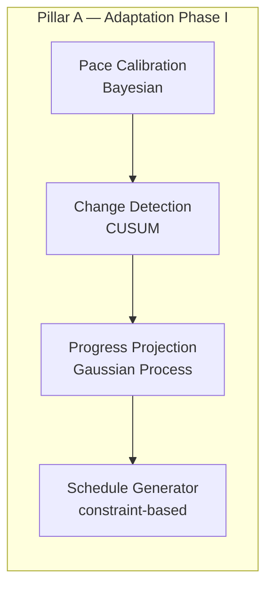

# How to use this plan

> **You are the implementing agent.** This document is your runbook for porting Pillar A to Python and standing up the FastAPI Intelligence Service. Read this preamble in full before doing anything else.

## Your job

1. Read **TL;DR**, **Context**, **Decisions log**, and **Architecture overview** first.
2. Find the first phase with status `☐ Not started` whose `Depends on:` phases are `✅ Complete`.
3. Implement **that phase only** unless the human explicitly asks for batch execution.
4. Run prereq verification before starting; run post-verification before marking complete.
5. Update the phase `Status:` to `✅ Complete — <commit-sha>` and commit plan + code together.

## What you must NOT do

- Do not modify the Decisions log, TL;DR, or Architecture overview without human approval.
- Do not wire the React client in this plan — that is explicitly deferred.
- Do not remove or rewrite the existing TS packages (`packages/progress`, `packages/roadmap-engine`) until a later client-wiring slice.

## Status vocabulary

- `☐ Not started` · `🟡 In progress` · `🛑 Blocked: <reason>` · `✅ Complete — <commit-sha>`

---

# Pillar A FastAPI Backend

**Written:** 2026-06-08  
**Status:** Ready for implementation  
**Grill session:** 2026-06-08 (scope, algo strategy, repo layout, API shape, data flow, parity depth)

## TL;DR

Port Pillar A — currently split across `@study-tracker/progress` (~1.6k LOC) and `@study-tracker/roadmap-engine` (~1k LOC) — into Python packages under a **uv workspace**, expose them via a **stateless FastAPI Intelligence Service**, and prove **full parity** with pytest against Vitest golden fixtures. **No React client changes** in this plan.

## Context

The target architecture ([`college/mydeliverables/1st-Review/deck/assets/architecture_horizontal.png`](../../../college/mydeliverables/1st-Review/deck/assets/architecture_horizontal.png), [`design/architecture.md`](../../../design/architecture.md)) places heavy ML in a Python FastAPI service:



| Pillar A stage | Current TS package | TS module(s) |
|---|---|---|
| Pace Calibration | `packages/progress` | `bayesian.ts`, `calibration.ts` |
| Change Detection | `packages/progress` | `cusum.ts`, `trend.ts`, `kalman.ts` |
| Progress Projection | `packages/progress` | `gp.ts`, `progress.ts` |
| Schedule Generator | `packages/roadmap-engine` | `roadmap-engine.ts` |

**Key architectural decision** ([`college/scope/asOfReview1/architecture.md`](../../../college/scope/asOfReview1/architecture.md)): Python is the single source of truth for algorithms — evaluated code = shipped code. The TS implementations remain until client wiring swaps hooks to the API.

### How the client gets data today

Intelligence is **100% client-side**. Hooks read **Dexie EventStore**, not Supabase:

- [`apps/app/src/progress/useCalibration.ts`](../../../apps/app/src/progress/useCalibration.ts) — `eventStore.getAll()` → `mapEvents` → `computeCalibration()`
- [`apps/app/src/progress/useProgress.ts`](../../../apps/app/src/progress/useProgress.ts) — same → `computeProgress()`
- [`apps/app/src/onboarding/steps/Step3Preview.tsx`](../../../apps/app/src/onboarding/steps/Step3Preview.tsx) — `generateRoadmap()` on form state

Supabase ([`SyncEngine`](../../../apps/app/src/sync/SyncEngine.ts)) syncs events for backup/cross-device only. It is **not** read at compute time.

### Future client interaction (deferred — documented for wiring slice)

**Client-push, stateless API, local cache** (recommended over service-pull-from-Supabase):

1. Client reads Dexie → reuses [`mapEvents.ts`](../../../apps/app/src/progress/mapEvents.ts)
2. POSTs JSON to FastAPI endpoints
3. Caches `CalibrationState` / `ProgressSnapshot` / `RoadmapOutput` in new `intelligence_cache` Dexie table
4. UI reads cache (works offline); background refresh when online
5. Supabase sync unchanged — event hub only

Service-pull from Supabase deferred to Phase II closed-loop (e.g. mastery webhook triggers replan without client).

---

## Decisions log

| ID | Decision | Rationale | Rejected alternatives |
|---|---|---|---|
| D-01 | **Backend-only scope** — Python port + FastAPI + parity tests; no client changes | Highest-risk work is the numerical port; client wiring is lower-risk once API is frozen | Full vertical slice with React hooks in same PR |
| D-02 | **Faithful NumPy port** — same hyperparameters as [`packages/progress/src/config.ts`](../../../packages/progress/src/config.ts); hand-rolled GP Cholesky | ~71 Vitest cases are the regression oracle; avoids drift before client wires up | Rewrite with scipy/GPy now (numerical differences) |
| D-03 | **uv workspace** at repo root: `packages/py-progress/`, `packages/py-roadmap-engine/`, `services/intelligence/` | Pure math testable without FastAPI; mirrors TS package names; `/research` can import same libs later | Monolithic `services/intelligence/` only |
| D-04 | **Mirror TS public API** — separate REST endpoints per function | Incremental parity testing; Vitest maps 1:1 to pytest | Single `/pillar-a/pipeline` endpoint only |
| D-05 | **Stateless service v1** — JSON in request body, no Supabase connection | Testable via curl/pytest without standing up Supabase | Service reads `public.events` directly |
| D-06 | **Full parity testing** — all ~71 progress + ~31 roadmap unit tests; 10 canonical roadmap snapshots | Numerical rewrite needs comprehensive coverage | Minimal ~10 hand-picked fixtures |
| D-07 | **No auth on endpoints in v1** | Local dev / Colima; JWT via Supabase JWKS deferred to client-wiring slice | API key from day one |
| D-08 | **Keep TS packages untouched** until client migration | Both must pass CI during transition | Delete TS engines immediately after Python port |
| D-09 | **Swappable backends later** — e.g. `gp/numpy.py` vs future `gp/gpy.py` | Research comparison can promote winners without API rewrite | Hard-code GPy now |
| D-10 | **Port `streak.ts` for parity** even though streak may stay client-side post-wiring | `computeProgress()` returns streak in `ProgressSnapshot`; full function parity required | Slim API excluding display fields in v1 |

### Implementation defaults (no further clarification needed)

- Python 3.12, uv, NumPy, FastAPI, Pydantic v2, pytest, httpx, ruff
- Float tolerance `1e-6` in parity assertions
- CORS: `http://localhost:5173` for future client
- One-time Vitest fixture-export script (not hand-porting test cases)
- Docker/Colima on port 8000

---

## Architecture overview

```
study-planner-web/
├── pyproject.toml                    # uv workspace root
├── packages/
│   ├── progress/                     # existing TS (unchanged)
│   ├── roadmap-engine/               # existing TS (unchanged)
│   ├── py-progress/                  # NEW
│   │   └── src/py_progress/
│   │       ├── config.py, bayesian.py, cusum.py, kalman.py
│   │       ├── trend.py, gp.py, streak.py
│   │       ├── calibration.py, progress.py, types.py
│   └── py-roadmap-engine/            # NEW
│       └── src/py_roadmap_engine/
│           ├── constants.py, engine.py, types.py
├── services/
│   └── intelligence/                 # NEW FastAPI app
│       ├── Dockerfile
│       ├── app/main.py
│       ├── app/routers/{calibration,progress,roadmap}.py
│       ├── app/schemas/
│       └── tests/
├── scripts/
│   └── export-vitest-fixtures.mjs    # NEW one-time golden fixture exporter
└── tests/fixtures/pillar-a/          # NEW shared JSON golden files
```

### FastAPI endpoints

| Endpoint | TS equivalent |
|---|---|
| `GET /health` | — |
| `POST /v1/calibration` | `computeCalibration` |
| `POST /v1/calibration/prompt-detail` | `getPromptDetail` |
| `POST /v1/progress` | `computeProgress` |
| `POST /v1/roadmap/generate` | `generateRoadmap` |
| `POST /v1/roadmap/regenerate` | `regenerateRoadmap` |

### Files-touched index (new files only)

| Path | Purpose |
|---|---|
| `pyproject.toml` | uv workspace root |
| `packages/py-progress/**` | Ported progress engines |
| `packages/py-roadmap-engine/**` | Ported roadmap engine |
| `services/intelligence/**` | FastAPI app + Docker |
| `scripts/export-vitest-fixtures.mjs` | Dump Vitest inputs/outputs to JSON |
| `tests/fixtures/pillar-a/**` | Golden JSON for pytest parity |
| `docker-compose.yml` | Colima local dev (optional at repo root) |

---

## Phases

### Phase 1 — Scaffold uv workspace + FastAPI skeleton

**Status:** `✅ Complete — 0d605b5`  
**Depends on:** —

**Goal:** Empty Python workspace boots; `GET /health` returns 200.

**Steps:**
1. Add root `pyproject.toml` with uv workspace members: `packages/py-progress`, `packages/py-roadmap-engine`, `services/intelligence`
2. Each package: `pyproject.toml`, `src/` layout, pytest + ruff config
3. `services/intelligence/app/main.py` — FastAPI app, CORS, `/health`
4. `services/intelligence/README.md` stub with `uv sync` + `uv run uvicorn` commands

**Verification (run AFTER):**
```bash
uv sync
uv run --package intelligence pytest services/intelligence/tests/test_health.py -q
uv run --package intelligence uvicorn app.main:app --port 8000 &
curl -s http://localhost:8000/health
```

---

### Phase 2 — Fixture export script + golden JSON

**Status:** `✅ Complete — 0d605b5`  
**Depends on:** Phase 1

**Goal:** Shared JSON fixtures exist for all Vitest test cases.

**Steps:**
1. Add `scripts/export-vitest-fixtures.mjs` — runs Vitest tests with a custom reporter or inline dumps; writes to `tests/fixtures/pillar-a/progress/` and `tests/fixtures/pillar-a/roadmap/`
2. Export all `packages/progress/test/*.test.ts` cases (~71)
3. Export all `packages/roadmap-engine/src/roadmap-engine.test.ts` cases (~31)
4. For roadmap: include the 10 canonical snapshot inputs/outputs (8-week DDIA, N=1, N=2, over-capacity, under-capacity, regenerate-with-pins, add-material, remove-material, two-anchors, single-material)

**Verification:**
```bash
node scripts/export-vitest-fixtures.mjs
ls tests/fixtures/pillar-a/progress/ | wc -l   # ~71
ls tests/fixtures/pillar-a/roadmap/ | wc -l    # ~31+
```

---

### Phase 3 — Port `packages/py-progress`

**Status:** `✅ Complete — aebb861`  
**Depends on:** Phase 2

**Goal:** All progress parity tests green.

**Steps (bottom-up):**
1. `types.py` — dataclasses matching [`packages/progress/src/types.ts`](../../../packages/progress/src/types.ts)
2. `config.py` — copy constants from [`config.ts`](../../../packages/progress/src/config.ts)
3. `bayesian.py` → `cusum.py` → `kalman.py` → `trend.py` → `gp.py` → `streak.py`
4. `calibration.py` — `compute_calibration()`, `get_prompt_detail()`
5. `progress.py` — `compute_progress()`
6. `packages/py-progress/tests/` — parametrized pytest loading golden JSON from `tests/fixtures/pillar-a/progress/`

**Verification:**
```bash
uv run --package py-progress pytest packages/py-progress/tests -q
pnpm --filter progress test   # TS still passes
```

---

### Phase 4 — Port `packages/py-roadmap-engine`

**Status:** `✅ Complete — 3d3c73d`  
**Depends on:** Phase 2

**Goal:** All roadmap parity + property tests green.

**Steps:**
1. `constants.py` — `DEFAULT_ROADMAP_CONFIG`, role labels from [`constants.ts`](../../../packages/roadmap-engine/src/constants.ts)
2. `engine.py` — port [`roadmap-engine.ts`](../../../packages/roadmap-engine/src/roadmap-engine.ts) (~940 LOC)
3. Public API: `generate_roadmap`, `infer_role`, `add_material_to_roadmap`, `remove_material_from_roadmap`, `regenerate_roadmap`
4. pytest: golden JSON + property tests (determinism; foundation not in last ⅓; practice not in first ⅓ for N≥3)

**Verification:**
```bash
uv run --package py-roadmap-engine pytest packages/py-roadmap-engine/tests -q
pnpm --filter roadmap-engine test
```

---

### Phase 5 — FastAPI routers + integration tests

**Status:** `✅ Complete — 74346f1`  
**Depends on:** Phase 3, Phase 4

**Goal:** HTTP API mirrors TS public API; integration tests pass.

**Steps:**
1. Pydantic schemas in `services/intelligence/app/schemas/` mirroring TS types
2. Routers: `calibration.py`, `progress.py`, `roadmap.py`
3. Wire routers in `main.py` under `/v1/`
4. Integration tests via `httpx.AsyncClient` — POST fixture JSON, assert response matches golden

**Verification:**
```bash
uv run --package intelligence pytest services/intelligence/tests -q
```

---

### Phase 6 — Docker + Colima + docs

**Status:** `✅ Complete — 2e32f18`
**Depends on:** Phase 5

**Goal:** Service runs in Docker; README has curl examples.

**Steps:**
1. `services/intelligence/Dockerfile` — Python 3.12 slim, uv install
2. `docker-compose.yml` — service on `:8000`, `CORS_ORIGINS` env
3. `services/intelligence/README.md` — build/run, curl examples for each endpoint

**Verification:**
```bash
docker compose up --build -d
curl -s http://localhost:8000/health
curl -s -X POST http://localhost:8000/v1/calibration -H 'Content-Type: application/json' -d @tests/fixtures/pillar-a/progress/compute-calibration-empty.input.json
docker compose down
```

---

## Open questions

_None — grill session complete 2026-06-08._

## Out of scope (this plan)

- React `IntelligenceClient` + `intelligence_cache` Dexie table
- Supabase JWT auth on FastAPI
- `/research` offline comparison tier
- `POST /v1/pillar-a/pipeline` orchestrator endpoint
- Service-pull adapter (Supabase → service)
- Production hosting (Fly.io / Render / Railway)
- CI GitHub Actions job for pytest (optional add-on)
- Removing TS `packages/progress` / `packages/roadmap-engine`
- Pillar B (LLM item-gen, KT, closed loop)

## References

- [`design/architecture.md`](../../../design/architecture.md) — three-tier target architecture
- [`college/scope/asOfReview1/architecture.md`](../../../college/scope/asOfReview1/architecture.md) — Python as single source of truth
- [`college/mydeliverables/1st-Review/architecture-diagram.md`](../../../college/mydeliverables/1st-Review/architecture-diagram.md) — Mermaid diagram + reading guide
- [`design/algo/ROADMAP_ENGINE_GUIDE.md`](../../../design/algo/ROADMAP_ENGINE_GUIDE.md) — roadmap algorithm decisions
- [`../archive/2026-06-04-review1-prep-deferrals.md`](../archive/2026-06-04-review1-prep-deferrals.md) — original deferral of this work to Phase II
- [`packages/progress/`](../../../packages/progress/) — TS source to port
- [`packages/roadmap-engine/`](../../../packages/roadmap-engine/) — TS source to port
