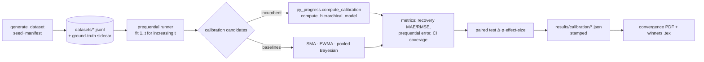

# How to use this plan

> **You are the implementing agent.** This document is your runbook for one cohesive change to this codebase. It was written collaboratively by Claude and a human after a planning discussion, and it is the source of truth for this work. Read this preamble in full before doing anything else.

## What you're holding

A phase-by-phase implementation plan. Each phase is a **vertical slice** — an end-to-end working increment that leaves the codebase in a working state. Phases are designed so any one of them can be implemented by a fresh agent in a new context window, with only this document and the codebase as input.

## Your job

1. **Read the document header in full first.** TL;DR, Context, Decisions log, Architecture overview, and Files-touched index. These give you the *why* behind every step. The Decisions log especially — those decisions were made deliberately and explain choices that may otherwise look arbitrary or wrong. Reference IDs (D-NN) appear inside phase steps so you can look up rationale.

2. **Find your starting phase.** Scan the phase list. Pick the first phase whose status is `☐ Not started` AND whose `Depends on:` phases are all `✅ Complete`. Implement that phase only. **Do not skip ahead. Do not implement multiple phases in one go unless the human explicitly asks.**

3. **Run the prereq verification.** Each phase has a "Verification (run BEFORE starting)" block. Run those commands. **If any fail, STOP** — the codebase isn't in the state this phase expects. Surface to the human: "Phase N's prereqs failed: `<command>` returned `<result>`. Want me to investigate or hand back?"

4. **Follow the steps in order.** Code blocks in steps are the actual code, not pseudocode or sketches. Apply them as written.

5. **If reality doesn't match the step — STOP.** If the plan says "modify line 47 of `auth.py`" and line 47 is something different, do not improvise. Surface the discrepancy: "Plan expected `<X>` at `auth.py:47`, found `<Y>`. Possible causes: plan is stale, file was edited since planning, plan was wrong. How should I proceed?"

6. **Run the tests and post-verification.** Each phase specifies what tests to add or update and the bash command to run. All must pass before the phase is considered done.

7. **Update status and commit.** When the phase is complete:
   - Edit this document: change the phase's `Status:` line to `✅ Complete — <commit-sha-here>`.
   - `git add` the code changes AND this plan file.
   - Commit them together. Suggested message: `Phase N: <phase title>` (with longer body referencing the plan file).
   - The status update and the code change live in the same commit so the doc and the code never drift.

## What you must NOT do

- **Do not skip phases.** Order matters; later phases assume earlier ones completed.
- **Do not modify the Decisions log, the Operating manual preamble, the TL;DR, the Architecture overview, the Files-touched index, the Open questions, the Out-of-scope list, or the References.** Those are immutable above-the-phases content. If you discover a decision is wrong, surface to the human — don't silently revise.
- **Do not re-plan or re-architect.** If the plan seems wrong, that's a signal to stop and surface, not to improvise.
- **Do not implement multiple phases without surfacing for human review** between them, unless the user explicitly asked for batch execution upfront.

## If you get stuck

- Update the phase's `Status:` to `🛑 Blocked: <one-line reason>`.
- Fill in the phase's `Notes (filled in during implementation)` block with what you tried, what's blocking, and what you'd want to know to unblock.
- Hand back to the human.

## Status vocabulary

- `☐ Not started`
- `🟡 In progress`
- `🛑 Blocked: <reason>`
- `✅ Complete — <commit-sha>`

## When status markers and reality drift

The status markers are a fast read, but they are not the source of truth. The phase's `Verification (DONE)` commands are the truth — if you suspect a marker is wrong (someone forgot to update, branches diverged, partial commits, etc.), run the verification commands for the phases marked complete. Trust the commands over the markers, and surface the drift to the human so the markers can be corrected.

---

# Research tier — Part 1: Foundation & tracer bullet (Phases 0–2)

**Slug:** `research-tier-1-foundation`
**Date written:** 2026-06-13
**Author:** Claude + Rohit Saji
**Plan status:** Draft
**Upstream:** [`../../handovers/2026-06-13-research-tier.md`](../../handovers/2026-06-13-research-tier.md) · index: [`2026-06-13-research-tier.md`](2026-06-13-research-tier.md)

> **This is plan 1 of 4.** It covers tracker Phases 0, 1, 2. Sibling plans:
> [Part 2 — Pillar-A fan-out + closed-loop](2026-06-13-research-tier-2-pillar-a-fanout.md) (Phases 3, 7) ·
> [Part 3 — KT bench](2026-06-13-research-tier-3-kt-bench.md) (Phase 4) ·
> [Part 4 — Validation & outputs](2026-06-13-research-tier-4-validation-outputs.md) (Phases 5–6).

## TL;DR

Stand up the offline `/research` tier from greenfield and drive **one Pillar-A track end-to-end** — the *tracer bullet*. Phase 0 scaffolds the `research/` tree as a `uv` workspace member that imports `py-progress` and runs a stamped, no-op `make dataset compare figs` pipeline. Phase 1 builds the seeded synthetic-learner generator that emits `SessionEvent`-shaped records plus a ground-truth sidecar, with an oracle test proving planted truth is recoverable. Phase 2 wires the **calibration** track from generate → prequential comparison (Hierarchical Bayesian incumbent vs SMA/EWMA/pooled baselines) → paired stats → a convergence-curve PDF + winner `.tex` table from real runs. When Phase 2's smoke test produces the PDF and table from a clean state, **Milestone 1 is shippable** and the spine is ready to fan out (Part 2). Everything here lives in the clean `uv` env; no torch, no pyKT.

## Context & background

This is the M.Tech project *"Adaptive Study Planning for Self-Directed Learners."* `py-progress` (Bayesian calibration, CUSUM, hand-rolled GP, Kalman, streak) and `py-roadmap-engine` (scheduler) already ship as pure NumPy importable functions under a `uv` workspace; `services/intelligence` is a thin FastAPI wrapper over them. The **`/research` tier does not exist yet** — it is the offline Python layer evaluators grade. It generates synthetic learners with known ground truth, runs a **genuine** (not rigged) multi-candidate comparison for each Pillar-A component, and auto-emits the report/journal tables and figures.

The guiding principle (set by the candidate): this is a *genuine* comparison, not a demonstration that the incumbents win. `py-progress`'s engines are *peer candidates*; the winner is whatever the data says, and the winner is what Phase II deploys. Rigour is the deliverable.

The work is sequenced as a **tracer bullet**: build *one* track (calibration) all the way through before fanning out. That is exactly what this plan delivers (Phases 0–2). Do not start Part 2 (fan-out) until Phase 2's DoD holds.

**Support docs (read before implementing):**

- [`college/scope/research-build-plan.md`](../../../college/scope/research-build-plan.md) — authoritative design + rationale (the spec). §2 architecture, §3 methodology, §7 generator spec, §8 repo layout.
- [`college/scope/research-decisions-and-findings.md`](../../../college/scope/research-decisions-and-findings.md) — settled decisions #1–19 + **code-verified facts** (pace semantics, py-progress API, repo state). Do not re-open these.
- [`college/scope/archetype-preregistration.md`](../../../college/scope/archetype-preregistration.md) — **frozen** generator numbers (Phase 1 consumes these verbatim).
- [`college/scope/research-tasklist.md`](../../../college/scope/research-tasklist.md) — master tracker; Phases 0–2 atomic tasks.
- [`2026-06-08-pillar-a-fastapi-backend.md`](2026-06-08-pillar-a-fastapi-backend.md) — format/discipline template (the TS→Python port that produced `py-progress`).

## Decisions log

These mirror the frozen decisions #1–19 in [`research-decisions-and-findings.md`](../../../college/scope/research-decisions-and-findings.md) (frozen 2026-06-13). Reproduced here as the subset that governs Phases 0–2. **Do not re-litigate** — if new information forces a change, record an amendment in `archetype-preregistration.md §10`, do not silently reverse.

### D-01: `/research` imports `py-progress`; never re-implements it

**Status:** ✅ Agreed (master #2)

**Context:** The harness needs the incumbent engines as candidates.

**Decision:** `research/comparison` is a `uv` workspace member that does `import py_progress` / `import py_roadmap_engine`. Evaluated code = shipped code. The engines are pure functions (`compute_calibration`, `run_cusum`, `gp_regression`, …) — call them **directly, no HTTP**.

**Rationale:** Single source of truth; a fix re-grades both research and product. Reimplementing risks drift.

**Alternatives considered:**
- Reimplement engines in `/research` → rejected: drift between evaluated and shipped code.
- Call the FastAPI service over HTTP → rejected: needless coupling; the service is just a wrapper.

**Reversibility:** hard — the whole comparison is built on direct imports.

### D-02: Baselines live only in `/research`

**Status:** ✅ Agreed (master #3)

**Context:** A genuine comparison needs non-incumbent candidates.

**Decision:** SMA, EWMA, pooled (non-hierarchical) Bayesian calibrators are research-only modules in `research/comparison/baselines/`. They are never shipped.

**Rationale:** Keeps the product surface clean; baselines exist purely to be beaten or to win on the merits.

**Reversibility:** easy.

### D-03: Generator emits `SessionEvent`-shaped records with literal pace semantics

**Status:** ✅ Agreed (master #6; code-verified)

**Context:** Output must flow into the engines with zero glue, and ground truth must match how the engines read pace.

**Decision:** The generator emits records with the `SessionEvent` shape (`date, source, plannedMinutes, activeMinutes, duration, materialRole, startedAt, sessionId`). Engines model `pace_ratio = activeMinutes / plannedMinutes` **literally** (`bayesian.py` L89, `cusum.py` L84). Convention: **`r > 1` over-runs the slot, `r < 1` under budget.** Do **not** invert the OpenAPI "0.8 = 25% longer" prose.

**Rationale:** Zero-glue ingestion; ground truth defined in the same units the engines consume.

**Alternatives considered:**
- Invert per the OpenAPI prose → rejected: the prose is loose; the code is the contract.

**Reversibility:** hard — frozen in the pre-registration.

### D-04: Neutral generator from a different family than any candidate

**Status:** ✅ Agreed (master #6)

**Context:** Circularity defence — no model may recover its own assumptions.

**Decision:** Ground-truth process uses heavy-tailed lognormal AR(1) noise + nonlinear fatigue/deadline effects, mis-specified relative to every candidate. All candidates see the **same** stream.

**Rationale:** Prevents the Bayesian/GP *or* the linear baselines being gifted the truth.

**Reversibility:** moderate (changes the generator's structural form).

### D-05: K≈40 Monte-Carlo seeds + paired tests

**Status:** ✅ Agreed (master #5)

**Context:** A single seed lets noise pick the winner — the non-genuine outcome.

**Decision:** ~40 seeded replications per (archetype × band) cell; candidates compared by **paired test (Δ + p-value + effect size)** on identical seeds.

**Rationale:** Error bars and genuineness.

**Reversibility:** easy (K is a parameter).

### D-06: Reproducibility via seed + manifest + version-hash stamp

**Status:** ✅ Agreed (master #18; build-plan §7, §8)

**Context:** Results must trace to exact inputs; report/journal numbers must not drift.

**Decision:** Seeded RNG; a manifest JSON (archetype mix, N, seed, generator version, params-file hash) is written next to every dataset; every result file carries the stamp.

**Rationale:** Citable, reproducible datasets; no transcription drift.

**Reversibility:** hard — everything downstream reads the stamp.

### D-07: Frozen pre-registered parameters; sensitivity-swept later

**Status:** ✅ Agreed (master #14)

**Context:** Defend against "you cherry-picked parameters."

**Decision:** Phase 1 reads the **frozen** values in [`archetype-preregistration.md`](../../../college/scope/archetype-preregistration.md) verbatim through a single `params.py` config module exposing a version hash. No value may change to favour a candidate.

**Rationale:** Converts a cherry-picking objection into a methods strength.

**Reversibility:** hard — frozen; amendments only via the pre-reg §10 log.

## Architecture overview

```
research/
  comparison/                 ← uv workspace member; imports py-progress (single source of truth)
    src/research_comparison/
      params.py               P0  frozen pre-reg values + version hash (single source)
      manifest.py             P0  seed/version/params-hash stamp helpers
      generator/              P1  synthetic learners + ground-truth sidecar
        types.py                  SessionEvent (emit) + GroundTruth (sidecar)
        materials.py              material model → role, totalMinutes, chunking
        capacity.py               neutral capacity planner → plannedMinutes
        pace.py                   latent base pace m_global·ρ·τ·ν
        regimes.py                step + drift generators (labelled)
        effects.py                φ_fatigue, δ_deadline
        noise.py                  lognormal AR(1) ε + clip
        adherence.py              skip/partial/manual model
        archetypes.py             six frozen presets
        generate.py               generate_learner / generate_dataset
      metrics/                P2  recovery error, prequential, coverage, paired tests, aggregator
      runners/                P2  prequential calibration runner (streams through py_progress)
      baselines/              P2  SMA, EWMA, pooled Bayesian (calibration)
      plots/                  P2  convergence curve → vector PDF
      writers/                P2  results JSON writer (stamped) + booktabs .tex
    tests/                    P0/P1/P2  pytest (mirrors py-progress test style)
    pyproject.toml            P0  package + workspace-source deps
  datasets/                   generated synthetic, versioned by manifest (gitignored; manifests tracked)
  results/                    metric tables + figures (report artifacts)
  kt-bench/                   (Part 3 — isolated env; created empty here for .gitignore only)
Makefile                      P0  dataset / compare / kt / figs / all targets
```

Data flow for the tracer bullet (Phase 2):



## Files touched (index)

| Path | Change | Phase | Purpose |
|------|--------|-------|---------|
| `pyproject.toml` (root) | modify | 0 | Register `research/comparison` workspace member; testpaths/ruff src |
| `research/comparison/pyproject.toml` | new | 0 | Package + clean-env deps + workspace-source deps |
| `research/comparison/src/research_comparison/__init__.py` | new | 0 | Package marker + version |
| `research/comparison/src/research_comparison/params.py` | new | 0 | Frozen pre-reg values + `PARAMS_VERSION_HASH` |
| `research/comparison/src/research_comparison/manifest.py` | new | 0 | `build_manifest()`, `stamp(result)` |
| `Makefile` | new | 0 | `dataset / compare / kt / figs / all` targets |
| `.gitignore` | modify | 0 | Ignore `research/datasets/`, `research/results/`, `research/kt-bench/.venv` |
| `research/comparison/tests/test_scaffold.py` | new | 0 | Import + stamp + Makefile-stub smoke |
| `research/comparison/src/research_comparison/generator/types.py` | new | 1 | `SessionEvent` (emit) + `GroundTruth` sidecar |
| `research/comparison/src/research_comparison/generator/materials.py` | new | 1 | Material model + chunk-duration distributions |
| `research/comparison/src/research_comparison/generator/capacity.py` | new | 1 | Neutral capacity planner → `plannedMinutes` |
| `research/comparison/src/research_comparison/generator/pace.py` | new | 1 | Latent base pace `m_global·ρ·τ·ν` |
| `research/comparison/src/research_comparison/generator/regimes.py` | new | 1 | Step + drift generators (labelled) |
| `research/comparison/src/research_comparison/generator/effects.py` | new | 1 | `φ_fatigue`, `δ_deadline` |
| `research/comparison/src/research_comparison/generator/noise.py` | new | 1 | Lognormal AR(1) ε + clip + clip-rate log |
| `research/comparison/src/research_comparison/generator/adherence.py` | new | 1 | Skip/partial/manual adherence |
| `research/comparison/src/research_comparison/generator/archetypes.py` | new | 1 | Six frozen presets |
| `research/comparison/src/research_comparison/generator/generate.py` | new | 1 | `generate_learner`, `generate_dataset`, face-validity export |
| `research/comparison/tests/test_generator.py` | new | 1 | Schema, determinism, oracle recovery, clip-rate, shift labels |
| `research/comparison/src/research_comparison/runners/calibration.py` | new | 2 | Prequential calibration runner |
| `research/comparison/src/research_comparison/baselines/calibration.py` | new | 2 | SMA, EWMA, pooled Bayesian calibrators |
| `research/comparison/src/research_comparison/metrics/recovery.py` | new | 2 | Recovery MAE/RMSE vs sidecar |
| `research/comparison/src/research_comparison/metrics/prequential.py` | new | 2 | Next-session pace error |
| `research/comparison/src/research_comparison/metrics/coverage.py` | new | 2 | Credible-interval coverage |
| `research/comparison/src/research_comparison/metrics/paired.py` | new | 2 | Paired diff → Δ, p, effect size |
| `research/comparison/src/research_comparison/metrics/aggregate.py` | new | 2 | Per-cell μ±σ → winner-per-band table |
| `research/comparison/src/research_comparison/writers/results.py` | new | 2 | Stamped `results/calibration/*.json` writer |
| `research/comparison/src/research_comparison/writers/tables.py` | new | 2 | booktabs `.tex` emitter |
| `research/comparison/src/research_comparison/plots/convergence.py` | new | 2 | Convergence curve → vector PDF |
| `research/comparison/tests/test_calibration_track.py` | new | 2 | Runner, baselines, metrics, paired stats, smoke |

## Phases

### Phase 0: Scaffold `/research`, register the workspace member, run a stamped no-op pipeline

**Status:** ✅ Complete — b46b79ccda987df29d8db5b5f39a13581ae67cd4
**Depends on:** none — can start immediately
**Estimated scope:** ~8 files, ~250 lines

Covers tracker tasks **P0.1–P0.9**. (DoD: `make dataset compare figs` runs on a stub and produces a stamped placeholder artifact; `import py_progress` works from `research/comparison`.)

#### Codebase state assumed at start

- Root `pyproject.toml` has `[tool.uv.workspace] members = ["packages/py-progress", "packages/py-roadmap-engine", "services/intelligence"]`.
- `packages/py-progress` and `packages/py-roadmap-engine` are installed, importable packages (`py_progress`, `py_roadmap_engine`).
- `uv` is available (installed at `~/.local/bin/uv` during the Pillar-A work; add to PATH).
- No `research/` directory exists yet.

#### Verification (run BEFORE starting to confirm prereqs are met)

```bash
export PATH="$HOME/.local/bin:$PATH"
uv run python -c "import py_progress, py_roadmap_engine; print('engines importable')"   # should print the line
test ! -d research && echo "research/ absent (expected)"                                # should print
grep -q '"packages/py-progress"' pyproject.toml && echo "workspace ok"                  # should print
```

If any fail, STOP — surface to the human.

#### Steps

1. **Create the directory tree (P0.1):**

   ```bash
   mkdir -p research/comparison/src/research_comparison/{generator,baselines,metrics,runners,plots,writers}
   mkdir -p research/comparison/tests research/datasets research/results research/kt-bench
   touch research/comparison/src/research_comparison/{generator,baselines,metrics,runners,plots,writers}/__init__.py
   ```

2. **Create `research/comparison/pyproject.toml` (P0.2–P0.4)** — mirrors `packages/py-progress/pyproject.toml` (hatchling, src layout) and adds the clean-env deps plus workspace-source deps. Implements D-01.

   ```toml
   [project]
   name = "research-comparison"
   version = "0.1.0"
   description = "Offline Pillar-A algorithm comparison harness (imports py-progress)"
   requires-python = ">=3.12"
   dependencies = [
       "py-progress",
       "py-roadmap-engine",
       "numpy>=2.0",
       "scipy>=1.13",
       "scikit-learn>=1.5",
       "ruptures>=1.1",
       "statsmodels>=0.14",
       "pandas>=2.2",
       "matplotlib>=3.9",
       "pyBKT>=1.4",
   ]

   [build-system]
   requires = ["hatchling"]
   build-backend = "hatchling.build"

   [tool.hatch.build.targets.wheel]
   packages = ["src/research_comparison"]

   [tool.uv.sources]
   py-progress = { workspace = true }
   py-roadmap-engine = { workspace = true }

   [tool.pytest.ini_options]
   testpaths = ["tests"]
   ```

3. **Register the member in root `pyproject.toml` (P0.2, P0.8):** add `"research/comparison"` to `[tool.uv.workspace] members`, add its tests to `[tool.pytest.ini_options] testpaths` and `pythonpath`, and add `research/comparison/src` to `[tool.ruff] src`.

   ```toml
   [tool.uv.workspace]
   members = [
       "packages/py-progress",
       "packages/py-roadmap-engine",
       "services/intelligence",
       "research/comparison",
   ]
   ```
   Append `"research/comparison/tests"` to `testpaths`, `"research/comparison/src"` to `pythonpath`, and `"research/comparison/src"` to `[tool.ruff] src`. Ruff lint config (`select = ["E", "F", "I", "UP"]`, line-length 100) already applies workspace-wide.

4. **Create `params.py` (P0.9)** — single source for the frozen pre-reg values, exposing a version hash. Implements D-07. Transcribe the numbers from [`archetype-preregistration.md`](../../../college/scope/archetype-preregistration.md) **verbatim** (§2 noise, §3 structural, §4 per-archetype, §5 shifts, §6 adherence, §7 capacity, §8 sweep grid). Hash the pre-reg file's bytes so any result traces to the exact params.

   ```python
   from __future__ import annotations
   import hashlib
   from pathlib import Path

   # Convention (pre-reg §1): r = activeMinutes / plannedMinutes; r>1 over-runs, r<1 under budget.
   CLIP_LOW, CLIP_HIGH = 0.55, 1.60          # pre-reg §1
   AR1_PHI = 0.30                            # pre-reg §2 [default->sweep]
   ROLE_RHO = {"anchor": 1.10, "foundation": 1.00, "practice": 0.92}   # §3
   TAU_GENERIC = {"morning": 0.97, "afternoon": 1.00, "evening": 1.05} # §3
   FATIGUE_PER_EXTRA_SESSION = 0.04          # §3

   ARCHETYPES = {
       "steady":            {"m_global": 1.00, "sigma_log": 0.15, "attempt_prob": 0.88},
       "morning_lark":      {"m_global": 0.98, "sigma_log": 0.16, "attempt_prob": 0.85,
                             "tau": {"morning": 0.85, "afternoon": 1.00, "evening": 1.20}},
       "fading_flame":      {"m_global": 1.00, "sigma_log": 0.20, "drift_total": 0.20},
       "weekend_warrior":   {"m_global": 1.02, "sigma_log": 0.18, "nu_weekend": 1.02,
                             "attempt_prob_weekday": 0.45, "attempt_prob_weekend": 0.95},
       "deadline_sprinter": {"m_global": 1.00, "sigma_log": 0.25, "deadline_ramp": 1.30},
       "marathon_runner":   {"m_global": 1.05, "sigma_log": 0.18, "n_steps": (2, 3),
                             "step_mag": (0.12, 0.18), "attempt_prob": 0.92},
   }
   BANDS = {  # pre-reg §5 + build-plan §4
       "small":  {"sessions": (8, 20),   "shifts": (0, 1)},
       "medium": {"sessions": (35, 70),  "shifts": (1, 2)},
       "max":    {"sessions": (90, 160), "shifts": (2, 3)},
   }
   STEP_MAG_DEFAULT, STEP_MAG_RANGE = 0.15, (0.10, 0.22)   # §5
   DRIFT_TOTAL_DEFAULT, DRIFT_WINDOW_FRAC = 0.20, (0.30, 0.45)  # §5
   MANUAL_FRACTION = 0.15                    # §6
   SWEEP_GRID = {                            # §8
       "sigma_log": [0.12, 0.18, 0.25],
       "step_mag": [0.10, 0.15, 0.22],
       "drift_total": [0.12, 0.20, 0.30],
       "manual_fraction": [0.05, 0.15, 0.25],
       "ar1_phi": [0.0, 0.30, 0.50],
   }

   _PREREG = Path(__file__).resolve().parents[4] / "college/scope/archetype-preregistration.md"
   PARAMS_VERSION_HASH = hashlib.sha256(_PREREG.read_bytes()).hexdigest()[:12]
   ```

   > NOTE for the implementing agent: confirm `parents[4]` resolves to the repo root from this file's location (`research/comparison/src/research_comparison/params.py` → repo root). Adjust the index if the path differs; the test in step 8 asserts the pre-reg file is found.

5. **Create `manifest.py` (P0.5)** — provenance util.

   ```python
   from __future__ import annotations
   from dataclasses import dataclass, asdict
   from typing import Any
   from research_comparison.params import PARAMS_VERSION_HASH

   GENERATOR_VERSION = "0.1.0"

   @dataclass(frozen=True)
   class Manifest:
       seed: int
       generator_version: str
       params_version_hash: str
       archetype_mix: dict[str, int]
       n_learners: int

   def build_manifest(seed: int, archetype_mix: dict[str, int], n_learners: int) -> Manifest:
       return Manifest(seed, GENERATOR_VERSION, PARAMS_VERSION_HASH, archetype_mix, n_learners)

   def stamp(result: dict[str, Any], manifest: Manifest) -> dict[str, Any]:
       """Attach provenance to any result dict written to disk."""
       return {**result, "_provenance": asdict(manifest)}
   ```

6. **Create `Makefile` (P0.6)** — stub targets that no-op + stamp a placeholder. Real bodies land in Phases 1–2.

   ```makefile
   UV ?= uv run --package research-comparison
   .PHONY: dataset compare kt figs all
   dataset: ; $(UV) python -m research_comparison.generator.generate --stub
   compare: ; $(UV) python -m research_comparison.runners.calibration --stub
   figs:    ; $(UV) python -m research_comparison.plots.convergence --stub
   kt:      ; @echo "KT bench runs in research/kt-bench (see plan part 3)"
   all: dataset compare figs
   ```

   For Phase 0 only, give each referenced module a `__main__` guard that, with `--stub`, writes a stamped placeholder JSON to `research/results/` and exits 0.

7. **Update `.gitignore` (P0.7):** add `research/datasets/`, `research/results/`, `research/kt-bench/.venv/`. Keep manifests tracked — add a negation `!research/datasets/**/manifest.json`.

8. **Create `tests/test_scaffold.py` (smoke):**

   ```python
   from __future__ import annotations
   import py_progress, py_roadmap_engine                      # D-01: imports work
   from research_comparison.manifest import build_manifest, stamp
   from research_comparison.params import PARAMS_VERSION_HASH, ARCHETYPES

   def test_engines_importable():
       assert hasattr(py_progress, "compute_calibration")
       assert hasattr(py_roadmap_engine, "generate_roadmap")

   def test_params_hash_stable_and_prereg_found():
       assert len(PARAMS_VERSION_HASH) == 12
       assert set(ARCHETYPES) >= {"steady", "fading_flame", "deadline_sprinter"}

   def test_stamp_attaches_provenance():
       m = build_manifest(seed=7, archetype_mix={"steady": 1}, n_learners=1)
       out = stamp({"x": 1}, m)
       assert out["_provenance"]["params_version_hash"] == PARAMS_VERSION_HASH
       assert out["_provenance"]["seed"] == 7
   ```

#### Tests

- Add `research/comparison/tests/test_scaffold.py` — engines importable, params hash stable, stamp works.
- Run: `export PATH="$HOME/.local/bin:$PATH" && uv run --package research-comparison pytest research/comparison/tests -q`

#### Verification (DONE — run after implementation)

```bash
export PATH="$HOME/.local/bin:$PATH"
uv sync
uv run --package research-comparison pytest research/comparison/tests -q   # all pass
uv run --package research-comparison python -c "import py_progress; print('ok')"  # ok
make dataset compare figs                                                  # exits 0
ls research/results/*.json && cat research/results/*.json | grep _provenance  # stamped placeholder
```

#### Rollback

`git rm -r research/`, revert the root `pyproject.toml` and `.gitignore` diffs, `rm Makefile`. No external side-effects, no migrations.

#### Notes (filled in during implementation)

`pyBKT>=1.4` initially resolved to `pybkt==1.4.2`, whose package metadata reports version
`1.4.1`; uv rejects that build. The comparison package therefore constrains pyBKT to
`>=1.4,<1.4.2`, preserving the intended 1.4 line while keeping the clean env reproducible.

---

### Phase 1: Seeded synthetic-learner generator with ground-truth sidecar

**Status:** ✅ Complete — 2ced5f44872e1855cff7362387c478af50948a6c
**Depends on:** Phase 0
**Estimated scope:** ~10 files, ~700 lines (split across the steps below)

Covers tracker tasks **P1.1–P1.15**. (DoD: `make dataset` emits a versioned dataset + manifest; oracle recovers planted truth within tolerance; same seed → identical bytes; clip rate <2%.) Implements D-03, D-04, D-06, D-07.

#### Codebase state assumed at start

- Phase 0 complete: `research/comparison` is a workspace member, `params.py` exposes the frozen values + `PARAMS_VERSION_HASH`, `manifest.py` provides `build_manifest`/`stamp`.
- `make dataset` currently calls a stub `--main` in `generator/generate.py`.

#### Verification (run BEFORE starting)

```bash
export PATH="$HOME/.local/bin:$PATH"
uv run --package research-comparison pytest research/comparison/tests/test_scaffold.py -q   # pass
uv run --package research-comparison python -c "from research_comparison.params import ARCHETYPES, BANDS; print(len(ARCHETYPES), len(BANDS))"  # 6 3
```

#### Steps

1. **`generator/types.py` (P1.1):** the emit shape and the sidecar. `SessionEvent` must match `py_progress.types.SessionEvent` exactly (D-03).

   ```python
   from __future__ import annotations
   from dataclasses import dataclass, field
   from typing import Literal, TypedDict

   MaterialRole = Literal["anchor", "foundation", "practice"]

   class SessionEvent(TypedDict, total=False):     # mirrors py_progress.types.SessionEvent
       date: str
       source: Literal["active", "manual"]
       plannedMinutes: float | None
       activeMinutes: float | None
       duration: float
       materialRole: MaterialRole
       startedAt: str
       sessionId: str

   @dataclass
   class Shift:
       onset_index: int
       type: Literal["step", "drift"]
       pre_mean: float
       post_mean: float
       drift_window: tuple[int, int] | None

   @dataclass
   class GroundTruth:
       m_global: float
       role_multipliers: dict[str, float]
       context_multipliers: dict[str, float]   # time-of-day / day-of-week
       regime_schedule: list[Shift]
       r_star: list[float]                      # noise-free latent pace per session index
       true_finish_date: str                    # date noise-free cumulative reaches total minutes
       is_faker: bool                           # carried, unused in Pillar A (Phase-II overlay)
       clip_rate: float
   ```

2. **`generator/materials.py` (P1.2):** map material type → role + `totalMinutes` + chunk-duration sampler (playlist/anchor 20–50, textbook/foundation 40–90, practice 30–75 heavy-tail, flashcards/practice 10–20). Build-plan §4; pre-reg §7.

3. **`generator/capacity.py` (P1.3):** neutral capacity planner (D not the scheduler — master #12). `plannedMinutes` per slot = `weekdayHours·60` / `weekendHours·60` distributed across study days, chunked by material type (pre-reg §7). Return a list of planned slots with `(date, dayOfWeek, plannedMinutes, materialRole)`.

4. **`generator/pace.py` (P1.4):** `latent_base(m_global, role, time_of_day, day_of_week, params) -> float` = `m_global · ρ(role) · τ(tod) · ν(dow)` from `params.py`.

5. **`generator/regimes.py` (P1.5, P1.6, P1.7):** `step_schedule(...)` and `drift_schedule(...)` producing `g_regime(t)` multiplier series + `Shift` labels. Onset sampler: interior 20–80%, ≥4 sessions from edges; per-band shift counts (pre-reg §5). Step magnitude `U(0.10,0.22)` default 0.15; drift total 0.20 over 30–45% window.

6. **`generator/effects.py` (P1.8):** `phi_fatigue(same_day_count)` = `1 + 0.04·(count-1)`; `delta_deadline(t, T, archetype)` = Sprinter nonlinear ramp ×1.00→×1.30 over final 20%.

7. **`generator/noise.py` (P1.9):** lognormal AR(1): `η[t] = φ·η[t-1] + √(1-φ²)·N(0,σ²)`, `ε=exp(η)`; multiply onto `r*`; clip `r*·ε` to `[0.55,1.60]`; return clip rate. Uses a seeded `numpy.random.Generator`.

8. **`generator/adherence.py` (P1.10):** per-archetype attempt probability (Bernoulli per planned slot), manual fraction 0.15 of attempted → `source="manual"` (no pace), skips → real calendar gaps.

9. **`generator/archetypes.py` (P1.11):** assemble the six presets from `params.ARCHETYPES` into a single `archetype_config(name)` returning all knobs (m_global, σ_log, τ override, drift/step schedule, adherence).

10. **`generator/generate.py` (P1.12–P1.13, P1.15):**

    ```python
    def generate_learner(archetype: str, band: str, seed: int) -> tuple[list[SessionEvent], GroundTruth]:
        ...  # compose capacity -> r*[t] -> noise -> adherence -> emitted SessionEvents + sidecar
    def generate_dataset(archetype_mix: dict[str,int], bands: list[str], seeds: list[int], out_dir: str) -> str:
        ...  # writes <out_dir>/<version>/learners.jsonl + sidecars.jsonl + manifest.json (stamped); returns dataset dir
    def export_face_validity(dataset_dir: str) -> None:
        ...  # P1.15: dump pace-ratio/duration/gap distributions for Phase 5 overlay
    ```
    Wire `make dataset` (replace the Phase-0 stub) to call `generate_dataset` with the default mix.

#### Tests

- Add `research/comparison/tests/test_generator.py` (P1.14) covering:
  - **Schema/shape:** every emitted record has the `SessionEvent` keys; `active` sessions have `plannedMinutes>0` and `activeMinutes>0`; `manual` sessions have no pace.
  - **Determinism by seed:** `generate_learner("steady","medium",42)` twice → byte-identical JSON (D-06).
  - **Oracle recovery:** feed a generated learner's `active` sessions to `py_progress.compute_hierarchical_model(sessions, set())`; assert `globalPosterior.mean` is within tolerance of the planted `m_global` (per-role means likewise where ≥`MIN_SESSIONS_PER_BUCKET`=3). This is the *generator-validity* test — proves the truth is recoverable (D-04 neutrality must still allow recovery in the noise-free limit).
  - **Shift labels:** number/type of `Shift`s in the sidecar matches the band schedule (pre-reg §5); onsets in interior 20–80%.
  - **Clip rate <2%:** assert `GroundTruth.clip_rate < 0.02` for each archetype (pre-reg §1 — else a consistency bug).
- Run: `uv run --package research-comparison pytest research/comparison/tests/test_generator.py -q`

#### Verification (DONE)

```bash
export PATH="$HOME/.local/bin:$PATH"
uv run --package research-comparison pytest research/comparison/tests/test_generator.py -q   # all pass
make dataset                                                                                  # writes dataset + manifest
ls research/datasets/*/manifest.json && ls research/datasets/*/learners.jsonl                # exist
# determinism: regenerate and diff
make dataset && d=$(ls -dt research/datasets/*/ | head -1); echo "seed-stable if oracle test green"
```

#### Rollback

`git rm research/comparison/src/research_comparison/generator/* research/comparison/tests/test_generator.py`; restore the Phase-0 `make dataset` stub. Generated `research/datasets/` is gitignored — safe to `rm -rf`.

#### Notes (filled in during implementation)

The generator keeps planted regime shifts on the archetypes that define them in the
pre-registration: Fading-Flame gets gradual drift and Marathon-Runner gets abrupt steps; flat
archetypes keep their distinguishing adherence/time/deadline mechanisms without generic extra
shifts. Clip-rate accounting is active-session-only because manual sessions emit no pace to the
engines. A deterministic noise redraw guard preserves seed determinism while enforcing the frozen
`<2%` physical-plausibility ceiling.

---

### Phase 2: Calibration track end-to-end — THE TRACER BULLET

**Status:** ✅ Complete — 4682b5347c4595c9514ed9b193baff34e2b6a547
**Depends on:** Phase 1
**Estimated scope:** ~11 files, ~650 lines

Covers tracker tasks **P2.1–P2.11**. (DoD: `make compare` (calibration) + `make figs` produce a stamped convergence-curve PDF and a winner table from real runs.) Implements D-01, D-02, D-05, D-06. **Completing this phase = Milestone 1 (first shippable increment).**

#### Codebase state assumed at start

- Phase 1 complete: `generate_dataset` writes versioned datasets with sidecars; `make dataset` works.
- `py_progress` exposes `compute_calibration(sessions, exceptional_tags, resolutions)` and `compute_hierarchical_model(sessions, exceptional_ids)` returning `globalPosterior.mean`, `globalMultiplier`, `roleMultipliers` (verified signatures).

#### Verification (run BEFORE starting)

```bash
export PATH="$HOME/.local/bin:$PATH"
uv run --package research-comparison pytest research/comparison/tests/test_generator.py -q   # pass
uv run --package research-comparison python -c "from py_progress import compute_hierarchical_model; print('ok')"  # ok
ls research/datasets/*/learners.jsonl >/dev/null && echo "dataset present"
```

#### Steps

1. **`runners/calibration.py` (P2.1):** prequential runner — for increasing `t`, slice `sessions[:t]` and call each candidate. The incumbent path calls `py_progress.compute_calibration(sessions, [], [])` (or `compute_hierarchical_model(sessions, set())` for the raw posterior). Implements D-01.

   ```python
   from py_progress import compute_hierarchical_model

   def prequential_calibration(sessions, candidate, t_grid):
       """Return list of (t, estimate) where estimate is the global pace multiplier at history 1..t."""
       out = []
       for t in t_grid:
           hist = sessions[:t]
           out.append((t, candidate.fit_global(hist)))   # candidate wraps compute_hierarchical_model or a baseline
       return out
   ```

2. **`baselines/calibration.py` (P2.2):** SMA (mean of last-k `active/planned`), EWMA (exponential), and pooled (non-hierarchical) Bayesian (single Normal-Normal update over all active sessions, no role/context split). Each exposes `fit_global(sessions) -> float` (+ `fit_role` where applicable) so the runner treats incumbent and baselines uniformly (D-02).

3. **Metrics (P2.3–P2.5):**
   - `metrics/recovery.py` — `recovery_mae(estimates, ground_truth)` against the sidecar `m_global` and per-role multipliers.
   - `metrics/prequential.py` — at each `t`, predict session `t+1` pace from `1..t`; score vs the realised (noise-free `r*[t+1]` or emitted ratio per the build-plan §3 prequential protocol).
   - `metrics/coverage.py` — posterior credible-interval coverage (fraction of true values inside the 95% interval from `globalPosterior.mean ± 1.96·√variance`).

4. **`metrics/paired.py` (P2.6):** per-seed paired diff across candidates → Δ (mean diff), p-value (paired t or Wilcoxon via scipy/statsmodels), effect size (Cohen's d_z). Implements D-05.

5. **`metrics/aggregate.py` (P2.7):** group results by `(length-band × archetype)` cell → μ±σ; collapse to a winner-per-band table (the examiner-facing deliverable, build-plan §4).

6. **`writers/results.py` (P2.8):** write `research/results/calibration/*.json`, stamped via `manifest.stamp`, keyed `{band, archetype, candidate, seed}` (D-06).

7. **`writers/tables.py` + `report/generated/calibration_winners.tex` (P2.10):** booktabs `.tex` emitter; write the winner table to `college/mydeliverables/1st-Review/report/generated/calibration_winners.tex`. (The `\input{}` wiring into `main.tex` is Part 4 / Phase 6 — here we only emit the file.)

8. **`plots/convergence.py` (P2.9):** matplotlib convergence curve (recovery error vs #sessions, one line per candidate) → **vector PDF** at `college/mydeliverables/1st-Review/report/generated/calibration_convergence.pdf`. Set `matplotlib.use("Agg")`; save with `format="pdf"`. Stamp the provenance hash into the caption-footnote text file alongside (Phase 6 consumes it).

9. **Wire `make compare` / `make figs`** to call the calibration runner and the plot/table writers (replace Phase-0 stubs).

#### Tests

- Add `research/comparison/tests/test_calibration_track.py` (P2.11) covering:
  - **Runner:** `prequential_calibration` returns one estimate per `t` for the incumbent and each baseline; estimates are finite.
  - **Baselines:** SMA/EWMA/pooled each return a float; pooled Bayesian on a flat-pace learner converges near `m_global`.
  - **Paired stats:** on synthetic paired arrays with a known mean diff, `paired.py` recovers Δ and a p-value in `[0,1]`; effect-size sign correct.
  - **Aggregator:** a 2-cell fixture collapses to a winner-per-band table with the lower-error candidate as winner.
  - **Smoke (the tracer bullet):** from a clean state, `make dataset compare figs` yields the convergence PDF + the `.tex` table; assert both files exist and are non-empty and the JSON carries `_provenance`.
- Run: `uv run --package research-comparison pytest research/comparison/tests/test_calibration_track.py -q`

#### Verification (DONE)

```bash
export PATH="$HOME/.local/bin:$PATH"
uv run --package research-comparison pytest research/comparison/tests -q          # all pass
rm -rf research/datasets/* research/results/*                                     # clean state
make dataset compare figs                                                         # full tracer-bullet run
test -s college/mydeliverables/1st-Review/report/generated/calibration_convergence.pdf && echo "PDF ok"
test -s college/mydeliverables/1st-Review/report/generated/calibration_winners.tex && echo "table ok"
grep -l _provenance research/results/calibration/*.json | head -1                 # stamped
```

#### Rollback

`git rm` the Phase-2 files and `report/generated/calibration_*`; restore the Phase-0/1 Makefile bodies for `compare`/`figs`. Results/datasets are gitignored.

#### Notes (filled in during implementation)

The Makefile command variable was renamed from `UV` to `UV_RUN` because this shell exports
`UV=/Users/rsaji/.local/bin/uv`; with the plan's original `UV ?= ...`, `make dataset` invoked
`uv python -m ...` and failed. Phase 2 now produces stamped calibration JSON, a vector PDF,
the booktabs winners table, and a provenance text file from the clean tracer-bullet run. The PDF
writer sets deterministic metadata/source-date behavior so repeated `make figs` runs do not churn
the generated PDF.

---

## Open questions

### OQ-01: Exact prequential target for the calibration error metric

**Why deferred:** The build-plan §3 defines two protocols (latent-recovery vs prequential next-step). Phase 2 scores recovery against the sidecar; the prequential next-session target (noise-free `r*[t+1]` vs emitted `active/planned`) is implemented but the headline choice can be confirmed once the first curves are seen.
**Triggers needing resolution:** Before the R2 figure is finalised.
**Owner / resolution path:** Candidate, after eyeballing the first convergence curve.
**Cross-ref:** affects Phase 2 step 3; does not block the tracer bullet.

### OQ-02: Per-phase build-effort estimates

**Why deferred:** The handover flags effort/time estimates as open. Scope estimates (files/lines) are given per phase; calendar estimates are not.
**Triggers needing resolution:** If scheduling the build against review dates (R2).
**Owner / resolution path:** Candidate.

## Out of scope (this plan)

- **Detection / projection / scheduling tracks, sensitivity sweep, oracle baselines** — Phase 3, see [Part 2](2026-06-13-research-tier-2-pillar-a-fanout.md). The tracer bullet deliberately does *one* track only.
- **Closed-loop machinery** — Phase 7, [Part 2](2026-06-13-research-tier-2-pillar-a-fanout.md).
- **Knowledge-tracing bench** — Phase 4, [Part 3](2026-06-13-research-tier-3-kt-bench.md). Different (isolated) environment.
- **N=1 validation + report `\input{}` wiring** — Phases 5–6, [Part 4](2026-06-13-research-tier-4-validation-outputs.md). Phase 2 only *emits* the table/PDF into `report/generated/`; it does not edit `main.tex`.
- **Any change to `packages/py-progress` or `py-roadmap-engine`** — they are imported, never modified (D-01).

## References

- [`college/scope/research-build-plan.md`](../../../college/scope/research-build-plan.md) — design spec (§2, §3, §4, §7, §8).
- [`college/scope/archetype-preregistration.md`](../../../college/scope/archetype-preregistration.md) — frozen parameters (§1–§9).
- [`college/scope/research-decisions-and-findings.md`](../../../college/scope/research-decisions-and-findings.md) — decisions #1–19 + verified API facts.
- [`college/scope/research-tasklist.md`](../../../college/scope/research-tasklist.md) — Phases 0–2 atomic tasks.
- [`packages/py-progress/src/py_progress/__init__.py`](../../../packages/py-progress/src/py_progress/__init__.py) — public API surface the harness imports.
- [`packages/py-progress/openapi.yaml`](../../../packages/py-progress/openapi.yaml) — `SessionEvent` field semantics.
- [`packages/py-progress/tests/conftest.py`](../../../packages/py-progress/tests/conftest.py) — pytest parametrize/fixture style to mirror.
- [`2026-06-08-pillar-a-fastapi-backend.md`](2026-06-08-pillar-a-fastapi-backend.md) — format/discipline template.
