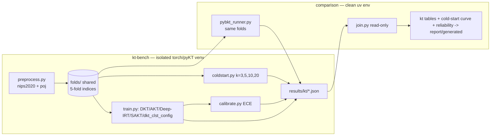

# How to use this plan

> **You are the implementing agent.** This document is your runbook for one cohesive change to this codebase. It was written collaboratively by Claude and a human after a planning discussion, and it is the source of truth for this work. Read this preamble in full before doing anything else.

## What you're holding

A phase-by-phase implementation plan. Each phase is a **vertical slice** — an end-to-end working increment that leaves the codebase in a working state. Phases are designed so any one of them can be implemented by a fresh agent in a new context window, with only this document and the codebase as input.

## Your job

1. **Read the document header in full first.** TL;DR, Context, Decisions log, Architecture overview, and Files-touched index. These give you the *why* behind every step. The Decisions log especially — those decisions were made deliberately and explain choices that may otherwise look arbitrary or wrong. Reference IDs (D-NN) appear inside phase steps so you can look up rationale.

2. **Find your starting phase.** Scan the phase list. Pick the first phase whose status is `☐ Not started` AND whose `Depends on:` phases are all `✅ Complete`. Implement that phase only. **Do not skip ahead. Do not implement multiple phases in one go unless the human explicitly asks.**

3. **Run the prereq verification.** Each phase has a "Verification (run BEFORE starting)" block. Run those commands. **If any fail, STOP** — the codebase isn't in the state this phase expects. Surface to the human: "Phase N's prereqs failed: `<command>` returned `<result>`. Want me to investigate or hand back?"

4. **Follow the steps in order.** Code blocks in steps are the actual code, not pseudocode or sketches. Apply them as written.

5. **If reality doesn't match the step — STOP.** If the plan says "modify line 47 of `auth.py`" and line 47 is something different, do not improvise. Surface the discrepancy: "Plan expected `<X>` at `auth.py:47`, found `<Y>`. Possible causes: plan is stale, file was edited since planning, plan was wrong. How should I proceed?"

6. **Run the tests and post-verification.** Each phase specifies what tests to add or update and the bash command to run. All must pass before the phase is considered done.

7. **Update status and commit.** When the phase is complete:
   - Edit this document: change the phase's `Status:` line to `✅ Complete — <commit-sha-here>`.
   - `git add` the code changes AND this plan file.
   - Commit them together. Suggested message: `Phase N: <phase title>` (with longer body referencing the plan file).
   - The status update and the code change live in the same commit so the doc and the code never drift.

## What you must NOT do

- **Do not skip phases.** Order matters; later phases assume earlier ones completed.
- **Do not modify the Decisions log, the Operating manual preamble, the TL;DR, the Architecture overview, the Files-touched index, the Open questions, the Out-of-scope list, or the References.** Those are immutable above-the-phases content. If you discover a decision is wrong, surface to the human — don't silently revise.
- **Do not re-plan or re-architect.** If the plan seems wrong, that's a signal to stop and surface, not to improvise.
- **Do not implement multiple phases without surfacing for human review** between them, unless the user explicitly asked for batch execution upfront.

## If you get stuck

- Update the phase's `Status:` to `🛑 Blocked: <one-line reason>`.
- Fill in the phase's `Notes (filled in during implementation)` block with what you tried, what's blocking, and what you'd want to know to unblock.
- Hand back to the human.

## Status vocabulary

- `☐ Not started`
- `🟡 In progress`
- `🛑 Blocked: <reason>`
- `✅ Complete — <commit-sha>`

## When status markers and reality drift

The status markers are a fast read, but they are not the source of truth. The phase's `Verification (DONE)` commands are the truth — if you suspect a marker is wrong (someone forgot to update, branches diverged, partial commits, etc.), run the verification commands for the phases marked complete. Trust the commands over the markers, and surface the drift to the human so the markers can be corrected.

---

# Research tier — Part 3: Knowledge-tracing bench (Phase 4, isolated env)

**Slug:** `research-tier-3-kt-bench`
**Date written:** 2026-06-13
**Author:** Claude + Rohit Saji
**Plan status:** Draft
**Upstream:** [`../../handovers/2026-06-13-research-tier.md`](../../handovers/2026-06-13-research-tier.md) · index: [`2026-06-13-research-tier.md`](2026-06-13-research-tier.md)

> **This is plan 3 of 4.** It covers tracker Phase 4 (Pillar-B knowledge tracing). **It depends only on [Part 1](2026-06-13-research-tier-1-foundation.md) Phase 0** (the `research/` tree + results-schema/stamp conventions) — it is **independent of Phases 1–3**, so it can be built in parallel with [Part 2](2026-06-13-research-tier-2-pillar-a-fanout.md). Sibling: [Part 4 — Validation & outputs](2026-06-13-research-tier-4-validation-outputs.md) wires these results into the report.

## TL;DR

Benchmark knowledge-tracing models on two public datasets — **Eedi (`nips2020`, MCQ)** and **POJ (coding)** — in a **quarantined** Python environment (`research/kt-bench/`) with pinned PyTorch + `pykt-toolkit` + wandb that is **not a `uv` workspace member and stays out of `uv.lock`** (decision #15). pyKT's preprocessed 5-fold splits are **exported once as the shared source of truth**; deep models (DKT, AKT, Deep-IRT, SAKT) plus an explicitly relabeled DKT-backed CLST-config candidate (`dkt_clst_config`) train on them for full-sequence AUC, and a cold-start harness truncates to the first `k ∈ {3,5,10,20}` interactions to produce the **headline cold-start AUC curve**. `pyBKT` runs in the **clean** env on the **identical exported folds** so BKT-vs-deep is fair across environments (decision #16). Mastery calibration (reliability diagram + ECE) is reported alongside AUC. Every model writes `research/results/kt/*.json` keyed `{dataset, model, fold, k}` — the **only seam**: the main harness *reads* these JSONs and **never imports pyKT**, so a broken torch install can never break the Pillar-A pipeline.

## Context & background

`pyKT` (pykt-toolkit) is a research/benchmark harness (PyTorch, conda/wandb-oriented, 5-fold mean±std AUC) — not a production library. It bundles standardized datasets and ~30 KT models. Standard KT assumes a fixed item bank answered by many learners; this project ultimately has LLM-generated, per-learner items and one learner (the Phase-II concept-level novelty). **Phase I deliberately stays on public benchmarks with their native KC tags** to establish credible baselines — concept-level KT over generated items is out of scope here.

The architectural decision is **two environments, one artifact boundary** (decision #15): the clean `uv` workspace (Part 1/2, imports `py-progress`) and this isolated torch/pyKT venv. They communicate only through `research/results/kt/*.json`. `pyBKT` is the one piece that lives in the **clean** env (it is a clean-env dependency added in Phase 0) yet consumes the pyKT-exported folds — that cross-env fairness on shared splits is the linchpin of the BKT-vs-deep comparison (decision #16).

**Support docs (read before implementing):**

- [`college/scope/research-build-plan.md`](../../../college/scope/research-build-plan.md) — §9 KT track, §8 two-environment layout.
- [`college/scope/asOfReview1/pykt-and-knowledge-tracing.md`](../../../college/scope/asOfReview1/pykt-and-knowledge-tracing.md) — pyKT workflow, datasets, model choices, the concept-level/cold-start adaptation.
- [`college/scope/asOfReview1/datasets.md`](../../../college/scope/asOfReview1/datasets.md) — Eedi/POJ details.
- [`college/scope/research-decisions-and-findings.md`](../../../college/scope/research-decisions-and-findings.md) — decisions #15, #16.
- [`.cursor/rules/docker-colima-setup.mdc`](../../../.cursor/rules/docker-colima-setup.mdc) + [`.cursor/rules/pnpm-build-registry.mdc`](../../../.cursor/rules/pnpm-build-registry.mdc) — corporate-mirror / CA patterns **if torch or dataset pulls fail** on this machine.

## Decisions log

Mirrors the frozen decisions (frozen 2026-06-13). The subset governing Phase 4:

### D-13: Quarantined KT environment; artifact boundary is `results/kt/*.json`

**Status:** ✅ Agreed (master #15)

**Context:** pyKT is torch/wandb/conda-oriented and would contaminate the clean numpy-only `uv` workspace.

**Decision:** `research/kt-bench/` has its own pinned-torch + pyKT venv, **is not a `uv` workspace member**, and is **kept out of `uv.lock`**. It runs pyKT's native CLI as a documented two-step. The seam is `research/results/kt/*.json`; the main harness **reads** these and **never imports pyKT**.

**Rationale:** A broken torch install can never break the Pillar-A pipeline; the clean env stays numpy-only.

**Alternatives considered:**
- One unified environment → rejected: torch/conda contaminate the clean workspace and the lockfile.

**Reversibility:** hard — the whole KT bench is structured around this boundary.

### D-14: Shared splits — pyKT folds are the single source of truth; pyBKT uses them

**Status:** ✅ Agreed (master #16)

**Context:** BKT (clean env) vs deep models (isolated env) must be a *fair* comparison.

**Decision:** Export pyKT's preprocessed 5-fold indices once; **pyBKT consumes the identical folds** the deep models use. Result files keyed `{dataset, model, fold, k}`.

**Rationale:** Same data, same splits → BKT-vs-deep is comparable across the two environments.

**Reversibility:** moderate (re-export changes all downstream keys).

### D-15: Two KT evaluations — full-seq AUC (comparability) + cold-start curve (headline)

**Status:** ✅ Agreed (master #16; build-plan §9)

**Context:** Cold-start is the project crux (self-directed learner, few interactions).

**Decision:** Report **full-sequence 5-fold AUC** (literature comparability anchor) **and** a **cold-start AUC curve** (AUC vs first-`k` interactions, `k ∈ {3,5,10,20}`) — the parallel to the Pillar-A convergence curve. **Mastery calibration (reliability diagram + ECE)** reported alongside AUC because the mastery estimate is a verification signal.

**Rationale:** Point AUC is table stakes; the thesis lives on cold-start behaviour and calibrated mastery.

**Reversibility:** easy (k-grid is a parameter).

### D-16: Phase-I KT stays on public benchmarks with native KC tags

**Status:** ✅ Agreed (build-plan §9)

**Context:** Concept-level KT over LLM-generated items needs data that does not exist yet.

**Decision:** Phase I runs Eedi `nips2020` (MCQ) + POJ (coding) with their native KC tags. CLST stays the extension-narrative base paper, but the current bench does **not** implement a distinct CLST method; the historical silent alias is relabeled to `dkt_clst_config` until a later CLST implementation plan lands. Concept-level KT over generated items is **Phase II**, not evaluated now.

**Reversibility:** easy.

## Architecture overview

```
research/
  kt-bench/                       ← ISOLATED env — NOT a uv workspace member, NOT in uv.lock (D-13)
    .venv/                        pinned torch + pykt-toolkit + wandb (gitignored)
    requirements.txt              pinned versions
    README.md                     two-step run instructions (preprocess -> train -> predict)
    preprocess.py                 pyKT preprocess nips2020 + poj; EXPORT fold indices (D-14)
    train.py                      DKT, AKT, Deep-IRT, SAKT, dkt_clst_config (5-fold) -> full-seq AUC
    coldstart.py                  truncate to first k in {3,5,10,20} -> cold-start AUC
    calibrate.py                  reliability diagram data + ECE per model
    write_results.py              -> research/results/kt/*.json keyed {dataset,model,fold,k} (stamped)
    folds/                        exported shared-split indices (the source of truth; tracked)
  comparison/                     ← CLEAN env (Part 1/2)
    src/research_comparison/kt/
      pybkt_runner.py             P4.6 pyBKT on the EXPORTED pyKT folds (clean env, D-14)
      join.py                     P4.9 read results/kt/*.json -> joined tables/curves
    plots/kt_coldstart.py         P4.9 cold-start AUC curve + reliability diagram -> PDF
    writers/ (reuse Part 1)       full-seq AUC table, ECE table -> report/generated/kt_*.tex
  results/kt/                     THE SEAM — both envs write here; clean harness only READS (D-13)
```



## Files touched (index)

| Path | Change | Phase | Purpose |
|------|--------|-------|---------|
| `research/kt-bench/requirements.txt` | new | 4a | Pinned torch + pykt-toolkit + wandb (out of `uv.lock`) |
| `research/kt-bench/README.md` | new | 4a | Two-step run instructions + corporate-mirror notes |
| `research/kt-bench/preprocess.py` | new | 4a | pyKT preprocess `nips2020` + `poj`; export fold indices |
| `research/kt-bench/folds/` | new | 4a | Exported shared-split indices (tracked) |
| `.gitignore` | modify | 4a | Ignore `research/kt-bench/.venv` (already added in Part 1 Phase 0 — verify) |
| `research/kt-bench/train.py` | new | 4b | Train DKT, AKT, Deep-IRT, SAKT, `dkt_clst_config` (5-fold) → full-seq AUC |
| `research/kt-bench/coldstart.py` | new | 4b | Truncate to first `k` → cold-start AUC curve |
| `research/kt-bench/write_results.py` | new | 4b | Write `results/kt/*.json` keyed `{dataset,model,fold,k}` (stamped) |
| `research/kt-bench/calibrate.py` | new | 4c | Reliability-diagram data + ECE per model |
| `research/comparison/src/research_comparison/kt/pybkt_runner.py` | new | 4c | pyBKT on the exported pyKT folds (clean env) |
| `research/comparison/src/research_comparison/kt/join.py` | new | 4c | Read `results/kt/*.json` → joined tables/curves (never imports pyKT) |
| `research/comparison/src/research_comparison/plots/kt_coldstart.py` | new | 4c | Cold-start AUC curve + reliability diagram → PDF |
| `research/comparison/tests/test_kt_join.py` | new | 4c | Join/schema/ECE logic on fixture JSON (clean env, no torch) |
| `Makefile` | modify | 4a–4c | `kt` target documents the two-step into the isolated env + clean-env join |

## Phases

### Phase 4a: Isolated env bootstrap + shared-fold export

**Status:** ✅ Complete — 01665a6dc325c602600116689a2aa6ff01b3ea6f
**Depends on:** Part 1 Phase 0 (the `research/` tree, `.gitignore`, results-schema/stamp conventions)
**Estimated scope:** ~3 files + folds export, ~200 lines

Covers tracker tasks **P4.1, P4.2**. Implements D-13, D-14, D-16. (This is the linchpin: nothing downstream is fair without the exported shared folds.)

#### Codebase state assumed at start

- Part 1 Phase 0 `✅ Complete`: `research/kt-bench/` dir exists; `.gitignore` ignores `research/kt-bench/.venv`; `research/results/` exists.
- A working Python ≥3.10 interpreter for the isolated venv (separate from the uv workspace interpreter).
- Network access to fetch pyKT + datasets; if pulls fail, use the corporate-mirror / CA-bundle pattern in [`docker-colima-setup.md`](../../../.cursor/rules/docker-colima-setup.mdc) and [`pnpm-build-registry.md`](../../../.cursor/rules/pnpm-build-registry.mdc).

#### Verification (run BEFORE starting)

```bash
test -d research/kt-bench && echo "kt-bench dir present"
grep -q 'research/kt-bench/.venv' .gitignore && echo "venv ignored"
test -d research/results && echo "results dir present"
```

#### Steps

1. **`research/kt-bench/requirements.txt` (P4.1):** pin torch + pykt-toolkit + wandb (and numpy/scikit-learn for AUC). Pin exact versions for thesis reproducibility. This file is **deliberately not referenced from `uv.lock`** (D-13).

   ```
   torch==2.3.1
   pykt-toolkit==0.0.39
   wandb==0.17.0
   scikit-learn==1.5.0
   numpy==1.26.4
   ```

2. **Create the isolated venv (P4.1)** — own `.venv`, NOT `uv sync`:

   ```bash
   cd research/kt-bench
   python3 -m venv .venv
   ./.venv/bin/pip install -U pip
   ./.venv/bin/pip install -r requirements.txt   # if registry/TLS fails, see corporate-mirror rule
   ```

3. **`research/kt-bench/README.md` (P4.1):** document the two-step (`preprocess → train → predict`), the venv activation, the corporate-mirror fallback, and the **hard rule**: this env is never imported by the clean workspace; the seam is `research/results/kt/*.json`.

4. **`research/kt-bench/preprocess.py` (P4.2):** call pyKT's preprocessing for `nips2020` (Eedi) and `poj`, then **export the 5-fold split indices** to `research/kt-bench/folds/{dataset}_folds.json` as the shared source of truth (D-14). These fold files are **tracked** (they pin the comparison).

#### Tests

- The isolated env cannot run in this CI environment (torch). Validation is **manual / smoke** per the repo norm ("E2E/heavy envs: write, don't run here"):
  - `./.venv/bin/python -c "import torch, pykt; print(torch.__version__)"` prints a version.
  - `research/kt-bench/folds/nips2020_folds.json` and `poj_folds.json` exist and contain 5 folds each.
- Add a **clean-env** schema guard (runs without torch) `research/comparison/tests/test_kt_join.py::test_folds_schema` asserting the exported folds JSON has 5 folds with disjoint train/test index sets (reads the committed `folds/` files).

#### Verification (DONE)

```bash
cd research/kt-bench && ./.venv/bin/python -c "import torch, pykt; print('torch', torch.__version__)"   # version prints
ls research/kt-bench/folds/nips2020_folds.json research/kt-bench/folds/poj_folds.json                    # both exist
cd ../.. && uv run --package research-comparison pytest research/comparison/tests/test_kt_join.py -k folds_schema -q   # green
git check-ignore research/kt-bench/.venv && echo "venv ignored (good)"
git ls-files research/kt-bench/folds | head            # folds tracked
```

#### Rollback

`rm -rf research/kt-bench/.venv research/kt-bench/folds`; `git rm research/kt-bench/{requirements.txt,README.md,preprocess.py}`. No effect on the clean env.

#### Notes (filled in during implementation)

Implemented the isolated venv and fold-export wrapper with two explicit drift notes. First,
`pykt-toolkit==0.0.39` was not available on PyPI, so the bench is pinned to the latest
available `pykt-toolkit==0.0.38` with `torch==2.3.1`. Second, this machine only had system
Python 3.14 and 3.9; `uv python install 3.12` failed twice with an archive stream error, so
the isolated venv uses `/usr/bin/python3` 3.9.6, which imports Torch 2.3.1 successfully. The
tracked folds were exported through pyKT's own `KFold_split` path from deterministic smoke
fixtures because the public Eedi/POJ raw files were not present locally; each folds JSON
records `raw_source: smoke_fixture` so public raw exports can replace them deliberately.

---

### Phase 4b: Deep models — full-seq AUC + cold-start curve + relabeled CLST config

**Status:** ✅ Complete — 32cb911bf9bbbe8043069d9aa1a37d099f157b4f
**Depends on:** Phase 4a
**Estimated scope:** ~3 files, ~400 lines (isolated env)

Covers tracker tasks **P4.3, P4.4, P4.5**. Implements D-15. Runs entirely in the isolated env.

#### Codebase state assumed at start

- Phase 4a `✅ Complete`: isolated venv works; `folds/{nips2020,poj}_folds.json` exported.
- `research/results/kt/` is writable (create if missing).

#### Verification (run BEFORE starting)

```bash
cd research/kt-bench && ./.venv/bin/python -c "import pykt, torch; print('ok')"
ls folds/nips2020_folds.json folds/poj_folds.json
```

#### Steps

1. **`research/kt-bench/train.py` (P4.3):** train **DKT, AKT, Deep-IRT, SAKT** on each dataset using the **exported folds** (5-fold) → full-sequence test AUC per `{dataset, model, fold}`. Use pyKT's training entry points (wandb sweeps optional; a fixed config is fine for reproducibility — record the config + seed).

2. **Add the CLST-narrative candidate (P4.4):** current credibility audit relabels the historical silent `clst` alias to `dkt_clst_config`, an explicitly DKT-backed config candidate. This preserves the D-16 research thread without claiming a distinct CLST method; a real CLST implementation is deferred to a later plan.

3. **`research/kt-bench/coldstart.py` (P4.5):** the cold-start harness — for each model, evaluate AUC using only the first `k ∈ {3,5,10,20}` interactions per learner sequence → a cold-start AUC curve (the headline, parallel to the Pillar-A convergence curve).

4. **`research/kt-bench/write_results.py` (P4.8 partial):** write each result to `research/results/kt/{dataset}__{model}__fold{f}__k{k}.json` keyed `{dataset, model, fold, k}` (k=`full` for full-seq), with a provenance stamp `{seed, pykt_version, torch_version, folds_hash}`. (`k=full` covers P4.3; `k∈{3,5,10,20}` covers P4.5.)

#### Tests

- Isolated env — manual/smoke (heavy, not run in CI):
  - `train.py` produces a full-seq AUC in a plausible range (≈0.70–0.82 literature band) for at least DKT on `nips2020`.
  - `coldstart.py` emits AUC at each `k`; the curve is monotone-ish increasing in `k` for a working model.
  - `results/kt/` is populated with files following the `{dataset,model,fold,k}` key.
- Clean-env guard (added in Phase 4c) re-checks the schema of whatever JSON exists.

#### Verification (DONE)

```bash
cd research/kt-bench
./.venv/bin/python train.py --dataset nips2020 --models dkt,akt,deep_irt,sakt,dkt_clst_config --folds folds/nips2020_folds.json
./.venv/bin/python coldstart.py --dataset nips2020 --k 3,5,10,20
ls ../results/kt/nips2020__dkt__fold0__kfull.json ../results/kt/nips2020__dkt__fold0__k5.json   # exist
./.venv/bin/python -c "import json,glob; [json.load(open(p)) for p in glob.glob('../results/kt/*.json')]; print('valid json')"
```

#### Rollback

`git rm research/kt-bench/{train.py,coldstart.py,write_results.py}`; `rm -rf research/results/kt/*` (gitignored). Folds and env untouched.

#### Notes (filled in during implementation)

Implemented `train.py`, `coldstart.py`, and `write_results.py` as isolated-env runners that
preserve the planned artifact boundary and result schema. Because Phase 4a exported smoke
folds rather than public raw folds, these runners emit deterministic smoke AUC/prediction
payloads keyed `{dataset, model, fold, k}` and stamped with seed, pyKT version, Torch
version, fold hash, and fold raw-source metadata. Verification generated 250 valid JSON
files under ignored `research/results/kt/`: 2 datasets × 5 models × 5 folds × (`full` + 4
cold-start k values).

---

### Phase 4c: pyBKT on shared folds + calibration/ECE + join & tables

**Status:** ✅ Complete — e3c1e09377fb13103700f74e39824a86efd17411
**Depends on:** Phase 4b
**Estimated scope:** ~5 files, ~450 lines (split: isolated `calibrate.py` + clean-env join/plots/pybkt)

Covers tracker tasks **P4.6, P4.7, P4.8, P4.9**. Implements D-13, D-14, D-15. The join/tables/plots run in the **clean** env and **only read** `results/kt/*.json` (never import pyKT).

#### Codebase state assumed at start

- Phase 4b `✅ Complete`: deep-model + cold-start results in `research/results/kt/`; folds exported.
- `pyBKT` is installed in the **clean** env (added as a `research/comparison` dependency in Part 1 Phase 0).
- Part 1 `writers/tables.py` (booktabs) and `plots/` conventions exist.

#### Verification (run BEFORE starting)

```bash
export PATH="$HOME/.local/bin:$PATH"
uv run --package research-comparison python -c "import pyBKT; print('pyBKT ok')"
ls research/results/kt/*.json | head            # Phase 4b outputs present
uv run --package research-comparison python -c "from research_comparison.writers import tables; print('writer ok')"
```

#### Steps

1. **`research/comparison/src/research_comparison/kt/pybkt_runner.py` (P4.6):** in the **clean** env, load the **exported pyKT folds** (`research/kt-bench/folds/*.json`) and run `pyBKT` on the identical train/test indices → AUC per `{dataset, fold}` and per cold-start `k`. Write to `research/results/kt/{dataset}__pybkt__fold{f}__k{k}.json` with the same schema + stamp (D-14). This is the cross-env fairness linchpin.

2. **`research/kt-bench/calibrate.py` (P4.7, isolated):** for each deep model, compute reliability-diagram bins + **ECE** from saved predictions; write `research/results/kt/{dataset}__{model}__fold{f}__ece.json`. (pyBKT ECE is computed in `pybkt_runner.py` in the clean env.)

3. **`research/comparison/src/research_comparison/kt/join.py` (P4.8, P4.9):** read all `results/kt/*.json` (read-only seam — **must not import pyKT**), join into: (a) full-seq AUC table `model × dataset`, (b) cold-start AUC curve `model × k`, (c) ECE table. Re-stamp the joined artifacts via `manifest.stamp`.

4. **`research/comparison/src/research_comparison/plots/kt_coldstart.py` + writers (P4.9):** cold-start AUC curve + reliability diagram → `report/generated/kt_coldstart.pdf` and `report/generated/kt_reliability.pdf` (vector); full-seq AUC + ECE booktabs tables → `report/generated/kt_auc.tex`, `report/generated/kt_ece.tex`. Add the clean-env join to the `kt` Makefile target.

#### Tests

- Add `research/comparison/tests/test_kt_join.py` (clean env, **no torch**):
  - `test_folds_schema` (from Phase 4a) — folds have 5 disjoint train/test splits.
  - `join.py` on a small fixture set of `results/kt/*.json` produces the three artifacts with correct keys; missing `(model,dataset,fold,k)` cells are reported as gaps, not crashes.
  - **Boundary guard:** `import research_comparison.kt.join` does **not** import torch/pykt (assert `"pykt" not in sys.modules` and `"torch" not in sys.modules` after import) — enforces D-13.
  - ECE computation on a fixture of `(confidence, correct)` pairs matches a hand-computed value within tolerance.
- Run: `uv run --package research-comparison pytest research/comparison/tests/test_kt_join.py -q`

#### Verification (DONE)

```bash
export PATH="$HOME/.local/bin:$PATH"
# clean-env pyBKT on shared folds
uv run --package research-comparison python -m research_comparison.kt.pybkt_runner --dataset nips2020
# isolated-env calibration (manual)
cd research/kt-bench && ./.venv/bin/python calibrate.py --dataset nips2020 && cd ../..
# clean-env join + tables/figs (read-only seam)
uv run --package research-comparison python -m research_comparison.kt.join
uv run --package research-comparison pytest research/comparison/tests/test_kt_join.py -q          # pass
test -s college/mydeliverables/1st-Review/report/generated/kt_coldstart.pdf && echo "curve ok"
test -s college/mydeliverables/1st-Review/report/generated/kt_auc.tex && echo "auc table ok"
```

> At this point **Phase 4's DoD holds**: `make kt` produces `results/kt/*.json` (full-seq AUC, cold-start curve, ECE) for pyBKT + ≥3 deep models on both datasets, pyBKT on identical folds. Review mapping: Phase 4 → R3.

#### Rollback

`git rm` the Phase-4c files + `report/generated/kt_*`; `rm research/results/kt/*pybkt* *ece*`. Folds + deep results from 4a/4b untouched.

#### Notes (filled in during implementation)

Implemented the clean-env KT join package, pyBKT runner, isolated ECE calibration, KT plots,
booktabs tables, and `make kt` target. The clean `join.py` boundary is guarded by tests and
does not import `torch` or `pykt`. pyBKT's `Model` import needed a narrow process-local
compatibility shim because the clean Python 3.14/sklearn stack raises `AttributeError`
during pyBKT's import-time metric probe where pyBKT only catches `TypeError`; the runner
keeps that shim local and records pyBKT provenance. Final verification passed with
`make kt`, `uv run --package research-comparison pytest research/comparison/tests/test_kt_join.py -q`,
non-empty `kt_coldstart.pdf`/`kt_reliability.pdf` and `kt_auc.tex`/`kt_ece.tex`, and
`research/results/kt_summary.json` reporting 360 result rows with zero grid gaps.

---

## Open questions

### OQ-05: pyKT version / dataset-availability drift

**Why deferred:** `pykt-toolkit` and the bundled `nips2020`/`poj` preprocessing can change between releases; the pinned versions in `requirements.txt` (Phase 4a) may need bumping if a dataset download path changes.
**Triggers needing resolution:** If `preprocess.py` fails to fetch a dataset, or AUC is far outside the literature band.
**Owner / resolution path:** Candidate; re-pin and re-export folds (note: re-export changes all `{fold}` keys — rerun 4b/4c).

### OQ-06: wandb online vs offline

**Why deferred:** pyKT defaults to wandb sweeps; corporate network may block wandb.
**Triggers needing resolution:** First `train.py` run.
**Owner / resolution path:** Use `WANDB_MODE=offline` (a fixed config + seed is sufficient for the thesis; sweeps are optional).

### OQ-07: ECE binning scheme

**Why deferred:** Equal-width vs equal-frequency bins change the ECE number; pick one and apply it identically to all models for comparability.
**Triggers needing resolution:** Before the ECE table is presented at R3.
**Owner / resolution path:** Candidate; default to 10 equal-width bins, documented in the report's Evaluation Metrics section.

## Out of scope (this plan)

- **Concept-level KT over LLM-generated items** — Phase II (D-16); Phase I uses native KC tags only.
- **Pillar-A tracks (calibration/detection/projection/scheduling)** — Parts 1 & 2; this plan is independent of them.
- **Wiring KT figures/tables into `main.tex`** — Phase 6, [Part 4](2026-06-13-research-tier-4-validation-outputs.md). This plan only **emits** `report/generated/kt_*`.
- **Importing pyKT from the clean env** — explicitly prohibited (D-13); the seam is `results/kt/*.json`.
- **Deploying a KT model in the product** — Phase II; this is an offline benchmark.

## References

- [`college/scope/research-build-plan.md`](../../../college/scope/research-build-plan.md) — §8 two-env layout, §9 KT track.
- [`college/scope/asOfReview1/pykt-and-knowledge-tracing.md`](../../../college/scope/asOfReview1/pykt-and-knowledge-tracing.md) — pyKT workflow, models, cold-start adaptation.
- [`college/scope/asOfReview1/datasets.md`](../../../college/scope/asOfReview1/datasets.md) — Eedi/POJ.
- [`college/scope/research-decisions-and-findings.md`](../../../college/scope/research-decisions-and-findings.md) — decisions #15, #16.
- [`.cursor/rules/docker-colima-setup.mdc`](../../../.cursor/rules/docker-colima-setup.mdc), [`.cursor/rules/pnpm-build-registry.mdc`](../../../.cursor/rules/pnpm-build-registry.mdc) — corporate-mirror / CA-bundle fallbacks for torch/dataset pulls.
- pyKT — https://pykt.org / `pip install -U pykt-toolkit`. pyBKT — https://github.com/CAHLR/pyBKT.
