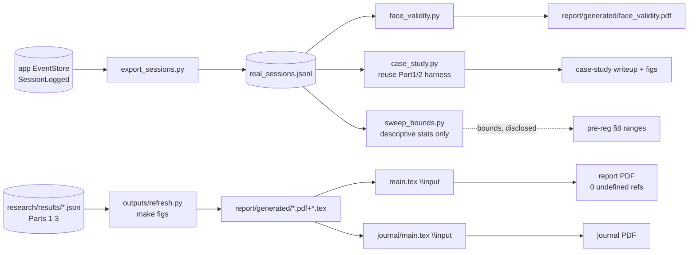

# How to use this plan

> **You are the implementing agent.** This document is your runbook for one cohesive change to this codebase. It was written collaboratively by Claude and a human after a planning discussion, and it is the source of truth for this work. Read this preamble in full before doing anything else.

## What you're holding

A phase-by-phase implementation plan. Each phase is a **vertical slice** — an end-to-end working increment that leaves the codebase in a working state. Phases are designed so any one of them can be implemented by a fresh agent in a new context window, with only this document and the codebase as input.

## Your job

1. **Read the document header in full first.** TL;DR, Context, Decisions log, Architecture overview, and Files-touched index. These give you the *why* behind every step. The Decisions log especially — those decisions were made deliberately and explain choices that may otherwise look arbitrary or wrong. Reference IDs (D-NN) appear inside phase steps so you can look up rationale.

2. **Find your starting phase.** Scan the phase list. Pick the first phase whose status is `☐ Not started` AND whose `Depends on:` phases are all `✅ Complete`. Implement that phase only. **Do not skip ahead. Do not implement multiple phases in one go unless the human explicitly asks.**

3. **Run the prereq verification.** Each phase has a "Verification (run BEFORE starting)" block. Run those commands. **If any fail, STOP** — the codebase isn't in the state this phase expects. Surface to the human: "Phase N's prereqs failed: `<command>` returned `<result>`. Want me to investigate or hand back?"

4. **Follow the steps in order.** Code blocks in steps are the actual code, not pseudocode or sketches. Apply them as written.

5. **If reality doesn't match the step — STOP.** If the plan says "modify line 47 of `auth.py`" and line 47 is something different, do not improvise. Surface the discrepancy: "Plan expected `<X>` at `auth.py:47`, found `<Y>`. Possible causes: plan is stale, file was edited since planning, plan was wrong. How should I proceed?"

6. **Run the tests and post-verification.** Each phase specifies what tests to add or update and the bash command to run. All must pass before the phase is considered done.

7. **Update status and commit.** When the phase is complete:
   - Edit this document: change the phase's `Status:` line to `✅ Complete — <commit-sha-here>`.
   - `git add` the code changes AND this plan file.
   - Commit them together. Suggested message: `Phase N: <phase title>` (with longer body referencing the plan file).
   - The status update and the code change live in the same commit so the doc and the code never drift.

## What you must NOT do

- **Do not skip phases.** Order matters; later phases assume earlier ones completed.
- **Do not modify the Decisions log, the Operating manual preamble, the TL;DR, the Architecture overview, the Files-touched index, the Open questions, the Out-of-scope list, or the References.** Those are immutable above-the-phases content. If you discover a decision is wrong, surface to the human — don't silently revise.
- **Do not re-plan or re-architect.** If the plan seems wrong, that's a signal to stop and surface, not to improvise.
- **Do not implement multiple phases without surfacing for human review** between them, unless the user explicitly asked for batch execution upfront.

## If you get stuck

- Update the phase's `Status:` to `🛑 Blocked: <one-line reason>`.
- Fill in the phase's `Notes (filled in during implementation)` block with what you tried, what's blocking, and what you'd want to know to unblock.
- Hand back to the human.

## Status vocabulary

- `☐ Not started`
- `🟡 In progress`
- `🛑 Blocked: <reason>`
- `✅ Complete — <commit-sha>`

## When status markers and reality drift

The status markers are a fast read, but they are not the source of truth. The phase's `Verification (DONE)` commands are the truth — if you suspect a marker is wrong (someone forgot to update, branches diverged, partial commits, etc.), run the verification commands for the phases marked complete. Trust the commands over the markers, and surface the drift to the human so the markers can be corrected.

---

# Research tier — Part 4: N=1 validation & output wiring (Phases 5–6)

**Slug:** `research-tier-4-validation-outputs`
**Date written:** 2026-06-13
**Author:** Claude + Rohit Saji
**Plan status:** Draft
**Upstream:** [`../../handovers/2026-06-13-research-tier.md`](../../handovers/2026-06-13-research-tier.md) · index: [`2026-06-13-research-tier.md`](2026-06-13-research-tier.md)

> **This is plan 4 of 4 — the convergence/assembly plan.** It covers tracker Phases 5 (N=1 validation) and 6 (report & journal wiring). **Prerequisites:** [Part 1](2026-06-13-research-tier-1-foundation.md) (generator + calibration), [Part 2](2026-06-13-research-tier-2-pillar-a-fanout.md) (detection/projection/scheduling + sweep), and [Part 3](2026-06-13-research-tier-3-kt-bench.md) (KT results) must have produced their `report/generated/*` artifacts and `research/results/*`. Phase 6 assembles **all** of them into the report and journal.
>
> ⏰ **Act now, before implementing anything:** task **P5.1 — "start logging your own study sessions" — is an ongoing collection task that must begin immediately** (today), independent of this plan's build order, so the N=1 case study and face-validity overlay are real by R3. Do not wait until Phase 5 to start logging.

## TL;DR

Close out the research tier with the two honest, non-load-bearing real-data uses and the fully automated output pipeline. Phase 5 exports the candidate's **own** logged study sessions into `SessionEvent[]`, overlays their pace-ratio/duration/gap distributions on the synthetic ones for a **face-validity** figure, runs them through the existing calibration/detection/projection harness as a **qualitative case study**, derives **sweep-bound descriptive stats** from real data (bounds only — never tuning generator parameters, the circularity guard), and writes a stub with **explicit non-claims** (no algorithm-superiority from N=1). Phase 6 makes `make figs`/`make all` regenerate every report/journal artifact from `results/*.json` → `report/generated/*.{pdf,tex}` with a provenance stamp in each caption footnote, `\input{}`s them into `main.tex`, wires the full artifact inventory (build-plan §11), creates an IMRAD journal-draft skeleton reusing the identical artifacts, and adds a reproducibility gate: clean clone → `make all` → `main.tex` compiles with **0 undefined refs** and numbers identical across report and journal.

## Context & background

Three legs make the single-user data non-load-bearing (build-plan §10): synthetic-with-ground-truth (Parts 1–2), public benchmarks (Part 3), and — here — N=1 real sessions used only for **feasibility and face-validity**, never for performance claims (decision #17). No real data exists yet, which is exactly why **logging must start now**: by R3 we expect ~15–25 of the candidate's own sessions — small, but a genuine cold-start case.

The output layer (decision #18) makes the report and journal **fully auto-generated**: results JSON → booktabs `.tex` + matplotlib **vector PDF** → `\input{}` into `main.tex`. Numbers cannot drift between report, journal, and re-runs. The report is LaTeX via **TinyTeX** at [`college/mydeliverables/1st-Review/report/main.tex`](../../../college/mydeliverables/1st-Review/report/main.tex) (manual `thebibliography`, vector figures). Parts 1–3 already **emit** their artifacts into `report/generated/`; Phase 6 is where they get **wired in** and the whole thing is made reproducible from a clean clone.

**Support docs (read before implementing):**

- [`college/scope/research-build-plan.md`](../../../college/scope/research-build-plan.md) — §10 N=1 validation, §11 output wiring + artifact inventory.
- [`college/scope/research-decisions-and-findings.md`](../../../college/scope/research-decisions-and-findings.md) — decisions #17, #18.
- [`college/scope/archetype-preregistration.md`](../../../college/scope/archetype-preregistration.md) — §8 sweep grid (Phase 5 informs *bounds* only).
- [`.cursor/rules/latex-report-build.mdc`](../../../.cursor/rules/latex-report-build.mdc) — **TinyTeX toolchain on PATH**, `latexmk` multi-pass, manual bib, 0-undefined-refs check.
- [`.cursor/rules/flow-diagram-tikz-gen.mdc`](../../../.cursor/rules/flow-diagram-tikz-gen.mdc) — vector-PDF discipline / visual verification loop.
- [`apps/app/src/events/EventStore.ts`](../../../apps/app/src/events/EventStore.ts) — the app event store the N=1 export reads from (`SessionLogged` events).

## Decisions log

Mirrors the frozen decisions (frozen 2026-06-13). The subset governing Phases 5 & 6:

### D-17: N=1 is face-validity + feasibility + sweep-bound info — never a performance claim

**Status:** ✅ Agreed (master #17)

**Context:** A single subject cannot prove algorithm performance.

**Decision:** Real data is used three ways only — (1) generator face-validity overlay, (2) end-to-end pipeline case study, (3) descriptive stats that inform sweep **bounds**. **Prohibited:** any "real data shows model X beats Y" claim. The write-up states the non-claims explicitly.

**Rationale:** Keeps the contribution bulletproof; the comparison rests on synthetic ground truth + public benchmarks.

**Reversibility:** easy (it's a reporting discipline).

### D-18: Circularity guard — real data sets sweep *bounds*, never tunes generator params

**Status:** ✅ Agreed (master #14, #17)

**Context:** Tuning generator parameters to real data and then "validating" on the same data is circular.

**Decision:** Generator parameters stay literature-grounded and pre-registered (Part 1 `params.py`). Real data may only *widen/centre the sweep ranges* (descriptive stats), and that influence is disclosed. Parameters are never fit to the N=1 sessions.

**Rationale:** Preserves the pre-registration's integrity.

**Reversibility:** hard — violating it would invalidate the pre-registration claim.

### D-19: Outputs fully auto-generated; one command refreshes report + journal

**Status:** ✅ Agreed (master #18)

**Context:** Hand-placed numbers drift between report, journal, and re-runs.

**Decision:** `make figs`/`make all` regenerate `report/generated/*.{pdf,tex}` from `results/*.json`; `main.tex` and the journal draft `\input{}` the identical files; every artifact carries a provenance stamp in its caption footnote. Re-running the study refreshes both with one command.

**Rationale:** No transcription drift; reproducible; citable.

**Alternatives considered:**
- Hand-place numbers → rejected: drift and non-reproducibility.

**Reversibility:** moderate.

### D-20: Reproducibility gate — clean clone → `make all` → report compiles, 0 undefined refs

**Status:** ✅ Agreed (master #18; build-plan §11)

**Context:** "Reproducible" must be enforced, not asserted.

**Decision:** A scripted gate runs from a clean clone: `make all` regenerates every artifact and `main.tex` compiles with **0 undefined references** (checked in the final `main.log`). Report and journal numbers are identical because they `\input{}` the same files.

**Reversibility:** easy (it's a check).

## Architecture overview

```
research/comparison/src/research_comparison/
  validation/
    export_sessions.py    P5.2  app EventStore export -> SessionEvent[]  (real_sessions.jsonl)
    face_validity.py      P5.3  real vs synthetic distribution overlay -> PDF
    case_study.py         P5.4  run real sessions through calibration/detection/projection harness
    sweep_bounds.py       P5.5  descriptive stats -> sweep-bound suggestions (bounds only, D-18)
  outputs/
    refresh.py            P6.1  results/*.json -> report/generated/*.{pdf,tex} (orchestrator for `make figs`)
    provenance_caption.py P6.2  caption-footnote stamp string from manifest
    inventory.py          P6.4  the full artifact inventory (build-plan §11) -> ensure each is generated
  tests/
    test_validation.py    P5    export schema, overlay, case-study smoke, sweep-bounds = bounds only
    test_outputs.py       P6    refresh produces inventory; captions stamped; repro-gate dry checks

college/mydeliverables/1st-Review/
  report/
    main.tex              P6.3  \input{generated/...} into Results/Implementation/Expected-Outcomes
    generated/            ALL artifacts: calibration_*, detection_*, projection_*, scheduling_*,
                          kt_*, robustness_heatmap, face_validity  (+ .tex tables)
  journal/
    main.tex              P6.5  IMRAD skeleton \input{}-ing the SAME generated artifacts
scripts/
  repro_gate.sh           P6.6  clean clone -> make all -> latexmk -> assert 0 undefined refs
```



## Files touched (index)

| Path | Change | Phase | Purpose |
|------|--------|-------|---------|
| `research/comparison/src/research_comparison/validation/export_sessions.py` | new | 5a | Export own sessions from app EventStore → `SessionEvent[]` |
| `research/comparison/src/research_comparison/validation/face_validity.py` | new | 5a | Real vs synthetic distribution overlay → PDF |
| `research/comparison/tests/test_validation.py` | new | 5a/5b | Export schema, overlay, case-study smoke, sweep-bounds discipline |
| `research/comparison/src/research_comparison/validation/case_study.py` | new | 5b | Run real sessions through the harness (qualitative) |
| `research/comparison/src/research_comparison/validation/sweep_bounds.py` | new | 5b | Descriptive stats → sweep-bound suggestions (bounds only) |
| `college/mydeliverables/1st-Review/report/generated/face_validity.pdf` | new | 5a | Face-validity figure |
| `college/.../report/results/n1_case_study.md` (or `.tex` stub) | new | 5b | N=1 write-up stub with explicit non-claims |
| `research/comparison/src/research_comparison/outputs/refresh.py` | new | 6a | `results/*.json` → `report/generated/*` orchestrator |
| `research/comparison/src/research_comparison/outputs/provenance_caption.py` | new | 6a | Caption-footnote provenance string |
| `research/comparison/src/research_comparison/outputs/inventory.py` | new | 6a | Full artifact inventory (build-plan §11) |
| `college/mydeliverables/1st-Review/report/main.tex` | modify | 6a | `\input{generated/...}` into Results / Implementation / Expected-Outcomes |
| `research/comparison/tests/test_outputs.py` | new | 6a/6b | Refresh produces inventory; captions stamped; repro dry-checks |
| `college/mydeliverables/1st-Review/journal/main.tex` | new | 6b | IMRAD skeleton `\input`-ing the same artifacts |
| `scripts/repro_gate.sh` | new | 6b | Clean clone → `make all` → `latexmk` → 0 undefined refs |
| `Makefile` | modify | 5a–6b | `validate`, refreshed `figs`, `all`, `report`, `repro` targets |

## Phases

### Phase 5a: Export real sessions + face-validity overlay

**Status:** ☐ Not started
**Depends on:** Part 1 Phase 1 (generator face-validity export hook), Part 1 Phase 2 (harness/plots spine)
**Estimated scope:** ~3 files, ~300 lines

Covers tracker tasks **P5.1 (flag/ongoing), P5.2, P5.3**. Implements D-17.

> **P5.1 is not a code task** — it is the ongoing instruction to *log your own study sessions in the app now*. This phase consumes whatever has been logged so far. Start logging today regardless of when this phase is implemented.

#### Codebase state assumed at start

- Part 1 complete: `generator/generate.py::export_face_validity` dumps synthetic pace-ratio/duration/gap distributions; `plots/` + `manifest` conventions exist.
- The app EventStore persists `SessionLogged` events (per-user Dexie DB; exportable JSON). See [`apps/app/src/events/EventStore.ts`](../../../apps/app/src/events/EventStore.ts).
- At least a handful of real sessions have been logged (else the overlay runs on a near-empty set — acceptable for a first pass; flag it).

#### Verification (run BEFORE starting)

```bash
export PATH="$HOME/.local/bin:$PATH"
uv run --package research-comparison python -c "from research_comparison.generator.generate import export_face_validity; print('hook ok')"
uv run --package research-comparison pytest research/comparison/tests/test_calibration_track.py -q   # spine green
```

#### Steps

1. **`validation/export_sessions.py` (P5.2):** read an exported EventStore JSON dump (the app can export the per-user Dexie `events` table) and map `SessionLogged` payloads to the `SessionEvent` shape (`date, source, plannedMinutes, activeMinutes, duration, materialRole, startedAt, sessionId`) — the **same shape the generator emits and the engines consume**. Write `research/datasets/real/real_sessions.jsonl`. Document the manual export step in the module docstring (where in the app to trigger the export).

2. **`validation/face_validity.py` (P5.3):** load `real_sessions.jsonl` and the synthetic face-validity dump; overlay the **pace-ratio**, **session-duration**, and **inter-session-gap** distributions (histogram/KDE, real vs synthetic) → `college/mydeliverables/1st-Review/report/generated/face_validity.pdf` (vector). Report resemblance **qualitatively** in the caption — no goodness-of-fit claim that would imply tuning (D-17/D-18).

3. **Makefile:** add a `validate` target running the export + face-validity overlay.

#### Tests

- Add `research/comparison/tests/test_validation.py` (this phase's slice):
  - **Export schema:** a fixture EventStore dump maps to records with the `SessionEvent` keys; `active` rows have pace fields, `manual` rows do not.
  - **Overlay runs:** `face_validity.py` on a tiny real + synthetic fixture produces a non-empty PDF and does not raise on small/empty real sets (degrades gracefully).
- Run: `uv run --package research-comparison pytest research/comparison/tests/test_validation.py -q`

#### Verification (DONE)

```bash
export PATH="$HOME/.local/bin:$PATH"
uv run --package research-comparison pytest research/comparison/tests/test_validation.py -q   # pass
uv run --package research-comparison python -m research_comparison.validation.export_sessions --in <eventstore_dump.json>
test -s research/datasets/real/real_sessions.jsonl && echo "real sessions exported"
make validate
test -s college/mydeliverables/1st-Review/report/generated/face_validity.pdf && echo "overlay ok"
```

#### Rollback

`git rm` Phase-5a files + `report/generated/face_validity.pdf`; revert Makefile diff. `research/datasets/real/` is gitignored.

#### Notes (filled in during implementation)

_(empty)_

---

### Phase 5b: N=1 case study + sweep-bound stats + non-claim write-up

**Status:** ☐ Not started
**Depends on:** Phase 5a, Part 2 Phase 3a–3b (detection/projection harness)
**Estimated scope:** ~3 files, ~250 lines

Covers tracker tasks **P5.4, P5.5, P5.6**. Implements D-17, D-18.

#### Codebase state assumed at start

- Phase 5a `✅ Complete`: `real_sessions.jsonl` exists.
- Part 2 Phases 3a (detection) and 3b (projection) complete: their runners/metrics are importable (calibration runner from Part 1).

#### Verification (run BEFORE starting)

```bash
export PATH="$HOME/.local/bin:$PATH"
test -s research/datasets/real/real_sessions.jsonl && echo "real sessions present"
uv run --package research-comparison python -c "from research_comparison.runners import calibration, detection, projection; print('harness ok')"
```

#### Steps

1. **`validation/case_study.py` (P5.4):** run the real sessions through the **exact** calibration/detection/projection harness (the same runners the synthetic study uses) and emit a qualitative case-study artifact (a few figures + a short narrative) → `report/generated/n1_case_study_*.pdf`. This demonstrates end-to-end **feasibility**, not benchmark performance.

2. **`validation/sweep_bounds.py` (P5.5):** compute **descriptive stats only** from the real sessions (observed pace-ratio spread → σ range, observed gap structure → manual-fraction range, etc.) and emit *suggested bounds* for the pre-reg §8 sweep grid. **Output is advisory bounds, never a parameter fit** (D-18). The module must NOT write into `params.py`; it writes a separate `research/results/validation/sweep_bounds_suggested.json` that a human reviews before any (disclosed) widening of the sweep ranges.

3. **N=1 write-up stub (P5.6):** `college/mydeliverables/1st-Review/report/results/n1_case_study.md` (or a `.tex` stub) stating the **explicit non-claims**: "N=1 establishes feasibility and face-validity only; no algorithm-superiority conclusion is drawn from real data; generator parameters were not tuned to these sessions (circularity guard)." This text is reused verbatim in the report and journal.

#### Tests

- Extend `research/comparison/tests/test_validation.py`:
  - **Case-study smoke:** the real sessions run through the calibration/detection/projection runners without error and produce finite outputs.
  - **Sweep-bounds discipline (D-18 guard):** `sweep_bounds.py` writes only to `results/validation/sweep_bounds_suggested.json`; assert it does **not** modify `params.py` (compare `PARAMS_VERSION_HASH` before/after — unchanged).
  - **Non-claim text present:** the write-up stub contains the required non-claim sentences (grep-style assertion on key phrases).
- Run: `uv run --package research-comparison pytest research/comparison/tests/test_validation.py -q`

#### Verification (DONE)

```bash
export PATH="$HOME/.local/bin:$PATH"
uv run --package research-comparison pytest research/comparison/tests/test_validation.py -q   # pass
make validate
ls research/results/validation/sweep_bounds_suggested.json                                    # advisory bounds only
grep -qi "no algorithm-superiority" college/mydeliverables/1st-Review/report/results/n1_case_study.md && echo "non-claims present"
```

> At this point **Phase 5's DoD holds**: real-vs-synthetic overlay figure + a case-study run through the harness, with explicit non-claim notes.

#### Rollback

`git rm` Phase-5b files + the case-study PDFs + write-up stub; revert Makefile diff.

#### Notes (filled in during implementation)

_(empty)_

---

### Phase 6a: Auto-generate every artifact + `\input{}` into `main.tex` + provenance footnotes

**Status:** ☐ Not started
**Depends on:** Part 1 Phase 2, Part 2 Phase 3a–3d, Part 3 Phase 4c, Phase 5a–5b *(all artifact producers)*
**Estimated scope:** ~3 new modules + `main.tex` edits, ~400 lines

Covers tracker tasks **P6.1, P6.2, P6.3, P6.4**. Implements D-19.

#### Codebase state assumed at start

- All artifact producers complete: calibration (Part 1), detection/projection/scheduling/robustness (Part 2), KT (Part 3), face-validity/case-study (Phase 5). Their `report/generated/*` files exist.
- `research/results/*.json` are stamped (manifest provenance).
- The report compiles today via **TinyTeX**: `export PATH="$HOME/Library/TinyTeX/bin/universal-darwin:$PATH"` then `latexmk -pdf` (see [`latex-report-build.md`](../../../.cursor/rules/latex-report-build.mdc)). `main.tex` has chapters: *Implementation Details* (Dataset Description / Model Implementation / Evaluation Metrics), *Results and Discussion* (Result Analysis), and *Proposed Methodology* (Expected Outcomes and Evaluation Methodology).

#### Verification (run BEFORE starting)

```bash
export PATH="$HOME/Library/TinyTeX/bin/universal-darwin:$PATH"
cd college/mydeliverables/1st-Review/report && latexmk -pdf -interaction=nonstopmode -halt-on-error main.tex >/dev/null 2>&1 && echo "report compiles today"
grep -c undefined main.log   # baseline (should be 0)
cd - && ls college/mydeliverables/1st-Review/report/generated/*.tex | head   # artifacts present from Parts 1-3 + Phase 5
```

#### Steps

1. **`outputs/provenance_caption.py` (P6.2):** produce the caption-footnote string from a manifest stamp — `"generator v{version} · seed {seed} · params {hash}"` — for embedding in every figure/table caption.

2. **`outputs/refresh.py` (P6.1):** the `make figs` orchestrator — read every `results/*.json`, (re)generate `report/generated/*.pdf` (matplotlib → vector) + `*.tex` (booktabs), each carrying the provenance footnote (P6.2). Idempotent: re-running reproduces byte-stable tables (modulo timestamps, which are excluded).

3. **`outputs/inventory.py` (P6.4):** declare the **full artifact inventory** (build-plan §11) and verify each is present after `refresh.py`: calibration convergence + winners; detection latency-vs-FA (per shift-type) + table; projection CI-reliability + error/sharpness; scheduling metrics (per material-mix); KT cold-start curve + reliability diagram + full-seq AUC + ECE; generator face-validity overlay; sensitivity-sweep robustness heatmap. Missing artifacts fail the build with a clear message.

4. **Edit `main.tex` (P6.3):** replace the placeholder/result figures with `\input{generated/...}` and `\includegraphics{generated/...}` in the right sections — results figures/tables into **Results and Discussion**; dataset/metric tables into **Implementation Details**; keep the existing `system_architecture.pdf` figure[p]. Follow the figure-float discipline in [`flow-diagram-tikz-gen.md`](../../../.cursor/rules/flow-diagram-tikz-gen.mdc). Add `make report` (= `figs` then `latexmk`).

#### Tests

- Add `research/comparison/tests/test_outputs.py`:
  - **Inventory completeness:** after a fixture `refresh.py` run, `inventory.py` reports every required artifact present; a deliberately-removed artifact makes it fail.
  - **Caption stamp:** generated `.tex` tables contain the provenance footnote string for their result's manifest.
  - **Idempotence:** running `refresh.py` twice yields identical `.tex` bytes (excluding any timestamp line).
- Run: `uv run --package research-comparison pytest research/comparison/tests/test_outputs.py -q`

#### Verification (DONE)

```bash
export PATH="$HOME/.local/bin:$PATH"
uv run --package research-comparison pytest research/comparison/tests/test_outputs.py -q   # pass
make figs
export PATH="$HOME/Library/TinyTeX/bin/universal-darwin:$PATH"
cd college/mydeliverables/1st-Review/report && latexmk -pdf -interaction=nonstopmode -halt-on-error main.tex && grep -c undefined main.log   # 0
grep -l "seed" generated/*.tex | head    # captions stamped
```

#### Rollback

`git rm` the Phase-6a modules; `git checkout -- college/mydeliverables/1st-Review/report/main.tex` to restore the placeholder figures; revert Makefile diff. `report/generated/*` are regenerable.

#### Notes (filled in during implementation)

_(empty)_

---

### Phase 6b: Journal IMRAD skeleton + reproducibility gate

**Status:** ☐ Not started
**Depends on:** Phase 6a
**Estimated scope:** ~2 files, ~250 lines

Covers tracker tasks **P6.5, P6.6**. Implements D-19, D-20.

#### Codebase state assumed at start

- Phase 6a `✅ Complete`: `make figs` regenerates all artifacts; `main.tex` `\input`s them and compiles with 0 undefined refs.
- TinyTeX on PATH; `make all` chains `dataset compare … figs`.

#### Verification (run BEFORE starting)

```bash
export PATH="$HOME/.local/bin:$PATH"
uv run --package research-comparison pytest research/comparison/tests/test_outputs.py -q   # 6a green
ls college/mydeliverables/1st-Review/report/generated/*.tex | wc -l   # full inventory present
```

#### Steps

1. **`college/mydeliverables/1st-Review/journal/main.tex` (P6.5):** an IMRAD skeleton (Intro / Methods / Results / Discussion) that `\input{}`s the **identical** `report/generated/*` artifacts (relative path or a symlink/copy of `generated/`). Venue-agnostic (LAK / EDM / IEEE TLT class — no venue-specific template yet). Because it reuses the same generated files, numbers cannot diverge from the report (D-19).

2. **`scripts/repro_gate.sh` (P6.6):** the reproducibility gate — from a clean checkout: `make all` (regenerate every artifact), then `latexmk -pdf` on both `report/main.tex` and `journal/main.tex`, then assert **0 undefined references** in each final `main.log` (`grep -c undefined main.log` → 0) and assert the report and journal reference identical generated files. Exit non-zero on any failure. Add a `make repro` target.

#### Tests

- Extend `research/comparison/tests/test_outputs.py`:
  - **Journal reuse:** `journal/main.tex` `\input`s only paths under `generated/` (no inline numbers) — grep assertion.
  - **Gate dry-check (no LaTeX needed):** `repro_gate.sh --dry` lists the steps and validates that `make all` targets exist and `generated/` is non-empty.
- The full LaTeX compile in `repro_gate.sh` runs on the candidate's machine (TinyTeX); it is not run in CI here (per repo norm: write the gate, run it locally).
- Run: `uv run --package research-comparison pytest research/comparison/tests/test_outputs.py -q`

#### Verification (DONE)

```bash
export PATH="$HOME/Library/TinyTeX/bin/universal-darwin:$PATH:$HOME/.local/bin"
bash scripts/repro_gate.sh        # exits 0; prints "report: 0 undefined", "journal: 0 undefined"
# spot check both PDFs built:
ls college/mydeliverables/1st-Review/report/main.pdf college/mydeliverables/1st-Review/journal/main.pdf
```

> At this point **Phase 6's DoD holds**: clean clone → `make all` → `report/generated/*` populated → `main.tex` compiles with 0 undefined refs; numbers identical in report & journal. **The research tier is complete** (Phase 7's closed loop remains built-but-held for Phase II per Part 2). Review mapping: Phases 4–6 → R3.

#### Rollback

`git rm scripts/repro_gate.sh college/mydeliverables/1st-Review/journal/main.tex`; revert the Makefile `repro` target.

#### Notes (filled in during implementation)

_(empty)_

---

## Open questions

### OQ-08: How many real sessions by R3?

**Why deferred:** Depends on the candidate's logging discipline starting now (P5.1). ~15–25 expected; the face-validity overlay and case study scale to whatever exists.
**Triggers needing resolution:** R3 prep — if too few sessions, frame the case study as preliminary feasibility only.
**Owner / resolution path:** Candidate; start logging immediately.

### OQ-09: Journal venue specifics

**Why deferred:** Target venue (LAK / EDM / IEEE TLT class) not chosen; the IMRAD skeleton is venue-agnostic.
**Triggers needing resolution:** Before journal submission (post-R3).
**Owner / resolution path:** Candidate + advisor; swap in the venue template, reuse the same `generated/` artifacts.

### OQ-10: `generated/` sharing between report and journal

**Why deferred:** Journal can `\input` `../report/generated/...` directly, or use a copy/symlink. Direct relative `\input` is simplest and guarantees identical numbers; a copy is more portable for submission.
**Triggers needing resolution:** Phase 6b step 1.
**Owner / resolution path:** Candidate; default to relative `\input` for the build, copy at submission time.

## Out of scope (this plan)

- **Producing the result artifacts themselves** — Parts 1–3 generate `report/generated/*`; this plan *wires and assembles* them.
- **Real-data algorithm-superiority claims** — explicitly prohibited (D-17).
- **Tuning generator parameters to real data** — prohibited circularity (D-18); real data informs sweep *bounds* only, disclosed.
- **Closed-loop results in the Phase-I report/journal** — Phase 7 (Part 2) is archived and held for Phase II.
- **Venue-specific journal formatting** — deferred (OQ-09); skeleton is venue-agnostic.

## References

- [`college/scope/research-build-plan.md`](../../../college/scope/research-build-plan.md) — §10 N=1 validation, §11 outputs + artifact inventory.
- [`college/scope/research-decisions-and-findings.md`](../../../college/scope/research-decisions-and-findings.md) — decisions #17, #18.
- [`college/scope/archetype-preregistration.md`](../../../college/scope/archetype-preregistration.md) — §8 sweep grid (bounds only).
- [`.cursor/rules/latex-report-build.mdc`](../../../.cursor/rules/latex-report-build.mdc) — TinyTeX toolchain, `latexmk`, manual bib, 0-undefined-refs.
- [`.cursor/rules/flow-diagram-tikz-gen.mdc`](../../../.cursor/rules/flow-diagram-tikz-gen.mdc) — vector-PDF discipline / figure floats.
- [`college/mydeliverables/1st-Review/report/main.tex`](../../../college/mydeliverables/1st-Review/report/main.tex) — wiring target (Results / Implementation / Expected-Outcomes chapters).
- [`apps/app/src/events/EventStore.ts`](../../../apps/app/src/events/EventStore.ts) — source of the N=1 session export.
