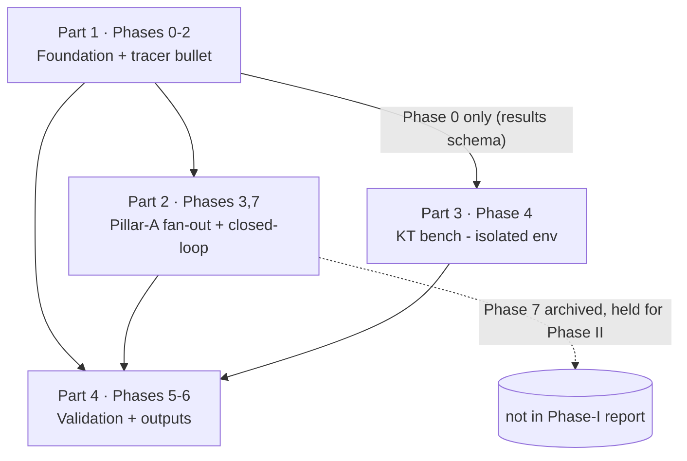

# Research tier (`/research`) — implementation plan index

**Date written:** 2026-06-13
**Author:** Claude + Rohit Saji
**Plan status:** Draft (4 grouped sub-plans)
**Upstream:** [`../../handovers/2026-06-13-research-tier.md`](../../handovers/2026-06-13-research-tier.md)

> **This is an index, not a runbook.** It maps the 8-phase master tracker
> ([`college/scope/research-tasklist.md`](../../../college/scope/research-tasklist.md)) onto **four grouped
> implementation plans**. To *implement*, open the relevant part below and follow its
> operating-manual preamble. Do not implement from this index.

## What is being built

The offline Python **`/research` tier** for the M.Tech project *"Adaptive Study Planning for
Self-Directed Learners."* It generates synthetic learners with known ground truth, runs a
**genuine** multi-candidate comparison for every Pillar-A component (importing `py-progress` /
`py-roadmap-engine` as peer candidates — never re-implementing them), benchmarks knowledge-tracing
models on real public data (Eedi/POJ), validates against the candidate's own N=1 sessions, and
auto-emits every report/journal table and figure. `/research` is greenfield. Authoritative design:
[`research-build-plan.md`](../../../college/scope/research-build-plan.md); frozen generator numbers:
[`archetype-preregistration.md`](../../../college/scope/archetype-preregistration.md); settled decisions
#1–19: [`research-decisions-and-findings.md`](../../../college/scope/research-decisions-and-findings.md).

## The four plans

| Part | File | Tracker phases | Milestone |
|---|---|---|---|
| **1 · Foundation & tracer bullet** | [`2026-06-13-research-tier-1-foundation.md`](2026-06-13-research-tier-1-foundation.md) | 0, 1, 2 | **M1** — first shippable increment (one track end-to-end) |
| **2 · Pillar-A fan-out + closed-loop** | [`2026-06-13-research-tier-2-pillar-a-fanout.md`](2026-06-13-research-tier-2-pillar-a-fanout.md) | 3, 7 | **M2** — all four Pillar-A tracks + sweep; closed loop built (held for Phase II) |
| **3 · KT bench** | [`2026-06-13-research-tier-3-kt-bench.md`](2026-06-13-research-tier-3-kt-bench.md) | 4 | Pillar-B benchmark (isolated env, parallelizable) |
| **4 · Validation & outputs** | [`2026-06-13-research-tier-4-validation-outputs.md`](2026-06-13-research-tier-4-validation-outputs.md) | 5, 6 | N=1 validation + fully reproducible report/journal |

## Why this grouping (how the phases fit together)

The tracker is sequenced as a **tracer bullet** (build one track end-to-end before fanning out),
and its dependency graph has four natural seams:

1. **The 0→1→2 critical path is one tight chain** ending in the first shippable artifact (generate →
   calibrate → figure). Phase 0 (scaffold) is not a meaningful standalone deliverable, so it groups
   with the generator and the calibration tracer bullet as **Part 1**.
2. **Phase 3 (fan-out) and Phase 7 (closed-loop) both extend the same Pillar-A harness** (both depend
   on the Phase-2 spine). Whoever just built the open-loop tracks has the context to add the
   closed-loop feedback wiring. They group as **Part 2** — with Phase 7 explicitly **built but not
   presented in Phase I** (decision #19).
3. **Phase 4 (KT) is a different environment** (isolated torch/pyKT venv) and is **independent of
   Phases 1–3** — it depends only on Part 1's Phase 0 (results schema). It is its own **Part 3** so it
   can be built in parallel and a broken torch install can never block the Pillar-A pipeline
   (decision #15).
4. **Phases 5–6 are the assembly point** — they need results from every other track. They group as
   **Part 4**, the convergence plan that turns all results into the report and journal.

Each part stays under the implementation-plan skill's ~7-phase soft cap (the tracker's coarse phases
each fan into 2–4 vertical-slice plan-phases).

## Dependency DAG (between plans)

**Build order:** Part 1 first (critical path). Then **Part 2 and Part 3 can proceed in parallel**
(Part 3 needs only Part 1's Phase 0). Part 4 last — it assembles everyone's artifacts.

## Phase → plan coverage (all 8 tracker phases)

| Tracker phase | Title | Plan | Plan-internal phase(s) |
|---|---|---|---|
| 0 | Scaffolding & environment | Part 1 | Phase 0 |
| 1 | Synthetic generator | Part 1 | Phase 1 |
| 2 | Metrics spine + calibration (tracer bullet) | Part 1 | Phase 2 |
| 3 | Fan out Pillar-A tracks | Part 2 | Phases 3a, 3b, 3c, 3d |
| 4 | KT bench (Pillar B) | Part 3 | Phases 4a, 4b, 4c |
| 5 | N=1 validation | Part 4 | Phases 5a, 5b |
| 6 | Outputs — report & journal | Part 4 | Phases 6a, 6b |
| 7 | Closed-loop (built, held for Phase II) | Part 2 | Phase 7 |

## Review mapping (presentation gate, not a build gate)

Per the tracker: **Phases 0–3 → R2** (intermediate results), **Phases 4–6 → R3** (full comparison +
demo + journal draft), **Phase 7 built but revealed in Phase II.** Build the full pipeline now; reveal
what each review needs (decision #1).

## Cross-cutting rules every part respects

- **Single source of truth** — `/research` imports `py-progress` / `py-roadmap-engine`; never copies an
  engine (#2). Baselines are research-only (#3).
- **Pace semantics** — `pace_ratio = activeMinutes / plannedMinutes` literally; `r>1` over-runs (code-verified, frozen in pre-reg §1). Do not invert the OpenAPI prose.
- **Genuineness** — neutral mis-specified generator, K≈40 seeds, paired tests, oracle baselines (#5, #6, #14).
- **Reproducibility** — seed + manifest + params-version-hash stamped into every artifact (#18).
- **Frozen parameters** — Phase 1 reads [`archetype-preregistration.md`](../../../college/scope/archetype-preregistration.md) verbatim via one `params.py`; amendments only via its §10 log (#14).
- **TDD throughout** — generator tests prove the oracle recovers planted truth; determinism-by-seed is a test. Mirror the `packages/py-progress/tests` style.
- **Two environments** — clean `uv` member `research/comparison` + isolated `research/kt-bench` (out of `uv.lock`); seam = `results/kt/*.json` (#15).

## ⏰ Start now (does not wait for any phase)

**Log your own study sessions in the app today.** Tracker task P5.1 is an ongoing collection task; the
N=1 face-validity overlay and case study (Part 4 / Phase 5) need ~15–25 real sessions to be genuine by
R3. This is the one piece of work that cannot be compressed later.

## References

- [`college/scope/research-build-plan.md`](../../../college/scope/research-build-plan.md) — authoritative design.
- [`college/scope/research-tasklist.md`](../../../college/scope/research-tasklist.md) — the 8-phase master tracker.
- [`college/scope/archetype-preregistration.md`](../../../college/scope/archetype-preregistration.md) — frozen generator parameters.
- [`college/scope/research-decisions-and-findings.md`](../../../college/scope/research-decisions-and-findings.md) — decisions #1–19 + verified code facts.
- [`../../handovers/2026-06-13-research-tier.md`](../../handovers/2026-06-13-research-tier.md) — the session handover that scoped this work.
- [`2026-06-08-pillar-a-fastapi-backend.md`](2026-06-08-pillar-a-fastapi-backend.md) — the format/discipline template these plans mirror.
