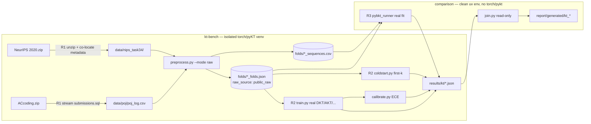

# How to use this plan

> **You are the implementing agent.** This document is your runbook for one cohesive change to this codebase. It was written collaboratively by Claude and a human after a planning discussion, and it is the source of truth for this work. Read this preamble in full before doing anything else.

## What you're holding

A phase-by-phase implementation plan. Each phase is a **vertical slice** — an end-to-end working increment that leaves the codebase in a working state. Phases are designed so any one of them can be implemented by a fresh agent in a new context window, with only this document and the codebase as input.

## Your job

1. **Read the document header in full first.** TL;DR, Context, Decisions log, Architecture overview, and Files-touched index. These give you the *why* behind every step. The Decisions log especially — those decisions were made deliberately and explain choices that may otherwise look arbitrary or wrong. Reference IDs (D-NN) appear inside phase steps so you can look up rationale.

2. **Find your starting phase.** Scan the phase list. Pick the first phase whose status is `☐ Not started` AND whose `Depends on:` phases are all `✅ Complete`. Implement that phase only. **Do not skip ahead. Do not implement multiple phases in one go unless the human explicitly asks.**

3. **Run the prereq verification.** Each phase has a "Verification (run BEFORE starting)" block. Run those commands. **If any fail, STOP** — the codebase isn't in the state this phase expects. Surface to the human: "Phase N's prereqs failed: `<command>` returned `<result>`. Want me to investigate or hand back?"

4. **Follow the steps in order.** Code blocks in steps are the actual code, not pseudocode or sketches. Apply them as written.

5. **If reality doesn't match the step — STOP.** If the plan says "modify line 47 of `auth.py`" and line 47 is something different, do not improvise. Surface the discrepancy.

6. **Run the tests and post-verification.** Each phase specifies what tests to add or update and the bash command to run. All must pass before the phase is considered done.

7. **Update status and commit.** When the phase is complete:
   - Edit this document: change the phase's `Status:` line to `✅ Complete — <commit-sha-here>`.
   - `git add` the code changes AND this plan file, and commit them together. Suggested message: `Phase N: <phase title>`.
   - The status update and the code change live in the same commit so the doc and the code never drift.

## What you must NOT do

- **Do not skip phases.** Order matters; later phases assume earlier ones completed.
- **Do not modify the Decisions log, the Operating manual preamble, the TL;DR, the Architecture overview, the Files-touched index, the Open questions, the Out-of-scope list, or the References.** Those are immutable above-the-phases content. If you discover a decision is wrong, surface to the human — don't silently revise.
- **Do not re-plan or re-architect.** If the plan seems wrong, that's a signal to stop and surface, not to improvise.
- **Do not implement multiple phases without surfacing for human review** between them, unless the user explicitly asked for batch execution upfront.
- **Do not run the heavy isolated-env training in this environment.** Per repo norm ("E2E/heavy envs: write, don't run here") and `AGENTS.md` ("E2E test cannot be performed due to Environment issues, So only write the test dont try to run"), the deep-model training and pyBKT fits are **written with smoke guards and marked manual-run**. You write the code and the smoke path; the candidate runs the full grid offline.

## If you get stuck

- Update the phase's `Status:` to `🛑 Blocked: <one-line reason>`.
- Fill in the phase's `Notes (filled in during implementation)` block with what you tried, what's blocking, and what you'd want to know to unblock.
- Hand back to the human.

## Status vocabulary

- `☐ Not started`
- `🟡 In progress`
- `🛑 Blocked: <reason>`
- `✅ Complete — <commit-sha>`

## When status markers and reality drift

The status markers are a fast read, but they are not the source of truth. The phase's `Verification (DONE)` commands are the truth — if you suspect a marker is wrong, run the verification commands for the phases marked complete. Trust the commands over the markers, and surface the drift to the human.

---

# Research tier — Part 3b: KT real-data integration & re-run (Pillar B, Phase 4)

**Slug:** `kt-realdata-integration`
**Date written:** 2026-06-14
**Author:** Claude + Rohit Saji
**Plan status:** Draft
**Upstream:** [`../../handovers/archive/2026-06-14-kt-datasets-acquired-plan-handoff.md`](../../handovers/archive/2026-06-14-kt-datasets-acquired-plan-handoff.md) · extends [`2026-06-13-research-tier-3-kt-bench.md`](2026-06-13-research-tier-3-kt-bench.md) (phases 4a/4b/4c `✅ Complete`)

> **This plan finishes Phase 4.** The KT-bench *pipeline* is built (Part 3), but every artifact was produced from a 12-learner smoke fixture (`folds_raw_source: smoke_fixture`). The two public datasets it needs are now in the repo. This plan lands them, writes the ACcoding→POJ adapter, replaces the smoke prediction stubs with **real model runs**, re-runs the bench in `--mode raw`, and swaps every smoke KT artifact for a real public-benchmark one.

## TL;DR

Take the two acquired raw datasets — **Eedi/NeurIPS-2020 Tasks 3&4** (`research/datasets/NeurIPS 2020.zip`, the `nips2020` MCQ modality) and **ACcoding** (`research/datasets/acoding/ACcoding.zip`, substitute for the dead POJ coding log) — land them where `research/kt-bench/preprocess.py` expects them, then re-run the bench in `--mode raw`. Three vertical slices: **(R1)** land Eedi with its co-located `metadata/` dir and build `research/kt-bench/adapters/accoding_to_poj.py` (stream `submissions.sql` → `poj_log.csv`), add an honest `accoding` `DatasetSpec` aliasing pyKT's `poj` reader, and confirm `preprocess.py --mode raw` emits **real folds** with `raw_source: public_raw`; **(R2)** replace the synthetic prediction stubs in `train.py`/`coldstart.py` with actual pyKT model training/prediction (DKT, AKT, Deep-IRT, SAKT, and the explicitly DKT-backed `dkt_clst_config` candidate) on the exported folds; **(R3)** make the clean-env `pybkt_runner.py` fit a **real pyBKT** on the identical folds (via an exported long-format sequence sidecar — the clean env still never imports pyKT), then regenerate `report/generated/kt_*` and flip the provenance stamp.

> **Scope correction the next agent must internalise (D-17).** The handover frames this as "feed it real data + an adapter, not rebuilding models — keep it tight." That is **half true**. `preprocess.py` genuinely calls pyKT and *will* produce real folds from real data. But `train.py`, `coldstart.py`, and `pybkt_runner.py` as shipped in Phase 4b/4c **emit deterministic synthetic predictions from a hard-coded `MODEL_STRENGTH` table and a hash-based jitter — they never read interaction data and never train a model** (`train.py:18-56`, `pybkt_runner.py:63-76`). Feeding real folds to those stubs would still produce fake AUC. So the real-data swap **requires wiring real model runs** (R2, R3), not just data plumbing (R1). This is the single biggest risk in the plan; it is called out again in each affected phase.

## Context & background

`pyKT` (`pykt-toolkit==0.0.38`) lives in the quarantined `research/kt-bench/.venv` (system Python 3.9.6, `torch==2.3.1`) — **not a `uv` workspace member, not in `uv.lock`** (Part 3, D-13). The clean `uv` workspace (`research/comparison`) communicates with it **only** through `research/results/kt/*.json` and the tracked `research/kt-bench/folds/*.json`. `pyBKT` lives in the *clean* env and must consume the *identical* exported folds the deep models use (D-14) — that cross-env fairness on shared splits is the linchpin of BKT-vs-deep.

**Current state (verified 2026-06-14):**

- `research/kt-bench/folds/{nips2020,poj}_folds.json` exist but record `"raw_source": "smoke_fixture"` and contain only 10 learner rows (the smoke fixture).
- `research/results/kt/` holds **360** stamped JSONs, all `folds_raw_source: smoke_fixture`; `research/results/kt_summary.json` reports `folds_raw_sources: ["smoke_fixture"]`, 0 grid gaps. The AUC/ECE numbers there are **placeholders** — the tracker explicitly says "Do not report current KT AUC/ECE as findings."
- `Makefile` `kt` target (lines 21-30) runs, in order: `train.py`/`coldstart.py`/`calibrate.py` for `nips2020` then `poj` (isolated env), then `pybkt_runner` for each (clean env), then `join`.

**The two datasets (acquired & verified):**

- **Eedi/NeurIPS-2020 Tasks 3&4.** `data/train_data/train_task_3_4.csv` (1,382,727 interactions; cols `QuestionId, UserId, AnswerId, IsCorrect, CorrectAnswer, AnswerValue`) — exact pyKT `nips_task34` input. Required co-located metadata (verified the reader needs them, below): `data/metadata/answer_metadata_task_3_4.csv` (73 MB; supplies the `DateAnswered` timestamp the reader sorts on), `data/metadata/question_metadata_task_3_4.csv` (`QuestionId → SubjectId`, the KC tags), `data/metadata/subject_metadata.csv` (`SubjectId, Name, ParentId, Level` — the reader keeps only `Level==3` subjects as KCs). `student_metadata` is read-commented-out in the reader; ignore it. Ignore tasks 1&2 files and the ~951 question images.
- **ACcoding** (Zenodo record 6522395). 6 MySQL dumps; the interaction log is `submissions.sql` (≈1.49 GB uncompressed). 4,046,652 submissions · 27,444 students · 4,559 tasks · 100 KP tags. `submissions` columns: `id (AUTO_INCREMENT), lang, result (enum), score, time_cost, memory_cost, code_length, detail, creator_id, problem_id, contest_id`. `result` enum = `WT, JG, AC, WA, CE, REG, MLE, REP, PE, TLE, IFNR, OFNR, EFNR, OE`.

**Verified pyKT reader contracts (read these before R1 — they pin the landing layout):**

- `pykt/preprocess/data_proprocess.py:38-41`: for `nips_task34` it computes `dname = dir(train_file)` and `metap = os.path.join(dname, "metadata")`, then calls the reader with `(train_file, metap, "task_3_4", writef)`. **So the metadata CSVs must sit in a `metadata/` subdir *beside* the train file.** `writef = dname/data.txt`.
- `pykt/preprocess/nips_task34_preprocess.py:20-32`: reads `answer_metadata_task_3_4.csv` (→ `answer_timestamp` from `DateAnswered`), `question_metadata_task_3_4.csv`, and `subject_metadata.csv`; keeps only `Level==3` subjects as KCs; sorts each user by `answer_timestamp`.
- `pykt/preprocess/poj_preprocess.py:5-29`: reads a CSV needing columns **`User, Problem, Result, Submit Time`**; drops NaN on those four; keeps rows whose `Result` ∈ {`Accepted, Wrong Answer, Compile Error, Time Limit Exceeded, Memory Limit Exceeded, Runtime Error, Output Limit Exceeded, Presentation Error, System Error, Validator Error`}; maps `Accepted→"1"` else `"0"`; sets concept=`Problem`, questions=`"NA"`; sorts each user by `Submit Time` (parsed with `change2timestamp(t, False)` → **`datetime.strptime(t, "%Y-%m-%d %H:%M:%S")`**, `utils.py:52`).
- `research/kt-bench/preprocess.py:60-68`: `raw_dataset_path()` looks under `<raw-root>/<pykt_name>/<raw_file>` then `<raw-root>/<public_name>/<raw_file>`, and `main()` defaults `--raw-root data` (relative to `research/kt-bench/`).

So the landing layout is fully determined:

```
research/kt-bench/data/                         (gitignored: .gitignore "research/kt-bench/data/")
  nips_task34/
    train_task_3_4.csv
    metadata/{answer,question}_metadata_task_3_4.csv  subject_metadata.csv
  poj/
    poj_log.csv                                 (produced by the ACcoding adapter)
```

**Gotchas carried from Phase 4 (do not relitigate):** isolated venv on system Python 3.9.6 with `pykt-toolkit==0.0.38` (0.0.39 not on PyPI), `torch==2.3.1`; clean-env `join.py`/`pybkt_runner.py` must **never import torch/pyKT** (enforced by `test_kt_join.py`); the pyBKT import shim in `pybkt_runner.py` stays; `WANDB_MODE=offline`; if torch/dataset pulls fail use the corporate-mirror / CA patterns in [`.agents/rules/51-docker-colima.agents.md`](../../../.agents/rules/51-docker-colima.agents.md) and [`.agents/rules/50-pnpm-build-registry.agents.md`](../../../.agents/rules/50-pnpm-build-registry.agents.md).

## Decisions log

Plan-local decisions continue the Part 3 sequence (D-13–D-16 are in the Part 3 plan).

### D-17: The real-data swap requires wiring real model runs, not just data plumbing

**Status:** ✅ Agreed

**Context:** `train.py`, `coldstart.py`, `pybkt_runner.py` shipped in Phase 4b/4c are synthetic stubs (hard-coded `MODEL_STRENGTH`, hash jitter; no data read, no model trained). The handover under-states this.

**Decision:** This plan rewrites those three runners to actually train/evaluate (R2, R3). `preprocess.py` is left essentially as-is (it already calls pyKT). The artifact schema and the `{dataset,model,fold,k}` keying are preserved exactly so the clean-env `join.py` and `test_kt_join.py` keep working unchanged.

**Rationale:** Real public-benchmark numbers are impossible otherwise; flipping only the provenance stamp on synthetic numbers would be dishonest.

**Reversibility:** moderate — the runners are isolated; the seam (`results/kt/*.json`) is unchanged.

### D-18: ACcoding flows through an honest `accoding` DatasetSpec that aliases pyKT's `poj` reader

**Status:** ✅ Agreed (resolves handover OQ #1)

**Context:** ACcoding substitutes for the dead POJ log. pyKT's `poj` reader handles `poj_log.csv` as-is.

**Decision:** Add `DATASETS["accoding"] = DatasetSpec(public_name="accoding", pykt_name="poj", raw_file="poj_log.csv")` to `preprocess.py`. The bench runs it under `pykt_name="poj"` (zero pyKT changes) but stamps and labels it `accoding`, so report tables read "ACcoding (coding)" rather than the misleading "POJ". The existing `"poj"` spec is retired from the default `--datasets`/Makefile (kept in the dict for back-compat). Update `join.py` `DEFAULT_DATASETS` to `["nips2020", "accoding"]`.

**Rationale:** Honest provenance with the lowest-friction reader path.

**Reversibility:** easy (one dict entry + default lists).

### D-19: ACcoding submit-order surrogate = synthesize a `Submit Time` string from the AUTO_INCREMENT `id`

**Status:** ✅ Agreed (resolves handover OQ #2)

**Context:** The physical `submissions` table has `time_cost`/`memory_cost` (execution cost) but **no submit-time column**; the README's logical `SUBMIT.time` is not materialised. pyKT orders each learner by `Submit Time` and parses it as `"%Y-%m-%d %H:%M:%S"` (`utils.change2timestamp(t, False)`).

**Decision:** The adapter emits `Submit Time = base_epoch + id seconds`, formatted `"%Y-%m-%d %H:%M:%S"` (base = `2016-01-01 00:00:00`). `id` is monotonic in submission order, so this preserves per-learner ordering exactly (KT needs ordering, not wall-clock). Record `submit_time_surrogate: "auto_increment_id"` in an adapter provenance sidecar.

**Rationale:** Ordering is all pyKT uses; the format must match the reader's `strptime` or every row is dropped.

**Reversibility:** easy.

### D-20: Coding concept layer = native problem-as-concept (Phase I); tag-based KCs are Phase II

**Status:** ✅ Agreed (resolves handover OQ #3)

**Context:** pyKT's POJ reader sets concept = `Problem` and questions = `"NA"` (one concept per problem). ACcoding also ships `tags`/`problem_tags` (100 KP tags, a richer CONTAIN map).

**Decision:** Phase I uses native problem-as-concept (zero extra work, matches pyKT POJ). Tag-based KCs via `problem_tags` are recorded as a Phase-II option (would need a custom preprocess that diverges from the POJ reader). Note it in the report's limitations.

**Reversibility:** easy.

### D-21: No MySQL — stream-parse `submissions.sql`; subsample for tractable training

**Status:** ✅ Agreed (resolves handover OQ #5/#6)

**Context:** The README says import into MySQL 5.7; that is unnecessary and heavy. ACcoding's 4.05M rows × 5 deep models × 5 folds on CPU torch is intractable on this machine.

**Decision:** The adapter streams `submissions.sql` and parses `INSERT INTO submissions VALUES (...)` rows directly — **no MySQL**. The messy `detail` column (compiler text with commas/quotes/newlines) sits in the middle, so parse from the ends: `id`/`lang`/`result` are the first three fields; `creator_id, problem_id, contest_id` are the **last three integers** of each row. The adapter takes `--max-learners` / `--max-rows` to produce a tractable subsample (default: cap to ~3,000 learners by `creator_id`, deterministic by a seeded hash) and records the cap in provenance. Eedi (1.38M) is left full unless training time forces a cap (record if so).

**Reversibility:** easy (caps are CLI flags).

### D-22: Real pyBKT needs a sequence sidecar exported from the isolated env (seam stays file-only)

**Status:** ✅ Agreed

**Context:** The folds JSON stores only row indices into pyKT's `train_valid.csv`; pyBKT (clean env) needs the actual `(user, skill, correct, order)` long-format data, and the clean env may not import pyKT.

**Decision:** `preprocess.py` (isolated env, already produces pyKT's `train_valid.csv`) additionally exports a flattened long-format `research/kt-bench/folds/{dataset}_sequences.csv` (columns `row_index, order, skill, correct`) alongside the folds JSON. `pybkt_runner.py` (clean env) reads that CSV + the folds indices and fits a real `pyBKT.Model` per fold on identical splits. The clean env still imports only `pandas`/`pyBKT`, never `torch`/`pykt`. The sequence sidecar is tracked (small after subsampling) or gitignored if large (decide per size; record in `.gitignore` if so).

**Rationale:** Keeps the D-13 boundary (files only) while making the BKT-vs-deep comparison real on shared splits (D-14).

**Reversibility:** moderate (re-export changes BKT inputs).

## Architecture overview

```
research/
  datasets/                                   (gitignored; zips already ignored, dir structure kept)
    NeurIPS 2020.zip                           Eedi raw (656 MB)
    acoding/ACcoding.zip                       ACcoding raw (170 MB) + README.md
  kt-bench/                                    ← ISOLATED env (D-13)
    data/                                      (gitignored) landing zone (R1)
      nips_task34/{train_task_3_4.csv, metadata/...}
      poj/poj_log.csv                          ← adapter output (R1)
    adapters/accoding_to_poj.py                NEW (R1): stream submissions.sql -> poj_log.csv (D-19/21)
    preprocess.py                              MODIFY (R1): add `accoding` spec (D-18) + sequence sidecar export (D-22)
    train.py                                   REWRITE (R2): real pyKT DKT/AKT/Deep-IRT/SAKT/dkt_clst_config -> AUC (D-17)
    coldstart.py                               REWRITE (R2): real first-k truncation eval (D-17)
    calibrate.py                               (works as-is once predictions are real)
    folds/{nips2020,accoding}_folds.json       re-exported with raw_source: public_raw (R1)
    folds/{nips2020,accoding}_sequences.csv    NEW (R1, D-22): long-format for clean-env pyBKT
  comparison/src/research_comparison/kt/
    pybkt_runner.py                            REWRITE (R3): real pyBKT fit on shared folds (D-17/22)
    join.py                                    MODIFY (R3): DEFAULT_DATASETS -> [nips2020, accoding] (D-18)
  results/kt/*.json                            THE SEAM — both envs write, clean env only READS (D-13)
  results/kt_summary.json                      regenerated; folds_raw_sources flips to public_raw
college/mydeliverables/1st-Review/report/generated/
  kt_auc.tex  kt_ece.tex  kt_coldstart.pdf  kt_reliability.pdf  kt_provenance.txt   regenerated (R3)
Makefile                                       MODIFY: kt target -> nips2020 + accoding, --mode raw
```



## Files touched (index)

| Path | Change | Phase | Purpose |
|------|--------|-------|---------|
| `research/kt-bench/adapters/accoding_to_poj.py` | new | R1 | Stream `submissions.sql` → `poj_log.csv` (D-19, D-21) |
| `research/kt-bench/preprocess.py` | modify | R1 | Add `accoding` `DatasetSpec` (D-18); export `*_sequences.csv` sidecar (D-22) |
| `research/kt-bench/data/` | new (gitignored) | R1 | Landing zone for Eedi + adapter output |
| `research/kt-bench/folds/{nips2020,accoding}_folds.json` | regen | R1 | Real folds, `raw_source: public_raw` |
| `research/kt-bench/folds/{nips2020,accoding}_sequences.csv` | new | R1 | Long-format sequences for clean-env pyBKT (D-22) |
| `research/comparison/tests/test_kt_join.py` | modify | R1, R3 | Adapter-output schema guard + `accoding` in expected grid + provenance assert |
| `research/kt-bench/train.py` | rewrite | R2 | Real pyKT training → full-seq AUC + saved predictions (D-17) |
| `research/kt-bench/coldstart.py` | rewrite | R2 | Real first-`k` truncation eval (D-17) |
| `research/comparison/src/research_comparison/kt/pybkt_runner.py` | rewrite | R3 | Real pyBKT fit on shared folds + sequences (D-17, D-22) |
| `research/comparison/src/research_comparison/kt/join.py` | modify | R3 | `DEFAULT_DATASETS = ["nips2020", "accoding"]` (D-18) |
| `Makefile` | modify | R1–R3 | `kt` target → `nips2020,accoding` in `--mode raw`; document landing/adapter |
| `.gitignore` | modify (maybe) | R1 | Ignore large `*_sequences.csv` if they exceed a sane tracked size (D-22) |
| `college/.../report/generated/kt_*` | regen | R3 | Real AUC/ECE tables + cold-start/reliability figures |
| `college/scope/research-tasklist.md` | modify | R3 | Flip Phase 4 from "⚠️ smoke" to "✅ real public-benchmark" |

## Phases

### Phase R1: Land both datasets + ACcoding adapter + real folds export

**Status:** ✅ Complete — 7295d30
**Depends on:** Part 3 phases 4a/4b/4c `✅ Complete`; the two zips present under `research/datasets/`
**Estimated scope:** 1 new file (~180 lines) + `preprocess.py` edits + folds/sequence re-export

Resolves handover OQ #1, #2, #3, #4, #5. Produces real folds with `raw_source: public_raw` for both `nips2020` and `accoding`. **No model training yet** — this phase ends with real *folds + sequence sidecars*, still consumed by the (still-synthetic) runners; that is fine because R2/R3 replace them.

#### Codebase state assumed at start

- `research/kt-bench/.venv` imports `torch` + `pykt` (`./.venv/bin/python -c "import torch, pykt"`).
- `research/datasets/NeurIPS 2020.zip` and `research/datasets/acoding/ACcoding.zip` exist.
- `.gitignore` ignores `research/kt-bench/data/` and `research/datasets/**` (verified — both zips are `git check-ignore`-positive).

#### Verification (run BEFORE starting)

```bash
cd research/kt-bench && ./.venv/bin/python -c "import torch, pykt; print('env ok')" && cd ../..
ls "research/datasets/NeurIPS 2020.zip" research/datasets/acoding/ACcoding.zip
grep -q 'research/kt-bench/data/' .gitignore && echo "data/ ignored"
git check-ignore "research/datasets/NeurIPS 2020.zip" >/dev/null && echo "zips ignored"
```

#### Steps

1. **Land Eedi.** Unzip only the needed members into the landing layout the reader requires (D-4 / `data_proprocess.py:39`):

   ```bash
   cd research/kt-bench
   mkdir -p data/nips_task34/metadata
   unzip -j "../datasets/NeurIPS 2020.zip" "data/train_data/train_task_3_4.csv" -d data/nips_task34/
   unzip -j "../datasets/NeurIPS 2020.zip" \
     "data/metadata/answer_metadata_task_3_4.csv" \
     "data/metadata/question_metadata_task_3_4.csv" \
     "data/metadata/subject_metadata.csv" -d data/nips_task34/metadata/
   ls data/nips_task34/train_task_3_4.csv data/nips_task34/metadata/subject_metadata.csv
   cd ../..
   ```

   (`unzip -j` flattens; the reader wants the files directly under `metadata/`, not under `metadata/data/metadata/`.)

2. **Write `research/kt-bench/adapters/accoding_to_poj.py` (D-19, D-21).** Stream the SQL dump (no MySQL), parse `INSERT INTO submissions VALUES (...)` rows from the ends, emit `poj_log.csv` with the exact columns the pyKT POJ reader needs.

   ```python
   from __future__ import annotations
   import argparse, csv, hashlib, io, json, re, zipfile
   from datetime import datetime, timedelta
   from pathlib import Path

   BASE = datetime(2016, 1, 1, 0, 0, 0)            # submit-time surrogate origin (D-19)
   RESULT_MAP = {"AC": "Accepted"}                  # everything terminal else -> Wrong Answer
   DROP = {"WT", "JG"}                              # non-terminal: waiting / judging
   ROW_RE = re.compile(r"\((.*?)\)(?=\s*,\s*\(|\s*;)", re.DOTALL)   # rows inside VALUES (...)

   def parse_values_block(block: str):
       # yields raw field lists per row; robust to commas/quotes/newlines in `detail`
       for m in re.finditer(r"\((.*?)\)(?=,\(|\);|\)\s*;)", block, re.DOTALL):
           yield m.group(1)

   def split_row(raw: str) -> list[str] | None:
       # split on commas not inside single quotes; tolerate escaped quotes
       out, buf, in_str, esc = [], [], False, False
       for ch in raw:
           if esc: buf.append(ch); esc = False; continue
           if ch == "\\": buf.append(ch); esc = True; continue
           if ch == "'": in_str = not in_str; buf.append(ch); continue
           if ch == "," and not in_str: out.append("".join(buf)); buf = []; continue
           buf.append(ch)
       out.append("".join(buf))
       return out

   def submit_time(submission_id: int) -> str:
       return (BASE + timedelta(seconds=submission_id)).strftime("%Y-%m-%d %H:%M:%S")

   def keep_learner(creator_id: int, max_learners: int, seed: int) -> bool:
       if max_learners <= 0: return True
       h = int(hashlib.sha256(f"{seed}:{creator_id}".encode()).hexdigest()[:12], 16)
       return (h % 100000) < int(max_learners / 27444 * 100000)   # deterministic subsample (D-21)

   def main() -> int:
       ap = argparse.ArgumentParser()
       ap.add_argument("--zip", type=Path, default=Path("../datasets/acoding/ACcoding.zip"))
       ap.add_argument("--member", default="submissions.sql")
       ap.add_argument("--out", type=Path, default=Path("data/poj/poj_log.csv"))
       ap.add_argument("--max-learners", type=int, default=3000)   # 0 = all
       ap.add_argument("--seed", type=int, default=20260614)
       args = ap.parse_args()
       args.out.parent.mkdir(parents=True, exist_ok=True)
       kept = dropped = total = 0
       with zipfile.ZipFile(args.zip) as zf, zf.open(args.member) as fh, \
            args.out.open("w", newline="", encoding="utf-8") as out:
           w = csv.writer(out); w.writerow(["User", "Problem", "Result", "Submit Time"])
           buf = ""
           for chunk in io.TextIOWrapper(fh, encoding="utf-8", errors="replace"):
               buf += chunk
               if "INSERT INTO" not in buf and len(buf) < 1_000_000:
                   continue
               # process complete rows; carry the tail
               for raw in parse_values_block(buf):
                   fields = split_row(raw)
                   if not fields or len(fields) < 4: continue
                   total += 1
                   try:
                       sid = int(fields[0].strip())
                       result = fields[2].strip().strip("'")
                       creator_id = int(fields[-3].strip())
                       problem_id = int(fields[-2].strip())
                   except (ValueError, IndexError):
                       continue
                   if result in DROP: dropped += 1; continue
                   if not keep_learner(creator_id, args.max_learners, args.seed): continue
                   w.writerow([creator_id, problem_id,
                               RESULT_MAP.get(result, "Wrong Answer"), submit_time(sid)])
                   kept += 1
               buf = buf[buf.rfind("(") :] if "(" in buf else ""
       (args.out.with_suffix(".provenance.json")).write_text(json.dumps(
           {"source": "ACcoding submissions.sql", "submit_time_surrogate": "auto_increment_id",
            "base_epoch": BASE.isoformat(), "max_learners": args.max_learners, "seed": args.seed,
            "rows_in": total, "rows_kept": kept, "rows_dropped_nonterminal": dropped}, indent=2))
       print(f"wrote {args.out}: kept {kept}/{total} (dropped {dropped} non-terminal)")
       return 0

   if __name__ == "__main__":
       raise SystemExit(main())
   ```

   > **Implementation note for the agent:** the streaming/row-boundary logic above is the *intent*, not a guaranteed-correct parser for a 1.49 GB dump. Before trusting it, smoke it on the first ~5 MB (`head -c 5000000`) and assert: (a) every emitted `Result` ∈ the pyKT allow-list, (b) `User`/`Problem` are integers, (c) `Submit Time` round-trips through `datetime.strptime(t, "%Y-%m-%d %H:%M:%S")`. If the regex misbehaves on the real `detail` column, fall back to a line-oriented parser that re-joins until paren depth returns to zero. **Do not import MySQL.**

3. **Run the adapter** to land `poj_log.csv`:

   ```bash
   cd research/kt-bench && ./.venv/bin/python adapters/accoding_to_poj.py --max-learners 3000 && cd ../..
   head -3 research/kt-bench/data/poj/poj_log.csv
   ```

4. **`preprocess.py` edits (D-18, D-22).**
   - Add the `accoding` spec to `DATASETS`:
     ```python
     "accoding": DatasetSpec(public_name="accoding", pykt_name="poj", raw_file="poj_log.csv"),
     ```
     so `raw_dataset_path` finds `data/poj/poj_log.csv` (the `<raw-root>/<pykt_name>/<raw_file>` candidate). Keep `"poj"` in the dict for back-compat but drop it from the Makefile default.
   - After `export_folds`, also write the **sequence sidecar** (D-22): read `dataset_dir/train_valid.csv`, explode each row's comma-joined `concepts`/`responses` into long format `(row_index, order, skill, correct)`, write `folds_dir/{public_name}_sequences.csv`. (This reuses the same `train_valid.csv` `export_folds` already reads, so no extra pyKT calls.)

5. **Re-export real folds** in `--mode raw`:

   ```bash
   cd research/kt-bench
   ./.venv/bin/python preprocess.py --datasets nips2020,accoding --mode raw --raw-root data --folds-dir folds
   cd ../..
   python3 -c "import json;d=json.load(open('research/kt-bench/folds/nips2020_folds.json'));print('raw_source=',d['raw_source'],'rows=',d['train_valid_rows'])"
   ```

6. **Makefile + tests.** Point the `kt` target's preprocess at `--datasets nips2020,accoding --mode raw`; add a clean-env schema guard in `test_kt_join.py` that, if `data/poj/poj_log.csv` exists, asserts its header is exactly `User,Problem,Result,Submit Time` and every `Result` value is in the pyKT allow-list (reads a sample, no torch).

#### Tests

- Clean-env (no torch), runs in CI:
  - `test_accoding_log_schema` — adapter output header + Result allow-list + `Submit Time` strptime round-trip on a fixture.
  - `test_folds_schema` (existing) still passes against the re-exported folds.
  - `test_sequences_sidecar` — `{dataset}_sequences.csv` has columns `row_index,order,skill,correct` and `correct ∈ {0,1}`.
- Isolated-env (manual): `preprocess.py --mode raw` prints pyKT's "after drop interaction num: ..." line with a plausible count (≫ the 10-row smoke fixture) and writes folds with `raw_source: public_raw`.

#### Verification (DONE)

```bash
# real folds, not smoke
python3 -c "import json;[print(f, json.load(open(f))['raw_source']) for f in ['research/kt-bench/folds/nips2020_folds.json','research/kt-bench/folds/accoding_folds.json']]"   # both public_raw
test -s research/kt-bench/data/poj/poj_log.csv && head -1 research/kt-bench/data/poj/poj_log.csv   # User,Problem,Result,Submit Time
ls research/kt-bench/folds/nips2020_sequences.csv research/kt-bench/folds/accoding_sequences.csv
export PATH="$HOME/.local/bin:$PATH"
uv run --package research-comparison pytest research/comparison/tests/test_kt_join.py -q   # green
git check-ignore research/kt-bench/data/poj/poj_log.csv && echo "landing ignored (good)"
```

#### Rollback

`rm -rf research/kt-bench/data research/kt-bench/folds/*_sequences.csv`; `git checkout research/kt-bench/{preprocess.py,folds} research/comparison/tests/test_kt_join.py Makefile`; `git rm research/kt-bench/adapters/accoding_to_poj.py`. The smoke folds and synthetic results are untouched.

#### Notes (filled in during implementation)

Implemented as planned with two local-data wrinkles handled in code. The ACcoding adapter streamed `submissions.sql` from the zip and wrote `data/poj/poj_log.csv` with 445,837 kept rows, 2,523 kept learners, 5 non-terminal drops, and 0 parse skips under the deterministic 3,000-learner cap. pyKT's POJ reader on this pandas version emits single-column group keys as tuple-looking UID lines such as `(17,),578`; `preprocess.py` now normalizes those UID lines before `split_concept`. Sequence sidecars were generated and verified locally, but are ignored because `nips2020_sequences.csv` is 15 MB and `accoding_sequences.csv` is 5.4 MB.

---

### Phase R2: Real deep-model runs — replace the synthetic stubs (isolated env)

**Status:** ✅ Complete — 0789554
**Depends on:** Phase R1
**Estimated scope:** `train.py` + `coldstart.py` rewrite (~250 lines), isolated env, manual-run

Covers tracker P4.3/P4.4/P4.5 **for real this time** (D-17). Implements D-15 (full-seq AUC + cold-start curve). Runs entirely in the isolated env. **Write-don't-run-here:** the agent writes the code + a `--smoke N` guard that trains on a tiny subset so CI/manual sanity is fast; the candidate runs the full grid offline with `WANDB_MODE=offline`.

#### Codebase state assumed at start

- Phase R1 `✅ Complete`: `folds/{nips2020,accoding}_folds.json` carry `raw_source: public_raw`; pyKT `train_valid.csv` exists under `data/{nips_task34,poj}/`.
- `write_results.py` schema (the `{dataset,model,fold,k}` filename + `_provenance` stamp) is **unchanged** — R2 keeps writing through `write_kt_result`.

#### Verification (run BEFORE starting)

```bash
python3 -c "import json;assert json.load(open('research/kt-bench/folds/nips2020_folds.json'))['raw_source']=='public_raw'; print('real folds ok')"
cd research/kt-bench && ./.venv/bin/python -c "import pykt, torch; print('env ok')"
```

#### Steps

1. **Rewrite `train.py` to actually train (D-17).** Replace `synthetic_predictions`/`MODEL_STRENGTH` with real pyKT training. Per `{dataset, model, fold}`: build pyKT's dataset config from the exported `data_config.json`, restrict to the fold's `train_indices`/`test_indices` (the rows of `train_valid.csv`), train DKT/AKT/Deep-IRT/SAKT plus the explicitly DKT-backed `dkt_clst_config` candidate with a **fixed config + seed** (no wandb sweep; `WANDB_MODE=offline`), then predict on the test fold and collect `(y_true, y_score)` at the **last response per sequence** (full-seq). Keep writing via `write_kt_result(...)` so the filename/stamp/schema are identical to today. Record the fixed config + seed in `_provenance`.

   > Use pyKT's own training entry points (`pykt.models.train_model` / the per-model constructors) rather than hand-rolling models — "wire pyKT, don't rebuild models" is the intent of D-16. The non-trivial work is the fold-restricted data loader and the prediction harvest, not the model.

2. **CLST cold-start candidate (P4.4).** The credibility audit relabels the historical silent `clst` alias to `dkt_clst_config`, an explicitly DKT-backed config candidate. This keeps the D-16 extension narrative visible without claiming a distinct CLST implementation; true CLST is deferred to a later research plan.

3. **Rewrite `coldstart.py` (P4.5).** For each model and `k ∈ {3,5,10,20}`, truncate each test sequence to its first `k` interactions before prediction → AUC-at-`k`. The headline cold-start curve. Reuse the trained model from step 1 (load checkpoint) rather than retraining per `k`.

4. **`--smoke N` guard.** Add a flag that trains on `N` sequences per fold for ~1 epoch so a fast sanity run produces well-formed JSON without the full grid. Document in the README that real numbers require the full run.

#### Tests

- Isolated env — manual/smoke (heavy, not run in CI):
  - `train.py --smoke 64` produces a full-seq AUC in a plausible range; for DKT on `nips2020` the **full run** should land ≈0.70–0.82 (literature band) — the DoD anchor.
  - `coldstart.py` emits AUC at each `k`; the curve is monotone-ish increasing in `k`.
  - `research/results/kt/` is populated with `{dataset,model,fold,k}` files whose `_provenance.folds_raw_source == "public_raw"`.
- Clean-env guard (R3) re-checks schema of whatever JSON exists.

#### Verification (DONE)

```bash
cd research/kt-bench
WANDB_MODE=offline ./.venv/bin/python train.py --dataset nips2020 --models dkt,akt,deep_irt,sakt,dkt_clst_config --folds folds/nips2020_folds.json --smoke 64
WANDB_MODE=offline ./.venv/bin/python coldstart.py --dataset nips2020 --k 3,5,10,20 --smoke 64
python3 -c "import json,glob; rows=[json.load(open(p)) for p in glob.glob('../results/kt/nips2020__dkt__*')]; assert all(r['_provenance']['folds_raw_source']=='public_raw' for r in rows); print('real provenance ok', len(rows))"
cd ../..
```

> **DoD anchor for the candidate's full offline run:** full-seq DKT AUC on `nips2020` in ≈0.70–0.82; cold-start AUC monotone-ish in `k`.

#### Rollback

`git checkout research/kt-bench/{train.py,coldstart.py}`; `rm research/results/kt/{nips2020,accoding}__*` (gitignored). Folds + env untouched.

#### Notes (filled in during implementation)

Implemented real training/evaluation runners with a smoke guard. `train.py` now uses pyKT models for DKT, AKT, Deep-IRT, SAKT, and the explicitly relabeled `dkt_clst_config`, trains per fold from the real R1 split artifacts, saves checkpoints under `.work/kt-checkpoints`, and writes the existing `{dataset,model,fold,k}` JSON schema via `write_kt_result`. `coldstart.py` reloads those checkpoints and evaluates first-k truncated sequences for `k={3,5,10,20}`. pyKT 0.0.38 has no distinct CLST class in this bench, so the former `clst` result label is retired; future rows must use `dkt_clst_config` and must not be reported as CLST. The R2 smoke run generated 300 deep-model rows across `nips2020` and `accoding`, all stamped `public_raw`; full-grid literature-band numbers remain the manual offline run per the plan preamble.

---

### Phase R3: Real pyBKT on shared folds + regenerate report + flip provenance

**Status:** ✅ Complete — 100080a
**Depends on:** Phase R2
**Estimated scope:** `pybkt_runner.py` rewrite (~150 lines) + `join.py` 1-line default + report regen + tracker flip

Covers P4.6 **for real** (D-14, D-17, D-22). The join/tables/plots run in the **clean** env and only **read** `results/kt/*.json` (D-13). This phase is what flips the headline provenance from `smoke_fixture` to `public_raw`.

#### Codebase state assumed at start

- Phase R2 `✅ Complete`: deep-model + cold-start results in `results/kt/` carry `public_raw`.
- `folds/{nips2020,accoding}_sequences.csv` exist (R1, D-22).
- `pyBKT` importable in the clean env (`uv run --package research-comparison python -c "import pyBKT"`); the import shim in `pybkt_runner.py` stays.

#### Verification (run BEFORE starting)

```bash
export PATH="$HOME/.local/bin:$PATH"
uv run --package research-comparison python -c "import pyBKT; print('pyBKT ok')"
ls research/kt-bench/folds/nips2020_sequences.csv
python3 -c "import glob,json; rows=[json.load(open(p)) for p in glob.glob('research/results/kt/nips2020__dkt__*')]; assert rows and all(r['_provenance']['folds_raw_source']=='public_raw' for r in rows); print('R2 outputs real')"
```

#### Steps

1. **Rewrite `pybkt_runner.py` to fit a real pyBKT (D-17, D-22).** Replace the synthetic `_predictions` with: load `folds/{dataset}_sequences.csv` + the folds JSON; for each fold, fit `pyBKT.Model().fit(...)` on the train rows' `(skill, correct)` long-format, predict on test rows, collect `(y_true, y_score)`; for each `k` truncate test sequences to first `k`. Keep the **exact same result schema/keys/stamp** (`{dataset}__pybkt__fold{f}__k{k}.json`, `_provenance.folds_raw_source`). The clean env still imports only `pandas`/`pyBKT`/`sklearn` — **never `torch`/`pykt`** (the boundary test enforces this).

2. **`join.py` one-liner (D-18).** `DEFAULT_DATASETS = ["nips2020", "accoding"]` so the gap-check grid and tables cover the renamed coding modality. (Models/folds/k-values unchanged.)

3. **Regenerate the report artifacts.** Run the clean-env join → `kt_auc.tex`, `kt_ece.tex`, `kt_coldstart.pdf`, `kt_reliability.pdf`, `kt_provenance.txt`, `research/results/kt_summary.json`. Confirm `kt_provenance.txt` no longer says `smoke_fixture` and `kt_summary.json._provenance.folds_raw_sources == ["public_raw"]` with **zero gaps**.

4. **Flip the tracker.** In `college/scope/research-tasklist.md`, change Phase 4's status from "⚠️ pipeline complete; ran on smoke fixtures" to "✅ complete (real public-benchmark numbers)"; remove the "do not report current KT AUC/ECE" caveat; update P4.2's "(ran on smoke fixtures …)" annotations.

#### Tests

- `test_kt_join.py` (clean env, no torch) — extend:
  - boundary guard still holds (`"pykt" not in sys.modules and "torch" not in sys.modules` after importing `join`/`pybkt_runner`).
  - gap-check over `DEFAULT_DATASETS=[nips2020,accoding]` reports zero missing cells once results exist.
  - a `provenance` assertion: every joined row's `folds_raw_source == "public_raw"`.
- Run: `uv run --package research-comparison pytest research/comparison/tests/test_kt_join.py -q`

#### Verification (DONE)

```bash
export PATH="$HOME/.local/bin:$PATH"
uv run --package research-comparison python -m research_comparison.kt.pybkt_runner --dataset nips2020
uv run --package research-comparison python -m research_comparison.kt.pybkt_runner --dataset accoding
uv run --package research-comparison python -m research_comparison.kt.join
uv run --package research-comparison pytest research/comparison/tests/test_kt_join.py -q          # pass
grep -L smoke_fixture college/mydeliverables/1st-Review/report/generated/kt_provenance.txt && echo "no smoke in provenance"
python3 -c "import json;d=json.load(open('research/results/kt_summary.json'));print('raw_sources=',d['_provenance']['folds_raw_sources']);assert d['_provenance']['folds_raw_sources']==['public_raw'];assert len(d['gaps'])==0;print('public_raw, zero gaps')"
test -s college/mydeliverables/1st-Review/report/generated/kt_auc.tex && echo "auc table ok"
```

> At this point **Phase 4's DoD holds with real data**: `make kt` (in `--mode raw`) produces `results/kt/*.json` (full-seq AUC, cold-start curve, ECE) for pyBKT + ≥3 deep models on both datasets, pyBKT on identical folds, **all stamped `public_raw`**.

#### Rollback

`git checkout research/comparison/src/research_comparison/kt/{pybkt_runner.py,join.py} college/scope/research-tasklist.md college/mydeliverables/1st-Review/report/generated/kt_*`; `rm research/results/kt/*pybkt*`. Re-run the old `make kt` to restore smoke artifacts if needed.

#### Notes (filled in during implementation)

Implemented real clean-env pyBKT on the exported sequence sidecars and regenerated the KT report artifacts. `pybkt_runner.py` now reads `{dataset}_sequences.csv`, fits per-skill pyBKT models per fold on the shared R1 split rows, evaluates full and first-k test sequences, writes the existing result schema, and prints CLI progress to stderr by dataset, fold, skill, prediction stage, and output file. pyBKT 1.4.1 has two local compatibility issues in this Python/sklearn/numpy stack: its import-time sklearn metric probe raises without the existing metric patch, and `pyBKT.fit.EM_fit.run` never executes workers when imported as a library because its worker pool is guarded by `if __name__ == "__main__"`. The runner applies narrow runtime patches for those issues and suppresses only the repeated pyBKT `invalid value encountered in divide` RuntimeWarning from sparse coding skills. `join.py` now defaults to `nips2020,accoding` and filters summaries to the expected grid so stale ignored `poj` smoke JSONs do not pollute provenance. Real pyBKT generation completed for both datasets (30 rows each), `kt_summary.json` reports `folds_raw_sources == ["public_raw"]` and zero gaps, and the generated KT report artifacts now stamp `public_raw`.

Audit follow-up: the active `research/results/kt` directory still contained ignored `poj` smoke JSONs after R3, so those were moved out of the active artifact tree to `/private/tmp/kt-smoke-archive-2026-06-14`. The audit also found that `nips2020` DKT rows were still from the smoke-guarded R2 run (`n_predictions == 64`), which did not prove the plan-level literature-band DoD. A full `nips2020` DKT run (`--smoke 0`, 5 epochs) was executed, followed by DKT cold-start, calibration, and join regeneration; the refreshed full-sequence DKT mean AUC is `0.7426` with full validation-sequence counts and `smoke_sequences_per_fold == 0`.

---

## Definition of done (whole plan)

- `research/results/kt/*.json` and `folds/*_folds.json` carry `raw_source: public_raw` (no `smoke_fixture`) for both `nips2020` and the `accoding`/coding modality.
- Full-seq AUC lands in ≈0.70–0.82 (literature band) for at least DKT on `nips2020`; cold-start AUC curve is monotone-ish in `k ∈ {3,5,10,20}`; ECE table present (10 equal-width bins — OQ-07 locked).
- `report/generated/{kt_auc.tex, kt_ece.tex, kt_coldstart.pdf, kt_reliability.pdf, kt_provenance.txt}` regenerated; `kt_provenance.txt` no longer says `smoke_fixture`.
- `uv run --package research-comparison pytest research/comparison/tests/test_kt_join.py -q` green; `research/results/kt_summary.json` reports `folds_raw_sources: ["public_raw"]` and zero grid gaps.
- Tracker Phase 4 flips to "✅ complete (real public-benchmark numbers)".

## Open questions

### OQ-K1: pyKT fold-restricted training API surface

**Why deferred:** R2 needs to train pyKT models on *specific* row subsets (the exported fold indices). pyKT's stock CLI trains on its own internal split; the exact entry point to inject custom train/test indices needs confirming against `pykt-toolkit==0.0.38` source.
**Trigger:** First R2 implementation.
**Resolution path:** Read `pykt/models/train_model.py` + the dataset loaders in the pinned venv; if custom-index injection is awkward, generate per-fold `train.csv`/`test.csv` files from `train_valid.csv` and point pyKT at those.

### OQ-K2: ACcoding subsample size vs literature-band AUC

**Why deferred:** `--max-learners 3000` (D-21) is a guess for tractability; too aggressive a cut may distort coding-modality AUC.
**Trigger:** First full ACcoding run; if AUC is implausible or training still too slow.
**Resolution path:** Sweep the cap (1k/3k/10k); record the chosen value + rationale in provenance and the report's limitations.

### OQ-K3: sequence sidecar — tracked or gitignored?

**Why deferred:** After subsampling the `*_sequences.csv` may be small enough to track (pins the BKT comparison) or large enough to gitignore.
**Trigger:** R1 file sizes.
**Resolution path:** If < ~5 MB, track them (reproducibility); else add to `.gitignore` and document regeneration via `preprocess.py`.

### OQ-K4 (inherited): ECE binning, wandb mode

10 equal-width bins (already implemented in `join.py`/`calibrate.py`); `WANDB_MODE=offline`. Locked — listed for completeness.

## Out of scope (this plan)

- **Concept-level KT over LLM-generated items** — Phase II (D-16); Phase I uses native KC tags only.
- **Tag-based coding KCs via `problem_tags`** — Phase II (D-20); Phase I is problem-as-concept.
- **Pillar-A tracks** — separate plan ([`2026-06-14-pillar-a-rigour.md`](2026-06-14-pillar-a-rigour.md)). The KT bench is irrelevant to Pillar A (different target/data/metric); do not cross the streams.
- **Wiring KT figures into `main.tex`** — Phase 6 (Part 4). This plan only emits `report/generated/kt_*`.
- **Committing the raw zips or landing CSVs** — they are gitignored by design.

## References

- [`../../handovers/archive/2026-06-14-kt-datasets-acquired-plan-handoff.md`](../../handovers/archive/2026-06-14-kt-datasets-acquired-plan-handoff.md) — dataset specs, mapping table, decisions to resolve.
- [`2026-06-13-research-tier-3-kt-bench.md`](2026-06-13-research-tier-3-kt-bench.md) — the pipeline this plan feeds (D-13–D-16, phases 4a/4b/4c).
- `research/kt-bench/preprocess.py` — `DATASETS`, `raw_dataset_path`, fold + (new) sequence export.
- `research/kt-bench/.venv/.../pykt/preprocess/{poj_preprocess.py,nips_task34_preprocess.py,data_proprocess.py,utils.py}` — reader contracts (verified above).
- `research/comparison/src/research_comparison/kt/{join.py,pybkt_runner.py}` + `tests/test_kt_join.py` — the clean-env seam.
- `Makefile` `kt` target (lines 21-30).
- [`.agents/rules/51-docker-colima.agents.md`](../../../.agents/rules/51-docker-colima.agents.md), [`.agents/rules/50-pnpm-build-registry.agents.md`](../../../.agents/rules/50-pnpm-build-registry.agents.md) — corporate-mirror / CA fallbacks for torch/dataset pulls.
- ACcoding upstream — https://zenodo.org/record/6522395 ; pyKT — https://pykt.org ; pyBKT — https://github.com/CAHLR/pyBKT.
