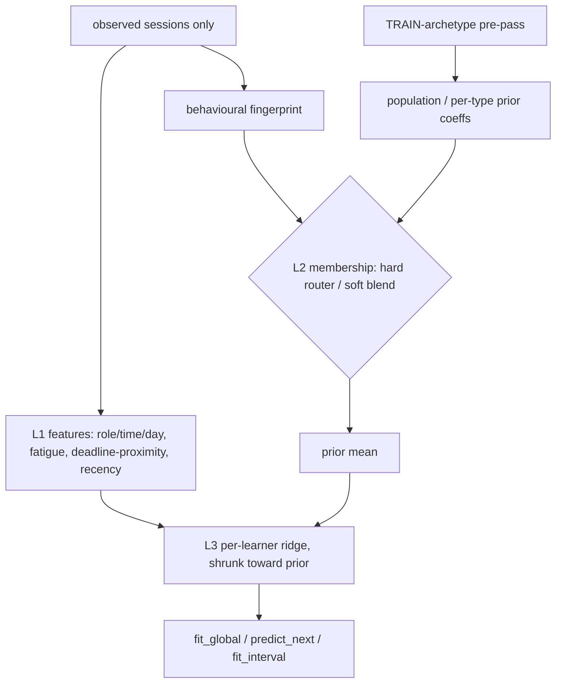

<!--
  This is the verbatim operating-manual preamble. It is pasted as the first content
  of every plan written by the write-implementation-plan skill. Do NOT modify it
  per-plan — keeping it identical across plans means implementing agents learn
  the protocol once and recognize it everywhere.
-->

# How to use this plan

> **You are the implementing agent.** This document is your runbook for one cohesive change to this codebase. It was written collaboratively by Claude and a human after a planning discussion, and it is the source of truth for this work. Read this preamble in full before doing anything else.

## What you're holding

A phase-by-phase implementation plan. Each phase is a **vertical slice** — an end-to-end working increment that leaves the codebase in a working state. Phases are designed so any one of them can be implemented by a fresh agent in a new context window, with only this document and the codebase as input.

## Your job

1. **Read the document header in full first.** TL;DR, Context, Decisions log, Architecture overview, and Files-touched index. These give you the *why* behind every step. The Decisions log especially — those decisions were made deliberately and explain choices that may otherwise look arbitrary or wrong. Reference IDs (D-NN) appear inside phase steps so you can look up rationale.

2. **Find your starting phase.** Scan the phase list. Pick the first phase whose status is `☐ Not started` AND whose `Depends on:` phases are all `✅ Complete`. Implement that phase only. **Do not skip ahead. Do not implement multiple phases in one go unless the human explicitly asks.**

3. **Run the prereq verification.** Each phase has a "Verification (run BEFORE starting)" block. Run those commands. **If any fail, STOP** — the codebase isn't in the state this phase expects. Surface to the human: "Phase N's prereqs failed: `<command>` returned `<result>`. Want me to investigate or hand back?"

4. **Follow the steps in order.** Code blocks in steps are the actual code, not pseudocode or sketches. Apply them as written.

5. **If reality doesn't match the step — STOP.** If the plan says "modify line 47 of `auth.py`" and line 47 is something different, do not improvise. Surface the discrepancy: "Plan expected `<X>` at `auth.py:47`, found `<Y>`. Possible causes: plan is stale, file was edited since planning, plan was wrong. How should I proceed?"

6. **Run the tests and post-verification.** Each phase specifies what tests to add or update and the bash command to run. All must pass before the phase is considered done.

7. **Update status and commit.** When the phase is complete:
   - Edit this document: change the phase's `Status:` line to `✅ Complete — <commit-sha-here>`.
   - `git add` the code changes AND this plan file.
   - Commit them together. Suggested message: `Phase N: <phase title>` (with longer body referencing the plan file).
   - The status update and the code change live in the same commit so the doc and the code never drift.

## What you must NOT do

- **Do not skip phases.** Order matters; later phases assume earlier ones completed.
- **Do not modify the Decisions log, the Operating manual preamble, the TL;DR, the Architecture overview, the Files-touched index, the Open questions, the Out-of-scope list, or the References.** Those are immutable above-the-phases content. If you discover a decision is wrong, surface to the human — don't silently revise.
- **Do not re-plan or re-architect.** If the plan seems wrong, that's a signal to stop and surface, not to improvise.
- **Do not implement multiple phases without surfacing for human review** between them, unless the user explicitly asked for batch execution upfront.

## If you get stuck

- Update the phase's `Status:` to `🛑 Blocked: <one-line reason>`.
- Fill in the phase's `Notes (filled in during implementation)` block with what you tried, what's blocking, and what you'd want to know to unblock.
- Hand back to the human.

## Status vocabulary

- `☐ Not started`
- `🟡 In progress`
- `🛑 Blocked: <reason>`
- `✅ Complete — <commit-sha>`

## When status markers and reality drift

The status markers are a fast read, but they are not the source of truth. The phase's `Verification (DONE)` commands are the truth — if you suspect a marker is wrong (someone forgot to update, branches diverged, partial commits, etc.), run the verification commands for the phases marked complete. Trust the commands over the markers, and surface the drift to the human so the markers can be corrected.

---

<!-- PROJECT ADDENDUM — specific to study-planner-web's Cowork↔Codex split. Read in addition to the generic preamble above. -->

## Project addendum — the build → test → review → advise loop (READ THIS)

This repo runs a **two-environment loop**. *Cowork (the planning/review agent)* wrote this plan and `VERIFICATION.md`; *you (Codex/Sonnet)* build and test. The division is absolute: **you write all code and run all scoring; Cowork writes zero code and only reviews your committed results and advises fixes.** Each phase is one turn of this loop:

1. **Step 0 — before writing any code, commit these planning docs verbatim.** Run `git add plans/2026-06-18-pillar-a-custom-calibration-detection/` and commit with `docs(plan): add pillar-a custom calibration/detection plan + verification`. Cowork cannot commit (sandbox git is read-only for mutations), so you establish the baseline so later diffs are meaningful. If Cowork has since edited these docs (a review round), your next Step 0 is to commit those doc edits before acting on them.
2. **Build + test the phase**, instrumenting every script per **D-08 (heartbeat)**.
3. **Produce clear, reviewable results** — each model/data phase emits a stamped `evidence.json` (A3/A4 style) **and** a short `SUMMARY.md` under `research/doc/verification-runs/2026-06-19-a6-<phase>/`. These are what Cowork reviews; Cowork does **not** re-run your scripts.
4. **Fill your section of `VERIFICATION.md`** (files changed, commit SHA, what you did, deviations + why, self-check vs. the phase's acceptance criteria) and **STOP for review**.
5. **A phase is not done until Cowork marks it `✅ Verified` in `VERIFICATION.md`.** Cowork's review may return `🔁 Changes requested` with specific fixes; apply them, fill the Resolution block, and re-submit. Loop until `✅ Verified`, then proceed to the next phase.

**A scientifically honest "no improvement" (null) is a valid, successful outcome.** A win produced by label leakage, tuning on the held-out scoring archetypes, or magic constants is a *failure*, not a win — that exact failure is why this track exists. When in doubt, report the null.

---

# Pillar-A custom pace calibration (archetype-aware) — and deferred change detection

**Slug:** `pillar-a-custom-calibration-detection`
**Date written:** 2026-06-19
**Author:** Claude (Cowork planning/review) + Rohit
**Plan status:** Draft
**Upstream:** Design briefs [`../../../prompts/2026-06-19-archetype-aware-calibrator-prompt.md`](../../../prompts/2026-06-19-archetype-aware-calibrator-prompt.md) (calibration, primary) and [`../../../handovers/2026-06-18-pillar-a-custom-algorithms-handover.md`](../../../handovers/2026-06-18-pillar-a-custom-algorithms-handover.md) (failure modes + detection). Prior rigour plan: [`../2026-06-14-pillar-a-rigour.md`](../2026-06-14-pillar-a-rigour.md).

## TL;DR

The A0–A5 rigour pass found pace **calibration** is an *honest null*: simple pooling/EWMA is near-optimal and the structured candidates (`covariate_bayes`, `eb_partial_pool`, `kalman`) overfit per-context multipliers from sparse data and **fail to survive Holm on held-out archetypes** (several are significantly worse). This plan builds a deliberate, honest attempt to beat that null: a **feature-enriched, partial-pooling (shrinkage) pace calibrator** that adds the *observable* signals the baselines ignore (fatigue `same_day_count`, deadline-proximity, recency/own-trend) and borrows strength from a population prior fit on **train archetypes only**, then an **archetype-aware variant** (infer the learner's type from behaviour alone → calibrate per type) built as **two membership flavours (hard router, soft/partial-pooling)** that must *beat* the plain enriched model to earn their complexity. The archetype set is **extended from 6 to 9 types** (adding `night_owl`, `crammer`, `steady_improver`) and re-frozen so every behaviour pattern straddles the train/held-out split. Work proceeds as a **build → test → review → advise loop**: Codex builds + scores each slice and emits a reviewable `evidence.json`; Cowork reviews and advises fixes; repeat. Change **detection** (two-stage ensemble + AR(1)-whitening) is **deferred to Phase 6** — sequenced after calibration, not dropped. **An honest null is an acceptable close.**

## Context & background

**The lever (what's genuinely learnable).** A learner's emitted pace ratio `r = activeMinutes / plannedMinutes` is generated (confirmed in `research/comparison/src/research_comparison/generator/`) as:

```
pace = m_global · ρ(role) · τ(time_of_day) · ν(day_of_week)        # pace.py
       · regime_multiplier(t)                                       # regimes.py / reality.py
       · φ_fatigue(same_day_count)                                  # effects.py: 1 + 0.04·(same_day_count−1)
       · δ_deadline(progress)                                       # effects.py: quadratic ramp past 80% progress
       · lognormal-AR(1) noise (φ=0.30)                             # noise.py
```

The current calibration candidates model **only `ρ/τ/ν`** (`baselines/calibration.py`, features `[intercept, anchor, practice, morning, evening, weekend]`). They ignore `φ_fatigue` (observable from session dates), `δ_deadline` (deadline-proximity), and recency/own-trend. Adding those real signals — not cleverer priors on the same six features — is the most promising honest win.

**The honest bar (held-out, 200 seeds, Holm), from `research/doc/verification-runs/2026-06-18-a3-a4-pillar-a/evidence.json`:** on `context_pred_mae` (primary metric, D-A7), only `ewma` posts 1 Holm-surviving win vs the `hierarchical_bayes` incumbent; `covariate_bayes`/`eb_partial_pool`/`kalman` are Holm-significant *in the wrong direction*. On the A5 reality regime it is worse for structured candidates (`does_not_hold_for_structured_context_candidates`). The oracle wins 9/9, so signal exists; the deployable methods just don't capture it on unseen learners.

**A Cowork design probe** (`/Users/.../outputs/hybrid_membership_sim.py`, a toy faithful to the generator's structure — **not** the real harness) tested membership designs and produced the architecture below. Its qualitative findings (directional only; the real numbers come from the harness in Phases 3–5):

- *Fixed* routing/population shapes **help** on same-direction held-out types (deadline `sprinter`↔`crammer`) but **actively hurt** on opposite-direction types (`night_owl` evening-fast vs the crowd's morning-fast) — worse than the pooled baseline.
- A gate-style hybrid of supervised prototypes + unsupervised clusters did **not** beat the simpler approaches on held-out (middling).
- **Partial-pooling / shrinkage** (population/type as a *prior* each learner's own data can override) was the clear held-out winner and *fixed* the opposite-direction failure. Crucially, shrink-toward-global ≈ shrink-toward-routed-type — i.e. the archetype-membership layer added little once shrinkage was present. This is why the plan validates the plain enriched+shrinkage model **first** and makes the archetype machinery prove its worth (S1-before-S3, brief §6).

**Support docs:**

- Calibration brief (primary): [`../../../prompts/2026-06-19-archetype-aware-calibrator-prompt.md`](../../../prompts/2026-06-19-archetype-aware-calibrator-prompt.md)
- Failure-mode + detection brief: [`../../../handovers/2026-06-18-pillar-a-custom-algorithms-handover.md`](../../../handovers/2026-06-18-pillar-a-custom-algorithms-handover.md)
- Claims & caveats ledger: [`research/doc/2026-06-18-pillar-a-report-claims-and-caveats.md`](../../../../research/doc/2026-06-18-pillar-a-report-claims-and-caveats.md)
- Evidence (the bar): `research/doc/verification-runs/2026-06-18-a3-a4-pillar-a/evidence.json`, `…/2026-06-18-a5-pillar-a/evidence.json`
- Prior rigour plan + verification: [`../2026-06-14-pillar-a-rigour.md`](../2026-06-14-pillar-a-rigour.md), [`../2026-06-14-pillar-a-rigour-VERIFICATION.md`](../2026-06-14-pillar-a-rigour-VERIFICATION.md)
- Cowork design probe (reference only): `outputs/hybrid_membership_sim.py`

## Decisions log

### D-01: Scope — calibration first, detection deferred (not dropped)

**Status:** ✅ Agreed

**Context:** The 06-19 brief scopes itself to calibration; the 06-18 brief covers both calibration and detection. The user clarified detection is sequenced, not removed.

**Decision:** This plan's active phases (1–5) build and score the **calibration** track. **Change detection** (two-stage ensemble layered on AR(1)-whitening, per the 06-18 brief) is **Phase 6, deferred** — fully specced only after calibration closes (Phase 5 verified).

**Rationale:** Keeps the loop tight and the plan under the 7-phase soft cap; detection design has its own open forks best grilled after calibration's dataset/loop machinery exists.

**Alternatives considered:**
- Build both tracks in parallel now → rejected: doubles surface area, dilutes the loop, detection forks unresolved.
- Drop detection entirely → rejected: user explicitly wants it sequenced in.

**User pushback / disagreement:** User corrected an earlier "detection is out of scope" framing: *"NO! its not, im splitting your task for now. Focus on pace calibration first then change detection."*

**Reversibility:** Easy — Phase 6 can be promoted to active phases or split into a sibling plan.

### D-02: Operating cadence — a build → test → review → advise loop

**Status:** ✅ Agreed

**Context:** User wants explicit iteration: build a draft model, test on the correct dataset, review results, advise fixes, repeat.

**Decision:** Every model/data phase ends with Codex emitting a stamped `evidence.json` + `SUMMARY.md`, then **stopping for Cowork review**. Cowork records per-criterion findings and required fixes in `VERIFICATION.md`; Codex applies them (Resolution block) and re-submits. A phase is done only at `✅ Verified`.

**Rationale:** Matches the repo's two-environment workflow and the user's stated process; makes every "win/null" claim review-gated and reproducible.

**Alternatives considered:** Build everything then review once → rejected: defers all risk to the end, exactly what the loop is meant to avoid.

**User pushback / disagreement:** *"I need a loop, we shd build a draft model, test it with correct dataset, check the results and work on improvement … development, test will be done by codex, ask to generate clear results which you will review here, and then you shd advise the fixes."*

**Reversibility:** Easy.

### D-03: Extend the archetype set 6 → 9 so every pattern straddles the train/held-out split

**Status:** ✅ Agreed

**Context:** The deadline-ramp behaviour exists in **only one** archetype (`deadline_sprinter`) and it is **held-out** — so a model trained only on the other types can never learn it, guaranteeing a null on exactly the pattern we most want to crack. Same single-sidedness afflicts time-of-day and trend.

**Decision:** Add three pre-registered archetypes — **`night_owl`** (evening-fast; mirror of `morning_lark`), **`crammer`** (flat then a sharper, later deadline ramp than `deadline_sprinter`), **`steady_improver`** (gentle upward drift; opposite of `fading_flame`) — and split so **every key pattern appears on both sides**:

| Pattern | TRAIN | HELD-OUT |
|---|---|---|
| time-of-day | `morning_lark` | `night_owl` |
| deadline ramp | `crammer` | `deadline_sprinter` |
| long-term trend | `steady_improver` (up) | `fading_flame` (down) |
| sudden jumps | `marathon_runner` | — (detection-side; one-sided OK) |
| weekend | — | `weekend_warrior` (pace effect ×1.02 is negligible; one-sided OK) |
| plain | `steady` | — |

Resulting split — **TRAIN (5):** `steady`, `morning_lark`, `marathon_runner`, `crammer`, `steady_improver`; **HELD-OUT (4):** `deadline_sprinter`, `fading_flame`, `night_owl`, `weekend_warrior`.

**Rationale:** Lets the model learn a pattern from its training-side twin while still honestly testing generalization to an unseen learner exhibiting it.

**Alternatives considered:**
- Keep 6 types, train-on-held-out → rejected: breaks the generalization guard that caught the original fake wins.
- Report two gradings (seen-type vs unseen-type) instead of extending → considered (Cowork's "Way C"); superseded by the cleaner archetype-extension fix the user chose.

**User pushback / disagreement:** Agreed on the principle and the three types: *"agreed on a and b."*

**Reversibility:** Hard — changes `PARAMS_VERSION_HASH` and forces dataset regeneration (see D-05, Phase 2).

### D-04: Deadline-proximity is a real product input → expose it as an observable horizon

**Status:** ✅ Agreed

**Context:** The generator's `δ_deadline` ramp is the largest missing multiplier, but `progress = index/total` is **not** observable at `predict_next(history, ctx)` time — the model knows the current session number, not the eventual total, and the observable learner record (`learners.jsonl`) carries no deadline/horizon field (confirmed: it holds only `{learner_id, archetype, band, seed, sessions}`; sessions expose `date, source, duration, materialRole, startedAt, sessionId` + `plannedMinutes/activeMinutes`).

**Decision:** The deadline is a genuine user input in the product (`apps/app/src/onboarding/steps/Step1Deadline.tsx` → `SET_DEADLINE`; `Step3Preview.tsx` computes `differenceInCalendarDays(deadline, today)`; `RoadmapCreated` persists it). So **emit a planned-horizon field into the observable learner record** (a *plan* input, not an outcome — no leakage) during the Phase 2 regeneration, and let the calibrator compute deadline-proximity from it. Provide **both** encodings as features and let the regularized fit weigh them: session-position `progress = index / planned_total` **and** calendar `days_to_deadline / total_span`. Until the field exists (Phases 1, pre-regen), the enriched model uses only within-history signals (fatigue, own recency-trend), which need no new field.

**Rationale:** It's the only honest way to test the deadline lever on the held-out `deadline_sprinter`, and it mirrors what the product actually has. Letting the fit weigh both encodings avoids a hand-picked combination constant (D-A* no-magic-constants rule).

**Alternatives considered:**
- Drop deadline as a `predict_next` feature → rejected: forgoes the biggest held-out lever.
- Online "near-the-end" proxy from observed acceleration → rejected: circular/leaky.
- Calendar-only vs session-only single encoding → rejected: the app is session-based but real urgency is also calendar-based; let the model weigh both.

**User pushback / disagreement:** User established the deadline is a real onboarding input (*"User already specifies the deadline … check in the onboarding flow?"*) and that the app is session-based with rearrangeable plans.

**Reversibility:** Moderate — the field rides on the Phase 2 regeneration; removing it later means another regeneration.

### D-05: Membership/routing must feed a **prior**, never a fixed shape (shrinkage, not hard substitution)

**Status:** ✅ Agreed (evidence-backed by the Cowork probe)

**Context:** The design probe showed *fixed* routed/population shapes backfire on opposite-direction held-out types (`night_owl`), losing to the pooled baseline; partial-pooling shrinkage fixed it and won overall.

**Decision:** Every population/type contribution is implemented as a **prior mean for a per-learner ridge that the learner's own data overrides as it accrues** (`(XᵀX + λI)β = Xᵀy + λ·prior`). The hard router and soft router (Phase 4) route to a *prior*, not a fixed predicted shape. The plain enriched model (Phase 3) shrinks toward a single global population prior. Population/type priors are fit on **TRAIN archetypes only**.

**Rationale:** It is the design that generalized in the probe and it is robust by construction — worst case it degrades to the (near-optimal) pooled/own-data estimate rather than going wrong-way.

**Alternatives considered:** Hard substitution of a routed shape → rejected (probe: hurts opposite-direction types). Gate-hybrid of supervised+unsupervised fixed shapes → rejected (probe: middling on held-out).

**User pushback / disagreement:** None on the conclusion; user asked for the probe (*"ultrathink, run a simulation as well to test"*) that produced it.

**Reversibility:** Easy — it's a fitting choice inside the new candidates.

### D-06: Validate the plain enriched+shrinkage model before the archetype machinery; the machinery must beat it

**Status:** ✅ Agreed

**Context:** The probe found shrink-toward-global ≈ shrink-toward-routed-type — the archetype layer added little. Brief §6 also mandates S1-before-S3.

**Decision:** Phase 3 ships the enriched + partial-pooling calibrator and scores it. Phase 4's archetype-aware variants (hard router, soft) are **additive challengers** that must post a *better* held-out `context_pred_mae` (Holm-surviving) than Phase 3 to be recommended. If they don't, Phase 5 reports that honestly and the enriched model (or the null) stands.

**Rationale:** Avoids paying for complexity that doesn't generalize; turns "does archetype-awareness help?" into a measured result, not an assumption.

**Reversibility:** Easy.

### D-07: Metric, baseline, and the success bar

**Status:** 🤔 Assumed (unconfirmed) — see OQ-01

**Context:** The runner computes Holm survivors against the `hierarchical_bayes` incumbent (`runners/calibration.py` `mc_correction` block), but the brief phrases success as "beats `pooled_bayes`/`ewma`." `paired_vs_pooled_bayes` exists as raw paired stats but is **not** Holm-corrected.

**Decision:** Primary metric = `context_pred_mae` on **held-out** archetypes (D-A7), secondary = `recovery_mae`. A "win" = a **Holm-surviving** improvement vs the incumbent baseline. **Additionally**, add a Holm-corrected `mc_correction` block baselined against `pooled_bayes` (and `ewma`) so the brief's success phrasing is actually computed, not just the incumbent comparison. Tie-break for the recommended candidate: holds on the reality regime, then simplicity.

**Rationale:** Makes the reported "win/null" match the brief's stated bar and the existing rigour machinery simultaneously.

**Alternatives considered:** Only compare vs `hierarchical_bayes` → rejected: doesn't answer the brief's question. Swap the incumbent → rejected: violates the additive rule.

**Reversibility:** Easy (a runner reporting addition).

### D-08: Every Python script must emit a progress %/heartbeat so the agent can tell it isn't stalled

**Status:** ✅ Agreed

**Context:** User requirement: scripts must show health/progress so the agent doesn't have to wonder if a long run hung.

**Decision:** Reuse the repo's `research_comparison.progress_log.ProgressLogger` (`progress.log(percent, "stage.key", detail)` → `[label-progress] <ts> NNN% state=… elapsed=Ns`) in **every** script this plan adds or touches, and wrap any long-running inner loop (per-learner scoring, dataset generation, λ tuning) in `research_comparison.progress_log.run_with_heartbeat(...)` so a periodic `… still running` heartbeat prints even when no phase boundary is crossed. New standalone scripts take a `--quiet` flag mirroring the runners. The runners already use `ProgressLogger`; new scripts must match.

**Rationale:** Zero new dependency; the helper already exists and the existing runners model the pattern.

**Alternatives considered:** Bespoke print statements → rejected: inconsistent, no elapsed/heartbeat. tqdm → rejected: new dep, not used elsewhere.

**Reversibility:** Easy.

## Architecture overview

Three estimated-from-observed-data-only layers, added as **additive** candidates in `baselines/calibration.py` and registered in `calibration_candidates()`:

- **L1 — Feature layer (shared).** Per session, observable covariates: role (anchor/foundation/practice), time-of-day (morning/afternoon/evening), day-of-week (weekday/weekend), `same_day_count` (fatigue, derived by grouping sessions by `date`), deadline-proximity (`progress` by session-position and calendar `days_to_deadline`, from the Phase-2 horizon field), recency/time-index.
- **L2 — Membership layer (label-free).** A per-learner behavioural fingerprint (evening−morning pace, weekend−weekday pace, late−early slope, final-stretch bump, volatility) summarising the learner's *observed* series only. Two flavours: **hard router** (nearest TRAIN-archetype prototype) and **soft** (similarity-weighted blend). Output is a **prior**, per D-05.
- **L3 — Calibration submodel.** Regularized log-linear fit of pace ratio on L1 features, fit per-learner with **partial-pooling shrinkage** toward the L2-supplied prior (global population prior for the plain model; routed/blended type prior for the archetype variants). Emits `fit_global` / `predict_next` / `fit_interval`.

Population/type priors are fit on TRAIN archetypes only, via a **train pre-pass added to `run_calibration_track`** — mirroring the precedent of `tune_cusum_params` in `runners/detection.py`, which already does a TRAIN-archetype-only pre-pass.



## Files touched (index)

| Path | Change | Phase | Purpose |
|------|--------|-------|---------|
| `research/comparison/scripts/capture_evidence.py` | new | 1 | Heartbeat-instrumented capture of `evidence.json` + `SUMMARY.md` from result JSONs (the review artifact) |
| `research/doc/verification-runs/2026-06-19-a6-*/` | new | 1,3,4,5 | Per-phase scored evidence + summary for Cowork review |
| `college/scope/archetype-preregistration.md` | modify | 2 | Add `night_owl`/`crammer`/`steady_improver`, new dated freeze entry (re-hashes `PARAMS_VERSION_HASH`) |
| `research/comparison/src/research_comparison/params.py` | modify | 2 | Add the 3 archetypes to `ARCHETYPES` with principled params |
| `research/comparison/src/research_comparison/generator/effects.py` | modify | 2 | `crammer`/`steady_improver` deadline/trend shapes (additive to existing `delta_deadline`/trend) |
| `research/comparison/src/research_comparison/generator/generate.py` | modify | 2 | Emit observable `planned_horizon` (deadline date + planned_total) into the learner record (D-04) |
| `research/comparison/src/research_comparison/generator/reality.py` | modify | 2 | New archetypes' reality-matched behaviour within OULAD moment bounds |
| `research/comparison/scripts/verify_reality_bounds.py` | new | 2 | Re-verify regenerated archetypes vs OULAD moment bounds (user's re-verification ask), heartbeat-instrumented |
| `research/comparison/src/research_comparison/baselines/calibration.py` | modify | 3,4 | New candidates: `enriched_shrink` (P3), `archetype_router_hard` + `archetype_soft` (P4); register in `calibration_candidates()` |
| `research/comparison/src/research_comparison/runners/calibration.py` | modify | 3 | TRAIN-only population-prior pre-pass (mirror `tune_cusum_params`); pass observable next-context incl. horizon; add `pooled_bayes`/`ewma`-baselined `mc_correction` (D-07) |
| `research/comparison/tests/test_calibration_track.py` | modify | 3,4 | Mirror existing tests for new candidates; add explicit **no-leakage** test |
| `research/comparison/src/research_comparison/baselines/detection.py` | modify | 6 (deferred) | Two-stage ensemble + AR(1)-whitening detector (spec TBD post-calibration) |

## Phases

### Phase 1: Lock the baseline and build the heartbeat-instrumented review scaffolding (S0)

**Status:** ✅ Complete — 83bcedea78a70d6c7715e1dba90cfc769c83b952
**Depends on:** none — can start immediately
**Estimated scope:** ~1 new file (~120 lines), no model/data change

#### Codebase state assumed at start

- `research/comparison/src/research_comparison/runners/calibration.py` exists with `run_calibration_track(...)` and uses `ProgressLogger`.
- `research/comparison/src/research_comparison/progress_log.py` exposes `ProgressLogger` and `run_with_heartbeat`.
- Frozen dataset `research/datasets/synthetic-e716cd12dddc-seed0-n3600` and reality dataset `research/datasets/synthetic-reality-3b404c903563-seed0-n3600` exist.

#### Verification (run BEFORE starting to confirm prereqs are met)

```bash
export PATH="$HOME/.local/bin:$PATH"
ls research/datasets/synthetic-e716cd12dddc-seed0-n3600/learners.jsonl   # exists
ls research/datasets/synthetic-reality-3b404c903563-seed0-n3600/learners.jsonl  # exists
uv run --package research-comparison pytest research/comparison/tests -q  # passes
```

#### Steps

1. **Run the calibration track UNCHANGED at 200 seeds on frozen + reality** to reproduce the current bar:

   ```bash
   uv run --package research-comparison python -m research_comparison.runners.calibration --seeds 200
   uv run --package research-comparison python -m research_comparison.runners.calibration \
     --dataset-dir research/datasets/synthetic-reality-3b404c903563-seed0-n3600
   ```

2. **Create `research/comparison/scripts/capture_evidence.py`** — reads the stamped result JSONs and writes an A3/A4-style `evidence.json` + a human `SUMMARY.md` (per-band `context_pred_mae`/`recovery_mae`, the `mc_correction` Holm table, `scored_split`, `params_version_hash`, seed count) into `research/doc/verification-runs/2026-06-19-a6-baseline/`. **It MUST use `ProgressLogger` and wrap the per-result-file loop in `run_with_heartbeat` (D-08)**, and accept `--quiet`. Mirror the field shape of `research/doc/verification-runs/2026-06-18-a3-a4-pillar-a/evidence.json`.

3. Record the incumbent numbers as the explicit bar in `SUMMARY.md` ("every later phase is measured against this").

#### Tests

- No new unit tests (no behaviour change). Confirm `pytest research/comparison/tests -q` still passes.
- Add `research/comparison/tests/test_capture_evidence.py::test_capture_writes_evidence_and_summary` — runs the capture script on a tiny fixture result JSON and asserts both files are written with the expected top-level keys.
- Run: `uv run --package research-comparison pytest research/comparison/tests/test_capture_evidence.py -q`

#### Verification (DONE — run after implementation)

```bash
test -f research/doc/verification-runs/2026-06-19-a6-baseline/evidence.json   # exists
test -f research/doc/verification-runs/2026-06-19-a6-baseline/SUMMARY.md       # exists
uv run --package research-comparison pytest research/comparison/tests -q       # passes
```

#### Rollback

Delete `research/comparison/scripts/capture_evidence.py`, its test, and the `2026-06-19-a6-baseline/` dir. No source/data touched.

#### Notes (filled in during implementation)

Implemented a narrow heartbeat-instrumented capture script and fixture test. The two
200-seed calibration baseline runs were executed unchanged except for `--out-dir`
so frozen and reality results could both be captured before the later run
overwrote the default result path. The large raw result JSONs were treated as
scratch inputs and not committed; the committed review artifacts are
`evidence.json` and `SUMMARY.md`.

---

### Phase 2: Dataset v2 — extend archetypes, add the observable deadline horizon, re-freeze, regenerate, re-verify against reality (S5 + D-04)

**Status:** ✅ Complete — 02cedbc741daec21f208fca379f5af8a5cc10c5b
**Depends on:** Phase 1
**Estimated scope:** ~4 files modified + 1 new script; dataset regeneration

> **PRE-REGISTRATION GATE.** This phase changes `PARAMS_VERSION_HASH` and regenerates every dataset. **Before regenerating or scoring, post the exact proposed archetype params + the TRAIN/HELD-OUT split + the horizon-field schema to the human and STOP for review** (per brief S5: "Surface the proposed archetypes + split for review before scoring"). Only proceed once Cowork marks the proposal `✅ Verified` in `VERIFICATION.md`.

#### Codebase state assumed at start

- `params.py` has `ARCHETYPES` (6 entries) and `PARAMS_VERSION_HASH = sha256(college/scope/archetype-preregistration.md)[:12]`.
- `generator/effects.py` has `phi_fatigue(same_day_count)` and `delta_deadline(session_index, total_sessions, archetype_config)`.
- `generator/generate.py` `_event_for_slot(...)` emits the session dict; the learner record is `{learner_id, archetype, band, seed, sessions}` (no horizon field).
- Phase 1 `✅ Complete`.

#### Verification (run BEFORE starting)

```bash
export PATH="$HOME/.local/bin:$PATH"
python -c "from research_comparison.params import ARCHETYPES; print(sorted(ARCHETYPES))"  # 6 types
grep -n "deadline_ramp" research/comparison/src/research_comparison/params.py             # only deadline_sprinter
```

#### Steps

1. **Propose + (after review) add 3 archetypes to `ARCHETYPES` in `params.py`** with principled, literature-anchored params (D-03). Starting proposal (confirm during the pre-registration gate; values are illustrative, not tuned to favour any model):
   - `night_owl`: `{m_global: 0.98, sigma_log: 0.16, tau: {morning: 1.20, afternoon: 1.00, evening: 0.85}}` (mirror of `morning_lark`).
   - `crammer`: `{m_global: 1.00, sigma_log: 0.22, deadline_ramp: 1.35, deadline_ramp_start: 0.90}` (later/steeper than the sprinter's 0.80).
   - `steady_improver`: `{m_global: 1.00, sigma_log: 0.18, trend_total: +0.20}` (upward; mirror of `fading_flame`'s downward `drift_total`).
2. **Generalize `generator/effects.py`** so `delta_deadline` honours a per-archetype `deadline_ramp_start` (default 0.80, `crammer` 0.90) and add a `trend_multiplier(session_index, total_sessions, archetype_config)` reading `trend_total` (additive; `fading_flame` keeps using its existing `drift_total` regime — confirm whether to unify or keep separate during the gate). **No magic constants** — every value lands in `params.py`/the pre-registration.
3. **Emit the observable planned horizon in `generator/generate.py`** (D-04): add `planned_horizon: {deadline: <ISO date of last planned slot>, planned_total_sessions: <target_sessions>}` to the learner record metadata (the NON-truth record), not the sidecar. Confirm `target_sessions` is the planned roadmap length and not derived from realized pace.
4. **Re-freeze the pre-registration:** add `night_owl`/`crammer`/`steady_improver` with params + principled rationale + a new dated freeze entry to `college/scope/archetype-preregistration.md`; this updates `PARAMS_VERSION_HASH`. Declare the TRAIN/HELD-OUT split (D-03) in the pre-registration so it is pre-committed, not chosen post-hoc.
5. **Regenerate frozen + reality datasets** at 200 seeds into new hash dirs:

   ```bash
   uv run --package research-comparison python -m research_comparison.generator.generate --seeds 200 --quiet
   uv run --package research-comparison python -m research_comparison.generator.generate --regime reality_matched \
     --moment-bounds-file research/doc/verification-runs/2026-06-18-a5-pillar-a/oulad_moment_bounds.json --seeds 200 --quiet
   ```

6. **Create `research/comparison/scripts/verify_reality_bounds.py`** (user's re-verification ask): recompute, for the regenerated dataset (esp. the 3 new archetypes), the realised moments (AR(1) φ, shift frequency per 100 days, gap-day distribution, dropout) and assert they fall inside the OULAD bounds in `…/2026-06-18-a5-pillar-a/oulad_moment_bounds.json`. **Heartbeat-instrumented (D-08).** Emit a `reality_bounds_check.json` into the Phase-2 verification-run dir.
7. **Re-capture the incumbent baseline on the v2 dataset** (so Phase 3+ has a comparable bar) via the Phase-1 `capture_evidence.py`.

#### Tests

- Update `research/comparison/tests/test_generator.py` — add cases asserting `night_owl` evening<morning pace, `crammer` ramps only past 0.90 progress, `steady_improver` rises with progress; assert the learner record now carries `planned_horizon` and the sidecar still carries truth (no horizon leakage into truth scoring).
- Add `research/comparison/tests/test_reality_bounds.py::test_new_archetypes_within_oulad_bounds`.
- Run: `uv run --package research-comparison pytest research/comparison/tests/test_generator.py research/comparison/tests/test_reality_bounds.py -q`

#### Verification (DONE — run after implementation)

```bash
export PATH="$HOME/.local/bin:$PATH"
python -c "from research_comparison.params import ARCHETYPES, PARAMS_VERSION_HASH; print(len(ARCHETYPES), PARAMS_VERSION_HASH)"  # 9, NEW hash
ls research/datasets/ | grep "$(python -c 'from research_comparison.params import PARAMS_VERSION_HASH as h; print(h)')"  # new frozen + reality dirs
python -c "import json,glob; r=json.loads(open(glob.glob('research/datasets/synthetic-*-n*/learners.jsonl')[-1]).readline()); assert 'planned_horizon' in r, r.keys()"  # horizon present
test -f research/doc/verification-runs/2026-06-19-a6-dataset-v2/reality_bounds_check.json
uv run --package research-comparison pytest research/comparison/tests -q
```

#### Rollback

Revert `params.py`, `effects.py`, `generate.py`, `reality.py`, the pre-registration entry; delete the new dataset dirs and the v2 verification-run dir. Note: the hash reverts with the pre-registration file.

#### Notes (filled in during implementation)

Frozen 9-archetype params hash is `21c2cdabfa91`; the regenerated dataset ids
are `synthetic-21c2cdabfa91-seed0-n5400` and
`synthetic-reality-c545404bcacf-seed0-n5400`. The pre-registration doc now
records the A6 v2 archetypes, the 5/4 TRAIN/HELD-OUT split, the planned-horizon
schema, and the OQ-02 decision to keep `fading_flame`'s existing drift separate
while adding `trend_total` for `steady_improver`. Reality bounds passed against
the A5 OULAD moment bounds. During v2 baseline recapture, two very short frozen
learners exposed a pre-existing calibration aggregation edge case: learners
with exactly 3 active sessions had no next session for `context_pred_mae`, so
`run_calibration_track` now requires at least 4 active sessions.

---

### Phase 3: Feature-enriched, partial-pooling pace calibrator + TRAIN-prior pre-pass (S1, the likely workhorse)

**Status:** ✅ Complete — 8545481648a6db93ba30559b7a8e2d994f48d8d4
**Depends on:** Phase 2
**Estimated scope:** ~2 files modified, ~150 lines + tests

#### Codebase state assumed at start

- v2 datasets (9 archetypes, with `planned_horizon`) exist (Phase 2).
- `baselines/calibration.py` exposes the `CalibrationCandidate` protocol (`fit_global`/`predict_next`/`fit_interval`), `calibration_candidates()`, and `CovariateBayesCalibrator` (the feature/ridge precedent).
- `runners/calibration.py` `run_calibration_track(...)`; `_context_of(session)` currently returns `{materialRole, startedAt}` only.
- `runners/detection.py` `tune_cusum_params(...)` is the precedent for a TRAIN-archetype-only pre-pass.

#### Verification (run BEFORE starting)

```bash
export PATH="$HOME/.local/bin:$PATH"
grep -n "def _context_of" research/comparison/src/research_comparison/runners/calibration.py
grep -n "def tune_cusum_params" research/comparison/src/research_comparison/runners/detection.py
grep -n "class CovariateBayesCalibrator" research/comparison/src/research_comparison/baselines/calibration.py
```

#### Steps

1. **Add L1 feature helpers + the `EnrichedShrinkageCalibrator` to `baselines/calibration.py`** (additive; adapt the algorithm validated in the Cowork probe `outputs/hybrid_membership_sim.py`, shaped to the real session dict and `CalibrationCandidate` protocol). Features extend the existing 6 with: `same_day_count` (derive by grouping `sessions` by `date`), session-position `progress` and calendar `days_to_deadline/total_span` (from the learner's `planned_horizon`, passed via next-context), and a recency/own-trend term. Fit log-ratio with ridge; **shrink toward an injected population prior** (`(XᵀX+λI)β = Xᵀy + λ·prior`, D-05). `λ` (ridge) and the shrink strength are **fields tuned on held-out-TRAIN only** (Phase-wide rule, brief Rule 2). Provide `fit_global`, `predict_next(history, next_context)` (uses observable next-context incl. horizon only — never the target or `r_star`), `fit_interval`.

   ```python
   @dataclass(frozen=True)
   class EnrichedShrinkageCalibrator:
       name: str = "enriched_shrink"
       ridge: float = 2.0          # tuned on held-out-TRAIN only (provenance-recorded)
       shrink: float = 6.0         # prior strength; tuned on held-out-TRAIN only
       population_prior: tuple[float, ...] = ()  # injected by the runner train pre-pass (step 3)
       # fit_global / predict_next / fit_interval implement the L1+L3 logic above.
       # NO import of generator truth (ROLE_RHO, TAU_GENERIC, m_global, schedules) — Rule 1.
   ```

2. **Extend `_context_of` in `runners/calibration.py`** to surface the observable next-context the enriched model needs: `{materialRole, startedAt, planned_horizon, session_index}` (so `predict_next` can compute fatigue/progress/days-to-deadline). Confirm it never passes `r_star`/truth.
3. **Add a TRAIN-only population-prior pre-pass to `run_calibration_track`** (mirror `tune_cusum_params`): before the per-learner loop, fit the enriched coefficients across TRAIN-archetype learners, record them in provenance (`population_prior.method = "fit_on_train_archetypes_only"`), and construct the candidate with `population_prior=…`. Wrap this pre-pass and the per-learner loop with `run_with_heartbeat`/`ProgressLogger` (D-08).
4. **Register `EnrichedShrinkageCalibrator()` in `calibration_candidates()`** (additive — do not remove shipped candidates).
5. **Add the `pooled_bayes`/`ewma`-baselined `mc_correction` block** to the payload (D-07) so the brief's success bar is computed alongside the incumbent comparison.
6. **Score on v2 frozen + reality at 200 seeds** and capture evidence via `capture_evidence.py`. **STOP for Cowork review.**

#### Tests

- Mirror `test_calibration_track.py` patterns: add `test_enriched_shrink_returns_float_and_finite`, `test_enriched_shrink_recovers_planted_fatigue_and_deadline_effects` (fixture with planted `same_day_count`/deadline ramp), `test_enriched_shrink_predict_next_uses_only_observable_context`.
- **Add an explicit no-leakage test** (brief §8): the candidate produces identical output when truth fields (`r_star`, sidecar archetype label, regime schedule) are stripped/shuffled from its inputs.
- Run: `uv run --package research-comparison pytest research/comparison/tests/test_calibration_track.py -q`

#### Verification (DONE — run after implementation)

```bash
export PATH="$HOME/.local/bin:$PATH"
python -c "from research_comparison.baselines.calibration import calibration_candidates; print([c.name for c in calibration_candidates()])"  # includes enriched_shrink
uv run --package research-comparison python -m research_comparison.runners.calibration --seeds 200   # on v2 frozen
test -f research/doc/verification-runs/2026-06-19-a6-enriched/evidence.json
uv run --package research-comparison pytest research/comparison/tests -q
```

#### Rollback

Remove `EnrichedShrinkageCalibrator` + its registration + the pre-pass + the `_context_of` extension + the extra `mc_correction` block; shipped candidates untouched.

#### Notes (filled in during implementation)

Added `EnrichedShrinkageCalibrator` and registered it additively. The runner now
passes observable `planned_horizon`/`session_index` context, fits an
`enriched_shrink` population prior on TRAIN archetypes only, tunes ridge/shrink
on TRAIN seed `<5` midpoint next-session validation, and records both the prior
and tuning audit in the result payload. The initial full prequential tuning
approach was too slow; it was replaced with bounded TRAIN-only validation after
two interrupted attempts, while keeping heartbeat output and explicit
provenance. Phase 3 evidence lives in
`research/doc/verification-runs/2026-06-19-a6-enriched/`.

---

### Phase 4: Archetype-aware variants — hard router + soft, as shrinkage priors (S2–S4 challengers)

**Status:** ✅ Complete — a919ea44beaf3f2edbc8a1f5d47edb9d4b9d8d9a
**Depends on:** Phase 3
**Estimated scope:** ~2 files modified, ~180 lines + tests

#### Codebase state assumed at start

- Phase 3 `✅ Verified`; `EnrichedShrinkageCalibrator` + TRAIN pre-pass exist and score.
- v2 datasets exist.

#### Verification (run BEFORE starting)

```bash
export PATH="$HOME/.local/bin:$PATH"
python -c "from research_comparison.baselines.calibration import calibration_candidates; print([c.name for c in calibration_candidates()])"  # enriched_shrink present
```

#### Steps

1. **Add the label-free behavioural fingerprint** to `baselines/calibration.py` (computable from `sessions` alone): evening−morning pace, weekend−weekday pace, late−early slope, final-stretch bump, volatility. Standardise using TRAIN-fit means/sds (recorded in provenance). Adapt the validated `fingerprint(...)` from the probe.
2. **Extend the TRAIN pre-pass** (Phase-3 hook) to also fit, on TRAIN archetypes only: a per-TRAIN-type population prior (the 5 train types' coefficient vectors) and the prototype fingerprint centroids.
3. **Add `ArchetypeRouterHardCalibrator`** — fingerprint the learner from its own history → nearest TRAIN prototype → use that type's coefficients as the **shrinkage prior** (D-05), then per-learner ridge as in Phase 3.
4. **Add `ArchetypeSoftCalibrator`** — similarity-weighted (softmax over negative fingerprint distance, temperature tuned on held-out-TRAIN) blend of the TRAIN-type coefficient vectors as the prior mean; shrink per-learner toward it. Sparse/ambiguous learners fall back toward the global prior.
5. **Register both in `calibration_candidates()`** (additive). Heartbeat per D-08.
6. **Score on v2 frozen + reality** and capture evidence. **STOP for Cowork review.** Recommendation rule (D-06): a variant is recommended only if it beats `enriched_shrink` on held-out `context_pred_mae` with a Holm-surviving Δ.

#### Tests

- `test_fingerprint_is_label_free` (no truth field touched; identical output under truth shuffle).
- `test_router_routes_sprinter_toward_crammer_prior` (held-out `deadline_sprinter` fixture → nearest prototype is `crammer`).
- `test_soft_calibrator_falls_back_to_population_when_ambiguous`.
- Run: `uv run --package research-comparison pytest research/comparison/tests/test_calibration_track.py -q`

#### Verification (DONE — run after implementation)

```bash
export PATH="$HOME/.local/bin:$PATH"
python -c "from research_comparison.baselines.calibration import calibration_candidates; print([c.name for c in calibration_candidates()])"  # + archetype_router_hard, archetype_soft
uv run --package research-comparison python -m research_comparison.runners.calibration --seeds 200
test -f research/doc/verification-runs/2026-06-19-a6-archetype/evidence.json
uv run --package research-comparison pytest research/comparison/tests -q
```

#### Rollback

Remove the two archetype candidates + fingerprint + the pre-pass extension; Phase 3 stands.

#### Notes (filled in during implementation)

Added a label-free behavioural fingerprint and two additive archetype-aware
calibrators. The hard router and soft router both use TRAIN-archetype priors as
shrinkage targets, not fixed substituted shapes. The runner now fits per-TRAIN
type coefficient priors, TRAIN-fit fingerprint centroids/standardiser values,
and soft-router temperature on TRAIN seed `<5` midpoint next-session
validation; all of that provenance is recorded under
`population_prior.enriched_shrink.archetype_variants`.

During post-verification, I added an explicit
`mc_correction_reference_baselines.enriched_shrink` block so Phase 4 can judge
the archetype variants directly against the Phase 3 `enriched_shrink`
workhorse. The refreshed Phase 4 evidence shows isolated Holm wins versus
`enriched_shrink`, but also Holm-significant losses, so the archetype layer does
not yet justify a broad recommendation over the simpler enriched model.

---

### Phase 5: Honest decision + findings note (S6)

**Status:** ✅ Complete — 922c64e56975d639e4e22e70115a4663486c5c1f
**Depends on:** Phase 4
**Estimated scope:** ~1 new findings doc; scoring runs

#### Codebase state assumed at start

- Phases 3–4 `✅ Verified`; all calibration candidates score on v2 frozen + reality.

#### Verification (run BEFORE starting)

```bash
export PATH="$HOME/.local/bin:$PATH"
uv run --package research-comparison pytest research/comparison/tests -q   # passes
```

#### Steps

1. **Re-score all calibration candidates at 200 seeds on v2 frozen AND reality**, capture a final `evidence.json` (with `delta_ci`, `scored_split="held_out"`, both `mc_correction` blocks — incumbent and `pooled_bayes`/`ewma`).
2. **Pick the winner by the D-07 bar**: a Holm-surviving improvement on held-out `context_pred_mae`; tie-break holds-on-reality, then simplicity (prefer `enriched_shrink` over the archetype variants if they tie — D-06). **If nothing beats `pooled_bayes`/`ewma`, write the honest null.**
3. **Write `research/doc/verification-runs/2026-06-19-a6-final/SUMMARY.md`** stating, per band and regime: did `enriched_shrink` win? did either archetype variant beat it? does it hold on reality? — each claim tied to the evidence file + commit SHA. No fabricated numbers.
4. **Update the claims & caveats ledger** `research/doc/2026-06-18-pillar-a-report-claims-and-caveats.md` with the A6 calibration outcome (win or null), in the agreed honest framing.

#### Tests

- No new code; ensure `pytest research/comparison/tests -q` still passes.

#### Verification (DONE — run after implementation)

```bash
test -f research/doc/verification-runs/2026-06-19-a6-final/evidence.json
grep -q "survives_holm_win" research/doc/verification-runs/2026-06-19-a6-final/evidence.json
test -f research/doc/verification-runs/2026-06-19-a6-final/SUMMARY.md
```

#### Rollback

Revert the ledger edit + delete the final verification-run dir. No source change.

#### Notes (filled in during implementation)

Re-scored the full calibration candidate set on the v2 frozen and
reality-matched datasets, captured final evidence, and wrote the A6 decision
summary. The primary result is a qualified next-session context-prediction win
for `enriched_shrink`: it has Holm-surviving held-out `context_pred_mae` wins
against `pooled_bayes` in 11/12 frozen cells and 9/12 reality cells, and
against `ewma` in 11/12 frozen cells and 5/12 reality cells.

The archetype hard/soft variants do not earn their extra complexity over
`enriched_shrink`; direct Holm comparisons show isolated wins plus significant
losses. The claims ledger now records this as the A6 calibration framing:
recommend `enriched_shrink` for context prediction, do not claim an
archetype-membership win, and keep `recovery_mae` as a mixed secondary result.

---

### Phase 6 (DEFERRED): Change-detection track — two-stage ensemble + AR(1)-whitening

**Status:** ☐ Not started — **deferred; do not start until Phase 5 is `✅ Verified` and Cowork has grilled + specced the detection design**
**Depends on:** Phase 5
**Estimated scope:** TBD (specced after calibration closes)

#### Intent (placeholder — not yet implementation-ready)

Per the 06-18 brief: build a custom detector that **dominates the CUSUM↔CSD Pareto frontier** (lower latency at ≤ false-alarm) and generalizes on held-out + reality. Recommended starting design: a **two-stage ensemble** (fast CSD arm proposes a shift; clean CUSUM/Page-Hinkley arm confirms within a short window) layered on an **AR(1)-whitening front-end** (pre-whiten the pace-ratio series for the learner's estimated φ̂ before detection, restoring the iid assumption the detectors rely on). Slots in via `detect_<name>(pace_ratios, …)->list[int]` in `baselines/detection.py`, registered in `runners/detection.py`'s `detection_candidates()`, added as a Pareto-probe family in `_pareto_probe_rows`, scored vs `cusum` under `mc_correction`. **This phase will be expanded into full steps (with the same build→test→review loop and D-08 heartbeat requirement) only after a dedicated grill-me, per D-01.**

#### Notes (filled in during implementation)

*(empty)*

---

## Open questions

### OQ-01: Holm baseline for the success bar — incumbent vs `pooled_bayes`/`ewma`

**Why deferred:** The runner currently Holm-corrects only against `hierarchical_bayes`; the brief phrases success vs `pooled_bayes`/`ewma`. D-07 resolves this by *adding* a second correction block, but whether the headline claim is "beats incumbent" or "beats pooled/ewma" affects how Phase 5 is written.
**Triggers needing resolution:** Phase 3 step 5 (adding the second `mc_correction` block) / Phase 5 winner selection.
**Owner / resolution path:** Cowork confirms with the user during the Phase 3 review whether the headline is "beats incumbent" or "beats pooled/ewma" (recommend reporting both; headline = beats `pooled_bayes`, the strongest simple baseline).
**Cross-ref:** Blocks D-07 from being upgraded to ✅ Agreed.

### OQ-02: Unify `fading_flame`'s regime-drift with the new `trend_total`, or keep separate?

**Why deferred:** `fading_flame` currently fades via a `drift_total` regime in `regimes.py`; `steady_improver` is proposed as a `trend_total` in `effects.py`. Having two mechanisms for "monotone trend" risks the fingerprint/feature seeing them differently.
**Triggers needing resolution:** Phase 2 step 2.
**Owner / resolution path:** Decide during the Phase 2 pre-registration gate — recommend keeping `fading_flame` as-is (frozen) and adding `trend_total` additively, documenting the asymmetry, to avoid disturbing prior A1–A5 `fading_flame` results.
**Cross-ref:** D-03, D-04.

### OQ-03: planned-horizon realism — planned ≡ realized in the generator

**Why deferred:** The generator emits exactly `target_sessions`, so planned_total ≡ realized_total; the deadline feature is therefore slightly "cleaner" than reality, where learners drop/rearrange sessions.
**Triggers needing resolution:** Phase 2 step 3; revisit if Phase 3/4 results lean heavily on the session-position progress feature.
**Owner / resolution path:** Acceptable for v2 (disclosed limitation). If results hinge on it, a follow-up can add planned≠realized noise (adherence/rearrangement) to the horizon.
**Cross-ref:** D-04.

## Out of scope

- **The React/TypeScript app and `packages/progress/`** — not touched; the calibrator stays research-layer. `predict_next` is kept app-portable for a *later* port, but no app code is written here (brief §1).
- **Direct scoring on real OULAD learner traces (A5.4)** — out; reality validation is the moment-bounded regenerated generator only (matches A5's honest framing).
- **Swapping the shipped incumbent** — out; all new candidates are strictly additive (brief Rule 4).
- **Change detection implementation** — deferred to Phase 6, specced after calibration closes (D-01).

## References

- `research_comparison.progress_log` — `ProgressLogger`, `run_with_heartbeat` (the D-08 heartbeat helpers).
- `runners/detection.py::tune_cusum_params` — precedent for a TRAIN-archetype-only pre-pass (Phase 3 prior fit).
- `runners/rigour.py` — held-out split, `bootstrap_delta_ci`, `holm_bonferroni`, `benjamini_hochberg`, `mc_correction_block`, `DEFAULT_HELDOUT_TRAIN_ARCHETYPES`.
- `metrics/prequential.py::context_prediction_absolute_errors` — how `context_pred_mae` is computed (uses `predict_next` + next-context).
- `baselines/calibration.py::CovariateBayesCalibrator` — the feature/ridge precedent to adapt.
- `generator/{pace,effects,noise,regimes,reality}.py` — generator truth (READ-ONLY; never import into `baselines/`).
- Cowork design probe — `outputs/hybrid_membership_sim.py` (algorithm source for the enriched+shrinkage and fingerprint logic; toy, not the harness).
- Evidence to match in format — `research/doc/verification-runs/2026-06-18-a3-a4-pillar-a/evidence.json`, `…/2026-06-18-a5-pillar-a/evidence.json`.
