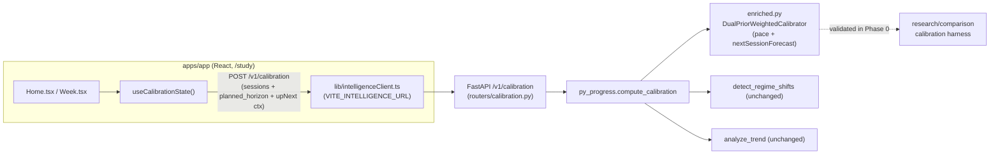

<!--
  This is the verbatim operating-manual preamble. It is pasted as the first content
  of every plan written by the write-implementation-plan skill. Do NOT modify it
  per-plan — keeping it identical across plans means implementing agents learn
  the protocol once and recognize it everywhere.
-->

# How to use this plan

> **You are the implementing agent.** This document is your runbook for one cohesive change to this codebase. It was written collaboratively by Claude and a human after a planning discussion, and it is the source of truth for this work. Read this preamble in full before doing anything else.

## What you're holding

A phase-by-phase implementation plan. Each phase is a **vertical slice** — an end-to-end working increment that leaves the codebase in a working state. Phases are designed so any one of them can be implemented by a fresh agent in a new context window, with only this document and the codebase as input.

## Your job

1. **Read the document header in full first.** TL;DR, Context, Decisions log, Architecture overview, and Files-touched index. These give you the *why* behind every step. The Decisions log especially — those decisions were made deliberately and explain choices that may otherwise look arbitrary or wrong. Reference IDs (D-NN) appear inside phase steps so you can look up rationale.

2. **Find your starting phase.** Scan the phase list. Pick the first phase whose status is `☐ Not started` AND whose `Depends on:` phases are all `✅ Complete`. Implement that phase only. **Do not skip ahead. Do not implement multiple phases in one go unless the human explicitly asks.**

3. **Run the prereq verification.** Each phase has a "Verification (run BEFORE starting)" block. Run those commands. **If any fail, STOP** — the codebase isn't in the state this phase expects. Surface to the human: "Phase N's prereqs failed: `<command>` returned `<result>`. Want me to investigate or hand back?"

4. **Follow the steps in order.** Code blocks in steps are the actual code, not pseudocode or sketches. Apply them as written.

5. **If reality doesn't match the step — STOP.** If the plan says "modify line 47 of `auth.py`" and line 47 is something different, do not improvise. Surface the discrepancy: "Plan expected `<X>` at `auth.py:47`, found `<Y>`. Possible causes: plan is stale, file was edited since planning, plan was wrong. How should I proceed?"

6. **Run the tests and post-verification.** Each phase specifies what tests to add or update and the bash command to run. All must pass before the phase is considered done.

7. **Update status and commit.** When the phase is complete:
   - Edit this document: change the phase's `Status:` line to `✅ Complete — <commit-sha-here>`.
   - `git add` the code changes AND this plan file.
   - Commit them together. Suggested message: `Phase N: <phase title>` (with longer body referencing the plan file).
   - The status update and the code change live in the same commit so the doc and the code never drift.

## What you must NOT do

- **Do not skip phases.** Order matters; later phases assume earlier ones completed.
- **Do not modify the Decisions log, the Operating manual preamble, the TL;DR, the Architecture overview, the Files-touched index, the Open questions, the Out-of-scope list, or the References.** Those are immutable above-the-phases content. If you discover a decision is wrong, surface to the human — don't silently revise.
- **Do not re-plan or re-architect.** If the plan seems wrong, that's a signal to stop and surface, not to improvise.
- **Do not implement multiple phases without surfacing for human review** between them, unless the user explicitly asked for batch execution upfront.

## If you get stuck

- Update the phase's `Status:` to `🛑 Blocked: <one-line reason>`.
- Fill in the phase's `Notes (filled in during implementation)` block with what you tried, what's blocking, and what you'd want to know to unblock.
- Hand back to the human.

## Status vocabulary

- `☐ Not started`
- `🟡 In progress`
- `🛑 Blocked: <reason>`
- `✅ Complete — <commit-sha>`

## When status markers and reality drift

The status markers are a fast read, but they are not the source of truth. The phase's `Verification (DONE)` commands are the truth — if you suspect a marker is wrong (someone forgot to update, branches diverged, partial commits, etc.), run the verification commands for the phases marked complete. Trust the commands over the markers, and surface the drift to the human so the markers can be corrected.

---

# Promote the enriched_shrink calibrator into production (py_progress → FastAPI → UI)

**Slug:** `enriched-shrink-production-integration`
**Date written:** 2026-06-20
**Author:** Claude (Cowork planning/review agent) + Rohit
**Plan status:** Draft
**Upstream:** A6 research — [`../2026-06-18-pillar-a-custom-calibration-detection/PLAN.md`](../2026-06-18-pillar-a-custom-calibration-detection/PLAN.md) + its `VERIFICATION.md`; handover [`../../../handovers/2026-06-19-a6-calibration-done-detection-null-next.md`](../../../handovers/2026-06-19-a6-calibration-done-detection-null-next.md); claims ledger [`research/doc/2026-06-18-pillar-a-report-claims-and-caveats.md`](../../../../research/doc/2026-06-18-pillar-a-report-claims-and-caveats.md).

## TL;DR

The A6 research produced one production-relevant model change: the `enriched_shrink` calibrator (context-aware pace prediction — fatigue + deadline-proximity + recency, partial-pooled toward a frozen TRAIN population prior) is a Holm-surviving held-out win on `context_pred_mae` that holds on the reality regime. It currently lives **only** in the research tree (`research/comparison/.../baselines/calibration.py`); production calibration (`py_progress.compute_calibration`, wrapped by the FastAPI `/v1/calibration` router) still runs the old hierarchical-Bayes incumbent, and the React app computes calibration **in-browser** and never calls the FastAPI service at all. This plan promotes `enriched_shrink` into `py_progress`, wires it through the FastAPI calibration endpoint (server-side delivery — D-01), and switches the app's `useCalibrationState` hook to call the service. The frozen prior is delivered as a per-learner Bayesian-weighted blend of the reality + frozen priors (D-02), **gated behind a research-harness validation step (Phase 0)** so the new weighting variant only ships if it beats reality-alone under the same rigour protocol; reality-alone is the documented fallback. Change detection (CUSUM), GP projection, and scheduling are unchanged — research found detection a robust null and the others were rigour-hardened, not replaced (D-03).

## Context & background

**Where the code is today (grounded 2026-06-20):**

- **Research winner:** `EnrichedShrinkageCalibrator` in `research/comparison/src/research_comparison/baselines/calibration.py:573–653` (+ its helpers at `:33–215`, `:317–333`). It already imports its primitives from `py_progress`, so promotion is a near-verbatim lift. It exposes `fit_global(sessions)`, `predict_next(sessions, next_context)`, `fit_interval(sessions)`. Its win comes from a **frozen TRAIN population prior** (10 coefficients); the default zero-intercept prior does **not** reproduce the result.
- **Production calibration:** `packages/py-progress/src/py_progress/calibration.py:17` `compute_calibration(sessions, exceptional_tags, resolutions) -> CalibrationState` runs `compute_hierarchical_model` (Bayesian) + `detect_regime_shifts` (CUSUM) + `analyze_trend`. `CalibrationState` (`py_progress/types.py:95`) = `globalMultiplier, globalPosterior, roleMultipliers, trend, promptNeeded, insightsByContext`.
- **FastAPI service:** `services/intelligence/app/main.py` mounts `/v1/calibration`, `/v1/calibration/prompt-detail`, `/v1/progress`, `/v1/roadmap/*`. The calibration router (`app/routers/calibration.py`) calls `py_progress.compute_calibration`. Request schema `app/schemas/progress.py` `CalibrationRequest{sessions, exceptionalTags, resolutions}`; `SessionEvent` carries **no** `planned_horizon`/`session_index`.
- **UI:** `apps/app/src/progress/useCalibration.ts` calls `computeCalibration` from the TS `@study-tracker/progress` package over Dexie events. **No code in `apps/app` calls the FastAPI service** (no `/v1/`, no `VITE_*` service env; `.env.example` is Supabase-only). `Home.tsx` and `Week.tsx` consume `useCalibrationState()`.

**Two facts that de-risk the change:**

1. `compute_progress` (`py_progress/progress.py:170`) takes calibration as `_calibration` — **the parameter is unused**; the GP burn-up projection is computed from `actual_cumulative` + dates only. So calibration drives UI *display* (pace narrative, `promptNeeded` banner, role insights) and the prompt-detail breakpoints — **not** the projection. Swapping the pace engine cannot perturb projection output.
2. `py_progress` already depends on `numpy>=2.0` (`packages/py-progress/pyproject.toml`), which `enriched_shrink` needs — no new dependency.

**The frozen prior vectors** (from `research/doc/verification-runs/2026-06-19-a6-final/evidence.json`, provenance `fit_on_train_archetypes_only` / `train_archetypes_seed_lt_20_per_learner_average`, computed by `research/comparison/src/research_comparison/runners/calibration.py:148` `_fit_enriched_population_prior`):

- **reality** (`/calibration/runs/reality/.../population_prior`): `[-0.13021535898759107, 0.043230211127485256, -0.02837212784940994, 0.07152433448169158, 0.02358168766937886, -0.004818945751361863, 0.02052383048408439, -0.0002366920001415282, -0.008956479540894973, -0.00023669200014153152]`
- **frozen** (`/calibration/runs/frozen/.../population_prior`): `[-0.04571875055479146, 0.0395639307409536, -0.046612134272635615, 0.08594397155792466, 0.030435408056741498, 0.005943879686877318, 0.020360140308798062, 0.004186068513064278, 0.005297293814845727, 0.004186068513064275]`

Feature order (`ENRICHED_FEATURE_NAMES`): `intercept, anchor, practice, morning, evening, weekend, same_day_extra, planned_progress, deadline_urgency, recency`.

**Support docs:**

- A6 plan + verification — `plans/2026-06-18-pillar-a-custom-calibration-detection/{PLAN.md,VERIFICATION.md}`
- A6 handover (calibration done) — `../../../handovers/2026-06-19-a6-calibration-done-detection-null-next.md`
- Claims ledger (read OQ-03 caveat) — `research/doc/2026-06-18-pillar-a-report-claims-and-caveats.md`
- Final calibration evidence — `research/doc/verification-runs/2026-06-19-a6-final/{evidence.json,SUMMARY.md}`
- Prior FastAPI backend plan — `../2026-06-08-pillar-a-fastapi-backend.md`
- Architecture diagram — `college/mydeliverables/1st-Review/deck/assets/architecture_horizontal.png`

## Decisions log

### D-01: Deliver calibration server-side via the FastAPI Intelligence Service

**Status:** ✅ Agreed

**Context:** The app computes calibration in-browser (TS) and never calls the FastAPI service. The architecture diagram shows Pillar-A calibration behind the API router. The research model needs a frozen prior artifact + numpy linear-algebra, which favours one Python source of truth.

**Decision:** The UI's `useCalibrationState` calls `POST /v1/calibration`; `enriched_shrink` becomes the production pace engine inside `py_progress.compute_calibration`. The TS `computeCalibration` is **not** updated to enriched (it becomes legacy / parity-only).

**Rationale:** Minimum new code (the research model is already Python and imports `py_progress`), matches the user's architecture diagram, and avoids re-implementing a matrix-solve model bit-parity in TypeScript.

**Alternatives considered:**
- Additive forecast-only endpoint, keep core local → rejected by user (they chose full server move).
- Server with local fallback → rejected for now: two code paths to keep coherent; revisit if offline UX bites (OQ-02).
- Local-first parity (port enriched to TS) → rejected: double-implementation + parity burden for a non-trivial model.

**User pushback / disagreement:** none — user explicitly selected "Move calibration to server."

**Reversibility:** moderate — the UI hook is the seam; reverting means pointing `useCalibrationState` back at the TS `computeCalibration`. The TS path is left intact precisely to keep this cheap.

### D-02: Ship a per-learner Bayesian-weighted blend of the reality + frozen priors — gated on harness validation

**Status:** ✅ Agreed (efficacy 🤔 unconfirmed until Phase 0 passes)

**Context:** The research produced two frozen priors (reality-regime, frozen-regime). User asked to "use both at once." Frozen/reality are the same model on two simulated populations — combining them is a *new* variant the research never scored.

**Decision:** Implement a `DualPriorWeightedCalibrator` that holds both priors and, per learner, weights them by leave-one-out fit (reality-favoured static fallback at cold-start). **Phase 0 must validate it beats reality-alone `enriched_shrink` on the reality held-out set under the rigour protocol (200 seeds, Holm).** If it does not clear that bar, the production model falls back to **reality-alone** (single `REALITY_POPULATION_PRIOR`) and the dual-prior wrapper is not shipped.

**Rationale:** Honours the user's "use both" while respecting the repo's "no manufactured wins / Holm-surviving evidence" bar. The blend matters mainly at cold-start (shrink=6 ≈ 6 pseudo-sessions; a learner's own data dominates after several sessions), so the downside of a null result is small and the fallback is clean.

**Alternatives considered:**
- Fixed 50/50 (or fixed-weight) blend → rejected: arbitrary weight, no principled justification, no evidence.
- Reality-alone (no blend) → kept as the **fallback**, not the default, per user preference for "both."
- Widen prior covariance to span both → rejected: more code, not what the user asked, harder to validate.

**User pushback / disagreement:** User asked "no way to use Frozen and Reality both at once?" then chose per-learner weighting after the trade-offs were explained.

**Reversibility:** easy — production reads one constant (`PRODUCTION_PRIOR_STRATEGY`); flip it from `dual_prior` to `reality_only`.

### D-03: Do not touch detection, projection, or scheduling

**Status:** ✅ Agreed

**Context:** Research outcomes beyond calibration: change detection = robust null (no detector dominates the CUSUM/CSD frontier); projection coverage already fixed in A1; scheduling constraint-based, validated.

**Decision:** Keep `detect_regime_shifts` (CUSUM) and `analyze_trend`/GP projection exactly as-is. `compute_calibration` keeps its CUSUM + trend + role/insights pipeline; only the **global pace estimate** source changes to `enriched_shrink`, plus an additive `nextSessionForecast`.

**Rationale:** Shipping a null as a change would manufacture work with no evidence. The validated wins are calibration-only.

**Alternatives considered:** Replace CUSUM with a unified detector → rejected: §7 of MASTER_TRACKER + the A6 handover document a robust null.

**User pushback / disagreement:** none.

**Reversibility:** n/a (no change).

### D-04: Preserve the `CalibrationState` contract; add `nextSessionForecast` as an additive optional field

**Status:** ✅ Agreed

**Context:** `enriched_shrink` produces a pace estimate + a next-context prediction, not the whole `CalibrationState` (it has no role multipliers / trend / promptNeeded). `Home.tsx`, `Week.tsx`, `usePromptDetail`, and `computeProgress`'s signature all depend on the current shape.

**Decision:** `compute_calibration` keeps returning `CalibrationState`. `globalMultiplier` (+ `globalPosterior.mean`) come from `enriched_shrink.fit_global`/`fit_interval`; `roleMultipliers`, `trend`, `promptNeeded`, `insightsByContext` stay from the existing hierarchical + CUSUM + trend pipeline. Add one optional field `nextSessionForecast: float | None` (the enriched `predict_next` for the up-next slot) to `CalibrationState` (Python dataclass + TS type + pydantic payload).

**Rationale:** Additive + optional → zero breakage for existing consumers; `nextSessionForecast` is the actual research win (context_pred) surfaced to the product. Safe because `compute_progress` ignores calibration (projection unaffected).

**Alternatives considered:** Replace `globalMultiplier` semantics wholesale / drop hierarchical role+insights → rejected: those power existing UI and the enriched model doesn't produce them.

**User pushback / disagreement:** none (design call).

**Reversibility:** easy — optional field defaults to `None`.

## Architecture overview



The seam is `useCalibrationState`. Everything downstream of `CalibrationState` (projection, prompt detail, displays) is unchanged because the contract is preserved (D-04) and projection ignores calibration.

## Files touched (index)

| Path | Change | Phase | Purpose |
|------|--------|-------|---------|
| `research/comparison/src/research_comparison/baselines/calibration.py` | modify | 0 | Add `DualPriorWeightedCalibrator` candidate |
| `research/comparison/src/research_comparison/runners/calibration.py` | modify | 0 | Register candidate; emit chosen prior + weighting audit |
| `research/comparison/tests/test_calibration_track.py` | modify | 0 | Cover the new candidate registers + scores |
| `research/doc/verification-runs/2026-06-20-enriched-dualprior/{evidence.json,SUMMARY.md}` | new | 0 | Stamped go/no-go evidence vs reality-alone |
| `packages/py-progress/src/py_progress/enriched.py` | new | 1 | Production enriched calibrator + frozen priors + dual-prior wrapper |
| `packages/py-progress/src/py_progress/__init__.py` | modify | 1 | Export enriched symbols |
| `packages/py-progress/tests/test_enriched.py` | new | 1 | Unit + parity tests for the promoted model |
| `packages/py-progress/src/py_progress/types.py` | modify | 2 | Add `nextSessionForecast` to `CalibrationState` |
| `packages/py-progress/src/py_progress/calibration.py` | modify | 2 | Wire enriched pace + forecast into `compute_calibration` |
| `packages/progress/src/types.ts` | modify | 2 | TS parity: add optional `nextSessionForecast` |
| `services/intelligence/app/schemas/progress.py` | modify | 2 | Add `plannedHorizon`/`nextContext`; add forecast to payload |
| `services/intelligence/app/routers/calibration.py` | modify | 2 | Pass new context through to `compute_calibration` |
| `services/intelligence/tests/test_v1_integration.py` | modify | 2 | Cover enriched pace + forecast over HTTP |
| `apps/app/src/lib/intelligenceClient.ts` | new | 3 | Fetch wrapper for the Intelligence Service |
| `apps/app/src/progress/useCalibration.ts` | modify | 3 | Call the service instead of in-browser compute |
| `apps/app/.env.example` | modify | 3 | Document `VITE_INTELLIGENCE_URL` |
| `apps/app/src/progress/useCalibration.test.ts` | new | 3 | Hook calls client, maps response, handles error |

## Phases

### Phase 0: Validate the dual-prior weighting in the research harness (go/no-go)

**Status:** ✅ Complete — bd9eafafc33ec399ee8fec5f49ad7d0b982b3498
**Depends on:** none — can start immediately
**Estimated scope:** ~3 files + 1 evidence dir, ~150 lines

This is the integrity gate for D-02. It is **research-tree only** — no production code. It decides whether production ships the dual-prior blend or falls back to reality-alone. Honour the global research rules (brief Rules 1–6): no generator-truth import in `baselines/`; observable next-context only in `predict_next`; any hyperparameter (prior weights, temperature) tuned on **held-out-TRAIN** archetypes only and recorded in provenance; only Holm-surviving held-out wins count as wins; emit `ProgressLogger` + `run_with_heartbeat`.

#### Codebase state assumed at start

- `research/comparison/src/research_comparison/baselines/calibration.py` defines `EnrichedShrinkageCalibrator` and `calibration_candidates()`.
- `research/comparison/src/research_comparison/runners/calibration.py` defines `_fit_enriched_population_prior` and emits a `population_prior` audit block.
- Frozen + reality datasets exist (`research/datasets/synthetic-21c2cdabfa91-seed0-n5400`, `research/datasets/synthetic-reality-c545404bcacf-seed0-n5400`).
- `uv run --package research-comparison pytest research/comparison/tests -q` passes.

#### Verification (run BEFORE starting to confirm prereqs are met)

```bash
grep -n "class EnrichedShrinkageCalibrator" research/comparison/src/research_comparison/baselines/calibration.py   # ~line 573
ls research/datasets/synthetic-reality-c545404bcacf-seed0-n5400   # exists
uv run --package research-comparison pytest research/comparison/tests -q   # passes
```

If any fail, STOP and surface.

#### Steps

1. **Add `DualPriorWeightedCalibrator` to `baselines/calibration.py`** (after `EnrichedShrinkageCalibrator`, before `calibration_candidates`). It composes two `EnrichedShrinkageCalibrator` members (one per prior) and weights them per learner by leave-one-out log-pace squared error, with a reality-favoured static fallback when there are <2 active sessions:

   ```python
   @dataclass(frozen=True)
   class DualPriorWeightedCalibrator:
       name: str = "enriched_dual_prior"
       ridge: float = 2.0
       shrink: float = 6.0
       reality_prior: tuple[float, ...] = ()
       frozen_prior: tuple[float, ...] = ()
       static_weights: tuple[float, float] = (0.6, 0.4)  # (reality, frozen) — tuned on held-out TRAIN only

       def _members(self) -> tuple[EnrichedShrinkageCalibrator, EnrichedShrinkageCalibrator]:
           return (
               EnrichedShrinkageCalibrator(ridge=self.ridge, shrink=self.shrink, population_prior=self.reality_prior),
               EnrichedShrinkageCalibrator(ridge=self.ridge, shrink=self.shrink, population_prior=self.frozen_prior),
           )

       def _weights(self, sessions: list[dict]) -> np.ndarray:
           active = _active_sessions(sessions)
           base = np.asarray(self.static_weights, dtype=float)
           base = base / base.sum()
           if len(active) < 2:
               return base
           members = self._members()
           loo = np.zeros(2, dtype=float)
           for k, member in enumerate(members):
               sse = 0.0
               for i in range(len(active)):
                   rest = active[:i] + active[i + 1 :]
                   pred = member.predict_next(rest, active[i])
                   actual = float(active[i]["activeMinutes"]) / float(active[i]["plannedMinutes"])
                   sse += (_safe_log(pred) - _safe_log(actual)) ** 2
               loo[k] = sse / len(active)
           s2 = max(float(np.mean(loo)), 1e-6)
           log_w = np.log(base) - 0.5 * loo / s2
           log_w -= float(np.max(log_w))
           w = np.exp(log_w)
           return w / float(np.sum(w))

       def predict_next(self, sessions: list[dict], next_context: dict[str, Any]) -> float:
           w = self._weights(sessions)
           members = self._members()
           preds = np.asarray([m.predict_next(sessions, next_context) for m in members], dtype=float)
           return float(preds @ w)

       def fit_global(self, sessions: list[dict]) -> float:
           w = self._weights(sessions)
           members = self._members()
           vals = np.asarray([m.fit_global(sessions) for m in members], dtype=float)
           return float(vals @ w)

       def fit_interval(self, sessions: list[dict]) -> tuple[float, float] | None:
           w = self._weights(sessions)
           members = self._members()
           intervals = [m.fit_interval(sessions) for m in members]
           if any(iv is None for iv in intervals):
               return None
           lowers = np.asarray([iv[0] for iv in intervals], dtype=float)
           uppers = np.asarray([iv[1] for iv in intervals], dtype=float)
           return (float(lowers @ w), float(uppers @ w))
   ```

   > Note: the static `(0.6, 0.4)` reality-favoured weights and the LOO-softmax temperature are the only tunables; record them in the run provenance and confirm they are not tuned on held-out archetypes. If the validation needs a different temperature, treat it as a TRAIN-only hyperparameter.

2. **Register the candidate in `runners/calibration.py`.** Where `population_prior` is fit (`_fit_enriched_population_prior`, ~line 301) the runner already has the TRAIN-fit reality/frozen priors per regime. Construct the dual-prior candidate with **both** regimes' priors and add it to the scored candidate set alongside `enriched_shrink`. Emit a `dual_prior_audit` block (the two prior vectors + static weights + per-band weights summary) next to the existing `population_prior` audit (~line 679).

3. **Score under the rigour protocol** on **reality** (the production-relevant regime): 200 seeds, held-out archetypes, Holm correction, reference baseline = `enriched_shrink` (reality-alone). Reuse `research/comparison/scripts/capture_evidence.py` to write `evidence.json` + `SUMMARY.md` into `research/doc/verification-runs/2026-06-20-enriched-dualprior/`.

#### Tests

- Update `research/comparison/tests/test_calibration_track.py` — assert `enriched_dual_prior` appears in `calibration_candidates()`/the scored runner output, and that `_weights` returns the reality-favoured fallback (`≈[0.6,0.4]`) for a learner with <2 active sessions. No generator-truth import.
- Run: `uv run --package research-comparison pytest research/comparison/tests -q`

#### Verification (DONE — run after implementation)

```bash
uv run --package research-comparison pytest research/comparison/tests -q   # all pass
ls research/doc/verification-runs/2026-06-20-enriched-dualprior/SUMMARY.md  # exists
# Decision read from SUMMARY.md "Reference-Baseline Survivors" vs baseline enriched_shrink (reality):
#   GO  -> enriched_dual_prior is a Holm-surviving win on context_pred_mae over enriched_shrink on reality
#   NO-GO -> not a Holm win -> production ships reality-alone (record in VERIFICATION; amend D-02 note)
```

#### Rollback

Pure research additions; revert the commit. No production impact.

#### Notes (filled in during implementation)

Implemented in `bd9eafafc33ec399ee8fec5f49ad7d0b982b3498`; SHA recorded in
`VERIFICATION.md` by the follow-up docs commit. Phase 0 is GO under the plan's
literal criterion (`enriched_dual_prior` has 7 Holm-surviving
`context_pred_mae` wins versus `enriched_shrink` on reality), with the caveat
that it also has 2 Holm-significant small-band regressions.

---

### Phase 1: Promote the enriched calibrator into `py_progress`

**Status:** ✅ Complete — 003247907257dda5749dfd09cff5a5843dd8c74f
**Depends on:** Phase 0 (its go/no-go selects dual-prior vs reality-alone as the default strategy)
**Estimated scope:** 3 files, ~280 lines

#### Codebase state assumed at start

- Phase 0 is `✅ Complete`; its `VERIFICATION.md` records **GO** (ship dual-prior) or **NO-GO** (ship reality-alone).
- `packages/py-progress/src/py_progress/__init__.py` exports the current symbols (no `enriched`).
- `packages/py-progress` depends on `numpy>=2.0`.
- `research/comparison/src/research_comparison/baselines/calibration.py` contains `EnrichedShrinkageCalibrator` (+ helpers) and, after Phase 0, `DualPriorWeightedCalibrator`.

#### Verification (run BEFORE starting to confirm prereqs are met)

```bash
grep -n "numpy" packages/py-progress/pyproject.toml          # numpy>=2.0 present
grep -n "PRODUCTION_PRIOR_STRATEGY\|enriched" packages/py-progress/src/py_progress/__init__.py  # absent (this phase adds it)
sed -n '1,5p' VERIFICATION.md  # Phase 0 GO/NO-GO recorded
```

#### Steps

1. **Create `packages/py-progress/src/py_progress/enriched.py`.** Copy, **verbatim except for the import line**, the following symbols from `research/comparison/src/research_comparison/baselines/calibration.py`:
   - constants `ENRICHED_FEATURE_NAMES` (`:81–92`);
   - helpers `_context_timestamp, _context_role, _context_time_of_day, _context_day_of_week, _context_date, _planned_horizon, _session_index, _same_day_count, _days_since_epoch, _deadline_urgency, _planned_progress, _enriched_feature_row, _active_sessions` (`:103–215`);
   - `_safe_log` (`:317`), `_posterior_interval` (`:321–333`);
   - dataclass `EnrichedShrinkageFit` (`:74–78`);
   - class `EnrichedShrinkageCalibrator` (`:573–653`);
   - and, **only if Phase 0 = GO**, `DualPriorWeightedCalibrator` (added in Phase 0).

   Replace the research import block (`:9–16`) with:

   ```python
   from __future__ import annotations

   import math
   from dataclasses import dataclass
   from typing import Any

   import numpy as np

   from py_progress.bayesian import infer_day_of_week, infer_time_of_day
   from py_progress.config import BAYESIAN_PRIOR_MEAN, BAYESIAN_PRIOR_VARIANCE
   ```

   (The promoted symbols use only `BAYESIAN_PRIOR_MEAN`, `BAYESIAN_PRIOR_VARIANCE`, `infer_time_of_day`, `infer_day_of_week`, `numpy`, and stdlib — confirmed by reading the class. Do **not** copy `behavioral_fingerprint`, `_standardized_fingerprint`, the archetype calibrators, or `compute_hierarchical_model`/`run_kalman_on_phase` imports — they belong to rejected variants.)

2. **Append the frozen prior constants and the strategy switch** to `enriched.py`:

   ```python
   # Frozen TRAIN population priors — provenance: research/doc/verification-runs/2026-06-19-a6-final/evidence.json
   # fit_on_train_archetypes_only / train_archetypes_seed_lt_20_per_learner_average (runners/calibration.py::_fit_enriched_population_prior)
   REALITY_POPULATION_PRIOR: tuple[float, ...] = (
       -0.13021535898759107, 0.043230211127485256, -0.02837212784940994, 0.07152433448169158,
       0.02358168766937886, -0.004818945751361863, 0.02052383048408439, -0.0002366920001415282,
       -0.008956479540894973, -0.00023669200014153152,
   )
   FROZEN_POPULATION_PRIOR: tuple[float, ...] = (
       -0.04571875055479146, 0.0395639307409536, -0.046612134272635615, 0.08594397155792466,
       0.030435408056741498, 0.005943879686877318, 0.020360140308798062, 0.004186068513064278,
       0.005297293814845727, 0.004186068513064275,
   )

   # Set by Phase 0 outcome: "dual_prior" (GO) or "reality_only" (NO-GO). See plan D-02.
   PRODUCTION_PRIOR_STRATEGY = "dual_prior"  # or "reality_only"


   def production_calibrator():
       """The single calibrator instance production uses for pace + next-session forecast."""
       if PRODUCTION_PRIOR_STRATEGY == "dual_prior":
           return DualPriorWeightedCalibrator(
               reality_prior=REALITY_POPULATION_PRIOR,
               frozen_prior=FROZEN_POPULATION_PRIOR,
           )
       return EnrichedShrinkageCalibrator(population_prior=REALITY_POPULATION_PRIOR)
   ```

   If Phase 0 = NO-GO, set `PRODUCTION_PRIOR_STRATEGY = "reality_only"` and omit the `DualPriorWeightedCalibrator` copy in step 1 (then `production_calibrator()` returns the reality-alone branch).

3. **Export from `packages/py-progress/src/py_progress/__init__.py`:** add the imports and `__all__` entries for `EnrichedShrinkageCalibrator`, `production_calibrator`, `REALITY_POPULATION_PRIOR`, `FROZEN_POPULATION_PRIOR`, `ENRICHED_FEATURE_NAMES` (and `DualPriorWeightedCalibrator` if GO).

#### Tests

- Add `packages/py-progress/tests/test_enriched.py`:
  - `production_calibrator().fit_global([])` returns `≈ BAYESIAN_PRIOR_MEAN` (empty → prior intercept).
  - With a small fixed session list + a `next_context` carrying `planned_horizon`, `predict_next` returns a finite positive float and is **deterministic** across calls.
  - **Parity:** for one fixed learner fixture, `EnrichedShrinkageCalibrator(population_prior=REALITY_POPULATION_PRIOR).predict_next(...)` matches (within 1e-9) the research class output for the same inputs (guards the verbatim lift). Build the fixture inline (no generator-truth import).
  - If GO: `DualPriorWeightedCalibrator._weights(<1-session list>)` ≈ `[0.6, 0.4]`.
- Run: `uv run --package py-progress pytest packages/py-progress/tests -q`

#### Verification (DONE — run after implementation)

```bash
uv run --package py-progress pytest packages/py-progress/tests -q          # all pass
python -c "from py_progress import production_calibrator; print(production_calibrator().fit_global([]))"  # ~1.0
```

#### Rollback

Delete `enriched.py`, revert the `__init__.py` export. `compute_calibration` is untouched in this phase, so production behaviour is unchanged either way.

#### Notes (filled in during implementation)

Implemented in `003247907257dda5749dfd09cff5a5843dd8c74f`; SHA recorded in
`VERIFICATION.md` by the follow-up docs commit. Phase 0 was GO, so production
strategy is `dual_prior`.

---

### Phase 2: Wire enriched pace + `nextSessionForecast` through `compute_calibration` and the FastAPI endpoint

**Status:** ✅ Complete — eef569acd5076f2df7b931bdea97d984586acdf6
**Depends on:** Phase 1
**Estimated scope:** 6 files, ~140 lines

#### Codebase state assumed at start

- `py_progress.production_calibrator()` exists and is exported (Phase 1).
- `compute_calibration` (`py_progress/calibration.py:17`) returns `CalibrationState` with no `nextSessionForecast`.
- `CalibrationState` dataclass at `py_progress/types.py:95`; TS mirror at `packages/progress/src/types.ts`.
- FastAPI `CalibrationRequest`/`SessionEvent`/`CalibrationStatePayload` in `services/intelligence/app/schemas/progress.py`; router at `app/routers/calibration.py`.

#### Verification (run BEFORE starting)

```bash
grep -n "class CalibrationState" packages/py-progress/src/py_progress/types.py   # ~line 95
grep -n "def compute_calibration" packages/py-progress/src/py_progress/calibration.py  # line 17
uv run --package intelligence pytest services/intelligence/tests -q   # passes (baseline)
```

#### Steps

1. **Add the optional field to `CalibrationState`** (`py_progress/types.py:95–101`), at the end so positional construction elsewhere is unaffected:

   ```python
   @dataclass
   class CalibrationState:
       globalMultiplier: float
       globalPosterior: BayesianPosterior
       roleMultipliers: dict[str, RoleMultiplier]
       trend: TrendAnalysis
       promptNeeded: bool
       insightsByContext: list[ContextInsight]
       nextSessionForecast: float | None = None
   ```

2. **Wire enriched into `compute_calibration`** (`py_progress/calibration.py`). Keep the existing hierarchical + CUSUM + trend pipeline; override the pace estimate from the enriched calibrator and compute the forecast when `next_context` is supplied. Implements D-03/D-04.

   ```python
   from py_progress.enriched import production_calibrator

   def compute_calibration(
       sessions: list[SessionEvent],
       exceptional_tags: list[ExceptionalTag],
       resolutions: list[RecalibrationResolution],
       next_context: dict | None = None,
   ) -> CalibrationState:
       exceptional_ids: set[str] = set()
       for tag in exceptional_tags:
           if tag["exceptional"]:
               exceptional_ids.add(tag["sessionId"])
           else:
               exceptional_ids.discard(tag["sessionId"])

       bayesian_result = compute_hierarchical_model(sessions, exceptional_ids)
       cusum_result = detect_regime_shifts(
           sessions, exceptional_ids, bayesian_result.globalPosterior.mean, resolutions,
       )
       trend = analyze_trend(sessions, exceptional_ids, bayesian_result, cusum_result)

       calibrator = production_calibrator()
       visible = [s for s in sessions if s.get("sessionId") not in exceptional_ids]
       enriched_pace = calibrator.fit_global(visible)
       interval = calibrator.fit_interval(visible)
       posterior_variance = (
           ((interval[1] - interval[0]) / (2 * 1.96)) ** 2 if interval else bayesian_result.globalPosterior.variance
       )
       forecast = calibrator.predict_next(visible, next_context) if next_context else None

       return CalibrationState(
           globalMultiplier=enriched_pace,
           globalPosterior=BayesianPosterior(
               mean=enriched_pace,
               variance=posterior_variance,
               sessionCount=bayesian_result.globalPosterior.sessionCount,
           ),
           roleMultipliers=bayesian_result.roleMultipliers,
           trend=trend,
           promptNeeded=cusum_result.promptNeeded,
           insightsByContext=bayesian_result.insights,
           nextSessionForecast=forecast,
       )
   ```

   (Import `BayesianPosterior` in `calibration.py` if not already imported.)

3. **TS parity** — add the optional field to `packages/progress/src/types.ts` `CalibrationState` interface: `nextSessionForecast?: number | null`. Do **not** change the TS `computeCalibration` implementation (D-01: TS path is legacy/parity-only).

4. **Enrich the FastAPI schema** (`services/intelligence/app/schemas/progress.py`):
   - Add to `SessionEvent`: `materialRole`, `startedAt`, `sessionId` already exist; no change needed for history.
   - Add a `PlannedHorizon` model and a `NextContext` model, and extend `CalibrationRequest`:

     ```python
     class PlannedHorizon(ApiModel):
         deadline: str | None = None
         planned_total_sessions: int | None = None

     class NextContext(ApiModel):
         startedAt: str | None = None
         date: str | None = None
         materialRole: MaterialRole | None = None
         session_index: int | None = None
         planned_horizon: PlannedHorizon | None = None

     class CalibrationRequest(ApiModel):
         sessions: list[SessionEvent] = Field(default_factory=list)
         exceptionalTags: list[ExceptionalTag] = Field(default_factory=list)
         resolutions: list[RecalibrationResolution] = Field(default_factory=list)
         nextContext: NextContext | None = None
     ```
   - Add `nextSessionForecast: float | None = None` to `CalibrationStatePayload`.

5. **Pass it through the router** (`services/intelligence/app/routers/calibration.py`):

   ```python
   @router.post("/calibration")
   def calibration(payload: CalibrationRequest) -> dict:
       data = dump_model(payload)
       result = compute_calibration(
           data.get("sessions", []),
           data.get("exceptionalTags", []),
           data.get("resolutions", []),
           data.get("nextContext"),
       )
       return to_json_value(result)
   ```

#### Tests

- Update `services/intelligence/tests/test_v1_integration.py` (build payloads inline — the README's `tests/fixtures/pillar-a/` are not in the tree):
  - `POST /v1/calibration` with a handful of active sessions returns 200 and a body whose `globalMultiplier` equals `production_calibrator().fit_global(sessions)` (the enriched pace, not the old hierarchical mean).
  - `POST /v1/calibration` **with** `nextContext.planned_horizon` returns a non-null `nextSessionForecast`; **without** `nextContext` returns `null`.
  - Existing `/v1/progress` and `/v1/roadmap/*` tests still pass (contract preserved).
- Run: `uv run --package intelligence pytest services/intelligence/tests -q` and `uv run --package py-progress pytest packages/py-progress/tests -q`.

#### Verification (DONE — run after implementation)

```bash
uv run --package intelligence pytest services/intelligence/tests -q   # all pass
# Manual smoke (service running on :8000):
curl -s -X POST http://localhost:8000/v1/calibration -H 'Content-Type: application/json' \
  -d '{"sessions":[{"date":"2026-06-01","source":"active","plannedMinutes":60,"activeMinutes":48,"materialRole":"foundation","startedAt":"2026-06-01T18:00:00Z","sessionId":"s1"}],"nextContext":{"date":"2026-06-02","materialRole":"foundation","session_index":1,"planned_horizon":{"deadline":"2026-08-01","planned_total_sessions":40}}}' | python -c "import sys,json;d=json.load(sys.stdin);print('forecast=',d['nextSessionForecast'],'pace=',d['globalMultiplier'])"
```

#### Rollback

Revert the four files; `nextSessionForecast` is optional so reverting leaves no dangling consumers (UI Phase 3 must be reverted first if already shipped).

#### Notes (filled in during implementation)

Implemented in `eef569acd5076f2df7b931bdea97d984586acdf6`; SHA recorded in
`VERIFICATION.md` by the follow-up docs commit.

---

### Phase 3: Switch the app's `useCalibrationState` to call the FastAPI service

**Status:** ✅ Complete — e4555c14a52d88b4a47265bbd7e2e0271fcaf5c6
**Depends on:** Phase 2
**Estimated scope:** 4 files, ~120 lines

#### Codebase state assumed at start

- `/v1/calibration` accepts `{sessions, exceptionalTags, resolutions, nextContext}` and returns `CalibrationState` including `nextSessionForecast` (Phase 2).
- `apps/app/src/progress/useCalibration.ts` currently calls `computeCalibration` from `@study-tracker/progress` over Dexie.
- `apps/app/src/progress/mapEvents.ts` exports `mapSessions`, `mapExceptionalTags`, `mapResolutions`, `findRoadmap`; `RoadmapCreatedPayload` (`apps/app/src/sync/types.ts`) carries `deadline` + `slots`.
- `Home.tsx`/`Week.tsx` already guard `calibration === null` (render conditionally) — confirmed.

#### Verification (run BEFORE starting)

```bash
grep -n "computeCalibration" apps/app/src/progress/useCalibration.ts   # current in-browser call
grep -n "VITE_INTELLIGENCE_URL" apps/app -r                            # absent (this phase adds it)
grep -n "deadline\|slots" apps/app/src/sync/types.ts                   # RoadmapCreatedPayload fields
```

#### Steps

1. **Create `apps/app/src/lib/intelligenceClient.ts`** — a thin fetch wrapper keyed on `import.meta.env.VITE_INTELLIGENCE_URL` (default `http://localhost:8000`):

   ```ts
   const BASE = import.meta.env.VITE_INTELLIGENCE_URL ?? 'http://localhost:8000'

   export async function postCalibration(body: unknown): Promise<unknown> {
     const resp = await fetch(`${BASE}/v1/calibration`, {
       method: 'POST',
       headers: { 'Content-Type': 'application/json' },
       body: JSON.stringify(body),
     })
     if (!resp.ok) throw new Error(`calibration ${resp.status}`)
     return resp.json()
   }
   ```

2. **Rewrite `useCalibration.ts`** to map events → request, derive `nextContext` from the latest roadmap (deadline + `planned_total_sessions = slots.length` + the up-next slot's role/date/index), POST to the service, and return the typed `CalibrationState`. Keep returning `null` while loading or on error so existing null-guards in `Home`/`Week` keep working. Use a `useEffect` + state (not `useLiveQuery`, which expects a sync/promise over Dexie) but still re-run when events change — read events once and re-fetch on change:

   ```ts
   import { useEffect, useState } from 'react'
   import { useLiveQuery } from 'dexie-react-hooks'
   import { useEventStore } from '../events/useEventStore'
   import type { CalibrationState } from '@study-tracker/progress'
   import { mapSessions, mapExceptionalTags, mapResolutions, findRoadmap } from './mapEvents'
   import { postCalibration } from '../lib/intelligenceClient'

   export function useCalibrationState(): CalibrationState | null {
     const eventStore = useEventStore()
     const request = useLiveQuery(async () => {
       const events = await eventStore.getAll()
       const sessions = mapSessions(events)
       const roadmap = findRoadmap(events)
       const nextContext = roadmap
         ? {
             planned_horizon: {
               deadline: roadmap.deadline,
               planned_total_sessions: roadmap.slots.length,
             },
             // up-next slot context (role/date/index) derived from roadmap.slots vs today
           }
         : null
       return {
         sessions,
         exceptionalTags: mapExceptionalTags(events),
         resolutions: mapResolutions(events),
         nextContext,
       }
     }, [eventStore])

     const [state, setState] = useState<CalibrationState | null>(null)
     useEffect(() => {
       if (!request) return
       let cancelled = false
       postCalibration(request)
         .then((r) => { if (!cancelled) setState(r as CalibrationState) })
         .catch(() => { if (!cancelled) setState(null) })
       return () => { cancelled = true }
     }, [JSON.stringify(request)])

     return state
   }
   ```

   (Finalize the up-next slot selection using the same logic as `ProgressEngine.getUpNextSlot(roadmap, today)`; reuse it rather than re-deriving.)

3. **Document the env var** — add to `apps/app/.env.example`:

   ```
   VITE_INTELLIGENCE_URL=http://localhost:8000
   ```

#### Tests

- Add `apps/app/src/progress/useCalibration.test.ts` (Vitest): mock `postCalibration`; assert the hook (a) builds a request containing `planned_horizon` when a roadmap exists, (b) returns the mapped `CalibrationState` on success, (c) returns `null` on fetch rejection. Use the existing Dexie test setup (`dexie-test-setup` rule) and a fake EventStore.
- Run: `pnpm --filter app test`
- **E2E:** per `CLAUDE.md`, E2E **cannot be run in this environment** — *write* a Playwright spec asserting Home renders the pace/forecast after a mocked `/v1/calibration` response, but do not run it.

#### Verification (DONE — run after implementation)

```bash
pnpm --filter app test                 # unit tests pass
pnpm --filter app typecheck            # no type errors (nextSessionForecast typed)
# Manual: run the service (uvicorn :8000) + pnpm dev:app, sign in, log a session, confirm Home shows pace; offline → calibration null, core logging still works.
```

#### Rollback

Revert `useCalibration.ts` to the `computeCalibration` import (the TS path is intact per D-01); delete `intelligenceClient.ts` and the env line. No data migration.

#### Notes (filled in during implementation)

Implemented in `e4555c14a52d88b4a47265bbd7e2e0271fcaf5c6`; verification
details are recorded in `VERIFICATION.md` by the follow-up docs commit. The
app now posts mapped calibration requests to `/v1/calibration` through
`apps/app/src/lib/intelligenceClient.ts`, derives `nextContext` from the latest
roadmap and up-next slot, and returns `null` while loading or when the service
rejects. The Playwright spec was written but intentionally not run, matching the
phase constraint. During the app test gate, two existing date-sensitive fixtures
failed under the current date (`2026-06-20`); they were stabilized separately in
`14af4ac7a57af69cb9dda8913029b03c1624dc90` before the Phase 3 commit.

---

## Open questions

### OQ-01: Should `nextSessionForecast` drive the projection, not just display?

**Why deferred:** `compute_progress` currently ignores calibration; using enriched per-slot predictions to project remaining work is a larger, separate change with its own UX.
**Triggers needing resolution:** if the product wants the burn-up/ETA to reflect context-aware pace (the full value of `context_pred_mae`).
**Owner / resolution path:** Rohit + a follow-up plan (`enriched-projection-wiring`).
**Cross-ref:** extends D-04 (which only surfaces the forecast as display).

### OQ-02: Offline / caching behaviour for server-side calibration

**Why deferred:** D-01 chose full server move; offline means `useCalibrationState` returns `null` (pace narrative + prompt banner disappear, core logging unaffected).
**Triggers needing resolution:** if offline degradation is judged too harsh in testing.
**Owner / resolution path:** Rohit; cheapest fix is caching the last `CalibrationState` in Dexie and serving it stale when offline (the "server with local fallback" option, deferred).
**Cross-ref:** D-01 alternative #2.

### OQ-03: Auth / deployment of the Intelligence Service for production

**Why deferred:** Local dev uses `http://localhost:8000` with permissive CORS. Production (`studytracker.app/study`) needs a deployed service URL, CORS origin, and a decision on whether `/v1/calibration` requires the Supabase JWT.
**Triggers needing resolution:** before shipping calibration to the production deploy (not local dev).
**Owner / resolution path:** Rohit + `DEPLOYMENT.md`; the prior FastAPI plan (`2026-06-08-pillar-a-fastapi-backend.md`) is the reference.

## Out of scope

- **Porting `enriched_shrink` to the TS `@study-tracker/progress` package** — D-01 keeps TS legacy/parity-only; not re-implemented.
- **Change-detection / unified-detector work** — robust null (D-03); no production change.
- **Moving `/v1/progress` and `/v1/roadmap/*` consumption to the server** — progress already ignores calibration; the roadmap engine is a separate concern. This plan moves *calibration* only.
- **Research Phase 5/6 (N=1 validation, report wiring)** — tracked in MASTER_TRACKER §2; independent of this integration.
- **OQ-03 ledger caveat / uncommitted A6 review edits** — separate housekeeping from the A6 handover; not this plan.

## References

- `EnrichedShrinkageCalibrator` source — `research/comparison/src/research_comparison/baselines/calibration.py:573–653` (+ helpers `:33–215`, `:317–333`)
- Prior-fit provenance — `research/comparison/src/research_comparison/runners/calibration.py:148` (`_fit_enriched_population_prior`), audit emission `:679`
- Frozen prior vectors — `research/doc/verification-runs/2026-06-19-a6-final/evidence.json` (`/calibration/runs/{reality,frozen}/population_prior/enriched_shrink/population_prior`)
- Production calibration — `packages/py-progress/src/py_progress/calibration.py`, types `py_progress/types.py`, config `py_progress/config.py`
- Service — `services/intelligence/app/{main.py,routers/calibration.py,schemas/progress.py,serialize.py}`, README `services/intelligence/README.md`
- UI — `apps/app/src/progress/{useCalibration.ts,useProgress.ts,usePromptDetail.ts,mapEvents.ts}`, `apps/app/src/pages/{Home.tsx,Week.tsx}`, `apps/app/src/sync/types.ts`
- Rules — `.claude/rules/dexie-test-setup.md`, `.claude/rules/auth-testing-fakes.md`, `.claude/rules/pnpm-build-registry.md`, `.claude/rules/docker-colima-setup.md` (service via Docker)
- MASTER_TRACKER §3/§4/§7 — research outcomes + detection null
