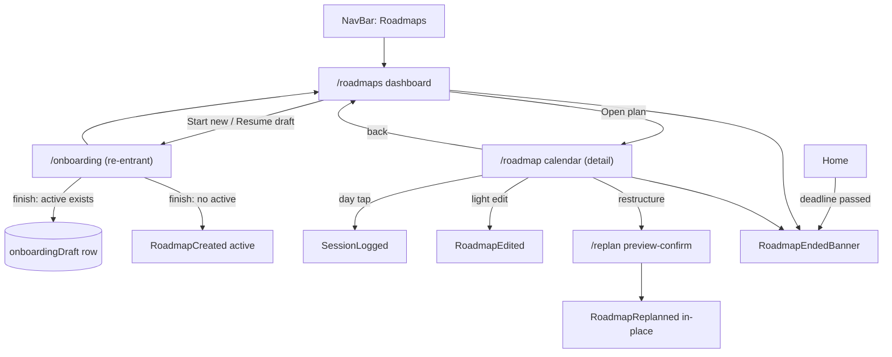

<!--
  This is the verbatim operating-manual preamble. It is pasted as the first content
  of every plan written by the write-implementation-plan skill. Do NOT modify it
  per-plan — keeping it identical across plans means implementing agents learn
  the protocol once and recognize it everywhere.
-->

# How to use this plan

> **You are the implementing agent.** This document is your runbook for one cohesive change to this codebase. It was written collaboratively by Claude and a human after a planning discussion, and it is the source of truth for this work. Read this preamble in full before doing anything else.

## What you're holding

A phase-by-phase implementation plan. Each phase is a **vertical slice** — an end-to-end working increment that leaves the codebase in a working state. Phases are designed so any one of them can be implemented by a fresh agent in a new context window, with only this document and the codebase as input.

## Your job

1. **Read the document header in full first.** TL;DR, Context, Decisions log, Architecture overview, and Files-touched index. These give you the *why* behind every step. The Decisions log especially — those decisions were made deliberately and explain choices that may otherwise look arbitrary or wrong. Reference IDs (D-NN) appear inside phase steps so you can look up rationale.

2. **Find your starting phase.** Scan the phase list. Pick the first phase whose status is `☐ Not started` AND whose `Depends on:` phases are all `✅ Complete`. Implement that phase only. **Do not skip ahead. Do not implement multiple phases in one go unless the human explicitly asks.**

3. **Run the prereq verification.** Each phase has a "Verification (run BEFORE starting)" block. Run those commands. **If any fail, STOP** — the codebase isn't in the state this phase expects. Surface to the human: "Phase N's prereqs failed: `<command>` returned `<result>`. Want me to investigate or hand back?"

4. **Follow the steps in order.** Code blocks in steps are the actual code, not pseudocode or sketches. Apply them as written.

5. **If reality doesn't match the step — STOP.** If the plan says "modify line 47 of `auth.py`" and line 47 is something different, do not improvise. Surface the discrepancy: "Plan expected `<X>` at `auth.py:47`, found `<Y>`. Possible causes: plan is stale, file was edited since planning, plan was wrong. How should I proceed?"

6. **Run the tests and post-verification.** Each phase specifies what tests to add or update and the bash command to run. All must pass before the phase is considered done.

7. **Update status and commit.** When the phase is complete:
   - Edit this document: change the phase's `Status:` line to `✅ Complete — <commit-sha-here>`.
   - `git add` the code changes AND this plan file.
   - Commit them together. Suggested message: `Phase N: <phase title>` (with longer body referencing the plan file).
   - The status update and the code change live in the same commit so the doc and the code never drift.

## What you must NOT do

- **Do not skip phases.** Order matters; later phases assume earlier ones completed.
- **Do not modify the Decisions log, the Operating manual preamble, the TL;DR, the Architecture overview, the Files-touched index, the Open questions, the Out-of-scope list, or the References.** Those are immutable above-the-phases content. If you discover a decision is wrong, surface to the human — don't silently revise.
- **Do not re-plan or re-architect.** If the plan seems wrong, that's a signal to stop and surface, not to improvise.
- **Do not implement multiple phases without surfacing for human review** between them, unless the user explicitly asked for batch execution upfront.

## If you get stuck

- Update the phase's `Status:` to `🛑 Blocked: <one-line reason>`.
- Fill in the phase's `Notes (filled in during implementation)` block with what you tried, what's blocking, and what you'd want to know to unblock.
- Hand back to the human.

## Status vocabulary

- `☐ Not started`
- `🟡 In progress`
- `🛑 Blocked: <reason>`
- `✅ Complete — <commit-sha>`

## When status markers and reality drift

The status markers are a fast read, but they are not the source of truth. The phase's `Verification (DONE)` commands are the truth — if you suspect a marker is wrong (someone forgot to update, branches diverged, partial commits, etc.), run the verification commands for the phases marked complete. Trust the commands over the markers, and surface the drift to the human so the markers can be corrected.

---

# Roadmaps dashboard: multi-roadmap lifecycle, re-entrant onboarding, and the deadline-passed loop

**Slug:** `2026-06-26-roadmaps-dashboard`
**Date written:** 2026-06-26
**Author:** Claude + Rohit
**Plan status:** Draft
**Upstream:** builds on [`plans/active/2026-06-26-roadmap-calendar/PLAN.md`](../2026-06-26-roadmap-calendar/PLAN.md) (verified base: calendar + history page + terminal events). Replan UI follow-up: [`specs/issues/010-replan-flow-with-three-options.md`](../../specs/issues/010-replan-flow-with-three-options.md). PRD: [`specs/prd/PRD-study-tracker-web.md`](../../specs/prd/PRD-study-tracker-web.md).

> **Step 0, before writing any code:** commit these planning docs verbatim — `docs(plan): add roadmaps-dashboard plan + verification`. Cowork cannot commit (the sandbox bricks on git lock files), so the native side must establish this baseline first; otherwise later phase diffs have nothing to diff against. After each phase, fill your section of [`VERIFICATION.md`](./VERIFICATION.md) (files changed, commit SHA, what you did, deviations + why) and expect review. **A phase is not done until the reviewer marks it `✅ Verified`; change requests may follow.**

## TL;DR

Today `/roadmap` drops the user straight onto a calendar that says "No active roadmap" with no way forward, and onboarding can only ever run once per user. This plan turns `/roadmaps` into the section **dashboard** (active plan + one queued draft + history), makes the calendar a detail view under it, makes the onboarding wizard **re-entrant** to build subsequent roadmaps (returning to the dashboard, not `/home`), and closes the lifecycle loop: exactly **one active roadmap per period** (temporally non-overlapping), explicit Complete/Abandon, and a **deadline-passed banner** on Home + dashboard + calendar. Editing the active plan **updates in place** (a re-plan carries the original plan's identity rather than spawning a "superseded" sibling), sessions attribute to roadmaps **by date window** (no schema change), and "edit & add" resolves into add-session / inline light edits (`RoadmapEdited`) / restructure (`/replan`). The full three-option replan scope-picker UI remains issue 010; this plan delivers the foundation it builds on (in-place identity, typed events, preview-confirm seam, unified entry points).

## Context & background

The roadmap calendar slice ([`2026-06-26-roadmap-calendar`](../2026-06-26-roadmap-calendar/PLAN.md), all 7 phases Cowork-verified) shipped: a month calendar at `/roadmap`, a `/roadmaps` history page (Active/Completed/Abandoned groups), the `RoadmapMarkedComplete` / `RoadmapMarkedAbandoned` terminal events, the lifecycle deriver `deriveRoadmapLifecycle`, and a Python-routed replan seam (`replanRoadmap` → `POST /v1/roadmap/regenerate`) with `/replan` left as a stub. Edit was deferred.

What's broken / missing for the user (product owner) goals:

1. **Dead-end empty state.** The nav links `/roadmap` (the bare calendar). When no roadmap is active it shows "No active roadmap" with only a "Start a roadmap" button → `/onboarding`, but that route is gated (see #2).
2. **Onboarding is one-shot.** `OnboardingGate` redirects `/onboarding` → `/home` whenever an `OnboardingCompleted` event exists, so "Start a new roadmap" lands the user on Home, never the wizard. There is no way to build a 2nd roadmap.
3. **No queued-draft concept, no dashboard hub.** `/roadmaps` is a read-only history list, not a control center.
4. **Editing spawns siblings.** `deriveRoadmapLifecycle` treats every `RoadmapCreated` *and* `RoadmapReplanned` as a separate entry and marks earlier ones `superseded`; a re-plan would clutter history with forks.
5. **Deadline passing is invisible** — nothing surfaces that an active plan's end date has come and gone.

Constraints: mobile-first React 19 SPA, event-sourced local store (Dexie), `BrowserRouter basename="/study"` (never put `/study` in `to`). Dexie schema is at **version 5**; this plan intentionally needs **no new table** (draft state reuses the existing `onboardingDraft` row; new state is *derived* from events, not stored). E2E tests are authored but NOT run in this environment (sandbox constraint — see [`../../../CLAUDE.md`](../../../CLAUDE.md)); Vitest unit tests should still be authored.

**Support docs:**

- Prior plan this extends — [`plans/active/2026-06-26-roadmap-calendar/PLAN.md`](../2026-06-26-roadmap-calendar/PLAN.md)
- Replan UI follow-up issue — [`specs/issues/010-replan-flow-with-three-options.md`](../../specs/issues/010-replan-flow-with-three-options.md)
- Onboarding architecture rule — [`.claude/rules/onboarding-architecture.md`](../../../.claude/rules/onboarding-architecture.md)
- EventStore / Dexie rules — [`.claude/rules/eventstore-architecture.md`](../../../.claude/rules/eventstore-architecture.md), [`.claude/rules/dexie-schema-migration.md`](../../../.claude/rules/dexie-schema-migration.md)
- Router rule — [`.claude/rules/react-router-v7-basename.md`](../../../.claude/rules/react-router-v7-basename.md)
- Design tokens — [`packages/design-tokens/src/tokens.css`](../../../packages/design-tokens/src/tokens.css)

## Decisions log

### D-01: One active roadmap per period; roadmaps are temporally non-overlapping

**Status:** ✅ Agreed

**Context:** The user asked for "multiple roadmaps" and "secondary roadmaps". Needed to decide whether multiple can be active simultaneously.

**Decision:** Exactly one *active* roadmap at any time. Others are a queued *draft* (pre-commit) or *history* (completed/abandoned). A new roadmap's period must not overlap the active one's `[startDate, deadline]`.

**Rationale:** `SessionLogged` carries no `roadmapId`; progress is matched against the latest roadmap. Concurrent actives make every session ambiguous and force a `roadmapId` + log-screen picker + backfill. Single-active keeps attribution unambiguous and matches the shipped deriver.

**Alternatives considered:**

- Multiple concurrent actives → rejected: ambiguous session attribution, large cross-cutting change.

**User pushback / disagreement:** none — user added "new one shd not conflict with current period."

**Reversibility:** hard — would require a session→roadmap key and progress rework.

### D-02: The active plan ends only by explicit user action (Complete / Abandon); nothing auto-activates

**Status:** ✅ Agreed

**Context:** How does the active roadmap stop being active and hand off.

**Decision:** A roadmap stays active until the user explicitly marks it **Complete** or **Abandon**. A queued draft never auto-promotes; the user explicitly starts it. Deadline passing does **not** auto-close (see D-09 for the nudge).

**Rationale:** User-driven is predictable; auto-activation on date-passing would strand progress with no anchor and surprise the user.

**User pushback / disagreement:** > "Users choice, hence its in draft" — the user explicitly wants the transition manual.

**Reversibility:** easy.

### D-03: One draft at a time

**Status:** ✅ Agreed

**Context:** How many queued drafts can exist.

**Decision:** A single draft. It reuses the existing single-row `onboardingDraft` table (`id=1`).

**Rationale:** User chose "One draft at a time for now." Avoids multi-row migration; the existing row suffices.

**Reversibility:** moderate — multiple drafts later needs a keyed table + migration.

### D-04: Wizard terminal behavior depends on whether a period is occupied

**Status:** ✅ Agreed

**Context:** What "Finish" does when a roadmap is already active.

**Decision:** If a roadmap is active when the wizard finishes → save as the **draft**, return to `/roadmaps`; the dashboard's "Start" stays locked until the active plan closes. If **no** roadmap is active → the wizard **starts** the new plan immediately (becomes active), return to `/roadmaps`. Non-overlap is enforced at the **Start/promote** moment, the only point real dates are known.

**Rationale:** Makes terminal behavior a function of one fact ("is the period occupied?"), which is exactly the non-overlap rule. Avoids a dead-end wizard.

**User pushback / disagreement:** none — agreed.

**Reversibility:** moderate.

### D-05: `/roadmaps` is the section home; `/roadmap` becomes a detail view; nav links one "Roadmaps" item

**Status:** ✅ Agreed

**Context:** How the user navigates between the dashboard and the existing calendar.

**Decision:** `/roadmaps` (dashboard) is the section home and the nav target. `/roadmap` (calendar) becomes a detail reached via "Open plan", with a "← Roadmaps" back link. The single NavBar item label becomes **Roadmaps** pointing at `/roadmaps`.

**Rationale:** One hub that always has somewhere to go; kills the dead-end. Two nav items for one feature crowd a mobile nav.

**Reversibility:** easy.

### D-06: Sessions attribute to roadmaps by date window — no `roadmapId` on `SessionLogged`

**Status:** ✅ Agreed

**Context:** With multiple historical roadmaps, which roadmap a session counts toward.

**Decision:** A session belongs to whichever roadmap's `[startDate, deadline]` window contains its `date`. Past roadmaps show frozen historical progress; the active one shows live progress. Sessions whose date falls in **no** window (gaps, post-abandon) count toward **global** stats only, not any roadmap's progress.

**Rationale:** Non-overlapping windows make date attribution unambiguous with zero migration. Adding `roadmapId` would mean payload change + log-screen picker + backfill.

**User pushback / disagreement:** none — agreed gap-sessions → global only.

**Reversibility:** moderate.

### D-07: Editing the active plan updates IN PLACE — a re-plan carries the original roadmap's identity

**Status:** ✅ Agreed

**Context:** Today `deriveRoadmapLifecycle` makes every `RoadmapReplanned` a new entry and marks the prior one `superseded`, so edits would fork history.

**Decision:** An edit is not a new roadmap. `RoadmapReplanned` carries a `roadmapCreatedAt` referencing the original `RoadmapCreated`; the deriver **collapses a replan chain into the single original identity**, surfacing the latest snapshot. The `superseded` status is removed from the active/history views. Completed sessions stay pinned; only the future reflows.

**Rationale:** Matches the mental model of one journey re-routed, keeps the dashboard clean (no superseded pile).

**User pushback / disagreement:** > "Ya its meant to update in place."

**Reversibility:** moderate — touches the deriver and the replan-commit payload.

### D-08: Close offers two outcomes (Complete / Abandon); no 100% gate; closing with a draft prompts to start it

**Status:** ✅ Agreed

**Context:** What "Close plan" does.

**Decision:** Two terminal outcomes — **Complete** (history, check, records actual %) and **Abandon** (history, greyed). Complete is **not** gated behind 100%. On close, if a draft exists, show an inline prompt "Ready to start <draft>?" with *Start now* / *Not yet*; if no draft, the dashboard empty state shows "Plan your next roadmap".

**Rationale:** Both terminal events already exist and history already styles them differently; the distinction is meaningful to a learner. The prompt closes the "onboarding again when roadmaps get over" loop at the natural moment.

**User pushback / disagreement:** none — agreed both.

**Reversibility:** easy.

### D-09: Deadline-passed is a derived flag shown as a persistent inline banner on Home + dashboard + calendar

**Status:** ✅ Agreed

**Context:** The user flagged deadline-passing as an important event that must show on Home and Roadmap.

**Decision:** "ended" = the active plan's `deadline` < today and it has no terminal event. It is **computed**, not a new event. Surface as a **persistent, non-dismissible inline banner** (NOT a blocking modal) on Home, the dashboard active hero, and the calendar, offering exactly three actions: **Mark complete**, **Extend deadline** (→ `/replan` with a later deadline), **Abandon**. No fourth "leave it running" action.

**Rationale:** Important enough to be unmissable, but a blocking modal would contradict D-02's user-choice principle. Reuses existing terminal actions + the replan seam — no new mechanics, only a computed flag + banner.

**User pushback / disagreement:** none — agreed banner-over-modal and the three actions.

**Reversibility:** easy.

### D-10: "Edit & add" resolves into three operations of different weight

**Status:** ✅ Agreed

**Context:** The user wants to "edit, add sessions etc" within a roadmap.

**Decision:** (a) **Add session** — tap a day on the active calendar → log sheet pre-filled with that day's planned material/title → `SessionLogged` for that date (attributes by D-06). (b) **Light edit** — rename a session, move a material a day, mark done, nudge minutes → inline on the calendar, emitting `RoadmapEdited` events (already consumed as `user-edited` pins by `mapToRegenerateRequest`). (c) **Restructure** — add/remove material, change hours/deadline → `/replan` reflow. Past is always frozen; edits only reshape the road ahead.

**Rationale:** Separates frequent lightweight logging from occasional structural reflow; `RoadmapEdited` pins are already half-wired in the replan mapper.

**Reversibility:** moderate.

### D-11: `/replan` is the single home for all reflow, with preview-and-confirm reusing the Step3Preview presentation

**Status:** ✅ Agreed

**Context:** `/replan` is a stub with three entry points (calendar Replan, Week "Replan the rest", Home RecalibrationModal) and a real engine seam.

**Decision:** Unify all reflow entry points into `/replan`. It shows a **preview-and-confirm** of the regenerated "rest of plan" before writing, reusing the onboarding `Step3Preview` presentation pattern. Commit emits `RoadmapReplanned` carrying the original identity (D-07). The Python regenerate response is runtime-validated before commit (replaces the unchecked `as RoadmapOutput` cast). The richer three-option scope-picker UI (extend / hours / trim) remains issue 010, built on this seam.

**Rationale:** A replan reshuffles weeks; preview-before-write prevents surprises and reuses a proven pattern. In-place identity must apply here or recalibration would re-introduce superseded forks.

**User pushback / disagreement:** > "Yeah replan can make use of Step3Preview components and functions."

**Reversibility:** moderate.

### D-12: Draft detection is derived, not flagged; a draft card appears only after step 1 is complete

**Status:** ✅ Agreed

**Context:** The dashboard must distinguish a next-roadmap draft from a half-finished first-run, sharing the single `onboardingDraft` row.

**Decision:** Derive: a *next-roadmap draft* exists when an `OnboardingCompleted` event exists **and** the `onboardingDraft` row has meaningful content. The card appears only once **step 1 is complete** (`stepReached > 1` and `deadline` set); a blank-step-1 bail leaves no card. Title falls back to "Untitled plan". No `intent` flag is stored.

**Rationale:** First-run and next-roadmap draft states are mutually exclusive in time (RequireOnboarding traps an incomplete first-run inside onboarding; the row is cleared on first completion), so a flag would be redundant data that can drift. Deriving keeps events as the single source of truth.

**User pushback / disagreement:** none — agreed derive-not-flag and "appears after step 1".

**Reversibility:** easy.

## Architecture overview

The change is mostly **derivation + UI re-composition + one gate generalization**; no new Dexie table, no `SessionLogged` payload change.

- **Events (typed):** add `RoadmapReplannedPayload` (extends created shape + `roadmapCreatedAt`) and `RoadmapEditedPayload` to `sync/types.ts`. New kinds were already referenced untyped by the replan mapper.
- **Lifecycle deriver (`roadmapLifecycle.ts`):** becomes identity-aware (D-07) — group roadmap events by stable identity (`RoadmapCreated.createdAt`, with `RoadmapReplanned.payload.roadmapCreatedAt` pointing back), surface the latest snapshot per identity, drop `superseded` from active/history. Progress (`completedSlotCount`) becomes date-window-scoped (D-06).
- **Routing/nav:** `OnboardingGate` gains a "new roadmap" mode (via route state / search param) that bypasses the completed-gate (D-04); `Step3Preview.handleCommit` branches on active-exists to either start or save-as-draft and redirects to `/roadmaps`; NavBar item → Roadmaps (D-05); calendar gets a back link.
- **Dashboard (`Roadmaps.tsx`):** re-composed into Active hero / Next-up draft / History, with Close→prompt and Start (non-overlap-guarded) (D-03, D-08, D-12).
- **Deadline banner:** a shared `useRoadmapEndedState` hook + `RoadmapEndedBanner` mounted on Home, dashboard, calendar (D-09).
- **Edit & add:** calendar day-tap → quick log; inline light edits emit `RoadmapEdited`; `/replan` preview-confirm commits in-place `RoadmapReplanned` (D-10, D-11).



## Files touched (index)

| Path | Change | Phase | Purpose |
|------|--------|-------|---------|
| `apps/app/src/sync/types.ts` | modify | 1 | Add `RoadmapReplannedPayload`, `RoadmapEditedPayload` |
| `apps/app/src/roadmap/roadmapLifecycle.ts` | modify | 1 | Identity-aware collapse of replan chains; drop `superseded` from active/history (D-07) |
| `apps/app/src/roadmap/roadmapLifecycle.test.ts` | new/modify | 1 | Cover in-place identity + chain collapse |
| `apps/app/src/roadmap/roadmapLifecycle.ts` | modify | 2 | Date-window session attribution in `completedSlotCount` (D-06) |
| `apps/app/src/progress/mapEvents.ts` | modify | 2 | `findRoadmap` stays latest-active; add window helper if needed |
| `apps/app/src/components/NavBar.tsx` | modify | 3 | Nav item `/roadmap` → `/roadmaps`, label "Roadmaps" (D-05) |
| `apps/app/src/App.tsx` | modify | 3 | `OnboardingGate` new-roadmap mode; `/roadmap` back-link wiring |
| `apps/app/src/onboarding/OnboardingGate.tsx` | modify | 3 | Bypass completed-gate in new-roadmap mode (D-04) |
| `apps/app/src/onboarding/steps/Step3Preview.tsx` | modify | 3 | Branch finish: start vs save-as-draft; redirect `/roadmaps` (D-04) |
| `apps/app/src/roadmap/RoadmapCalendar.tsx` | modify | 3 | "← Roadmaps" back link in non-readOnly mode (D-05) |
| `apps/app/src/pages/Roadmaps.tsx` | modify | 4 | Dashboard: Active hero / Next-up draft / History (D-03, D-08, D-12) |
| `apps/app/src/roadmap/roadmapDraft.ts` | new | 4 | Derive next-roadmap draft from events + `onboardingDraft` (D-12) |
| `apps/app/src/roadmap/roadmap.css` | modify | 4 | Dashboard hero / draft / history styles |
| `apps/app/src/roadmap/useRoadmapEndedState.ts` | new | 5 | Computed "ended" flag for the active plan (D-09) |
| `apps/app/src/roadmap/RoadmapEndedBanner.tsx` | new | 5 | Shared deadline-passed banner (D-09) |
| `apps/app/src/pages/Home.tsx` | modify | 5 | Mount `RoadmapEndedBanner` as first child (D-09) |
| `apps/app/src/roadmap/RoadmapCalendar.tsx` | modify | 5 | Mount banner atop calendar (D-09) |
| `apps/app/src/roadmap/RoadmapCalendar.tsx` | modify | 6 | Day-tap quick-log + inline light edits → `RoadmapEdited` (D-10) |
| `apps/app/src/roadmap/edit/logRoadmapEdit.ts` | new | 6 | Helper to emit `RoadmapEdited` events |
| `apps/app/src/roadmap/replan/replanRoadmap.ts` | modify | 7 | Runtime-validate `parseRoadmapOutput` (D-11, issue 010) |
| `apps/app/src/roadmap/replan/commitReplan.ts` | new | 7 | Emit in-place `RoadmapReplanned` carrying original identity (D-07, D-11) |
| `apps/app/src/pages/Replan.tsx` | new | 7 | Preview-and-confirm `/replan` screen (D-11) |
| `apps/app/src/App.tsx` | modify | 7 | Replace `ReplanStub` with `<Replan />` |

## Phases

### Phase 1: Typed replan/edit events + in-place lifecycle identity

**Status:** ✅ Complete — 4631152
**Depends on:** none — can start immediately
**Estimated scope:** ~3 files, ~150 lines

#### Codebase state assumed at start

- `apps/app/src/sync/types.ts` defines `RoadmapCreatedPayload`, `RoadmapMarkedCompletePayload`, `RoadmapMarkedAbandonedPayload` (no `RoadmapReplannedPayload`/`RoadmapEditedPayload` yet).
- `apps/app/src/roadmap/roadmapLifecycle.ts` exports `deriveRoadmapLifecycle(events)` which treats each `RoadmapCreated`/`RoadmapReplanned` as a separate entry and sets `status: 'superseded'` for any non-latest roadmap event.
- `mapToRegenerateRequest.ts` already reads `RoadmapEdited` events (`userEditedPins(events, roadmapEvent.createdAt)`) and references `RoadmapReplanned`.

#### Verification (run BEFORE starting to confirm prereqs are met)

```bash
cd apps/app && grep -n "superseded" src/roadmap/roadmapLifecycle.ts   # expect matches (current sibling behavior)
grep -n "RoadmapReplannedPayload\|RoadmapEditedPayload" src/sync/types.ts   # expect NO matches (not yet typed)
grep -n "RoadmapReplanned\|RoadmapEdited" src/roadmap/replan/mapToRegenerateRequest.ts   # expect matches (untyped usage)
```

If `RoadmapReplannedPayload` already exists, STOP and surface — the plan is stale.

#### Steps

1. **Modify `apps/app/src/sync/types.ts`** — add two payload interfaces after `RoadmapMarkedAbandonedPayload`. `RoadmapReplannedPayload` mirrors `RoadmapCreatedPayload` plus the identity back-reference; `RoadmapEditedPayload` captures a single in-place slot edit. Implements D-07, D-10.

   ```ts
   export interface RoadmapReplannedPayload extends RoadmapCreatedPayload {
     // identity of the original RoadmapCreated this revises; collapses to one entry (D-07)
     roadmapCreatedAt: string
     // which entry path produced this replan, for analytics/history (optional)
     option?: 'extend-deadline' | 'increase-hours' | 'trim-scope' | 'edit'
   }

   export interface RoadmapEditedPayload {
     // identity of the roadmap being edited in place (D-07/D-10)
     roadmapCreatedAt: string
     weekIndex: number
     dayOfWeek: DayOfWeek
     // null materialId means "rest day" / cleared
     materialId: string | null
     sessionTitle: string | null
     plannedMinutes: number
   }
   ```

   Confirm `DayOfWeek` and `Slot` are already imported in this file (they are, used by `RoadmapCreatedPayload`). If not, add the import from the same module they currently come from.

2. **Refactor `apps/app/src/roadmap/roadmapLifecycle.ts`** to be identity-aware (D-07). The stable identity of a roadmap is the `createdAt` of its original `RoadmapCreated`; a `RoadmapReplanned` event points back via `payload.roadmapCreatedAt`. Replace the per-event mapping with a per-identity collapse:

   - Build a map keyed by identity. For each `RoadmapCreated`, identity = `event.createdAt`. For each `RoadmapReplanned`, identity = `payload.roadmapCreatedAt` (fall back to `event.createdAt` if absent, for forward-compat with any pre-existing untyped replans).
   - For each identity, keep the **latest** roadmap event (by `eventTime`) as the surfaced snapshot, but keep `roadmapCreatedAt = identity` (the original) so terminal events (`RoadmapMarkedComplete/Abandoned` reference `roadmapCreatedAt` = original) still match.
   - Determine status from the latest terminal event for that identity (unchanged logic via `latestTerminalFor`), else `active` for the most-recently-created identity, else **history is determined by terminal only** — drop the `superseded` branch from the active set. (Keep the `RoadmapLifecycleStatus` type member `superseded` only if other code imports it; otherwise remove it and update the `RoadmapLifecycleGroups` shape to drop the `superseded` array.)

   The collapse must ensure: replanning the active roadmap three times yields **one** `active` entry, not three.

3. **Keep `entryTitle`, `formatRange`, `percentComplete` outputs stable** so `Roadmaps.tsx` and `RoadmapCalendar.tsx` consumers don't break. The `RoadmapLifecycleEntry.payload` should be the latest snapshot's payload (so the calendar renders current slots), while `roadmapCreatedAt` remains the original identity.

#### Tests

- Add/extend `apps/app/src/roadmap/roadmapLifecycle.test.ts`:
  - `collapses a replan chain into one active entry` — `RoadmapCreated(A)` then `RoadmapReplanned(roadmapCreatedAt=A)` ×2 → `active.length === 1`, entry `roadmapCreatedAt === A`, entry `payload` equals the latest replan snapshot.
  - `terminal event on original identity marks the collapsed entry complete` — `RoadmapMarkedComplete(roadmapCreatedAt=A)` after replans → entry in `completed`, not `active`.
  - `two distinct original roadmaps with the older completed` — `Created(A)` + `MarkedComplete(A)` + `Created(B)` → `active=[B]`, `completed=[A]`, no `superseded`.
- Run: `pnpm --filter app test -- roadmapLifecycle`

#### Verification (DONE — run after implementation)

```bash
cd apps/app && pnpm --filter app test -- roadmapLifecycle   # expect new tests green
grep -n "superseded" src/roadmap/roadmapLifecycle.ts   # expect: removed from active/history derivation
pnpm --filter app typecheck   # expect: no type errors
```

#### Rollback

Revert the three files. No data migration (events are append-only; new payload fields are additive and unread by old code).

#### Notes (filled in during implementation)

- Added typed `RoadmapReplannedPayload` / `RoadmapEditedPayload`, then refactored `deriveRoadmapLifecycle` to collapse replan chains by original `RoadmapCreated.createdAt`.
- Removed `superseded` from `RoadmapLifecycleStatus` and `RoadmapLifecycleGroups`; no current app code outside the lifecycle module consumed it.
- Test note: default shell Node `v18.19.0` cannot run the app Vitest suite because jsdom/html-encoding-sniffer loads an ESM dependency through `require()`. Phase 1 verification was rerun successfully with Node `v22.17.1` via `/Users/rsaji/.nvm/versions/node/v22.17.1/bin`.
- The final Phase 1 code commit SHA is recorded in a follow-up doc state because amending a self-referential SHA changes the commit hash.

---

### Phase 2: Session attribution by date window (frozen history, live active)

**Status:** ✅ Complete — 37a0361
**Depends on:** Phase 1 (`✅ Complete`)
**Estimated scope:** ~2 files, ~80 lines

#### Codebase state assumed at start

- Phase 1 done: lifecycle entries are identity-collapsed.
- `roadmapLifecycle.ts::completedSlotCount(events, roadmap)` currently matches each slot to any `SessionLogged` with the same `date` and a `materialId ∈ slot.candidateMaterialIds`, with no roadmap-window scoping.
- `progress/mapEvents.ts::findRoadmap(events)` returns the latest `RoadmapCreated|RoadmapReplanned` payload (used by Home/Week for the active plan).

#### Verification (run BEFORE starting)

```bash
cd apps/app && grep -n "completedSlotCount" src/roadmap/roadmapLifecycle.ts   # expect the function exists
grep -n "function findRoadmap" src/progress/mapEvents.ts   # expect exists
```

#### Steps

1. **Modify `completedSlotCount`** (in `roadmapLifecycle.ts`) so sessions only count toward a roadmap if their `date` falls within that roadmap's `[startDate, deadline]` window (inclusive). Implements D-06. This makes a completed past roadmap's `percentComplete` frozen (only its own window's sessions), and prevents a new active roadmap from absorbing an old roadmap's sessions.

   ```ts
   function completedSlotCount(events: Event[], roadmap: RoadmapCreatedPayload): number {
     const usedSessionIndexes = new Set<number>()
     const inWindow = (date: string | undefined): boolean =>
       date !== undefined && date >= roadmap.startDate && date <= roadmap.deadline
     const sessions = events
       .filter((event) => event.kind === 'SessionLogged')
       .map((event, index) => ({
         index,
         date: event.payload.date as string | undefined,
         materialId: event.payload.materialId as string | undefined,
       }))
       .filter((s) => inWindow(s.date))   // D-06: only sessions inside this roadmap's window
     // ...existing greedy slot match unchanged below...
   }
   ```

   ISO `YYYY-MM-DD` strings compare correctly lexicographically, so `>=`/`<=` on the raw strings is safe; do not parse to Date unless you confirm timezone neutrality.

2. **Leave `findRoadmap` semantics intact** — "latest roadmap event" still equals the active snapshot, which is correct under D-01 (one active). Add a short comment noting that gap-sessions (outside any window) intentionally contribute to global stats only (D-06), not roadmap progress. No behavior change needed in `mapEvents.ts` beyond the comment unless a test reveals Home double-counts.

#### Tests

- Extend `roadmapLifecycle.test.ts`:
  - `sessions outside a roadmap window do not count toward its progress` — roadmap window Jan–Mar, a session dated in Apr with a matching materialId → `completedSlots` unchanged.
  - `each roadmap counts only its own window's sessions` — two historical roadmaps, sessions in each window → each entry's `percentComplete` reflects only its own.
- Run: `pnpm --filter app test -- roadmapLifecycle`

#### Verification (DONE)

```bash
cd apps/app && pnpm --filter app test -- roadmapLifecycle   # expect green incl. new window tests
pnpm --filter app typecheck
```

#### Rollback

Revert `completedSlotCount` to the unscoped match. No data effects.

#### Notes (filled in during implementation)

- Added a date-window filter to `completedSlotCount`: a `SessionLogged` date must be inside the roadmap's inclusive `[startDate, deadline]` before it can match a slot.
- Added tests for an out-of-window matching slot/session pair and for two roadmap windows counting their own sessions.
- Left `findRoadmap` semantics unchanged and documented that gap sessions remain available to global stats while roadmap progress scopes them by date window.
- Verification used Node `v22.17.1`; default shell Node `v18.19.0` remains unsuitable for this app Vitest suite.
- The final Phase 2 code commit SHA is recorded in a follow-up doc state because amending a self-referential SHA changes the commit hash.

---

### Phase 3: Re-entrant onboarding + nav/routing reshape

**Status:** ✅ Complete — 521cd6d
**Depends on:** Phase 1 (`✅ Complete`)
**Estimated scope:** ~5 files, ~140 lines

#### Codebase state assumed at start

- `App.tsx`: `/onboarding` is wrapped `ProtectedRoute → OnboardingGate → MetadataFetcherProvider → OnboardingProvider → OnboardingLayout`; protected group wraps `/home /session /log /week /roadmap /roadmaps /replan /settings`.
- `OnboardingGate.tsx`: redirects to `/home` when an `OnboardingCompleted` event exists.
- `Step3Preview.tsx::handleCommit`: emits `MaterialAdded`×N → `RoadmapCreated` → `OnboardingCompleted`, clears `onboardingDraft`, then `navigate('/onboarding/4')`.
- `NavBar.tsx::NAV_ITEMS`: includes `{ to: '/roadmap', label: 'Roadmap', icon: RoadmapIcon, prefix: '/roadmap' }`.
- `RoadmapCalendar.tsx`: takes `{ roadmapCreatedAt, readOnly }`; renders a footer with the Replan link.

#### Verification (run BEFORE starting)

```bash
cd apps/app && grep -n "label: 'Roadmap'" src/components/NavBar.tsx   # expect the current item
grep -n "navigate('/home'" src/onboarding/OnboardingGate.tsx   # expect the redirect
grep -n "OnboardingCompleted" src/onboarding/steps/Step3Preview.tsx   # expect the emit
```

#### Steps

1. **`NavBar.tsx`** — change the roadmap nav item to point at the dashboard (D-05):

   ```ts
   { to: '/roadmaps', label: 'Roadmaps', icon: RoadmapIcon, prefix: '/roadmap' },
   ```

   Keep `prefix: '/roadmap'` so both `/roadmaps` and the `/roadmap` detail highlight the same nav item (confirm the prefix-match logic uses `startsWith`; if it uses exact match, set `prefix: '/roadmap'` still matches both via startsWith — verify and adjust).

2. **`OnboardingGate.tsx`** — add a "new roadmap" mode that bypasses the completed-gate (D-04). Detect the mode from the router location (search param `?new=1` or `location.state.newRoadmap`). When in new-roadmap mode, do **not** redirect even if `OnboardingCompleted` exists:

   ```tsx
   import { useLocation, useNavigate } from 'react-router-dom'
   // ...
   const location = useLocation()
   const newRoadmapMode =
     new URLSearchParams(location.search).get('new') === '1' ||
     (location.state as { newRoadmap?: boolean } | null)?.newRoadmap === true
   // ...
   useEffect(() => {
     if (hasCompletedOnboarding && !newRoadmapMode) {
       navigate('/home', { replace: true })
     }
   }, [hasCompletedOnboarding, newRoadmapMode, navigate])

   if (events === undefined) return null
   if (hasCompletedOnboarding && !newRoadmapMode) return null
   return <>{children}</>
   ```

3. **`Step3Preview.tsx::handleCommit`** — branch terminal behavior (D-04). Determine whether a roadmap is currently active (reuse `deriveRoadmapLifecycle(events).active.length > 0`, importing from `../../roadmap/roadmapLifecycle`, with `events` from `useLiveQuery`/eventStore already in scope). Also determine new-roadmap mode from location (same detection as step 2).

   - Always emit `MaterialAdded`×N (unchanged).
   - **If new-roadmap mode AND a roadmap is active** → save as draft, do NOT emit `RoadmapCreated`/`OnboardingCompleted`; persist the wizard state to `onboardingDraft` (it already is, via OnboardingProvider) and `navigate('/roadmaps')`. (The draft becomes the dashboard's Next-up card; promotion happens on the dashboard, Phase 4.)
   - **If new-roadmap mode AND no roadmap active** → emit `RoadmapCreated` (becomes active), do NOT emit a second `OnboardingCompleted` (it already exists), clear the draft, `navigate('/roadmaps')`.
   - **If first-run (no `OnboardingCompleted` exists)** → unchanged: emit `RoadmapCreated` + `OnboardingCompleted`, clear draft, `navigate('/onboarding/4')` (Step4Confirm celebration stays for first-run).

   Implement this as an explicit branch at the end of `handleCommit`; keep the existing `committedIds`/`allSlots`/`roadmapPayload` construction shared. Reference D-04 in a code comment.

4. **`App.tsx`** — no structural route change is required (`/onboarding` and `/roadmaps` already exist). Confirm "Start a new roadmap" / "Resume setup" links navigate to `/onboarding?new=1` (set in Phase 4's dashboard). If `Step4Confirm` is only meaningful for first-run, ensure new-roadmap mode never routes through `/onboarding/4` (handled by step 3's `navigate('/roadmaps')`).

5. **`RoadmapCalendar.tsx`** — when `!readOnly` (i.e., the live `/roadmap` detail), render a "← Roadmaps" back link at the top pointing to `/roadmaps` (D-05). Use `<Link to="/roadmaps">` (never include `/study`, per the router rule).

#### Tests

- Update `apps/app/src/onboarding/OnboardingFlow.test.tsx` (or the gate's test):
  - `new-roadmap mode lets the wizard open even though onboarding was completed` — events include `OnboardingCompleted`; render gate with `?new=1` → children render, no redirect.
  - `first-run still redirects to /home after completion guard` — unchanged behavior preserved.
  - `finishing a new roadmap while one is active saves a draft and does not emit RoadmapCreated` — assert no `RoadmapCreated` emitted, navigate called with `/roadmaps`.
  - `finishing a new roadmap with no active plan emits RoadmapCreated and navigates to /roadmaps`.
- Run: `pnpm --filter app test -- Onboarding`

#### Verification (DONE)

```bash
cd apps/app && pnpm --filter app test -- Onboarding   # expect green
grep -n "to: '/roadmaps'" src/components/NavBar.tsx   # expect the new nav item
grep -n "newRoadmapMode" src/onboarding/OnboardingGate.tsx   # expect the bypass
pnpm --filter app typecheck
```

#### Rollback

Revert the five files. Onboarding returns to one-shot; nav points at `/roadmap` again.

#### Notes (filled in during implementation)

- Changed the NavBar roadmap item to label `Roadmaps` and route to `/roadmaps`, while keeping `prefix: '/roadmap'` so `/roadmaps` and `/roadmap` both highlight it.
- Added `newRoadmapMode` handling to `OnboardingGate` and `Step3Preview` using `?new=1` or router state `{ newRoadmap: true }`.
- `Step3Preview` now branches on existing events: first-run emits `RoadmapCreated` + `OnboardingCompleted` and goes to `/onboarding/4`; completed-user new mode with an active plan saves the wizard draft and returns to `/roadmaps`; completed-user new mode with no active plan emits `RoadmapCreated`, avoids duplicate `OnboardingCompleted`, clears the draft, and returns to `/roadmaps`.
- Added a live calendar back link to `/roadmaps` and kept source text ASCII by rendering the arrow via `&larr;`.
- Verification used Node `v22.17.1`; default shell Node `v18.19.0` remains unsuitable for this app Vitest suite.
- The final Phase 3 code commit SHA is recorded in a follow-up doc state because amending a self-referential SHA changes the commit hash.

---

### Phase 4: Roadmaps dashboard (active hero + draft + history + close/start)

**Status:** ✅ Complete — 2cba6cf
**Depends on:** Phase 1, Phase 3 (`✅ Complete`)
**Estimated scope:** ~3 files, ~260 lines

#### Codebase state assumed at start

- Phase 1: `deriveRoadmapLifecycle` returns identity-collapsed `active`/`completed`/`abandoned` groups (no `superseded`).
- Phase 3: `/onboarding?new=1` opens the wizard for a new roadmap and returns to `/roadmaps`.
- `Roadmaps.tsx` currently renders `RoadmapGroup` lists (Active/Completed/Abandoned) + a read-only `RoadmapCalendar` on selection, and a "Start a new roadmap" `Link to="/onboarding"`.
- `OnboardingProvider` stores wizard state at `onboardingDraft` row `id=1` with fields incl. `stepReached` and `deadline`.
- Terminal actions exist: `RoadmapCalendar.resolveRoadmap('RoadmapMarkedComplete'|'RoadmapMarkedAbandoned')` emits the terminal events.

#### Verification (run BEFORE starting)

```bash
cd apps/app && grep -n "Start a new roadmap" src/pages/Roadmaps.tsx   # expect current CTA
grep -n "stepReached" src/onboarding/OnboardingProvider.tsx   # expect the field
```

#### Steps

1. **Create `apps/app/src/roadmap/roadmapDraft.ts`** — derive the dashboard draft (D-12). A next-roadmap draft exists iff an `OnboardingCompleted` event exists AND the `onboardingDraft` row has meaningful content (`state.stepReached > 1` and `state.deadline` set). Expose:

   ```ts
   export interface RoadmapDraftSummary {
     title: string          // state.purpose || 'Untitled plan'
     stepReached: number    // for "paused at step N"
     stepLabel: string      // map 2→'Hours', 3→'Materials', 4→'Confirm'
   }
   // reads the onboardingDraft row (id=1) via eventStore.table('onboardingDraft').get(1)
   export async function deriveRoadmapDraft(
     eventStore: EventStore,
     hasCompletedOnboarding: boolean,
   ): Promise<RoadmapDraftSummary | null>
   ```

   Return `null` when `!hasCompletedOnboarding` (first-run drafts never show on the dashboard) or when content is below the step-1 threshold.

2. **Rewrite `Roadmaps.tsx`** into the dashboard (D-03, D-08, D-12) — keep it a `useLiveQuery` consumer. Three zones, matching the approved mockup:

   - **Active** — `lifecycle.active[0]`. Hero card: title, `formatRange`, weeks, progress bar (`percentComplete`), a stat strip (sessions / hours / streak — reuse existing progress selectors if available; otherwise show sessions count + percent only and file a follow-up for the richer stats). Actions: **Open plan** (`Link to="/roadmap"`), **Edit & add** (`Link to="/roadmap"` for now; Phase 6 adds the affordances there), **Close plan** (opens a small Complete/Abandon control that calls the terminal-event emit; reuse the logic from `RoadmapCalendar.resolveRoadmap` — extract it to a shared helper `apps/app/src/roadmap/resolveRoadmap.ts` if it's currently inline, so both the calendar and dashboard share one path).
   - **Next up · draft** — if `deriveRoadmapDraft(...)` returns a summary: dashed card with title, "paused at step N · <label>", a **lock note** "Start unlocks when the current plan is closed" when an active plan exists, and actions **Resume setup** (`Link to={{ pathname: '/onboarding/<step>', search: '?new=1' }}` or `state={{ newRoadmap: true }}`), **Start plan** (enabled only when `active.length === 0`; on click, promote — see step 3), **Discard** (clears `onboardingDraft` row). If no draft and no active plan: empty-state CTA "Plan your next roadmap" → `/onboarding?new=1`. If no draft but a plan is active: a slim "+ Plan your next roadmap" entry → `/onboarding?new=1`.
   - **History** — `completed` + `abandoned` rows (reuse the existing `RoadmapGroup`/row markup), clicking a row opens the read-only `RoadmapCalendar roadmapCreatedAt={...} readOnly` (existing behavior).

3. **Start/promote + close-prompt wiring** (D-04, D-08):
   - **Start plan** (draft → active): only enabled when no active roadmap (non-overlap, D-01/D-04). Promotion = resume the wizard to its confirm step in new-roadmap mode (`/onboarding/<stepReached>?new=1`) so the user lands on the existing commit path which, with no active plan, emits `RoadmapCreated` and returns to `/roadmaps` (Phase 3 step 3). Do NOT emit `RoadmapCreated` directly from the dashboard — keep one commit path in `Step3Preview`.
   - **Close prompt** (D-08): after Complete/Abandon succeeds, if `deriveRoadmapDraft` returns a draft, show an inline confirm "Ready to start <draft title>?" with *Start now* (→ `/onboarding/<step>?new=1`) and *Not yet* (dismiss). If no draft, the Active zone now renders the empty-state CTA.

4. **`roadmap.css`** — add styles for `.rmd-hero`, `.rmd-draft` (dashed `--clay` border), `.rmd-history-row`, status pills (moss `--moss` for on-track/completed, rust `--rust`/terracotta for ended/abandoned), reusing the tokens in `packages/design-tokens/src/tokens.css`. Mobile-first single column; the hero stat strip wraps.

#### Tests

- Add `apps/app/src/roadmap/roadmapDraft.test.ts`:
  - returns `null` when no `OnboardingCompleted`.
  - returns `null` when `stepReached <= 1` or `deadline` unset.
  - returns summary with correct `title` fallback and `stepLabel` when content present.
- Add/extend `apps/app/src/pages/Roadmaps.test.tsx` (jsdom + fake-indexeddb per `dexie-test-setup.md`):
  - renders the Active hero when an active roadmap exists.
  - **Start plan disabled** while a plan is active; enabled when none active.
  - shows the draft card only after step 1 (D-12).
  - close → prompt appears when a draft exists.
- Run: `pnpm --filter app test -- Roadmaps roadmapDraft`

#### Verification (DONE)

```bash
cd apps/app && pnpm --filter app test -- Roadmaps roadmapDraft   # expect green
pnpm --filter app typecheck && pnpm lint
```

#### Rollback

Restore the previous `Roadmaps.tsx`; delete `roadmapDraft.ts`. History/active lists revert to the simple grouped view.

#### Notes (filled in during implementation)

<empty>

---

### Phase 5: Deadline-passed banner (Home + dashboard + calendar)

**Status:** ✅ Complete — 03a2537
**Depends on:** Phase 1, Phase 4 (`✅ Complete`)
**Estimated scope:** ~4 files, ~150 lines

#### Codebase state assumed at start

- Phase 4: dashboard renders the active hero; close actions go through a shared resolve helper.
- `Home.tsx` outer wrapper is `<div style={{ padding: '2rem 1rem', maxWidth: '640px', margin: '0 auto' }}>`; it already conditionally renders a `RecalibrationBanner` (line ~231) — a precedent for a top banner.
- `RoadmapCalendar.tsx` renders the active plan when `!readOnly`.

#### Verification (run BEFORE starting)

```bash
cd apps/app && grep -n "RecalibrationBanner" src/pages/Home.tsx   # expect the existing banner precedent
grep -n "deriveRoadmapLifecycle" src/roadmap/roadmapLifecycle.ts   # expect exported
```

#### Steps

1. **Create `apps/app/src/roadmap/useRoadmapEndedState.ts`** (D-09) — a hook returning `{ ended: boolean, entry: RoadmapLifecycleEntry | null }`. `ended` is true iff there is an active entry (`lifecycle.active[0]`) whose `deadline < todayISO()` and which has no terminal event (it's active by definition). Use the same ISO-string comparison as Phase 2.

2. **Create `apps/app/src/roadmap/RoadmapEndedBanner.tsx`** (D-09) — a presentational, **non-dismissible** banner: message "Your plan '<title>' reached its end date on <date>." and three buttons: **Mark complete** (calls shared resolve helper with `RoadmapMarkedComplete`), **Extend deadline** (`Link to="/replan"` — Phase 7 will accept an extend intent; until then it routes to the replan screen/stub), **Abandon** (resolve helper with `RoadmapMarkedAbandoned`). Style with `--terracotta`/`--rust` accents; not a modal (D-09). Accept the `entry` + handlers via props so it's testable and reusable.

3. **Mount on Home** — in `Home.tsx`, render `<RoadmapEndedBanner ... />` as the **first child** inside the outer wrapper (above the date header), only when `useRoadmapEndedState().ended`. Keep it independent of the `RecalibrationBanner` (different concern: ended vs behind-mid-plan).

4. **Mount on the dashboard** — in `Roadmaps.tsx`, when the active entry is ended, switch the hero status pill to "● Ended — needs review" (rust) and render the banner's three actions inside/above the hero (reuse `RoadmapEndedBanner` or share its action handlers).

5. **Mount on the calendar** — in `RoadmapCalendar.tsx` (`!readOnly` only), render the banner strip at the top when ended.

#### Tests

- Add `apps/app/src/roadmap/useRoadmapEndedState.test.ts`:
  - active plan with past `deadline` → `ended === true`.
  - active plan with future `deadline` → `ended === false`.
  - completed plan with past deadline → `ended === false` (terminal wins).
- Add `apps/app/src/roadmap/RoadmapEndedBanner.test.tsx`:
  - renders the three actions; clicking each invokes the right handler; banner has no dismiss control.
- Run: `pnpm --filter app test -- RoadmapEnded useRoadmapEndedState`

#### Verification (DONE)

```bash
cd apps/app && pnpm --filter app test -- RoadmapEnded useRoadmapEndedState   # expect green
pnpm --filter app typecheck
```

#### Rollback

Delete the hook + banner; remove the three mounts. No data effects.

#### Notes (filled in during implementation)

<empty>

---

### Phase 6: Add-session quick-log + inline light edits (`RoadmapEdited`)

**Status:** ✅ Complete — c771f63
**Depends on:** Phase 1, Phase 3 (`✅ Complete`)
**Estimated scope:** ~3 files, ~200 lines

#### Codebase state assumed at start

- Phase 1: `RoadmapEditedPayload` is typed in `sync/types.ts`.
- `mapToRegenerateRequest.ts` already converts `RoadmapEdited` events into `user-edited` pins via `userEditedPins(events, roadmapEvent.createdAt)`.
- `RoadmapCalendar.tsx` renders day cells / slots; today it has NO inline edit affordance (editing deferred). It already opens a day-sheet / session modal on dot/hover interaction (from the calendar slice).
- The existing logging path emits `SessionLogged` (see `pages/Log.tsx`).

#### Verification (run BEFORE starting)

```bash
cd apps/app && grep -n "userEditedPins\|RoadmapEdited" src/roadmap/replan/mapToRegenerateRequest.ts   # expect the pin consumer
grep -n "SessionLogged" src/pages/Log.tsx   # expect the logging payload shape
```

#### Steps

1. **Create `apps/app/src/roadmap/edit/logRoadmapEdit.ts`** — a helper that emits a `RoadmapEdited` event for an in-place light edit (D-10), keyed to the active roadmap's identity (`roadmapCreatedAt`). Signature:

   ```ts
   export async function logRoadmapEdit(
     logEvent: (kind: string, payload: Record<string, unknown>) => Promise<unknown>,
     edit: RoadmapEditedPayload,
   ): Promise<void>
   ```

2. **`RoadmapCalendar.tsx` — Add session (D-10).** In the day-sheet / day interaction (non-readOnly only), add a "Log session" action that opens the session log pre-filled with that day's `date` and the slot's planned material/title, emitting `SessionLogged` with `{ date, materialId, ... }` so it attributes to the active roadmap by window (D-06). Reuse the existing log form/component from `pages/Log.tsx` if extractable; otherwise a minimal inline sheet.

3. **`RoadmapCalendar.tsx` — Light edits (D-10).** In non-readOnly mode, allow: rename a session (inline title edit on the slot), move a material to another day (reassign `dayOfWeek`/`weekIndex`), mark done/undone, nudge `plannedMinutes`. Each commits a `RoadmapEdited` via `logRoadmapEdit`. These are **future-only**: disable editing on past/locked days (the past is frozen, D-10). Do not regenerate here — light edits are slot-local; structural reflow is `/replan` (Phase 7).

4. **Confirm the read-only history view stays read-only** — past roadmaps opened from the dashboard pass `readOnly`, which must gate all the new affordances (mirror the existing `readOnly` gating already used for the terminal/Replan buttons).

#### Tests

- Add `apps/app/src/roadmap/edit/logRoadmapEdit.test.ts` — emits a `RoadmapEdited` event with the correct identity and slot fields.
- Extend `RoadmapCalendar` tests:
  - day-tap "Log session" emits `SessionLogged` with the tapped date + slot materialId.
  - inline rename emits `RoadmapEdited`; the emitted edit is later picked up as a `user-edited` pin by `mapToRegenerateRequest` (integration assertion).
  - `readOnly` mode renders none of the edit/log affordances.
- Run: `pnpm --filter app test -- RoadmapCalendar logRoadmapEdit`

#### Verification (DONE)

```bash
cd apps/app && pnpm --filter app test -- RoadmapCalendar logRoadmapEdit   # expect green
pnpm --filter app typecheck
```

#### Rollback

Delete `logRoadmapEdit.ts`; remove the calendar affordances. `RoadmapEdited` events already emitted remain harmless (consumed only as pins).

#### Notes (filled in during implementation)

<empty>

---

### Phase 7: `/replan` preview-and-confirm with in-place commit + unified entry points

**Status:** ✅ Complete — 734dd32
**Depends on:** Phase 1, Phase 6 (`✅ Complete`)
**Estimated scope:** ~4 files, ~240 lines

#### Codebase state assumed at start

- Phase 1: `RoadmapReplannedPayload` typed (carries `roadmapCreatedAt`); deriver collapses replan chains in place.
- `replanRoadmap.ts::replanRoadmap(events, opts)` returns `Promise<RoadmapOutput>` via `postRoadmapRegenerate` (Python) with offline fallback; `parseRoadmapOutput(response)` currently does an unchecked `response as RoadmapOutput` cast.
- `mapToRegenerateRequest.ts` builds the request with completed/today/user-edited pins.
- `App.tsx` renders `ReplanStub` at `/replan`; the calendar, Week, and Home RecalibrationModal all route to `/replan`.
- `Step3Preview.tsx` exports the preview component + `expandPlaylistsToMaterials`; its preview presentation can be mirrored.

#### Verification (run BEFORE starting)

```bash
cd apps/app && grep -n "function parseRoadmapOutput" src/roadmap/replan/replanRoadmap.ts   # expect the unchecked cast
grep -n "ReplanStub" src/App.tsx   # expect the stub still mounted
```

#### Steps

1. **Harden `parseRoadmapOutput` in `replanRoadmap.ts`** (D-11; issue 010 acceptance criterion) — replace the unchecked cast with a runtime shape check: verify `response` is an object with a `weeks` array whose elements have `weekIndex`, `startDate`, and `slots[]`, and a `warnings` array. Throw a typed error (mirror the calibration client's typed-error style) on malformed input so a bad `RoadmapReplanned` is never committed.

2. **Create `apps/app/src/roadmap/replan/commitReplan.ts`** (D-07, D-11) — given the regenerated `RoadmapOutput`, the current events, and the active roadmap identity, emit a single `RoadmapReplanned` event whose payload is a `RoadmapReplannedPayload` carrying `roadmapCreatedAt = <original identity>` and the flattened new slots (same flattening as `Step3Preview` `allSlots`). This is what makes the edit update in place (Phase 1 collapses it onto the original identity).

3. **Create `apps/app/src/pages/Replan.tsx`** (D-11) — the preview-and-confirm screen:
   - On mount, build the request (`mapToRegenerateRequest(events, todayISO())`), call `replanRoadmap(events, { offlineFallback: true })`, and render a **preview** of the regenerated rest-of-plan using the Step3Preview presentation (reuse its slot/week rendering components; extract a shared `RoadmapPreview` component from `Step3Preview` if needed rather than duplicating).
   - Show a pin summary ("N sessions locked, M will be re-planned") per issue 010.
   - Actions: **Apply** (calls `commitReplan`, then `navigate('/roadmap')`), **Keep current** (`navigate(-1)` / `/roadmap`).
   - This phase delivers the single-outcome preview-confirm; the **three-option scope picker (extend / hours / trim) remains issue 010**, built on `commitReplan` + this screen. If invoked with an "extend deadline" intent (from the ended banner, Phase 5), pre-fill a later deadline in the request; otherwise straight reflow.

4. **`App.tsx`** — replace `<Route path="/replan" element={<ReplanStub />} />` with `<Route path="/replan" element={<Replan />} />` and remove the `ReplanStub` function. The three existing entry points (calendar Replan link, Week "Replan the rest", Home RecalibrationModal `onReplan`) already navigate to `/replan` — confirm each lands on the new screen (D-11, unify entry points).

#### Tests

- Add `apps/app/src/roadmap/replan/replanRoadmap.test.ts` (or extend): malformed Python response → typed error, no commit; well-formed → parsed `RoadmapOutput`.
- Add `apps/app/src/roadmap/replan/commitReplan.test.ts`: emits one `RoadmapReplanned` with `roadmapCreatedAt === original identity`; after commit, `deriveRoadmapLifecycle` still shows ONE active entry with the new slots (in-place, D-07).
- Add `apps/app/src/pages/Replan.test.tsx`: renders preview + pin summary; Apply commits and navigates; Keep current does not commit.
- Run: `pnpm --filter app test -- replan commitReplan Replan`

#### Verification (DONE)

```bash
cd apps/app && pnpm --filter app test -- replan commitReplan Replan   # expect green
grep -n "ReplanStub" src/App.tsx   # expect: removed
pnpm --filter app typecheck && pnpm lint
```

#### Rollback

Restore `ReplanStub` at `/replan`; delete `Replan.tsx` and `commitReplan.ts`; revert `parseRoadmapOutput`. The replan seam returns to stub state.

#### Notes (filled in during implementation)

<empty>

---

## Open questions

### OQ-01: Richer active-hero stats (hours studied, streak) source

**Why deferred:** The mockup shows sessions / hours / streak on the hero; the exact selector for hours and streak may live in `progress/` hooks (`useProgressSnapshot`) whose shape needs confirming during Phase 4.
**Triggers needing resolution:** Phase 4 implementation when wiring the stat strip.
**Owner / resolution path:** Implementing agent confirms available selectors; if absent, ship sessions + percent and file a follow-up issue. Does not block the phase.
**Cross-ref:** affects Phase 4 step 2 (Active hero).

### OQ-02: Extend-deadline intent plumbing into `/replan`

**Why deferred:** Phase 5's ended-banner "Extend deadline" routes to `/replan`; the precise mechanism for pre-filling a later deadline (search param vs router state vs a small extend form on the replan screen) is finalized in Phase 7.
**Triggers needing resolution:** Phase 7 step 3.
**Owner / resolution path:** Implementing agent; default to a `?intent=extend` search param read by `Replan.tsx`.
**Cross-ref:** D-09, D-11.

### OQ-03: Intelligence Service deploy (replan transport in production)

**Why deferred:** `replanRoadmap` routes to the Python `POST /v1/roadmap/regenerate`; production needs the service deployed + auth + CORS (carried from issue 010 / Pillar-A OQ-03). Local dev + the offline TS fallback cover Phase 7 tests.
**Triggers needing resolution:** shipping replan to production.
**Owner / resolution path:** Rohit / infra — same OQ-03 tracked in STATUS.md.
**Cross-ref:** issue 010, D-11.

## Out of scope

- **Three-option replan scope picker (extend / increase hours / trim-scope with drag-between-columns).** Owned by [`issue 010`](../../specs/issues/010-replan-flow-with-three-options.md); this plan delivers the in-place commit + preview-confirm seam it builds on. Not duplicated here.
- **Multiple simultaneous drafts.** D-03 fixed one draft; a keyed multi-draft table is future work.
- **`roadmapId` on `SessionLogged` / per-roadmap session re-assignment.** D-06 attributes by date window; an explicit key is out of scope.
- **Mobile swipe vertical-intent guard.** Tracked in [`issue 018`](../../specs/issues/018-roadmap-calendar-mobile-swipe-vertical-guard.md).
- **Auto-activation on deadline pass.** D-02 keeps transitions user-driven; the banner nudges, it does not auto-close.

## References

- Prior verified plan (calendar + history + terminal events) — [`plans/active/2026-06-26-roadmap-calendar/PLAN.md`](../2026-06-26-roadmap-calendar/PLAN.md)
- Replan UI follow-up — [`specs/issues/010-replan-flow-with-three-options.md`](../../specs/issues/010-replan-flow-with-three-options.md)
- Onboarding architecture — [`.claude/rules/onboarding-architecture.md`](../../../.claude/rules/onboarding-architecture.md)
- EventStore per-user DB — [`.claude/rules/eventstore-per-user-db.md`](../../../.claude/rules/eventstore-per-user-db.md)
- Dexie schema migration (note: this plan needs NO new table) — [`.claude/rules/dexie-schema-migration.md`](../../../.claude/rules/dexie-schema-migration.md)
- Dexie test setup (fake-indexeddb, unique DB names) — [`.claude/rules/dexie-test-setup.md`](../../../.claude/rules/dexie-test-setup.md)
- React Router basename rule (never put `/study` in `to`) — [`.claude/rules/react-router-v7-basename.md`](../../../.claude/rules/react-router-v7-basename.md)
- Design tokens (Marginalia) — [`packages/design-tokens/src/tokens.css`](../../../packages/design-tokens/src/tokens.css)
- Fetch typed-error normalization (for `parseRoadmapOutput` hardening) — [`.claude/rules/fetch-typed-error-normalization.md`](../../../.claude/rules/fetch-typed-error-normalization.md)
