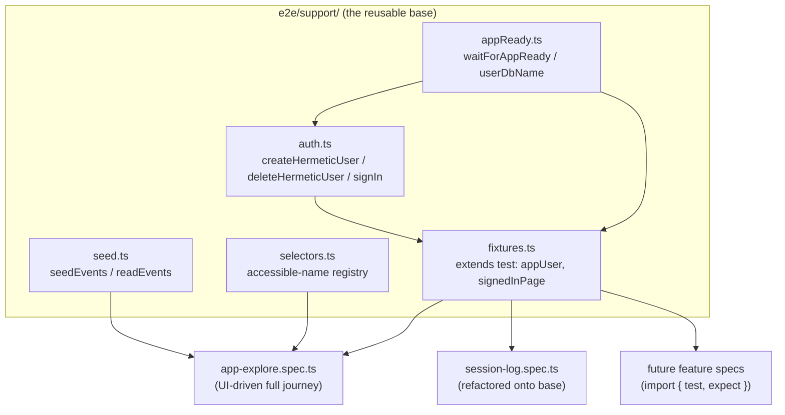

<!--
  This is the verbatim operating-manual preamble. It is pasted as the first content
  of every plan written by the write-implementation-plan skill. Do NOT modify it
  per-plan — keeping it identical across plans means implementing agents learn
  the protocol once and recognize it everywhere.
-->

# How to use this plan

> **You are the implementing agent.** This document is your runbook for one cohesive change to this codebase. It was written collaboratively by Claude and a human after a planning discussion, and it is the source of truth for this work. Read this preamble in full before doing anything else.

## What you're holding

A phase-by-phase implementation plan. Each phase is a **vertical slice** — an end-to-end working increment that leaves the codebase in a working state. Phases are designed so any one of them can be implemented by a fresh agent in a new context window, with only this document and the codebase as input.

## Your job

1. **Read the document header in full first.** TL;DR, Context, Decisions log, Architecture overview, and Files-touched index. These give you the *why* behind every step. The Decisions log especially — those decisions were made deliberately and explain choices that may otherwise look arbitrary or wrong. Reference IDs (D-NN) appear inside phase steps so you can look up rationale.

2. **Find your starting phase.** Scan the phase list. Pick the first phase whose status is `☐ Not started` AND whose `Depends on:` phases are all `✅ Complete`. Implement that phase only. **Do not skip ahead. Do not implement multiple phases in one go unless the human explicitly asks.**

3. **Run the prereq verification.** Each phase has a "Verification (run BEFORE starting)" block. Run those commands. **If any fail, STOP** — the codebase isn't in the state this phase expects. Surface to the human: "Phase N's prereqs failed: `<command>` returned `<result>`. Want me to investigate or hand back?"

4. **Follow the steps in order.** Code blocks in steps are the actual code, not pseudocode or sketches. Apply them as written.

5. **If reality doesn't match the step — STOP.** If the plan says "modify line 47 of `auth.py`" and line 47 is something different, do not improvise. Surface the discrepancy: "Plan expected `<X>` at `auth.py:47`, found `<Y>`. Possible causes: plan is stale, file was edited since planning, plan was wrong. How should I proceed?"

6. **Run the tests and post-verification.** Each phase specifies what tests to add or update and the bash command to run. All must pass before the phase is considered done.

7. **Update status and commit.** When the phase is complete:
   - Edit this document: change the phase's `Status:` line to `✅ Complete — <commit-sha-here>`.
   - `git add` the code changes AND this plan file.
   - Commit them together. Suggested message: `Phase N: <phase title>` (with longer body referencing the plan file).
   - The status update and the code change live in the same commit so the doc and the code never drift.

## What you must NOT do

- **Do not skip phases.** Order matters; later phases assume earlier ones completed.
- **Do not modify the Decisions log, the Operating manual preamble, the TL;DR, the Architecture overview, the Files-touched index, the Open questions, the Out-of-scope list, or the References.** Those are immutable above-the-phases content. If you discover a decision is wrong, surface to the human — don't silently revise.
- **Do not re-plan or re-architect.** If the plan seems wrong, that's a signal to stop and surface, not to improvise.
- **Do not implement multiple phases without surfacing for human review** between them, unless the user explicitly asked for batch execution upfront.

## If you get stuck

- Update the phase's `Status:` to `🛑 Blocked: <one-line reason>`.
- Fill in the phase's `Notes (filled in during implementation)` block with what you tried, what's blocking, and what you'd want to know to unblock.
- Hand back to the human.

## Status vocabulary

- `☐ Not started`
- `🟡 In progress`
- `🛑 Blocked: <reason>`
- `✅ Complete — <commit-sha>`

## When status markers and reality drift

The status markers are a fast read, but they are not the source of truth. The phase's `Verification (DONE)` commands are the truth — if you suspect a marker is wrong (someone forgot to update, branches diverged, partial commits, etc.), run the verification commands for the phases marked complete. Trust the commands over the markers, and surface the drift to the human so the markers can be corrected.

---

# Standard E2E "app-explore" base: reusable Playwright fixtures + flagship walkthrough spec

**Slug:** `e2e-explore-base`
**Date written:** 2026-07-04
**Author:** Claude (Cowork planner) + Rohit
**Plan status:** Draft
**Upstream:** none (net-new test infrastructure). Related: `.work/STATUS.md` Gotcha "E2E tests are written but NOT run"; grill-me session 2026-07-04.

> ### ⚠️ Step 0 — before writing any code
>
> This plan and its `VERIFICATION.md` were authored in Cowork, which **cannot commit** (git is read-only there). Your **first action** is to commit these planning docs verbatim so later diffs are meaningful:
>
> ```bash
> git add .work/plans/active/2026-07-04-e2e-explore-base/
> git commit -m "docs(plan): add e2e-explore-base plan + verification"
> ```
>
> After each phase, fill your section of `VERIFICATION.md` (files changed, commit SHA, what you did, deviations + why, self-check vs. criteria) and **expect review**. A phase is not done until the reviewer marks it `✅ Verified`; change requests may follow.

## TL;DR

The `e2e/` suite has **no shared test infrastructure** — every spec re-inlines its own `signIn`, `createTestUser`, `userDbName`, and IndexedDB seeding, so the same bugs recur (e.g. `session-log.spec.ts` clicks a button named `'Sign in'` when the real label is `'Continue'`, and swallows all failures in a `try/catch`). This plan builds a small, reusable **E2E base** under `e2e/support/` — Playwright fixtures for authentication + app-readiness, deduplicated seed/read helpers, and a central selector registry — plus **one flagship `app-explore.spec.ts`** that drives the full journey a human would explore (sign-in → onboarding/draft-roadmap → add sample materials → home → start session → log ad-hoc → open roadmaps → book a session → attach material). New feature tests are written *on top of* this base instead of re-deriving it. Auth defaults to a **hermetic throwaway Supabase user** (isolated, repeatable, CI-safe) with a **live-account opt-in**; the base **bans `waitForTimeout`** in favour of canonical waits. As proof-of-adoption we refactor the one broken spec (`session-log.spec.ts`) onto the base.

## Context & background

**The repo.** pnpm monorepo: Astro marketing site (`:4321`), Vite/React 19 SPA served at `/study/*` (`:5173`), FastAPI Intelligence Service (`:8000`). E2E lives in `e2e/` and is driven by `e2e/playwright.config.ts` (top-level `webServer` runs `pnpm dev:full` = app + intelligence; projects `marketing`, `app`, `app-mobile`). See `AGENTS.md`.

**The problem, concretely (grounded 2026-07-04):**

- `e2e/` is flat — **zero** shared helpers/fixtures (`grep "from './helpers|fixtures|support|utils'" e2e` → no matches).
- `userDbName()` is **byte-identical** in `roadmap-booking-live.spec.ts:29` and `material-session-decoupling.spec.ts:27`. `signIn` is reimplemented in ≥3 specs. `createTestUser` in ≥2.
- **A live bug from the duplication:** `session-log.spec.ts:60,96` clicks `getByRole('button', { name: 'Sign in' })`, but the real sign-in button is `'Continue'` (`SignIn.tsx:69`; every other spec uses `'Continue'`). The same file wraps its whole body in `try { ... } catch (error) { console.error(...) }` (`session-log.spec.ts:106-108`), so the test **cannot fail** — it logs and passes.
- `page.waitForTimeout(500|1000|2000)` is scattered through `smoke`, `session-log`, `progress-home` — the other recurring flake source.
- Two auth patterns coexist with no shared abstraction: **hermetic** (service-role throwaway user, auto-skips when `SUPABASE_SERVICE_ROLE_KEY` unset — `session-log.spec.ts`, `material-session-decoupling.spec.ts`) and **live login** (real dev account via `E2E_LIVE_EMAIL/PASSWORD`, non-destructive — `roadmap-booking-live.spec.ts`).

**The goal.** A "standard files where new tests can be written from on top" so the exploratory boilerplate is written **once**, correctly, and the recurring issues (stale selectors, timing, auth, seeding) stop resurfacing.

**Constraints:**

- **Run env:** `pnpm dev:full` needs `COREPACK_NPM_REGISTRY=https://registry.npmjs.org` (public npm is DNS/403-blocked — see rule `pnpm-build-registry`) and the intelligence service needs `SUPABASE_JWT_SECRET`. Chromium is installed. `apps/app/.env.local` (loaded by the config via `dotenv`) carries `SUPABASE_URL` + `SUPABASE_SERVICE_ROLE_KEY` for hermetic users.
- **Router:** `BrowserRouter basename="/study"` — write `page.goto('/study/...')` for absolute nav; never double the prefix (rule `react-router-v7-basename`).
- **Selectors:** the app runs on Vite (not Astro) at `:5173`, so the Astro-dev-toolbar trap (rule `astro-selectors`) does not apply to the app project — but prefer role/label selectors anyway.

**Support docs:**

- `.work/STATUS.md` — read-first status index (this becomes a new `[APP][INFRA]` Active row).
- `AGENTS.md` → "E2E test" section (how the agent runs E2E here).
- Rules: `playwright-config`, `playwright-full-app-lifecycle`, `astro-selectors`, `react-router-v7-basename`, `pnpm-build-registry`, `eventstore-per-user-db`, `dexie-test-setup`.
- Existing specs to mirror/replace: `e2e/roadmap-booking-live.spec.ts` (live-login + seed patterns), `e2e/material-session-decoupling.spec.ts` (hermetic + seed/read patterns), `e2e/session-log.spec.ts` (the broken one we refactor).

## Decisions log

### D-01: Ship a reusable base (fixtures + helpers + one flagship spec + a rule), not more one-off specs

**Status:** ✅ Agreed

**Context:** Rohit wants "standard files where new tests can be written from on top" so exploratory boilerplate isn't rewritten and the same issues stop recurring.

**Decision:** Build `e2e/support/` (fixtures, auth, appReady, seed, selectors) + a single flagship `e2e/app-explore.spec.ts` that consumes the base + an `e2e/README.md` + a canonical `e2e-explore-base` rule. Future tests import from `e2e/support/`.

**Rationale:** The recurring pain is duplicated setup and drift. Centralising it once, with a walkthrough spec that doubles as the living template, kills both.

**Alternatives considered:**

- One giant "smoke everything" spec, no shared module → rejected: doesn't stop the *next* spec from re-inlining setup.
- A published npm package of helpers → rejected: over-engineered for an in-repo suite.

**User pushback / disagreement:** none.

**Reversibility:** easy (delete `e2e/support/` and the flagship spec).

### D-02: Hermetic throwaway user is the default auth mode; live-account is opt-in

**Status:** ✅ Agreed

**Context:** The explore flows mutate state (create sessions, roadmaps, materials); we must not pollute a real account or depend on its contents.

**Decision:** Default: create a fresh Supabase user via service-role per run, tear it down after (`auth.admin.deleteUser`). Auto-skip when `SUPABASE_URL`/`SUPABASE_SERVICE_ROLE_KEY` are unset. Opt-in **live** mode (`E2E_EXPLORE_MODE=live` + `E2E_LIVE_EMAIL`/`E2E_LIVE_PASSWORD`) for smoke-checking a prod-like account, kept **non-destructive** (mirrors `roadmap-booking-live.spec.ts`).

**Rationale:** Isolation is the fix for order-dependence and stale-data flakiness. Live mode stays available for the cases that specifically want the real account.

**Alternatives considered:**

- Live default → rejected: stateful, destructive risk, not repeatable/CI-safe.
- Both equal/first-class → rejected: doubles surface for little gain; hermetic is the right default.

**User pushback / disagreement:** none.

**Reversibility:** easy (flip the default in `fixtures.ts`).

### D-03: Flagship spec drives the real UI; `seedEvents` helper exists as a fast-forward shortcut

**Status:** ✅ Agreed

**Context:** A fresh hermetic user is empty; reaching "book a session" needs a roadmap first. Driving the full onboarding wizard is the real exploration but is slow/fragile; seeding is fast but skips the UI.

**Decision:** The flagship `app-explore.spec.ts` **drives the UI** for the named journey (onboarding/draft-roadmap, add materials, log, start session, book). The base **also** ships `seedEvents()` so feature-specific specs can fast-forward to a precondition without re-walking onboarding.

**Rationale:** Rohit's list ("start sessions, log adhoc, book session, draft new roadmap, add sample materials") reads as a walkthrough, which is what surfaces breakage. But forcing *every* future test through the wizard would recreate the slowness we're escaping, so the seed shortcut must coexist.

**Alternatives considered:**

- Pure UI-driven (no seed) → rejected: makes every downstream test slow.
- Pure seed-based → rejected: doesn't actually explore the routes.

**User pushback / disagreement:** none.

**Reversibility:** easy.

### D-04: Accessible role/label selectors + existing `data-testid`s; no new app-source testids in this plan

**Status:** ✅ Agreed

**Context:** Some UI already exposes stable `data-testid`s (`roadmaps-active-hero`, `roadmaps-draft-card`, `roadmap-calendar`, `roadmap-month-label`); others (onboarding `MaterialRow` inputs) have only placeholders.

**Decision:** Selectors use `getByRole`/`getByLabel`/accessible names, and the existing `data-testid`s where present. **Do not** add `data-testid`/`aria-label` to app source in this plan (that is app code — out of the base's scope). Genuinely fragile spots (esp. `MaterialRow`) are filed as OQ-02, not silently changed.

**Rationale:** Keeps the base decoupled from app-source churn and within the test-infra boundary; centralising selectors in `selectors.ts` means a label change is a one-line fix.

**Alternatives considered:**

- Add testids everywhere now → rejected: scope creep into app source; do it deliberately later if fragility bites.

**User pushback / disagreement:** none.

**Reversibility:** easy.

### D-05: Ban `waitForTimeout`; use canonical waits only

**Status:** ✅ Agreed

**Context:** Fixed sleeps are the suite's main flake source and encode the 8s cold-start restore badly.

**Decision:** The base exposes `waitForAppReady(page)` (waits: URL left `/sign-in`; SyncProvider `BootScreen` gone; per-user Dexie DB exists). Specs use `page.waitForURL`, `expect(...).toBeVisible/toHaveText` (auto-retrying), and the helpers — **never** `page.waitForTimeout`. The `e2e/README.md` states this as a rule; the refactor phase removes existing sleeps from `session-log.spec.ts`.

**Rationale:** Deterministic waits fix timing flakiness at the root.

**Alternatives considered:** keep sleeps "for safety" → rejected: that's the bug.

**User pushback / disagreement:** none.

**Reversibility:** easy.

### D-06: Base targets the `app` project and requires `dev:full`

**Status:** ✅ Agreed

**Context:** The explore journey touches calibration/progress (Intelligence Service on `:8000`); the config's `webServer` already runs `pnpm dev:full`.

**Decision:** The flagship spec guards to `testInfo.project.name === 'app'` (like `roadmap-booking-live.spec.ts:90-92`) and assumes `dev:full` is up. Docs give the exact run command with `COREPACK_NPM_REGISTRY`.

**Rationale:** Matches the config and rule `playwright-full-app-lifecycle`; avoids the app-only footgun (missing service → hung calibration calls).

**Alternatives considered:** app-only (`dev:app`) → rejected: skips the Python service the app calls.

**User pushback / disagreement:** none.

**Reversibility:** easy.

### D-07: Prove adoption by refactoring `session-log.spec.ts`; migrating the other specs is deferred

**Status:** ✅ Agreed (refactor session-log) / 🤔 Assumed (defer the rest)

**Context:** A base with no consumer rots. `session-log.spec.ts` is both broken (`'Sign in'` label; failure-swallowing `try/catch`) and small — ideal proof.

**Decision:** Phase 4 refactors `session-log.spec.ts` onto the base (fixes the label, removes the `try/catch` swallow and all `waitForTimeout`). Migrating `roadmap-booking-live`, `material-session-decoupling`, `onboarding`, `roadmap`, `progress-home`, `smoke`, `sync`, `session-*` is **deferred** to a follow-up plan (OQ-04).

**Rationale:** One real consumer validates the base without a big-bang migration risk.

**Alternatives considered:** migrate all specs now → rejected: too large for one plan; violates the 7-phase cap and the vertical-slice guarantee.

**User pushback / disagreement:** none.

**Reversibility:** easy (the refactor is one file; the deferral is just scope).

### D-08: Base file layout under `e2e/support/`

**Status:** 🤔 Assumed (unconfirmed)

**Context:** Needs a home that won't be collected as a test.

**Decision:** `e2e/support/{fixtures,auth,appReady,seed,selectors}.ts`. Support files don't match `*.spec.ts`, so Playwright won't run them as tests. Specs import `{ test, expect }` from `../support/fixtures`.

**Rationale:** `support/` is a conventional Playwright name and self-documenting; keeps the base out of the spec glob.

**Alternatives considered:** `e2e/fixtures/` (also fine) → chose `support/` as the umbrella for fixtures + helpers + selectors.

**User pushback / disagreement:** none — Rohit delegated remaining structural calls.

**Reversibility:** easy (rename dir + imports).

## Architecture overview

A thin fixtures layer sits between Playwright and the specs. Specs import an **extended `test`** that provides two fixtures — `appUser` (hermetic-by-default identity, torn down after) and `signedInPage` (a `page` already authenticated and hydrated) — plus standalone helpers for seeding/reading the per-user event store and a central selector registry.



**Auth flow the fixtures encode** (grounded): sign-in fills `getByLabel('Email')`/`getByLabel('Password')`, clicks `getByRole('button',{name:'Continue',exact:true})` (`SignIn.tsx:47,56,69`), then `waitForAppReady` blocks until the SPA lands past `/sign-in`, the `SyncProvider` `BootScreen` (`.boot-screen`, `role="status"`, `SyncProvider.tsx`) is gone, and the per-user Dexie DB `StudyTracker_<userId>` exists (`EventStoreProvider.tsx:12`). A brand-new hermetic user has no `OnboardingCompleted` event, so `RequireOnboarding` (`RequireOnboarding.tsx`) redirects sign-in → `/study/onboarding/1` — `waitForAppReady`'s URL regex accepts both `home` and `onboarding`.

## Files touched (index)

All paths relative to repo root. Everything here is authored by the **implementing agent** (Cowork only wrote this plan under `.work/`).

| Path | Change | Phase | Purpose |
|------|--------|-------|---------|
| `e2e/support/appReady.ts` | new | 1 | `userDbName`, `waitForAppReady` — canonical readiness waits (D-05) |
| `e2e/support/auth.ts` | new | 1 | hermetic user create/delete, `signIn`, env guards (D-02) |
| `e2e/support/fixtures.ts` | new | 1 | extend `test` with `appUser` + `signedInPage` (D-01, D-02) |
| `e2e/support/seed.ts` | new | 2 | `seedEvents` / `readEvents` — dedup the copy-pasted IndexedDB logic (D-03) |
| `e2e/support/selectors.ts` | new | 2 | central accessible-name registry (D-04) |
| `e2e/app-explore.spec.ts` | new | 3 | flagship UI-driven full-journey walkthrough (D-03, D-06) |
| `e2e/session-log.spec.ts` | modify | 4 | refactor onto the base; fix `'Sign in'`→`'Continue'`, drop `try/catch` swallow + sleeps (D-07) |
| `e2e/README.md` | new | 5 | how to write a test on the base; run commands; anti-patterns (D-05) |
| `.agents/rules/e2e-explore-base.agents.md` | new | 5 | canonical rule for the base |
> **Cowork-side (already done, not your task):** `.work/plans/active/2026-07-04-e2e-explore-base/PLAN.md` + `VERIFICATION.md`, and the `.work/STATUS.md` row. Commit them in Step 0.

## Phases

### Phase 1: Auth + app-ready fixtures — a `signedInPage` that reliably lands hydrated

**Status:** ☐ Not started
**Depends on:** none — can start immediately
**Estimated scope:** ~3 files, ~160 lines

#### Codebase state assumed at start

- `SignIn.tsx` renders `getByLabel('Email')`, `getByLabel('Password')`, and a submit button named `'Continue'` (`apps/app/src/pages/SignIn.tsx:47,56,69`).
- `EventStoreProvider` creates a Dexie DB named `StudyTracker_<userId>` (`apps/app/src/events/EventStoreProvider.tsx:12`).
- `SyncProvider` renders a blocking `BootScreen` with class `boot-screen` and `role="status"` while initial cloud restore is pending (`apps/app/src/sync/SyncProvider.tsx`).
- `@supabase/supabase-js` is a root dep (`package.json`); the config loads `apps/app/.env.local` via `dotenv` (`e2e/playwright.config.ts:1-2`), so `process.env.SUPABASE_URL` / `SUPABASE_SERVICE_ROLE_KEY` are available inside specs.

#### Verification (run BEFORE starting to confirm prereqs are met)

```bash
grep -n "name=\"email\"\|htmlFor=\"email\"\|Continue" apps/app/src/pages/SignIn.tsx   # email label + 'Continue' button
grep -n "StudyTracker_" apps/app/src/events/EventStoreProvider.tsx                      # DB name pattern
grep -n "boot-screen\|role=\"status\"" apps/app/src/sync/SyncProvider.tsx               # BootScreen marker (confirm class name)
test -d e2e && echo e2e-ok
```

If the `boot-screen` class differs from what's used below, STOP and reconcile the selector before continuing (it is load-bearing for `waitForAppReady`).

#### Steps

1. **Create `e2e/support/appReady.ts`:**

   ```ts
   import { expect, type Page } from '@playwright/test';

   /**
    * Poll for the per-user Dexie DB (`StudyTracker_<userId>`) that EventStoreProvider
    * creates in an effect after auth resolves. Never a fixed sleep.
    * See rule: eventstore-per-user-db.
    */
   export async function userDbName(page: Page): Promise<string> {
     return page.evaluate(async () => {
       for (let attempt = 0; attempt < 80; attempt += 1) {
         const dbs = await indexedDB.databases();
         const userDb = dbs.find((db) => db.name?.startsWith('StudyTracker_'));
         if (userDb?.name) return userDb.name;
         await new Promise((resolve) => setTimeout(resolve, 250));
       }
       throw new Error('per-user StudyTracker_<id> DB was not created within ~20s');
     });
   }

   /**
    * Resolve once the SPA is authenticated AND hydrated:
    *  1. the router has left /sign-in (landed on an app or onboarding route),
    *  2. the SyncProvider BootScreen ('.boot-screen') is gone — it blocks children
    *     until initialRestorePending clears or the 8s safety timeout fires
    *     (VITE_INITIAL_RESTORE_TIMEOUT_MS, default 8000; SyncProvider.tsx), and
    *  3. the per-user Dexie DB exists.
    * Budget (20s) covers the cold-start restore. Implements D-05.
    */
   export async function waitForAppReady(page: Page): Promise<string> {
     await page.waitForURL(
       /\/study\/(home|onboarding|roadmap|roadmaps|week|session|settings|log)/,
       { timeout: 20_000 },
     );
     await expect(page.locator('.boot-screen')).toHaveCount(0, { timeout: 20_000 });
     return userDbName(page);
   }
   ```

2. **Create `e2e/support/auth.ts`:**

   ```ts
   import { type Page } from '@playwright/test';
   import { createClient, type SupabaseClient } from '@supabase/supabase-js';
   import { waitForAppReady } from './appReady';

   export interface AppUser {
     email: string;
     password: string;
   }

   const SUPABASE_URL = process.env.SUPABASE_URL;
   const SERVICE_ROLE_KEY = process.env.SUPABASE_SERVICE_ROLE_KEY;

   /** Hermetic mode is only possible when service-role creds are present. */
   export function hasServiceRole(): boolean {
     return Boolean(SUPABASE_URL && SERVICE_ROLE_KEY);
   }

   function adminClient(): SupabaseClient {
     return createClient(SUPABASE_URL!, SERVICE_ROLE_KEY!, {
       auth: { autoRefreshToken: false, persistSession: false },
     });
   }

   export function hermeticEmail(prefix = 'explore'): string {
     const rand = Math.random().toString(36).slice(2, 8);
     return `${prefix}+${Date.now()}-${rand}@test.studytracker.app`;
   }

   /** Create a confirmed throwaway user; returns its id for later teardown. */
   export async function createHermeticUser(email: string, password: string): Promise<string> {
     const { data, error } = await adminClient().auth.admin.createUser({
       email,
       password,
       email_confirm: true,
     });
     if (error && !error.message.includes('already been registered')) throw error;
     return data?.user?.id ?? '';
   }

   /** Best-effort cleanup of a throwaway user. */
   export async function deleteHermeticUser(userId: string): Promise<void> {
     if (!userId) return;
     await adminClient().auth.admin.deleteUser(userId).catch(() => {
       /* best-effort — never fail a test on teardown */
     });
   }

   /**
    * Fill the sign-in form and block until the app is authenticated + hydrated.
    * Uses the REAL button label 'Continue' (SignIn.tsx:69) — not 'Sign in'.
    */
   export async function signIn(page: Page, user: AppUser): Promise<void> {
     await page.goto('/study/sign-in');
     await page.getByLabel('Email').fill(user.email);
     await page.getByLabel('Password').fill(user.password);
     await page.getByRole('button', { name: 'Continue', exact: true }).click();
     await waitForAppReady(page);
   }
   ```

3. **Create `e2e/support/fixtures.ts`:**

   ```ts
   import { test as base, type Page } from '@playwright/test';
   import {
     type AppUser,
     createHermeticUser,
     deleteHermeticUser,
     hasServiceRole,
     hermeticEmail,
     signIn,
   } from './auth';

   interface ExploreFixtures {
     /** Identity under test. Hermetic by default; live via E2E_EXPLORE_MODE=live. */
     appUser: AppUser;
     /** A page already signed in AND hydrated (waitForAppReady has resolved). */
     signedInPage: Page;
   }

   const LIVE_MODE = process.env.E2E_EXPLORE_MODE === 'live';

   export const test = base.extend<ExploreFixtures>({
     appUser: async ({}, use) => {
       if (LIVE_MODE) {
         const email = process.env.E2E_LIVE_EMAIL;
         const password = process.env.E2E_LIVE_PASSWORD;
         test.skip(!email || !password, 'live mode needs E2E_LIVE_EMAIL + E2E_LIVE_PASSWORD');
         await use({ email: email!, password: password! });
         return;
       }
       test.skip(!hasServiceRole(), 'hermetic mode needs SUPABASE_URL + SUPABASE_SERVICE_ROLE_KEY');
       const email = hermeticEmail();
       const password = 'ExploreTest123!';
       const userId = await createHermeticUser(email, password);
       await use({ email, password });
       await deleteHermeticUser(userId); // teardown after the test that used it
     },

     signedInPage: async ({ page, appUser }, use) => {
       await signIn(page, appUser);
       await use(page);
     },
   });

   export { expect } from '@playwright/test';
   ```

#### Tests

- Add `e2e/support/__smoke__/base.spec.ts` (temporary; delete or fold at Phase 3) — a minimal consumer proving the fixture works:

  ```ts
  import { test, expect } from '../fixtures';

  test.describe('base: signedInPage lands hydrated', () => {
    test.beforeEach(({}, testInfo) => test.skip(testInfo.project.name !== 'app', 'app project only'));

    test('a signed-in user reaches an app or onboarding route', async ({ signedInPage }) => {
      await expect(signedInPage).toHaveURL(/\/study\/(home|onboarding)/);
    });
  });
  ```

- Run: `env COREPACK_NPM_REGISTRY=https://registry.npmjs.org pnpm exec playwright test -c e2e/playwright.config.ts e2e/support/__smoke__/base.spec.ts --project=app --reporter=list`

#### Verification (DONE — run after implementation)

```bash
env COREPACK_NPM_REGISTRY=https://registry.npmjs.org \
  pnpm exec playwright test -c e2e/playwright.config.ts e2e/support/__smoke__/base.spec.ts --project=app --reporter=list
# expect: 1 passed (hermetic), OR 1 skipped if SUPABASE_SERVICE_ROLE_KEY is unset — document which in VERIFICATION.md
pnpm exec tsc --noEmit -p e2e   # if e2e has no tsconfig, run the repo typecheck that covers e2e; expect 0 errors
```

#### Rollback

Delete `e2e/support/appReady.ts`, `e2e/support/auth.ts`, `e2e/support/fixtures.ts`, and `e2e/support/__smoke__/`. No app code touched; no data side-effects beyond throwaway users, which are torn down.

#### Notes (filled in during implementation)

*(empty)*

---

### Phase 2: Seed/read helpers + central selector registry

**Status:** ☐ Not started
**Depends on:** Phase 1
**Estimated scope:** ~2 files, ~150 lines

#### Codebase state assumed at start

- Phase 1's `e2e/support/appReady.ts` exists and exports `userDbName`.
- The per-user Dexie `events` object store holds `{ id?, kind, payload, createdAt }` rows (rule `eventstore-architecture`).
- Event kinds/payloads the explore flow relies on (grounded in `apps/app/src/sync/types.ts` + `Step3Preview.tsx:278-310`): `OnboardingCompleted{}`, `MaterialAdded{materialId,title,estimatedDuration,url?,kind,role}`, `RoadmapCreated{startDate,deadline,weeks,selectedStudyDays,weekdayHours,weekendHours,weeklyHours,materialIds?}`, `SessionBooked{roadmapCreatedAt,bookingId,date,estimatedDuration,materialId?}`, `SessionLogged{source,sessionId,duration,date,...}`.

#### Verification (run BEFORE starting)

```bash
grep -n "MaterialAddedPayload\|RoadmapCreatedPayload\|SessionBookedPayload" apps/app/src/sync/types.ts   # confirm payload field names
test -f e2e/support/appReady.ts && echo phase1-ok
```

#### Steps

1. **Create `e2e/support/seed.ts`** (dedups `userDbName`+IndexedDB write/read currently copy-pasted in `material-session-decoupling.spec.ts:40-80` and `roadmap-booking-live.spec.ts:41-87`):

   ```ts
   import { type Page } from '@playwright/test';
   import { userDbName } from './appReady';

   export interface StoredEvent {
     kind: string;
     payload: Record<string, unknown>;
     createdAt: string;
   }

   /** Append events straight into the per-user Dexie `events` store (fast-forward a precondition). Implements D-03. */
   export async function seedEvents(page: Page, events: StoredEvent[]): Promise<void> {
     const dbName = await userDbName(page);
     await page.evaluate(async ({ dbName, events }) => {
       await new Promise<void>((resolve, reject) => {
         const request = indexedDB.open(dbName);
         request.onsuccess = () => {
           const db = request.result;
           const tx = db.transaction('events', 'readwrite');
           const store = tx.objectStore('events');
           for (const event of events) store.add(event);
           tx.oncomplete = () => { db.close(); resolve(); };
           tx.onerror = () => reject(tx.error);
         };
         request.onerror = () => reject(request.error);
       });
     }, { dbName, events });
   }

   /** Read back all events (assert on what the app persisted). */
   export async function readEvents(page: Page): Promise<StoredEvent[]> {
     const dbName = await userDbName(page);
     return page.evaluate(async (dbName) => {
       return new Promise<StoredEvent[]>((resolve, reject) => {
         const request = indexedDB.open(dbName);
         request.onsuccess = () => {
           const db = request.result;
           const tx = db.transaction('events', 'readonly');
           const getAll = tx.objectStore('events').getAll();
           getAll.onsuccess = () => {
             db.close();
             resolve(getAll.result.map((row: any) => ({
               kind: row.kind, payload: row.payload, createdAt: row.createdAt,
             })));
           };
           getAll.onerror = () => reject(getAll.error);
         };
         request.onerror = () => reject(request.error);
       });
     }, dbName);
   }

   /** Convenience: a minimal active roadmap (no-slot model) reachable "today". */
   export function sampleRoadmapEvents(): StoredEvent[] {
     const now = new Date().toISOString();
     const today = now.slice(0, 10);
     const deadline = new Date(Date.now() + 21 * 24 * 60 * 60 * 1000).toISOString().slice(0, 10);
     return [
       { kind: 'OnboardingCompleted', payload: {}, createdAt: now },
       { kind: 'MaterialAdded', payload: { materialId: 'seed-mat-1', title: 'Seed Material', estimatedDuration: 120, kind: 'manual', role: 'anchor' }, createdAt: now },
       { kind: 'RoadmapCreated', payload: { startDate: today, deadline, weeks: 4, selectedStudyDays: ['Mon','Tue','Wed','Thu','Fri'], weekdayHours: 2, weekendHours: 0, weeklyHours: 10, materialIds: ['seed-mat-1'] }, createdAt: now },
       { kind: 'SessionBooked', payload: { roadmapCreatedAt: now, bookingId: 'seed-booking-1', date: today, estimatedDuration: 60, materialId: 'seed-mat-1' }, createdAt: now },
     ];
   }
   ```

2. **Create `e2e/support/selectors.ts`** (central accessible-name registry — grounded strings; change once here if a label moves. Implements D-04):

   ```ts
   /**
    * Central registry of accessible names / routes used across specs.
    * If the app renames a label, fix it HERE, not in every spec.
    * All strings verified against source on 2026-07-04 (see plan Files-touched index).
    */
   export const routes = {
     signIn: '/study/sign-in',
     home: '/study/home',
     log: '/study/log',
     session: '/study/session',
     roadmap: '/study/roadmap',
     roadmaps: '/study/roadmaps',
     onboardingNew: '/study/onboarding?new=1',
   } as const;

   export const signInPage = {
     email: 'Email',
     password: 'Password',
     submit: 'Continue',
   } as const;

   export const onboarding = {
     step1TargetDate: 'Target date',
     continue: 'Continue',            // Step1/Step2 advance button
     step2WeekdayHours: 'Weekday hours',
     step2WeekendHours: 'Weekend hours',
     hourChip: (h: number) => `${h}h`, // e.g. '6h' — auto-splits weekday/weekend (Step2Hours.tsx:26-32)
     dayChip: (d: string) => d,        // 'Mon'..'Sun'
     addManually: 'Add manually',
     materialTitlePlaceholder: 'Material title',  // MaterialRow inputs are placeholder-only — see OQ-02
     materialMinPlaceholder: 'Min',
     buildMyPlan: 'Build my plan',
     looksGood: 'Looks good',          // Step3Preview commit
     goToHome: 'Go to home',           // Step4Confirm
   } as const;

   export const home = {
     startSession: 'Start session',
     continueSession: 'Continue session',
     startAdHoc: 'Start ad-hoc session',
     logASession: 'Log a session',
     signOut: 'Sign out',
     recentActivityHeading: 'Recent activity',
   } as const;

   export const logPage = {
     duration: 'Duration (minutes)',
     date: 'Date',
     description: 'What did you study?',
     submit: 'Log session',
   } as const;

   export const roadmap = {
     addSessionInline: '+ add session',
     projectedFinishRegion: 'Projected finish',
     addSessionDialog: 'Add session',
     editBookingDialog: 'Edit booking',
     chooseMaterialDialog: 'Choose material',
     attach: 'Attach',
     changeMaterial: 'Change material',
     useThisMaterial: 'Use this material',
     noMaterialRow: 'No material · pick at start',
     done: 'Done',
     cancel: 'Cancel',
     abandonRoadmap: 'Abandon roadmap',
   } as const;

   export const roadmaps = {
     activeHero: 'roadmaps-active-hero',   // data-testid
     draftCard: 'roadmaps-draft-card',     // data-testid
     planNext: 'Plan your next roadmap',
     openPlan: 'Open plan',
   } as const;
   ```

#### Tests

- No new spec required; these modules are exercised by Phase 3. Optionally extend the Phase-1 smoke spec to seed `sampleRoadmapEvents()` then assert `/study/roadmaps` shows the active hero:

  ```ts
  import { test, expect } from '../fixtures';
  import { seedEvents, sampleRoadmapEvents } from '../seed';
  import { roadmaps } from '../selectors';

  test('seeded roadmap surfaces on /roadmaps', async ({ signedInPage }) => {
    await seedEvents(signedInPage, sampleRoadmapEvents());
    await signedInPage.goto('/study/roadmaps');
    await expect(signedInPage.getByTestId(roadmaps.activeHero)).toBeVisible();
  });
  ```

- Run: `env COREPACK_NPM_REGISTRY=https://registry.npmjs.org pnpm exec playwright test -c e2e/playwright.config.ts e2e/support/__smoke__/base.spec.ts --project=app --reporter=list`

#### Verification (DONE)

```bash
env COREPACK_NPM_REGISTRY=https://registry.npmjs.org \
  pnpm exec playwright test -c e2e/playwright.config.ts e2e/support/__smoke__/base.spec.ts --project=app --reporter=list
# expect: seeded-roadmap assertion passes (or documented skip)
```

#### Rollback

Delete `e2e/support/seed.ts` and `e2e/support/selectors.ts`.

#### Notes (filled in during implementation)

*(empty)*

---

### Phase 3: Flagship `app-explore.spec.ts` — the full UI-driven walkthrough

**Status:** ☐ Not started
**Depends on:** Phase 1, Phase 2
**Estimated scope:** ~1 file, ~180 lines

#### Codebase state assumed at start

- Phases 1–2 complete: `fixtures.ts`, `appReady.ts`, `seed.ts`, `selectors.ts` exist and export as specified.
- Onboarding is a wizard at `/study/onboarding/1..4` + `/3/preview` (App.tsx). Step 2 "Continue" is disabled unless `weekdayHours + weekendHours === weeklyHours` and ≥1 study day (`Step2Hours.tsx:19-20`); clicking an hour chip sets a consistent split (`Step2Hours.tsx:26-32`).
- Adding a material: click `Add manually` (`Step3Materials.tsx:258-261`) → an editable row auto-opens; its inputs are placeholder-only (`Material title`, `Min`) and a role `<select>` (`MaterialRow.tsx`). Commit on Step3Preview via `Looks good` (`Step3Preview.tsx:350`), which emits `MaterialAdded`/`RoadmapCreated`/`SessionBooked`/`OnboardingCompleted`.
- Home "start" control depends on state (`Home.tsx:240-291`): `Continue session` (active) | `Start session` (booking today) | `Start ad-hoc session` + `Log a session` (rest day).
- Booking on `/study/roadmap`: `+ add session` opens dialog `Add session`; `Attach` opens dialog `Choose material` with row `No material · pick at start` + `Use this material`; commit `Add session` (grounded in agent report + `roadmap-booking-live.spec.ts`).

#### Verification (run BEFORE starting)

```bash
grep -n "canContinue\|hoursMatch" apps/app/src/onboarding/steps/Step2Hours.tsx      # gating logic
grep -n "Add manually\|Build my plan" apps/app/src/onboarding/steps/Step3Materials.tsx
grep -n "Looks good" apps/app/src/onboarding/steps/Step3Preview.tsx
grep -n "Start session\|Start ad-hoc session\|Log a session" apps/app/src/pages/Home.tsx
grep -rn "Add session\|Choose material\|Use this material" apps/app/src/roadmap/booking/
```

If any label differs from `selectors.ts`, update `selectors.ts` (single source) — do NOT hardcode the new string in the spec.

#### Steps

1. **Create `e2e/app-explore.spec.ts`** — walk the journey Rohit named. Structure it as ordered steps within one serial test so state carries (a fresh hermetic user):

   ```ts
   import { test, expect } from './support/fixtures';
   import { onboarding, home, logPage, roadmap, roadmaps } from './support/selectors';

   test.describe.configure({ mode: 'serial' });

   test.describe('App explore — full journey (sign-in → onboarding → sessions → booking)', () => {
     test.beforeEach(({}, testInfo) => test.skip(testInfo.project.name !== 'app', 'app project only'));

     test('a new user can draft a roadmap, add material, log + start sessions, and book', async ({ signedInPage }) => {
       test.setTimeout(120_000);
       const page = signedInPage;

       // A brand-new hermetic user is bounced to onboarding by RequireOnboarding.
       await expect(page).toHaveURL(/\/study\/onboarding\/1/);

       // --- Draft a new roadmap via the wizard ---
       // Step 1 — deadline (a quick chip is the simplest reliable path).
       await page.getByRole('button', { name: 'In 1 month' }).click();
       await page.getByRole('button', { name: onboarding.continue, exact: true }).click();
       await expect(page).toHaveURL(/\/study\/onboarding\/2/);

       // Step 2 — hours: click an hour chip (auto-splits weekday/weekend so the
       // gate weekdayHours+weekendHours===weeklyHours holds), pick study days.
       await page.getByRole('button', { name: onboarding.hourChip(6), exact: true }).click();
       for (const day of ['Mon', 'Tue', 'Wed', 'Thu', 'Fri']) {
         await page.getByRole('button', { name: onboarding.dayChip(day), exact: true }).click();
       }
       await page.getByRole('button', { name: onboarding.continue, exact: true }).click();
       await expect(page).toHaveURL(/\/study\/onboarding\/3/);

       // Step 3 — add a sample material manually.
       await page.getByRole('button', { name: onboarding.addManually }).click();
       await page.getByPlaceholder(onboarding.materialTitlePlaceholder).first().fill('Explore Linear Algebra');
       await page.getByPlaceholder(onboarding.materialMinPlaceholder).first().fill('120');
       await page.getByRole('button', { name: onboarding.buildMyPlan }).click();
       await expect(page).toHaveURL(/\/study\/onboarding\/3\/preview/);

       // Preview — commit the plan (emits MaterialAdded/RoadmapCreated/SessionBooked/OnboardingCompleted).
       await page.getByRole('button', { name: onboarding.looksGood }).click();
       // First-time onboarding routes to /onboarding/4, then Home.
       await page.getByRole('button', { name: onboarding.goToHome }).click();
       await expect(page).toHaveURL(/\/study\/home/);

       // --- Home: start a session (branch on what Home offers) ---
       const startBooked = page.getByRole('button', { name: home.startSession });
       const startAdHoc = page.getByRole('button', { name: home.startAdHoc });
       if (await startBooked.isVisible().catch(() => false)) {
         await startBooked.click();
       } else {
         await expect(startAdHoc).toBeVisible();
         await startAdHoc.click();
       }
       await expect(page).toHaveURL(/\/study\/session/);
       // PreSessionSetup → start the timer, then return home without requiring a full log.
       // (Keep this tolerant: the exact PreSessionSetup control is 'Start session'.)
       const startTimer = page.getByRole('button', { name: 'Start session' });
       if (await startTimer.isVisible().catch(() => false)) await startTimer.click();
       await page.goto('/study/home');
       await expect(page).toHaveURL(/\/study\/home/);

       // --- Log an ad-hoc session via /log ---
       await page.goto('/study/log');
       await page.getByLabel(logPage.duration).fill('45');
       await page.getByLabel(logPage.description).fill('Explore: logged an ad-hoc session');
       await page.getByRole('button', { name: logPage.submit }).click();
       await expect(page).toHaveURL(/\/study\/home/);
       await expect(page.locator('.card-title').first()).toContainText('Explore: logged an ad-hoc session');

       // --- Roadmaps dashboard + detail ---
       await page.goto('/study/roadmaps');
       await expect(page.getByTestId(roadmaps.activeHero)).toBeVisible();
       await page.goto('/study/roadmap');
       await expect(page.getByLabel(roadmap.projectedFinishRegion)).toBeVisible();

       // --- Book a session (Add session sheet → attach material via picker) ---
       const addSession = page.getByRole('button', { name: roadmap.addSessionInline }).first();
       if (await addSession.isVisible().catch(() => false)) {
         await addSession.click();
         const dialog = page.getByRole('dialog', { name: roadmap.addSessionDialog });
         await expect(dialog).toBeVisible();
         await dialog.getByRole('button', { name: new RegExp(roadmap.attach) }).click();
         const picker = page.getByRole('dialog', { name: roadmap.chooseMaterialDialog });
         await expect(picker).toBeVisible();
         await expect(picker.getByText(roadmap.noMaterialRow)).toBeVisible();
         await picker.getByRole('button', { name: roadmap.useThisMaterial }).click();
         await dialog.getByRole('button', { name: roadmap.addSessionDialog }).click(); // primary "Add session"
       }
     });
   });
   ```

2. **Fold or delete the Phase-1 `__smoke__` spec** — its coverage is subsumed here. Keep it only if you want a fast readiness-only check; otherwise remove `e2e/support/__smoke__/`.

#### Tests

- This *is* the test. Run: `env COREPACK_NPM_REGISTRY=https://registry.npmjs.org pnpm exec playwright test -c e2e/playwright.config.ts e2e/app-explore.spec.ts --project=app --reporter=list`
- Debug aid on failure: `--headed --trace on`, then inspect the trace (`pnpm exec playwright show-trace <trace.zip>`).

#### Verification (DONE)

```bash
env COREPACK_NPM_REGISTRY=https://registry.npmjs.org \
  pnpm exec playwright test -c e2e/playwright.config.ts e2e/app-explore.spec.ts --project=app --reporter=list
# expect: 1 passed. If SUPABASE_SERVICE_ROLE_KEY unset, expect 1 skipped — record which in VERIFICATION.md.
grep -c "waitForTimeout" e2e/app-explore.spec.ts   # expect 0 (D-05)
```

#### Rollback

Delete `e2e/app-explore.spec.ts`. No app code touched; the hermetic user is torn down by the fixture.

#### Notes (filled in during implementation)

*(empty — record any selector that didn't match reality here, and reconcile in `selectors.ts`.)*

---

### Phase 4: Refactor `session-log.spec.ts` onto the base (adoption proof + bug fix)

**Status:** ☐ Not started
**Depends on:** Phase 1, Phase 2
**Estimated scope:** ~1 file, net negative lines

#### Codebase state assumed at start

- `e2e/session-log.spec.ts` currently: inlines `createTestUser`/`generateTestEmail`, clicks the WRONG button `getByRole('button',{name:'Sign in'})` (`:60,96`), uses `page.waitForTimeout(...)` throughout, and wraps the body in `try/catch { console.error }` (`:106-108`) so failures are swallowed.
- Base modules from Phases 1–2 exist.

#### Verification (run BEFORE starting)

```bash
grep -n "'Sign in'\|waitForTimeout\|catch (error)" e2e/session-log.spec.ts   # confirm the bugs still present
test -f e2e/support/fixtures.ts && test -f e2e/support/seed.ts && echo base-ok
```

#### Steps

1. **Rewrite `e2e/session-log.spec.ts`** to use the base. Preserve the intent (cross-account isolation: user A logs a session; user B sees zero) but with two hermetic users, correct selectors, canonical waits, and NO failure-swallowing:

   ```ts
   import { test, expect } from './support/fixtures';
   import { signIn, createHermeticUser, deleteHermeticUser, hermeticEmail, hasServiceRole } from './support/auth';
   import { logPage, home } from './support/selectors';

   test.describe('Session-log lifecycle — per-user isolation', () => {
     test.beforeEach(({}, testInfo) => {
       test.skip(testInfo.project.name !== 'app', 'app project only');
       test.skip(!hasServiceRole(), 'needs SUPABASE_URL + SUPABASE_SERVICE_ROLE_KEY');
     });

     test('a logged session for user A is not visible to user B', async ({ page }) => {
       test.setTimeout(120_000);
       const password = 'ExploreTest123!';
       const emailA = hermeticEmail('usera');
       const emailB = hermeticEmail('userb');
       const idA = await createHermeticUser(emailA, password);
       const idB = await createHermeticUser(emailB, password);
       try {
         // User A logs a session.
         await signIn(page, { email: emailA, password });
         await page.goto('/study/log');
         await page.getByLabel(logPage.duration).fill('45');
         await page.getByLabel(logPage.description).fill('Chapter 3: Integration');
         await page.getByRole('button', { name: logPage.submit }).click();
         await expect(page).toHaveURL(/\/study\/home/);
         await expect(page.locator('.card-title').first()).toContainText('Chapter 3: Integration');

         // Sign out, sign in as user B — must see none of A's data.
         await page.getByRole('button', { name: home.signOut }).click();
         await signIn(page, { email: emailB, password });
         await page.goto('/study/home');
         await expect(page.locator('body')).not.toContainText('Chapter 3: Integration');
       } finally {
         await deleteHermeticUser(idA);
         await deleteHermeticUser(idB);
       }
     });
   });
   ```

   Note the `try/finally` here is **teardown only** (delete throwaway users) — it does **not** swallow assertion failures (no `catch`), unlike the original.

#### Tests

- Run: `env COREPACK_NPM_REGISTRY=https://registry.npmjs.org pnpm exec playwright test -c e2e/playwright.config.ts e2e/session-log.spec.ts --project=app --reporter=list`

#### Verification (DONE)

```bash
env COREPACK_NPM_REGISTRY=https://registry.npmjs.org \
  pnpm exec playwright test -c e2e/playwright.config.ts e2e/session-log.spec.ts --project=app --reporter=list
grep -c "waitForTimeout\|'Sign in'" e2e/session-log.spec.ts   # expect 0
grep -c "catch (error)" e2e/session-log.spec.ts               # expect 0 (no failure-swallowing)
```

#### Rollback

`git checkout e2e/session-log.spec.ts` to restore the prior version.

#### Notes (filled in during implementation)

*(empty)*

---

### Phase 5: Document the base — `e2e/README.md` + `e2e-explore-base` rule

**Status:** ☐ Not started
**Depends on:** Phase 1, Phase 2, Phase 3, Phase 4
**Estimated scope:** ~4 files, ~120 lines

#### Codebase state assumed at start

- `e2e/support/*` and `e2e/app-explore.spec.ts` exist and pass.
- Rules live in `.agents/rules/<name>.agents.md` (canonical); `AGENTS.md` carries the rules table (rule `agent-friendly-docs`; Mandatory Rule 4).

#### Verification (run BEFORE starting)

```bash
ls .agents/rules/*.agents.md | head -3   # canonical rules
grep -n "playwright-config" AGENTS.md                              # rules table location
```

#### Steps

1. **Create `e2e/README.md`** covering: the `e2e/support/` layout; how to write a new spec (`import { test, expect } from './support/fixtures'`, use `signedInPage`, seed with `seedEvents`, select via `selectors.ts`); the run command (`env COREPACK_NPM_REGISTRY=https://registry.npmjs.org pnpm exec playwright test -c e2e/playwright.config.ts <spec> --project=app`); hermetic-vs-live modes; and the **anti-patterns** the base forbids (`waitForTimeout`, inlined `signIn`/`createTestUser`, hardcoded button labels, failure-swallowing `try/catch`).

2. **Create `.agents/rules/e2e-explore-base.agents.md`** — canonical rule. Content: "When writing any app E2E, build on `e2e/support/` — don't re-inline auth/seed/selectors. Sign-in button is `'Continue'` not `'Sign in'`. Never `waitForTimeout`; use `waitForAppReady`. Hermetic default, live opt-in. Requires `dev:full` + `COREPACK_NPM_REGISTRY`." Cross-link `10-runtime-and-e2e` and `30-eventstore-boundaries`.


3. **Add a row to the rules table in `AGENTS.md`**:

   ```markdown
   | `e2e-explore-base` | Reusable Playwright base (fixtures/helpers/selectors); write new E2E on top of `e2e/support/` |
   ```

#### Tests

- Docs only — no runtime test. Sanity: `test -f .agents/rules/e2e-explore-base.agents.md`.

#### Verification (DONE)

```bash
test -f .agents/rules/e2e-explore-base.agents.md && echo "canonical rule exists"
grep -c "e2e-explore-base" AGENTS.md   # expect >=1
```

#### Rollback

Delete the rule file + `e2e/README.md`; revert the table row.

#### Notes (filled in during implementation)

*(empty)*

---

## Open questions

### OQ-01: Should the flagship run in CI?

**Why deferred:** CI needs `SUPABASE_SERVICE_ROLE_KEY` (a secret) + reachable internal npm registry + a running `dev:full`. Local run is proven first.
**Triggers needing resolution:** wanting explore coverage to gate merges.
**Owner / resolution path:** Rohit + whoever owns CI config; separate infra plan.
**Cross-ref:** relates to D-02, D-06.

### OQ-02: Add `data-testid`/`aria-label` to fragile onboarding inputs?

**Why deferred:** `MaterialRow` title/duration inputs are placeholder-only and the role `<select>` has no label (`MaterialRow.tsx`); placeholder selectors are the weakest link in the flagship. Fixing means touching app source (out of this plan's scope, D-04).
**Triggers needing resolution:** the placeholder selectors break, or onboarding UI is restyled.
**Owner / resolution path:** file an `issues/` ticket; small app-code change reviewed separately.
**Cross-ref:** D-04.

### OQ-03: Live-mode account hygiene

**Why deferred:** Live mode reuses a real account and is kept non-destructive, but the explore journey mutates state; a dedicated persistent-but-throwaway live account would be cleaner.
**Triggers needing resolution:** running the flagship (not just `roadmap-booking-live`) in live mode regularly.
**Owner / resolution path:** Rohit provisions a dedicated account; document in `e2e/README.md`.
**Cross-ref:** D-02, D-03.

### OQ-04: Migrate the remaining specs onto the base

**Why deferred:** Big-bang migration violates the vertical-slice + 7-phase guarantees; `session-log` is the proof (D-07).
**Triggers needing resolution:** the base is validated and stable; the other specs drift again.
**Owner / resolution path:** a follow-up plan `e2e-migrate-specs-to-base` migrating `roadmap-booking-live`, `material-session-decoupling`, `onboarding`, `roadmap`, `progress-home`, `smoke`, `sync`, `session-per-kind`, `session-planned-end`, `calibration-service`.

## Out of scope

- **Adding `data-testid`/`aria-label` to app source** — app code, not test infra (D-04; tracked as OQ-02).
- **A materials-management page** — materials can only be added via onboarding today (grounded); building one is a product change, not this plan.
- **Visual/screenshot regression** — `e2e/__screens__/` exists but visual testing is a separate concern.
- **`app-mobile` / marketing coverage of the flagship** — flagship targets the `app` (desktop) project only (D-06); mobile is a later addition.
- **CI wiring** — OQ-01.
- **Migrating all existing specs** — OQ-04.

## References

- Rules: `.agents/rules/10-runtime-and-e2e.agents.md`, `.agents/rules/10-runtime-and-e2e.agents.md`, `.agents/rules/11-playwright-selectors.agents.md`, `.agents/rules/12-react-router-basename.agents.md`, `.agents/rules/50-pnpm-build-registry.agents.md`, `.agents/rules/30-eventstore-boundaries.agents.md`, `.agents/rules/30-eventstore-boundaries.agents.md`, `.agents/rules/32-dexie-testing.agents.md`.
- Config: `e2e/playwright.config.ts` (top-level `webServer`, projects `marketing`/`app`/`app-mobile`).
- Existing specs (patterns + the bug): `e2e/roadmap-booking-live.spec.ts`, `e2e/material-session-decoupling.spec.ts`, `e2e/session-log.spec.ts`, `e2e/smoke.spec.ts`.
- Source of ground-truth selectors: `apps/app/src/pages/SignIn.tsx`, `apps/app/src/App.tsx`, `apps/app/src/onboarding/steps/*`, `apps/app/src/onboarding/components/MaterialRow.tsx`, `apps/app/src/pages/Home.tsx`, `apps/app/src/pages/Log.tsx`, `apps/app/src/roadmap/RoadmapCalendar.tsx`, `apps/app/src/roadmap/booking/*`, `apps/app/src/pages/Roadmaps.tsx`, `apps/app/src/sync/types.ts`, `apps/app/src/sync/SyncProvider.tsx`, `apps/app/src/events/EventStoreProvider.tsx`.
- Run env: `AGENTS.md` → "E2E test"; live creds path `.work/specs/test-login-cred.txt` (git-ignored) or `E2E_LIVE_EMAIL`/`E2E_LIVE_PASSWORD`.
- Status index: `.work/STATUS.md`.
