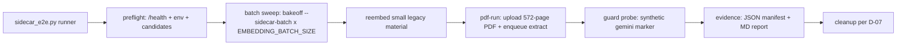

<!--
  This is the verbatim operating-manual preamble. It is pasted as the first content
  of every plan written by the write-implementation-plan skill. Do NOT modify it
  per-plan — keeping it identical across plans means implementing agents learn
  the protocol once and recognize it everywhere.
-->

# How to use this plan

> **You are the implementing agent.** This document is your runbook for one cohesive change to this codebase. It was written collaboratively by Claude and a human after a planning discussion, and it is the source of truth for this work. Read this preamble in full before doing anything else.

## What you're holding

A phase-by-phase implementation plan. Each phase is a **vertical slice** — an end-to-end working increment that leaves the codebase in a working state. Phases are designed so any one of them can be implemented by a fresh agent in a new context window, with only this document and the codebase as input.

## Your job

1. **Read the document header in full first.** TL;DR, Context, Decisions log, Architecture overview, and Files-touched index. These give you the *why* behind every step. The Decisions log especially — those decisions were made deliberately and explain choices that may otherwise look arbitrary or wrong. Reference IDs (D-NN) appear inside phase steps so you can look up rationale.

2. **Find your starting phase.** Scan the phase list. Pick the first phase whose status is `☐ Not started` AND whose `Depends on:` phases are all `✅ Complete`. Implement that phase only. **Do not skip ahead. Do not implement multiple phases in one go unless the human explicitly asks.**

3. **Run the prereq verification.** Each phase has a "Verification (run BEFORE starting)" block. Run those commands. **If any fail, STOP** — the codebase isn't in the state this phase expects. Surface to the human: "Phase N's prereqs failed: `<command>` returned `<result>`. Want me to investigate or hand back?"

4. **Follow the steps in order.** Code blocks in steps are the actual code, not pseudocode or sketches. Apply them as written.

5. **If reality doesn't match the step — STOP.** If the plan says "modify line 47 of `auth.py`" and line 47 is something different, do not improvise. Surface the discrepancy: "Plan expected `<X>` at `auth.py:47`, found `<Y>`. Possible causes: plan is stale, file was edited since planning, plan was wrong. How should I proceed?"

6. **Run the tests and post-verification.** Each phase specifies what tests to add or update and the bash command to run. All must pass before the phase is considered done.

7. **Update status and commit.** When the phase is complete:
   - Edit this document: change the phase's `Status:` line to `✅ Complete — <commit-sha-here>`.
   - `git add` the code changes AND this plan file.
   - Commit them together. Suggested message: `Phase N: <phase title>` (with longer body referencing the plan file).
   - The status update and the code change live in the same commit so the doc and the code never drift.

## What you must NOT do

- **Do not skip phases.** Order matters; later phases assume earlier ones completed.
- **Do not modify the Decisions log, the Operating manual preamble, the TL;DR, the Architecture overview, the Files-touched index, the Open questions, the Out-of-scope list, or the References.** Those are immutable above-the-phases content. If you discover a decision is wrong, surface to the human — don't silently revise.
- **Do not re-plan or re-architect.** If the plan seems wrong, that's a signal to stop and surface, not to improvise.
- **Do not implement multiple phases without surfacing for human review** between them, unless the user explicitly asked for batch execution upfront.

## If you get stuck

- Update the phase's `Status:` to `🛑 Blocked: <one-line reason>`.
- Fill in the phase's `Notes (filled in during implementation)` block with what you tried, what's blocking, and what you'd want to know to unblock.
- Hand back to the human.

## Status vocabulary

- `☐ Not started`
- `🟡 In progress`
- `🛑 Blocked: <reason>`
- `✅ Complete — <commit-sha>`

## When status markers and reality drift

The status markers are a fast read, but they are not the source of truth. The phase's `Verification (DONE)` commands are the truth — if you suspect a marker is wrong (someone forgot to update, branches diverged, partial commits, etc.), run the verification commands for the phases marked complete. Trust the commands over the markers, and surface the drift to the human so the markers can be corrected.

---

# Live Sidecar Embedding E2E — re-embed, batch tuning, and 572-page ingestion with metric evidence

**Slug:** `2026-08-17-sidecar-embed-live-e2e`
**Date written:** 2026-08-17
**Author:** opencode + user
**Plan status:** Draft
**Upstream:** handover `.work/handovers/2026-08-16-dockerize-embed-provider-abstraction.md` (open item "live re-embed E2E") · prior plan `.work/plans/active/2026-08-16-dockerize-embed/PLAN.md`

## TL;DR

Close the last open item of the Dockerized-Qwen-embedder work: prove the sidecar embedding path end to end against the live dev project, with an evidence package rich enough to tune before productionizing. The plan adds an operator runner (`services/intelligence/scripts/sidecar_e2e.py`) that preflights the GPU embedder, runs a batch-size sweep against the frozen ACCA corpus (read-only), re-embeds a small disposable legacy material with the sidecar worker, ingests the canonical 572-page PDF fixture through the sidecar path, and proves the provider-mixing guard non-destructively. **Gemini is never called** (D-03). All measurements land in timestamped JSON + Markdown evidence under this plan's folder, joined by material ID / attempt / correlation ID, while the approved `generation_telemetry` contract stays untouched (D-02).

## Context & background

The 2026-08-16 session (branch `phase2/issue-37`, commits `f08c47c`, `7e15ef8`) shipped:

- `services/embedder/` — Dockerized Qwen3-Embedding-0.6B sidecar on the RX 9070 XT (ROCm), 768-dim Matryoshka truncation, L2 normalization, fp32, `is_query` prompts. Parity gate passed (r@1 0.70 / r@3 0.83 / r@5 0.90 / MRR 0.790); GPU throughput ~4,297–4,522 chunks/min vs 80 CPU.
- Provider-abstract ingestion — `EMBEDDING_PROVIDER=gemini|sidecar` in `worker_main.py`, `SidecarEmbedder` client (16 tests), telemetry decoupled from `isinstance(GeminiEmbedder)`, TPM limiter disabled in sidecar mode.
- Mixing guard — `materials.embedding_provider` column (migration `017`, pushed + live-probed), written at embed start, terminal `validation_failed` on mismatch; `reembed_materials.py` operator script.
- `generation_telemetry` (migration `014`) — one row per pipeline stage and per provider batch call, server-owned, plus `ingestion_report.py` for per-material markdown reports.

What has **not** been proven live: a sidecar-mode worker against the hosted project, a real re-embed through the NULL-scan, a full-book sidecar ingestion, the guard's live behavior, or reproducible tuning numbers. That is this plan's scope. The existing `generation_telemetry` + `ingestion_report.py` already capture stage latency, p50/p95/max, tokens, texts/call, retries, outcomes, and token throughput; the missing operational metrics (sidecar `/health`, worker config, end-to-end wall time, queue wait, vector dimension/norm checks, batch-sweep table) are covered by the new runner's manifest (D-02).

**Support docs:**

- Handover (open item + runtime state): `.work/handovers/2026-08-16-dockerize-embed-provider-abstraction.md`
- Prior plan + verification: `.work/plans/active/2026-08-16-dockerize-embed/PLAN.md`, `.work/plans/active/2026-08-16-dockerize-embed/VERIFICATION.md`
- Rules: `.agents/rules/54-embedder-gpu-container.agents.md`, `.agents/rules/36-supabase-live-stack.agents.md`, `.agents/rules/53-wsl-dev-runtime.agents.md`, `.agents/rules/52-github-cli-and-token.agents.md`
- Research baseline: `research/doc/2026-08-15-session-test-report.md`, `research/doc/2026-08-16-qwen3-gpu-benchmark.md`
- Live ingestion E2E (PDF fixture contract): `e2e/material-ingestion-live.spec.ts`
- Telemetry contract: `apps/app/supabase/migrations/014_generation_telemetry.sql`, `services/intelligence/app/ingestion/telemetry.py`

## Decisions log

### D-01: Scope is the live E2E closeout only

**Status:** ✅ Agreed

**Context:** The handover's only open item is the live sidecar re-embed E2E; productionizing the worker runtime (compose orchestration, managed worker launcher, monitoring dashboards) is a separate concern.

**Decision:** This plan covers preflight → batch sweep → small re-embed → 572-page PDF ingestion → mixing-guard probe → evidence package. No production runtime changes.

**Rationale:** A narrow plan proves the shipped contract without changing deployment topology or risking the live corpus; tuning decisions then inform a separate productionization plan.

**Alternatives considered:**
- Include worker/embedder orchestration productionization → rejected: out of scope per the prior plan's "Decisions" section; verification would balloon into an infra project.
- Skip the sweep, just run once → rejected: the user wants tuning data before productionizing (see D-05).

**User pushback / disagreement:** "e2e we can limit it to, i want clear metrics to be logged, time tokens etc everything so that we can refine as needed before prductionising this."

**Reversibility:** easy — future plans can add orchestration.

### D-02: Evidence = existing telemetry + a new run manifest (no schema change)

**Status:** ✅ Agreed

**Context:** The user wants "clear metrics ... time tokens etc" as the basis for refinement. `generation_telemetry` + `ingestion_report.py` already cover most of it; the missing pieces are operational, not contract.

**Decision:** Keep `generation_telemetry` and its schema untouched. Add `services/intelligence/scripts/sidecar_e2e.py`, which writes one timestamped JSON manifest plus a Markdown report per run under this plan's `evidence/` directory, capturing: sidecar `/health` (model, device, dims, loaded), worker env/config snapshot, job/attempt/correlation IDs, wall-clock phases (queue wait, stage latency), telemetry summary (stage totals, p50/p95/max, tokens, texts/call, retries, outcomes, token throughput), chunk counts, NULL/skipped counts, sampled vector dimension/norm checks, and sweep results. The manifest is joined to telemetry by `material_id` / `attempt` / `correlation_id`. `ingestion_report.py` output is appended to the Markdown report for the material runs.

**Rationale:** The telemetry table is an approved, server-owned, best-effort contract; a separate artifact can be richer and experimental without coupling production telemetry to one GPU benchmark.

**Alternatives considered:**
- Add columns/rows to `generation_telemetry` for health, sweep, vector checks → rejected: pollutes an approved contract with run-specific data and needs a migration.
- Terminal-only logging → rejected: not machine-readable, not comparable across runs.

**User pushback / disagreement:** none.

**Reversibility:** easy — the runner is additive; removing it leaves telemetry intact.

### D-03: Gemini is never called — there is no rollback path

**Status:** ✅ Agreed

**Context:** The user explicitly ruled out Gemini ("We will not use gemini at all"). The handover's negative check (re-embed with `--provider gemini`) is destructive, and a Gemini restore path would consume quota and add failure surface.

**Decision:** All positive runs use only the Qwen sidecar worker. The mixing-guard probe uses a synthetic material whose `embedding_provider` is the string `gemini` to trigger the guard, but no Gemini API call, vector, or re-embed is ever performed. No phase may invoke Gemini or run `reembed_materials.py` with `--provider gemini`.

**Rationale:** The guard reads the column string, not the provider's existence. Testing it requires only a mismatched marker.

**Alternatives considered:**
- Handover's original negative check → rejected: `reembed_materials.py --provider gemini` nulls vectors and flips the material to `embedding` before the worker rejects the job, leaving a live material failed with no rollback.
- Ingest the PDF with Gemini first, then re-embed → rejected by the user (no Gemini at all) and wasteful.

**User pushback / disagreement:** "We will not use gemini at all."

**Reversibility:** easy — a later production plan may re-allow Gemini; nothing here depends on it.

### D-04: Two-tier live workload

**Status:** ✅ Agreed

**Context:** A small material proves provider selection, state transitions, telemetry linkage, and the guard; a large one exercises batching, throughput, latency, queue, and resume behavior.

**Decision:** Two live runs inside this plan:

1. **Small re-embed:** a disposable legacy `ready` material with `embedding_provider IS NULL`, roughly 1–100 chunks, re-embedded to `qwen-sidecar` via `reembed_materials.py`.
2. **Large ingestion:** the canonical 572-page PDF fixture (`e2e/pdf/sample-textbook-572page.pdf`) ingested from scratch through the sidecar worker (fresh upload, no Gemini pre-pass).

**Rationale:** Covers both contracts without spending Gemini quota to manufacture a large re-embed starting state. The 572-page file is the repository's canonical live fixture with documented corpus size and timing; the 632-page PDF is explicitly not referenced by live scenarios (see `e2e/material-ingestion-live.spec.ts:16-19` and rule 16).

**Alternatives considered:**
- Only one representative material → rejected: cannot surface batch/queue behavior at scale.
- 632-page PDF as the large tier → rejected: "Fine stick with current" — canonical 572-page fixture only (632-page optional stress run is out of scope).

**User pushback / disagreement:** "I have a 600+ pages material in the pdf dir" → then "Fine stick with current" (canonical 572-page fixture).

**Reversibility:** moderate — choosing a different PDF later is easy; the evidence format already carries a `pdf` config field.

### D-05: Batch sweep before the live runs; performance is baseline-only

**Status:** ✅ Agreed

**Context:** `4,297 chunks/min` is an observed bake-off number (788 chunks / 11.0 s), not a configured target, and it excludes HTTP, worker, DB, queue, and publish costs. The user asked "How is 4,297 chunks/min decided can we tune it?" and wants refinement data before productionizing.

**Decision:** Before the live runs, run a controlled sweep over sidecar HTTP batch size (16/32/64) × model microbatch `EMBEDDING_BATCH_SIZE` (32/64/128), each with one cold run plus three warm repetitions, using the frozen ACCA corpus read-only (bake-off never writes DB vectors). Record throughput, latency (mean/p50/p95/max), retries, failures, vector validity, and retrieval parity per config. Correctness and observability are hard gates; performance numbers are recorded as baseline only — no invented SLA.

**Rationale:** The bake-off number measures the embedder alone; the live E2E must separately measure end-to-end throughput (chunks / total embedding-stage wall time, including HTTP, token splitting, Supabase writes, queueing, retries). Tuning knobs: `EMBEDDING_BATCH_SIZE` (sidecar, read per-request in `services/embedder/app/main.py:153`), sidecar HTTP batch size (hardcoded `LOCAL_BATCH_SIZE = 32` in `embedding_bakeoff.py:44`), and worker `INGESTION_MAX_BATCH_TOKENS` / `INGESTION_BATCH_SIZE`. `EMBEDDING_DIMENSIONS` stays 768 (the `halfvec(768)` contract); prompts/normalization stay frozen.

**Alternatives considered:**
- Enforce a hard performance threshold now → rejected: no representative live baseline yet; a threshold would be invented.
- Sweep after the PDF run → rejected: re-ingesting the 572-page PDF per config is expensive; the ACCA corpus gives the same model the same workload read-only.

**User pushback / disagreement:** none (explicitly asked "can we tune it?" — yes, this decision answers it).

**Reversibility:** easy — the operating point selected from the sweep is recorded in the manifest and can change without code changes.

### D-06: Negative mixing test is non-destructive and synthetic

**Status:** ✅ Agreed

**Context:** The worker guard (`worker.py:424-448`) reads `embedding_provider` at embed-stage entry and raises terminal `validation_failed` on mismatch. Proving it live should not damage real materials.

**Decision:** The guard probe creates a disposable synthetic material row (`ingestion_state=embedding`, `embedding_provider=gemini`, no chunks, no vectors) plus a matching job row, enqueues `material_embed`, and asserts the worker fails the job with `validation_failed`, `retryable=false`. After evidence capture, the synthetic job row, material row, and its telemetry rows are deleted. No real material is touched; no Gemini is called; no vector is written.

**Rationale:** The guard's input is the column value; a synthetic marker exercises the same code path without mutating the shared dev account.

**Alternatives considered:**
- Handover's `reembed_materials.py --provider gemini` → rejected under D-03 (destructive).

**User pushback / disagreement:** none.

**Reversibility:** easy — synthetic rows are deleted at the end.

### D-07: Post-run state of the dev account

**Status:** ✅ Agreed (small-material policy) + 🤔 Assumed (fresh PDF cleanup)

**Context:** A successful run mutates the shared dev account's materials. The plan must define the intended end state.

**Decision:** The small legacy re-embed material is confirmed disposable during preflight (excludes the frozen ACCA material `80c8b138-b544-4095-8dc0-1c390ac70da2`, materials with active jobs, fixtures, and known user-facing dependencies) and is **left tagged `qwen-sidecar`** after the run — restoring Gemini would require another full embedding pass. The fresh 572-page PDF material is **deleted after its evidence is captured** (it exists only for this run). The mixing-guard synthetic rows are deleted (D-06). The manifest records every material ID touched and its pre/post state.

**Rationale:** Leaving the dedicated re-embed material on the validated provider preserves useful live evidence; deleting the throwaway PDF material keeps the library clean per the repo's live-E2E hygiene convention.

**Alternatives considered:**
- Restore all materials to Gemini → rejected: no Gemini at all (D-03).
- Leave the PDF material → rejected: it is a new artifact created solely for measurement; delete after evidence.

**User pushback / disagreement:** none; the fresh-PDF deletion detail was not explicitly confirmed (flagged as assumed).

**Reversibility:** easy — IDs are recorded in the manifest if re-creation is ever needed.

### D-08: Fail-fast before mutation; never blind-retry a failed mutation

**Status:** ✅ Agreed

**Context:** With no Gemini rollback path, a blind retry of a failed live mutation can corrupt a material.

**Decision:** The runner fails before any live mutation when preflight fails (embedder unhealthy, wrong model/dims, no safe material candidates, required env missing, worker not reachable). Sweep configuration failures are recorded individually and do not abort the sweep. Any failure of a mutating step (re-embed, PDF run, guard probe) stops the sequence immediately, preserves all evidence, prints the next operator action, and does not retry automatically.

**Rationale:** Evidence + human decision beats an automated retry that could leave a half-mutated material.

**Alternatives considered:**
- Automatic retry with backoff on all steps → rejected: no rollback exists; a second attempt may double-mutate.

**User pushback / disagreement:** none.

**Reversibility:** easy — the policy is in the runner's control flow.

### D-09: Canonical fixture choice

**Status:** ✅ Agreed

**Context:** Two textbook PDFs exist in the repo (`e2e/pdf/sample-textbook-572page.pdf`, `e2e/pdf/sample-textbook-632page.pdf`).

**Decision:** The canonical 572-page fixture is the large-tier workload. The 632-page PDF is not used.

**Rationale:** The 572-page file is the canonical live-E2E fixture with documented corpus size, timings, and retrieval baseline; the 632-page file is explicitly not referenced by any live scenario.

**Alternatives considered:**
- 632-page PDF → rejected by the user ("Fine stick with current").

**User pushback / disagreement:** "I have a 600+ pages material in the pdf dir" → "Fine stick with current".

**Reversibility:** easy.

### D-10: Runner file name and evidence location

**Status:** 🤔 Assumed (unconfirmed)

**Context:** The user approved "a reusable E2E runner that writes JSON and Markdown evidence" (D-02) but did not confirm file names.

**Decision:** New file `services/intelligence/scripts/sidecar_e2e.py`; evidence at `.work/plans/active/2026-08-17-sidecar-embed-live-e2e/evidence/<run-id>/{manifest.json,report.md}` (plus per-sweep-config JSON). `<run-id>` = UTC timestamp `YYYYMMDD-HHMMSS`.

**Rationale:** Matches existing operator-script conventions in `services/intelligence/scripts/` and the plan-folder evidence pattern used by sibling plans.

**Alternatives considered:**
- Evidence in `research/doc/` → rejected: this is plan-state evidence, not durable research output.

**User pushback / disagreement:** none.

**Reversibility:** easy — a rename before Phase 1 lands is trivial.

## Architecture overview

One operator-driven flow, no production-code changes beyond two script surfaces:



- The **worker** (`app/worker_main.py` with `EMBEDDING_PROVIDER=sidecar`) runs as a separate operator-started process (handover recipe, rule 53: env must be in the shell, `.env` is not auto-loaded) and does the actual stage work; the runner only preflights, triggers, polls, snapshots, and verifies.
- The **sweep** shells out to `embedding_bakeoff.py --models sidecar` (read-only over the ACCA corpus; never writes DB vectors) with a new `--sidecar-batch` flag and `--json-out`; the sidecar's `EMBEDDING_BATCH_SIZE` is changed per config via `docker compose` recreation (read per-request at `services/embedder/app/main.py:153`).
- **Evidence** merges: runner-captured operational data + `generation_telemetry` rows (via the existing `ingestion_report.py`) + vector spot-checks against `content_chunks`.

## Files touched (index)

| Path | Change | Phase | Purpose |
|------|--------|-------|---------|
| `services/intelligence/scripts/sidecar_e2e.py` | new | 1, 3, 4, 5 | Operator runner: preflight, sweep, re-embed, PDF run, guard probe, evidence |
| `services/intelligence/scripts/embedding_bakeoff.py` | modify | 2 | `--sidecar-batch`, optional `GEMINI_API_KEY`, `--json-out` |
| `services/intelligence/tests/test_sidecar_e2e.py` | new | 1, 2 | Unit tests for runner helpers and bakeoff arg handling |
| `services/intelligence/tests/test_embedding_bakeoff.py` | new | 2 | Bakeoff sidecar-batch/JSON-out behavior (if not covered above) |
| `.work/plans/active/2026-08-17-sidecar-embed-live-e2e/VERIFICATION.md` | new | 6 | Pre-filled acceptance criteria + implementation log |
| `.work/plans/active/2026-08-17-sidecar-embed-live-e2e/evidence/` | new (untracked outputs) | 1–5 | JSON/MD evidence artifacts |
| `.work/STATUS.md` | modify | 6 | Flip/refresh the dockerize-embed row + add this task's close-out |
| `.work/handovers/2026-08-16-dockerize-embed-provider-abstraction.md` | modify | 6 | Mark the open item closed (or archive the handover) |

## Phases

### Phase 1: Evidence runner skeleton — preflight, manifest, report

**Status:** ✅ Complete — ff32452
**Depends on:** none — can start immediately
**Estimated scope:** ~2 files, ~300 lines

#### Codebase state assumed at start

- `services/intelligence/scripts/reembed_materials.py` exists and loads `services/intelligence/.env` (plain KEY=VALUE lines, no override of existing env).
- `services/intelligence/scripts/ingestion_report.py` exists with `main()` taking a material ID argument and printing a markdown report.
- `services/intelligence/.env` exists (gitignored) with `SUPABASE_URL`, `SUPABASE_SERVICE_ROLE_KEY`, `SUPABASE_ACCESS_TOKEN`.
- The embedder container is running per rule 54: `curl -s http://127.0.0.1:8200/health` returns `{"status":"ok","model":"Qwen/Qwen3-Embedding-0.6B","dimensions":768,"cuda_available":true,"device_name":"AMD Radeon RX 9070 XT",...}`.
- Root `.venv` (repo root) is the test venv per the handover; tests run as `.venv/bin/python -m pytest services/intelligence/tests -q`.

#### Verification (run BEFORE starting to confirm prereqs are met)

```bash
curl -s http://127.0.0.1:8200/health        # status ok, dimensions 768, cuda_available true
ls services/intelligence/.env               # exists, gitignored
ls .venv/bin/python                         # repo-root test venv
```

If any of these fail, STOP — the codebase isn't in the expected state. Surface to the human.

#### Steps

1. **Create new file `services/intelligence/scripts/sidecar_e2e.py`** — the runner skeleton with `preflight` and `manifest`/`report` writing; the `sweep`, `reembed`, `pdf-run`, `guard-probe` subcommands are registered but raise `NotImplementedError` (implemented in Phases 2–5). Implements D-02, D-08, D-10.

   ```python
   """Sidecar embedding live E2E driver (services/embedder + ingestion worker).

   Operator tool. Preflights the GPU embedder, runs the batch-size sweep,
   drives a small legacy-material re-embed and the canonical 572-page PDF
   ingestion through the sidecar worker, proves the provider mixing guard, and
   writes timestamped JSON + Markdown evidence under
   `.work/plans/active/2026-08-17-sidecar-embed-live-e2e/evidence/`.

   Gemini is never called (plan decision D-03). The runner only preflights,
   triggers, polls, snapshots, and verifies; the worker does the stage work.

   Run from `services/intelligence` with `services/intelligence/.env` present:

       ../.venv/bin/python scripts/sidecar_e2e.py preflight
       ../.venv/bin/python scripts/sidecar_e2e.py sweep --http-batch 16,32,64 --model-batch 32,64,128
       ../.venv/bin/python scripts/sidecar_e2e.py reembed --material <id>
       ../.venv/bin/python scripts/sidecar_e2e.py pdf-run --pdf e2e/pdf/sample-textbook-572page.pdf --title "Sidecar E2E 572p"
       ../.venv/bin/python scripts/sidecar_e2e.py guard-probe --owner-id <uuid>
   """

   from __future__ import annotations

   import argparse
   import json
   import os
   import sys
   import time
   import uuid
   from datetime import UTC, datetime
   from pathlib import Path

   import httpx

   EMBEDDER_HEALTH_URL = os.getenv("EMBEDDER_URL", "http://localhost:8200").rstrip("/")
   EVIDENCE_DIR = (
       Path(__file__).resolve().parents[3]
       / ".work"
       / "plans"
       / "active"
       / "2026-08-17-sidecar-embed-live-e2e"
       / "evidence"
   )


   def load_env_file(path: Path) -> None:
       if not path.is_file():
           return
       for line in path.read_text(encoding="utf-8").splitlines():
           line = line.strip()
           if not line or line.startswith("#") or "=" not in line:
               continue
           key, _, value = line.partition("=")
           key = key.strip()
           value = value.strip().strip('"').strip("'")
           if key and key not in os.environ:
               os.environ[key] = value


   def require_env(name: str) -> str:
       value = os.getenv(name, "").strip()
       if not value:
           raise SystemExit(f"{name} is required (set it in services/intelligence/.env)")
       return value


   def service_headers(key: str) -> dict[str, str]:
       return {
           "apikey": key,
           "Authorization": f"Bearer {key}",
           "Content-Type": "application/json",
       }


   def run_id() -> str:
       return datetime.now(UTC).strftime("%Y%m%d-%H%M%S")


   def evidence_paths(run: str) -> tuple[Path, Path]:
       EVIDENCE_DIR.mkdir(parents=True, exist_ok=True)
       return EVIDENCE_DIR / f"{run}.json", EVIDENCE_DIR / f"{run}.md"


   def save_evidence(run: str, manifest: dict) -> tuple[Path, Path]:
       """Write the JSON manifest and a compact Markdown summary (D-02, D-10)."""
       json_path, md_path = evidence_paths(run)
       json_path.write_text(json.dumps(manifest, indent=2, sort_keys=True), encoding="utf-8")
       lines = [f"# Sidecar embedding E2E evidence — `{run}`", ""]
       lines.append(f"- **Run id:** {run}")
       lines.append(f"- **Model:** {manifest.get('health', {}).get('model')}")
       lines.append(
           f"- **Device:** {manifest.get('health', {}).get('device')} "
           f"({manifest.get('health', {}).get('device_name')})"
       )
       lines.append(f"- **Dimensions:** {manifest.get('health', {}).get('dimensions')}")
       for step in ("preflight", "sweep", "reembed", "pdf_run", "guard_probe"):
           section = manifest.get(step)
           if section:
               lines.append("")
               lines.append(f"## {step}")
               lines.append("")
               lines.append(json.dumps(section, indent=2, sort_keys=True))
       md_path.write_text("\n".join(lines) + "\n", encoding="utf-8")
       print(f"evidence written: {json_path}")
       print(f"report written:   {md_path}")
       return json_path, md_path


   def snapshot_health(client: httpx.Client) -> dict:
       """GET /health on the embedder; raises SystemExit on failure (D-08)."""
       try:
           response = client.get(f"{EMBEDDER_HEALTH_URL}/health", timeout=10.0)
           response.raise_for_status()
           return response.json()
       except Exception as exc:
           raise SystemExit(f"embedder /health failed: {exc}") from exc


   def cmd_preflight(args: argparse.Namespace) -> int:
       """Fail-fast gate before any live mutation (D-08).

       Checks: embedder /health contract, required env vars, and that the
       evidence directory is writable. Aborts with a clear message otherwise.
       """
       load_env_file(Path(__file__).parents[1] / ".env")
       require_env("SUPABASE_URL")
       require_env("SUPABASE_SERVICE_ROLE_KEY")
       run = run_id()
       with httpx.Client(timeout=30.0) as client:
           health = snapshot_health(client)
       problems = []
       if health.get("status") != "ok":
           problems.append(f"health.status={health.get('status')!r} (expected 'ok')")
       if health.get("loaded") is not True:
           problems.append("health.loaded is not true")
       if health.get("dimensions") != 768:
           problems.append(f"health.dimensions={health.get('dimensions')} (expected 768)")
       if not health.get("cuda_available"):
           problems.append("health.cuda_available is false — GPU passthrough broken (rule 54)")
       if problems:
           print("PREFLIGHT FAILED:")
           for problem in problems:
               print(f"  - {problem}")
           return 1
       manifest = {
           "run_id": run,
           "created_at": datetime.now(UTC).isoformat(),
           "worker_env": {
               "EMBEDDING_PROVIDER": os.getenv("EMBEDDING_PROVIDER", ""),
               "EMBEDDER_URL": os.getenv("EMBEDDER_URL", EMBEDDER_HEALTH_URL),
               "INGESTION_BATCH_SIZE": os.getenv("INGESTION_BATCH_SIZE", "100"),
               "INGESTION_MAX_BATCH_TOKENS": os.getenv("INGESTION_MAX_BATCH_TOKENS", "4000"),
               "INGESTION_MAX_TOKENS_PER_MINUTE": os.getenv(
                   "INGESTION_MAX_TOKENS_PER_MINUTE", "0"
               ),
           },
           "health": health,
           "preflight": {"ok": True, "problems": []},
       }
       save_evidence(run, manifest)
       print("PREFLIGHT OK")
       return 0


   def cmd_sweep(args: argparse.Namespace) -> int:
       raise NotImplementedError("implemented in Phase 2")


   def cmd_reembed(args: argparse.Namespace) -> int:
       raise NotImplementedError("implemented in Phase 3")


   def cmd_pdf_run(args: argparse.Namespace) -> int:
       raise NotImplementedError("implemented in Phase 4")


   def cmd_guard_probe(args: argparse.Namespace) -> int:
       raise NotImplementedError("implemented in Phase 5")


   def main() -> None:
       parser = argparse.ArgumentParser(description="Sidecar embedding live E2E driver")
       sub = parser.add_subparsers(dest="command", required=True)

       sub.add_parser("preflight", help="check embedder + env, write preflight evidence")

       sweep = sub.add_parser("sweep", help="batch-size sweep via embedding_bakeoff.py")
       sweep.add_argument("--http-batch", default="16,32,64")
       sweep.add_argument("--model-batch", default="32,64,128")
       sweep.add_argument("--material", default="80c8b138-b544-4095-8dc0-1c390ac70da2")
       sweep.add_argument("--questions", default="probe_questions.json")
       sweep.add_argument("--warm-runs", type=int, default=3)

       reembed = sub.add_parser("reembed", help="re-embed a small legacy material")
       reembed.add_argument("--material", required=True)

       pdf = sub.add_parser("pdf-run", help="ingest the canonical PDF via the sidecar")
       pdf.add_argument("--pdf", required=True)
       pdf.add_argument("--title", default="Sidecar E2E 572p")
       pdf.add_argument("--owner-id", default="")

       guard = sub.add_parser("guard-probe", help="non-destructive mixing-guard probe")
       guard.add_argument("--owner-id", required=True)

       args = parser.parse_args()
       handlers = {
           "preflight": cmd_preflight,
           "sweep": cmd_sweep,
           "reembed": cmd_reembed,
           "pdf-run": cmd_pdf_run,
           "guard-probe": cmd_guard_probe,
       }
       sys.exit(handlers[args.command](args))


   if __name__ == "__main__":
       main()
   ```

2. **Create new file `services/intelligence/tests/test_sidecar_e2e.py`** — unit tests for the runner's pure helpers using `httpx.MockTransport` (mirrors `tests/test_embeddings_sidecar.py`):

   ```python
   """Unit tests for scripts/sidecar_e2e.py helpers (no live services)."""

   from __future__ import annotations

   import json

   import httpx

   from scripts.sidecar_e2e import (
       EMBEDDER_HEALTH_URL,
       run_id,
       save_evidence,
       snapshot_health,
   )


   def test_run_id_is_utc_timestamp() -> None:
       value = run_id()
       parts = value.split("-")
       assert len(parts) == 2
       assert len(parts[0]) == 8 and len(parts[1]) == 6


   def test_snapshot_health_returns_payload(tmp_path) -> None:
       def handler(request: httpx.Request) -> httpx.Response:
           assert request.url.path == "/health"
           return httpx.Response(
               200,
               json={
                   "status": "ok",
                   "model": "Qwen/Qwen3-Embedding-0.6B",
                   "dimensions": 768,
                   "cuda_available": True,
                   "device_name": "AMD Radeon RX 9070 XT",
                   "loaded": True,
               },
           )

       client = httpx.Client(transport=httpx.MockTransport(handler))
       health = snapshot_health(client)
       assert health["status"] == "ok"
       assert health["dimensions"] == 768
       assert health["cuda_available"] is True


   def test_snapshot_health_fails_on_non_200(tmp_path) -> None:
       client = httpx.Client(transport=httpx.MockTransport(lambda r: httpx.Response(503, json={})))
       import pytest

       with pytest.raises(SystemExit):
           snapshot_health(client)


   def test_save_evidence_writes_json_and_markdown(tmp_path) -> None:
       from scripts.sidecar_e2e import EVIDENCE_DIR as _REAL

       import scripts.sidecar_e2e as module

       module.EVIDENCE_DIR = tmp_path  # type: ignore[attr-defined]
       try:
           json_path, md_path = save_evidence(
               "20260817-120000",
               {"health": {"model": "m", "dimensions": 768}, "preflight": {"ok": True}},
           )
           assert json_path.exists() and md_path.exists()
           assert json.loads(json_path.read_text())["health"]["dimensions"] == 768
           assert "## preflight" in md_path.read_text()
       finally:
           module.EVIDENCE_DIR = _REAL  # type: ignore[attr-defined]
   ```

   Note: `scripts/` needs `sys.path` access from tests. Add at the top of the test file before importing:

   ```python
   import sys
   from pathlib import Path

   sys.path.insert(0, str(Path(__file__).parents[2] / "scripts"))
   ```

3. **Run the tests** (root venv per handover):

   ```bash
   .venv/bin/python -m pytest services/intelligence/tests/test_sidecar_e2e.py -q
   ```

#### Tests

- Add `services/intelligence/tests/test_sidecar_e2e.py` — covers `run_id`, `snapshot_health` (ok + failure), `save_evidence` JSON/MD round-trip.
- Run: `.venv/bin/python -m pytest services/intelligence/tests/test_sidecar_e2e.py -q`

#### Verification (DONE — run after implementation)

```bash
.venv/bin/python -m pytest services/intelligence/tests/test_sidecar_e2e.py -q   # all pass
.venv/bin/python -m ruff check services/intelligence/scripts/sidecar_e2e.py services/intelligence/tests/test_sidecar_e2e.py  # clean
cd services/intelligence && ../.venv/bin/python scripts/sidecar_e2e.py preflight   # "PREFLIGHT OK" + evidence files written
```

#### Rollback

Delete `services/intelligence/scripts/sidecar_e2e.py`, `services/intelligence/tests/test_sidecar_e2e.py`, and the `evidence/` directory. No production code touched; no live data mutated.

#### Notes (filled in during implementation)

- Embedder container was stopped at session start; started per rule 54 (`docker compose -f services/embedder/docker-compose.yml up -d`) before prereqs. Health OK: Qwen3-Embedding-0.6B, dims 768, cuda:0, loaded.
- Dropped `time` and `uuid` imports from the skeleton: unused in Phase 1 (ruff F401 fails). Re-added in the phases that use them (2/4/5).
- Dropped the plan's `sys.path.insert(0, .../scripts)` test snippet: pytest's prepend import mode already puts `services/intelligence` on sys.path (no `__init__.py` there, namespace package `scripts.sidecar_e2e` imports fine), and the snippet's `parents[2]` resolves to `services/scripts` (nonexistent).
- Rewrapped the docstring `pdf-run` usage line to satisfy E501 (100 cols).
- Plan shell commands use `../.venv` from `services/intelligence`, which resolves to `services/.venv` (nonexistent); the venv is at repo root, so operator commands need `../../.venv`. No code impact: the runner resolves the venv via `parents[3]` (repo root).

---

### Phase 2: Batch-size sweep — bakeoff tuning surface + sweep subcommand

**Status:** ✅ Complete — a2b74fe
**Depends on:** Phase 1
**Estimated scope:** ~2 files, ~120 lines

#### Codebase state assumed at start

- `services/intelligence/scripts/sidecar_e2e.py` exists with `cmd_sweep` raising `NotImplementedError` (Phase 1).
- `services/intelligence/scripts/embedding_bakeoff.py` exists with `LOCAL_BATCH_SIZE = 32` (line 44), `SidecarEmbedder.embed` looping in batches of `LOCAL_BATCH_SIZE` (lines 358–373), and `main()` calling `require_env("GEMINI_API_KEY")` unconditionally (line 769).
- `services/intelligence/.dev/bakeoff/` may hold cached `.npy` vectors from prior runs; the sweep must run with a fresh cache per config or no cache.

#### Verification (run BEFORE starting to confirm prereqs are met)

```bash
grep -n "LOCAL_BATCH_SIZE" services/intelligence/scripts/embedding_bakeoff.py   # line 44
grep -n "require_env(\"GEMINI_API_KEY\")" services/intelligence/scripts/embedding_bakeoff.py  # line 769
.venv/bin/python -m pytest services/intelligence/tests/test_sidecar_e2e.py -q   # Phase 1 tests pass
```

If any of these fail, STOP — the codebase isn't in the expected state. Surface to the human.

#### Steps

1. **Modify `services/intelligence/scripts/embedding_bakeoff.py`, constants (line 44):** add a `SIDECAR_HTTP_BATCH_DEFAULT` and make the sidecar batch size configurable instead of reusing `LOCAL_BATCH_SIZE`:

   ```python
   LOCAL_BATCH_SIZE = 32
   SIDECAR_HTTP_BATCH_DEFAULT = int(os.getenv("SIDECAR_HTTP_BATCH_SIZE", "32"))
   ```

2. **Modify `services/intelligence/scripts/embedding_bakeoff.py`, `SidecarEmbedder.__init__` (lines 350–353):** accept the batch size:

   ```python
   def __init__(self, base_url: str = "", http_batch: int | None = None) -> None:
       self.base_url = (
           base_url or os.getenv("EMBEDDER_URL", "http://localhost:8200")
       ).rstrip("/")
       self.http_batch = http_batch or SIDECAR_HTTP_BATCH_DEFAULT
   ```

3. **Modify `services/intelligence/scripts/embedding_bakeoff.py`, `SidecarEmbedder.embed` (lines 358–373):** use `self.http_batch`:

   ```python
   def embed(self, texts: list[str], is_query: bool) -> list[list[float]]:
       vectors: list[list[float]] = []
       for start in range(0, len(texts), self.http_batch):
           batch = texts[start : start + self.http_batch]
           response = httpx.post(
               f"{self.base_url}/embed",
               json={"texts": batch, "is_query": is_query},
               timeout=300.0,
           )
           response.raise_for_status()
           payload = response.json()
           embeddings = payload.get("embeddings")
           if not isinstance(embeddings, list) or len(embeddings) != len(batch):
               raise SystemExit("sidecar embedding count mismatch")
           vectors.extend(embeddings)
       return vectors
   ```

4. **Modify `services/intelligence/scripts/embedding_bakeoff.py`, `main()` (lines 737–770):**

   - Only require `GEMINI_API_KEY` when the `gemini` model is selected (D-03: no Gemini in this plan, but the script stays generic):

     ```python
     load_env_file(Path(__file__).parents[1] / ".env")
     supabase_url = require_env("SUPABASE_URL").rstrip("/")
     service_key = require_env("SUPABASE_SERVICE_ROLE_KEY")
     models = [name.strip() for name in args.models.split(",") if name.strip()]
     if "gemini" in models:
         gemini_key = require_env("GEMINI_API_KEY")
     else:
         gemini_key = os.getenv("GEMINI_API_KEY", "")
     os.environ["BAKEOFF_MATERIAL_ID"] = args.material
     ```

   - Add a `--sidecar-batch` argument and a `--json-out` argument; pass `http_batch` into the sidecar spec; write the JSON result for the sidecar run:

     ```python
     parser.add_argument(
         "--sidecar-batch",
         type=int,
         default=None,
         help="HTTP batch size for the sidecar embedder (default: env SIDECAR_HTTP_BATCH_SIZE or 32)",
     )
     parser.add_argument(
         "--json-out",
         default="",
         help="write the sidecar run result dict as JSON to this path (sweep support)",
     )
     ```

     In the specs dict (around line 547), change `"sidecar": SidecarEmbedder(),` to:

     ```python
     "sidecar": SidecarEmbedder(http_batch=args.sidecar_batch),
     ```

     After the per-model loop, persist the sidecar result JSON when requested:

     ```python
     for result in results:
         if result.get("model") == "sidecar" and args.json_out:
             Path(args.json_out).write_text(json.dumps(result, indent=2), encoding="utf-8")
             print(f"sidecar result written to {args.json_out}")
     ```

5. **Modify `services/intelligence/scripts/sidecar_e2e.py`, replace `cmd_sweep` (Phase 2 implements D-05):** loop configs; per config, recreate the embedder container with `EMBEDDING_BATCH_SIZE` set (the sidecar reads it per-request at `services/embedder/app/main.py:153`), wait for `/health.loaded`, run one cold bakeoff then `--warm-runs` warm bakeoffs, each with a fresh `--json-out`; aggregate results into the manifest. No DB vectors are written (bake-off only reads the corpus via REST; rule 54 confirms the ACCA material must not be re-embedded into the DB — this sweep never writes).

   ```python
   def _embedder_health_loaded(client: httpx.Client, timeout_s: float = 300.0) -> dict:
       deadline = time.monotonic() + timeout_s
       while time.monotonic() < deadline:
           try:
               health = snapshot_health(client)
               if health.get("loaded") is True:
                   return health
           except SystemExit:
               pass
           time.sleep(5)
       raise SystemExit("embedder /health never reported loaded=True")


   def _recreate_embedder(model_batch: int) -> None:
       """Recreate the embedder container with EMBEDDING_BATCH_SIZE (rule 54)."""
       import subprocess

       env = os.environ.copy()
       env["EMBEDDING_BATCH_SIZE"] = str(model_batch)
       result = subprocess.run(
           [
               "docker",
               "compose",
               "-f",
               "services/embedder/docker-compose.yml",
               "up",
               "-d",
               "--force-recreate",
               "embedder",
           ],
           cwd=Path(__file__).resolve().parents[3],
           env=env,
           capture_output=True,
           text=True,
           timeout=600,
       )
       if result.returncode != 0:
           raise SystemExit(f"docker compose recreate failed: {result.stderr[-2000:]}")


   def _run_bakeoff(args: argparse.Namespace, http_batch: int, json_out: Path) -> dict:
       import subprocess

       cmd = [
           str(Path(__file__).resolve().parents[1] / ".venv" / "bin" / "python"),
           "scripts/embedding_bakeoff.py",
           "--material",
           args.material,
           "--models",
           "sidecar",
           "--questions",
           args.questions,
           "--sidecar-batch",
           str(http_batch),
           "--json-out",
           str(json_out),
       ]
       if json_out.parent:
           json_out.parent.mkdir(parents=True, exist_ok=True)
       result = subprocess.run(cmd, capture_output=True, text=True, timeout=1800)
       if result.returncode != 0:
           return {"error": result.stderr[-4000:] or result.stdout[-4000:]}
       return json.loads(json_out.read_text(encoding="utf-8"))


   def cmd_sweep(args: argparse.Namespace) -> int:
       load_env_file(Path(__file__).parents[1] / ".env")
       require_env("SUPABASE_URL")
       require_env("SUPABASE_SERVICE_ROLE_KEY")
       run = run_id()
       http_batches = [int(v) for v in args.http_batch.split(",") if v.strip()]
       model_batches = [int(v) for v in args.model_batch.split(",") if v.strip()]
       results: dict[str, dict] = {}
       with httpx.Client(timeout=30.0) as client:
           for model_batch in model_batches:
               print(f"== EMBEDDING_BATCH_SIZE={model_batch} ==")
               _recreate_embedder(model_batch)
               health = _embedder_health_loaded(client)
               for http_batch in http_batches:
                   runs: list[dict] = []
                   # Cold run first (fresh container load / GPU warm-up), then warm repeats.
                   for warm_index in range(args.warm_runs + 1):
                       label = "cold" if warm_index == 0 else f"warm-{warm_index}"
                       out = EVIDENCE_DIR / run / f"sweep-e{model_batch}-h{http_batch}-{label}.json"
                       result = _run_bakeoff(args, http_batch, out)
                       runs.append({"label": label, "result": result})
                       print(
                           f"  http={http_batch} {label}: "
                           f"{result.get('chunks_per_min', 'ERR')} chunks/min "
                           f"MRR={result.get('mrr', 'ERR')}"
                       )
                   results[f"e{model_batch}-h{http_batch}"] = {
                       "model_batch": model_batch,
                       "http_batch": http_batch,
                       "health": health,
                       "runs": runs,
                   }
       manifest = {
           "run_id": run,
           "created_at": datetime.now(UTC).isoformat(),
           "sweep": {
               "material": args.material,
               "questions": args.questions,
               "warm_runs": args.warm_runs,
               "note": "baseline-only performance (D-05); ACCA corpus read-only; no DB writes",
               "configs": results,
           },
       }
       save_evidence(run, manifest)
       return 0
   ```

   Tuning surface summary (for the report): `--http-batch` (runner) controls the sidecar HTTP batch; `EMBEDDING_BATCH_SIZE` (container env) controls the model microbatch; worker-side `INGESTION_MAX_BATCH_TOKENS` / `INGESTION_BATCH_SIZE` are recorded in the manifest but not swept in this plan (D-05).

#### Tests

- Update `services/intelligence/tests/test_sidecar_e2e.py` — add tests for `_run_bakeoff` argument construction? Keep it light: add a test for `_recreate_embedder` env passing and for `cmd_sweep` config parsing via monkeypatched helpers (no docker, no live service):

  ```python
  def test_cmd_sweep_parses_configs_and_aggregates(monkeypatch) -> None:
      from scripts import sidecar_e2e as module

      calls = []
      monkeypatch.setattr(module, "_recreate_embedder", lambda mb: calls.append(("recreate", mb)))
      monkeypatch.setattr(module, "_embedder_health_loaded", lambda c: {"loaded": True})
      monkeypatch.setattr(
          module, "_run_bakeoff", lambda a, hb, out: {"chunks_per_min": 1000 + hb, "mrr": 0.7}
      )
      monkeypatch.setattr(module, "save_evidence", lambda run, m: (None, None))
      import argparse

      ns = argparse.Namespace(
          http_batch="16,32", model_batch="64,128", material="m", questions="q.json", warm_runs=1
      )
      assert module.cmd_sweep(ns) == 0
      assert ("recreate", 64) in calls and ("recreate", 128) in calls
  ```

- Add `services/intelligence/tests/test_embedding_bakeoff.py` — assert the sidecar spec picks up `--sidecar-batch` (monkeypatch `SidecarEmbedder` to capture `http_batch`) and that `main()` no longer requires `GEMINI_API_KEY` when only `sidecar` is selected (monkeypatch `require_env`, `fetch_chunks`, `run_model`, and assert no `SystemExit` for the key).
- Run: `.venv/bin/python -m pytest services/intelligence/tests/test_sidecar_e2e.py services/intelligence/tests/test_embedding_bakeoff.py -q`

#### Verification (DONE — run after implementation)

```bash
.venv/bin/python -m pytest services/intelligence/tests/test_sidecar_e2e.py services/intelligence/tests/test_embedding_bakeoff.py -q   # all pass
.venv/bin/python -m ruff check services/intelligence/scripts/sidecar_e2e.py services/intelligence/scripts/embedding_bakeoff.py services/intelligence/tests/test_sidecar_e2e.py services/intelligence/tests/test_embedding_bakeoff.py  # clean
# Smoke the bakeoff arg surface without the live corpus:
grep -n "sidecar-batch\|json-out" services/intelligence/scripts/embedding_bakeoff.py   # present
```

The full live sweep is an operator run (Phase 6 close-out evidence), not a CI check.

#### Rollback

Revert `embedding_bakeoff.py` diffs (`LOCAL_BATCH_SIZE`, `SidecarEmbedder`, `main()`); delete the sweep code from `sidecar_e2e.py`; delete the new test file. No live data touched.

#### Notes (filled in during implementation)

- Plan's step 4 said `"sidecar": SidecarEmbedder(http_batch=args.sidecar_batch)` at "line 547", but that line is **inside `run_model`**, which has no `args`. Adapted: added a `sidecar_batch: int | None = None` keyword param to `run_model` (appended last so positional callers are unaffected) and pass `sidecar_batch=args.sidecar_batch` from `main()`. All existing callers use keyword args, so no behavior change.
- `run_model` uses `LOCAL_BATCH_SIZE` at line ~293 for the local sentence-transformers models; only `SidecarEmbedder.embed` was switched to `self.http_batch`. Local model batching is untouched.
- Sweep tests: the plan's `test_cmd_sweep_parses_configs_and_aggregates` needed `SUPABASE_URL` / `SUPABASE_SERVICE_ROLE_KEY` env (via `monkeypatch.setenv`) because `cmd_sweep` calls `require_env`.
- Bakeoff tests call `run_model("sidecar", ...)` directly (instead of mocking `run_model` in `main()`), because mocking `run_model` short-circuits the spec construction where `SidecarEmbedder(http_batch=...)` is instantiated.
- `_run_bakeoff` uses the repo-root venv (`parents[3] / ".venv"` — the plan's `parents[1] / ".venv"` resolves to the nonexistent `services/intelligence/.venv`) and runs with an explicit `cwd=services/intelligence` so `scripts/embedding_bakeoff.py` and `probe_questions.json` resolve from any caller directory.
- `--sidecar-batch` / `--json-out` are present in `embedding_bakeoff.py` (verified by grep in the DONE block).
- The full live sweep is intentionally deferred to Phase 6 (operator run).

---

### Phase 3: Small legacy material re-embed (live)

**Status:** ☐ Not started
**Depends on:** Phase 1
**Estimated scope:** ~1 file, ~90 lines

#### Codebase state assumed at start

- `services/intelligence/scripts/sidecar_e2e.py` exists with `cmd_reembed` raising `NotImplementedError` (Phase 1).
- `services/intelligence/scripts/reembed_materials.py` exists; usage: `--material <id> --provider qwen-sidecar --yes`; it refuses non-ready materials and same-provider no-ops.
- Worker entrypoint: `services/intelligence/app/worker_main.py` selects the provider via `EMBEDDING_PROVIDER` (`sidecar` needs `EMBEDDER_URL`, default `http://localhost:8200`).
- Worker mixing guard: `services/intelligence/app/ingestion/worker.py:424-448`.

#### Verification (run BEFORE starting to confirm prereqs are met)

```bash
curl -s http://127.0.0.1:8200/health                       # loaded: true, dimensions 768
grep -n "provider_name" services/intelligence/app/ingestion/embeddings_sidecar.py   # "qwen-sidecar"
grep -n "validation_failed" services/intelligence/app/ingestion/worker.py           # mixing guard present
.venv/bin/python -m pytest services/intelligence/tests/test_sidecar_e2e.py -q       # Phase 1 tests pass
```

If any of these fail, STOP — the codebase isn't in the expected state. Surface to the human.

#### Steps

1. **Modify `services/intelligence/scripts/sidecar_e2e.py`, replace `cmd_reembed` (implements D-04 small tier, D-07, D-08):** select a disposable candidate by preflight criteria, snapshot pre-state, trigger `reembed_materials.py`, poll to `ready`, verify zero NULL chunks, provider marker, and telemetry linkage, then append `ingestion_report.py` output to the Markdown evidence.

   ```python
   CANDIDATE_EXCLUDED_IDS = {"80c8b138-b544-4095-8dc0-1c390ac70da2"}  # frozen ACCA corpus (rule 54)


   def _service_client(key: str) -> httpx.Client:
       return httpx.Client(timeout=30.0, headers=service_headers(key))


   def _pick_candidate(client: httpx.Client, base: str, key: str, min_chunks: int, max_chunks: int) -> dict:
       """A ready, provider-NULL material with an inactive job, excluded IDs removed."""
       rows = client.get(
           f"{base}/rest/v1/materials",
           params={
               "ingestion_state": "eq.ready",
               "embedding_provider": "is.null",
               "select": "id,title,kind,chunk_count,user_id,created_at",
               "order": "chunk_count.asc",
           },
       ).json()
       candidates = [
           row
           for row in rows
           if row["id"] not in CANDIDATE_EXCLUDED_IDS
           and min_chunks <= int(row.get("chunk_count") or 0) <= max_chunks
       ]
       if not candidates:
           raise SystemExit(
               f"no disposable ready/NULL material with {min_chunks}-{max_chunks} chunks; "
               "create one (e.g. a small manual text) and re-run (D-04)"
           )
       chosen = candidates[0]
       jobs = client.get(
           f"{base}/rest/v1/ingestion_jobs",
           params={"material_id": f"eq.{chosen['id']}", "status": "in.(queued,running)"},
       ).json()
       if jobs:
           raise SystemExit(f"candidate {chosen['id']} has an active job; pick another")
       return chosen


   def _poll_material(
       client: httpx.Client,
       base: str,
       key: str,
       material_id: str,
       timeout_s: float = 900.0,
   ) -> dict:
       deadline = time.monotonic() + timeout_s
       while time.monotonic() < deadline:
           row = client.get(
               f"{base}/rest/v1/materials",
               params={"id": f"eq.{material_id}", "select": "*", "limit": 1},
           ).json()
           if row:
               state = row[0].get("ingestion_state")
               if state == "ready":
                   return row[0]
               if state == "failed":
                   raise SystemExit(
                       f"material {material_id} FAILED: "
                       f"{row[0].get('ingestion_error')} (no auto-retry, D-08)"
                   )
           time.sleep(5)
       raise SystemExit(f"material {material_id} did not reach ready in {timeout_s}s")


   def cmd_reembed(args: argparse.Namespace) -> int:
       load_env_file(Path(__file__).parents[1] / ".env")
       base = require_env("SUPABASE_URL").rstrip("/")
       key = require_env("SUPABASE_SERVICE_ROLE_KEY")
       run = run_id()
       with _service_client(key) as client:
           candidate = _pick_candidate(client, base, key, min_chunks=1, max_chunks=100)
           material_id = candidate["id"]
           pre = client.get(
               f"{base}/rest/v1/materials",
               params={"id": f"eq.{material_id}", "select": "*", "limit": 1},
           ).json()[0]
           pre_chunks = client.get(
               f"{base}/rest/v1/content_chunks",
               params={"material_id": f"eq.{material_id}", "select": "id"},
           ).json()
           print(
               f"candidate: {material_id} ({candidate.get('title')!r}, "
               f"{candidate.get('chunk_count')} chunks)"
           )
       # Trigger the operator script (non-interactive).
       import subprocess

       trigger = subprocess.run(
           [
               str(Path(__file__).resolve().parents[1] / ".venv" / "bin" / "python"),
               "scripts/reembed_materials.py",
               "--material",
               material_id,
               "--provider",
               "qwen-sidecar",
               "--yes",
           ],
           capture_output=True,
           text=True,
           timeout=120,
       )
       if trigger.returncode != 0:
           raise SystemExit(f"reembed trigger failed: {trigger.stderr[-2000:] or trigger.stdout[-2000:]}")
       with _service_client(key) as client:
           post = _poll_material(client, base, key, material_id)
           post_chunks = client.get(
               f"{base}/rest/v1/content_chunks",
               params={"material_id": f"eq.{material_id}", "select": "id,embedding,skipped"},
           ).json()
           nulls = [c for c in post_chunks if c.get("embedding") is None]
           skipped = [c for c in post_chunks if c.get("skipped")]
           problems = []
           if post.get("embedding_provider") != "qwen-sidecar":
               problems.append(f"provider={post.get('embedding_provider')!r}")
           if nulls:
               problems.append(f"{len(nulls)} NULL vectors remain")
           if len(post_chunks) != len(pre_chunks):
               problems.append(
                   f"chunk count changed {len(pre_chunks)} -> {len(post_chunks)}"
               )
           if problems:
               raise SystemExit(f"REEMBED VERIFICATION FAILED: {'; '.join(problems)}")
           telemetry = client.get(
               f"{base}/rest/v1/generation_telemetry",
               params={"material_id": f"eq.{material_id}", "order": "id.asc", "select": "*"},
           ).json()
           import subprocess as sp

           report_md = sp.run(
               [
                   str(Path(__file__).resolve().parents[1] / ".venv" / "bin" / "python"),
                   "scripts/ingestion_report.py",
                   material_id,
               ],
               capture_output=True,
               text=True,
               timeout=120,
           )
           report_text = report_md.stdout if report_md.returncode == 0 else f"(report failed: {report_md.stderr[-500:]})"
       manifest = {
           "run_id": run,
           "created_at": datetime.now(UTC).isoformat(),
           "reembed": {
               "material_id": material_id,
               "title": candidate.get("title"),
               "pre_state": {
                   "ingestion_state": pre.get("ingestion_state"),
                   "embedding_provider": pre.get("embedding_provider"),
                   "chunk_count": pre.get("chunk_count"),
               },
               "post_state": {
                   "ingestion_state": post.get("ingestion_state"),
                   "embedding_provider": post.get("embedding_provider"),
                   "chunk_count": post.get("chunk_count"),
                   "null_vectors": len(nulls),
                   "skipped_chunks": len(skipped),
               },
               "telemetry_records": len(telemetry),
               "trigger_output": trigger.stdout[-2000:],
               "note": "material left tagged qwen-sidecar per D-07",
           },
           "telemetry_report_md": report_text,
       }
       save_evidence(run, manifest)
       print(f"REEMBED OK: {material_id} ready with provider qwen-sidecar")
       return 0
   ```

2. **Operator run (executed by the implementer during Phase 6 close-out, or by the human):** start the sidecar-mode worker per the handover recipe (rule 53 — `.env` is not auto-loaded; export first):

   ```bash
   cd services/intelligence
   set -a; . ./.env; set +a
   EMBEDDING_PROVIDER=sidecar EMBEDDER_URL=http://localhost:8200 \
     INGESTION_LOG_LEVEL=INFO ../.venv/bin/python -m app.worker_main
   ```

   Then, in a second shell:

   ```bash
   cd services/intelligence
   ../.venv/bin/python scripts/sidecar_e2e.py preflight
   ../.venv/bin/python scripts/sidecar_e2e.py reembed --material <candidate-id-or-auto>
   ```

   If no disposable candidate exists, preflight stops the run (D-04) — create a small manual-text material first, or pass an explicit `--material`.

#### Tests

- Add `services/intelligence/tests/test_sidecar_e2e.py::test_pick_candidate_filters_and_orders` — with `httpx.MockTransport`, return ready/NULL rows with mixed chunk counts and an excluded ID; assert the smallest non-excluded 1–100-chunk row is chosen.
- Add `test_pick_candidate_rejects_active_job` — a candidate with a `queued` job raises `SystemExit`.
- Run: `.venv/bin/python -m pytest services/intelligence/tests/test_sidecar_e2e.py -q`

#### Verification (DONE — run after implementation)

```bash
.venv/bin/python -m pytest services/intelligence/tests/test_sidecar_e2e.py -q   # all pass
.venv/bin/python -m ruff check services/intelligence/scripts/sidecar_e2e.py     # clean
# Live run (operator, worker running in sidecar mode):
cd services/intelligence && ../.venv/bin/python scripts/sidecar_e2e.py reembed --material <id>
# evidence/<run>.json: post_state.ingestion_state == "ready", embedding_provider == "qwen-sidecar",
# null_vectors == 0; evidence/<run>.md contains the ingestion_report.py stage/embedding tables
```

#### Rollback

If the live re-embed fails mid-way: the material may be left in `embedding`/`failed` state with NULL vectors. Per D-08 do **not** auto-retry; record the state in evidence, then either re-run `reembed_materials.py` (which restores the material to `embedding` and re-enqueues) after fixing the cause, or delete the material if it was a fresh throwaway. The manifest's pre-state snapshot tells the operator what the material was before.

#### Notes (filled in during implementation)

*(empty)*

---

### Phase 4: 572-page PDF ingestion through the sidecar (live)

**Status:** ☐ Not started
**Depends on:** Phase 1
**Estimated scope:** ~1 file, ~110 lines

#### Codebase state assumed at start

- `services/intelligence/scripts/sidecar_e2e.py` exists with `cmd_pdf_run` raising `NotImplementedError` (Phase 1).
- `e2e/pdf/sample-textbook-572page.pdf` exists (~23 MB; canonical fixture, D-09).
- Worker handles `file` materials by downloading `<ownerId>/<materialId>/<source>` from the `material-raw` bucket (`worker.py:_FileSourceReader`, `repository.py:SupabaseStorageClient`), then extract → chunk → embed → publish (`ingestion_publish_ready` RPC).
- Materials row contract: `materials` columns include `id, user_id, title, kind, source, ingestion_state, ingestion_progress, content_version, upload_complete_at` (migrations 004–013); jobs via `ingestion_jobs`; enqueue via RPC `ingestion_send` (`queue.py:75-79`).

#### Verification (run BEFORE starting to confirm prereqs are met)

```bash
ls -la e2e/pdf/sample-textbook-572page.pdf                  # ~23 MB
curl -s http://127.0.0.1:8200/health                        # loaded: true
grep -n "ingestion_send" services/intelligence/app/ingestion/queue.py   # RPC name confirmed
.venv/bin/python -m pytest services/intelligence/tests/test_sidecar_e2e.py -q   # pass
```

If any of these fail, STOP — the codebase isn't in the expected state. Surface to the human.

#### Steps

1. **Modify `services/intelligence/scripts/sidecar_e2e.py`, replace `cmd_pdf_run` (implements D-04 large tier, D-07, D-08):** create the material row + job row, upload the PDF to storage (x-upsert per rule 36), enqueue `material_extract`, poll to `ready`, verify provider/chunks/NULLs, capture telemetry + `ingestion_report.py`, then **delete the material after evidence is saved** (fresh throwaway per D-07).

   ```python
   def _find_owner(client: httpx.Client, base: str, key: str, email: str | None) -> str:
       """Service-role admin lookup of the dev account id (auth/v1/admin/users)."""
       if not email:
           raise SystemExit("--owner-id or E2E_LIVE_EMAIL is required for pdf-run")
       response = client.get(
           f"{base}/auth/v1/admin/users",
           params={"per_page": 1000},
           headers={"apikey": key, "Authorization": f"Bearer {key}"},
       )
       response.raise_for_status()
       for user in response.json().get("users", []):
           if user.get("email") == email:
               return user["id"]
       raise SystemExit(f"no auth.users row for email {email!r}")


   def _material_payload(
       base: str, key: str, material_id: str, owner_id: str, title: str, pdf_name: str
   ) -> dict:
       return {
           "id": material_id,
           "user_id": owner_id,
           "title": title,
           "kind": "file",
           "source": pdf_name,
           "ingestion_state": "pending",
           "ingestion_progress": 0,
           "content_version": uuid.uuid4().hex,
           "upload_complete_at": datetime.now(UTC).isoformat(),
       }


   def cmd_pdf_run(args: argparse.Namespace) -> int:
       load_env_file(Path(__file__).parents[1] / ".env")
       base = require_env("SUPABASE_URL").rstrip("/")
       key = require_env("SUPABASE_SERVICE_ROLE_KEY")
       pdf = Path(args.pdf)
       if not pdf.is_file():
           raise SystemExit(f"--pdf {args.pdf} not found")
       run = run_id()
       material_id = uuid.uuid4().hex
       job_id = uuid.uuid4().hex
       correlation_id = uuid.uuid4().hex
       with _service_client(key) as client:
           owner_id = args.owner_id or _find_owner(
               client, base, key, os.getenv("E2E_LIVE_EMAIL")
           )
           # 1) Upload the raw PDF (deterministic path; x-upsert per rule 36).
           object_path = f"{owner_id}/{material_id}/{pdf.name}"
           upload = client.post(
               f"{base}/storage/v1/object/material-raw/{object_path}",
               headers={**service_headers(key), "x-upsert": "true"},
               content=pdf.read_bytes(),
           )
           if upload.status_code >= 400:
               raise SystemExit(f"storage upload failed: {upload.status_code} {upload.text[:300]}")
           # 2) Material row.
           client.post(
               f"{base}/rest/v1/materials",
               json=_material_payload(base, key, material_id, owner_id, args.title, pdf.name),
           ).raise_for_status()
           # 3) Job row.
           client.post(
               f"{base}/rest/v1/ingestion_jobs",
               json={
                   "id": job_id,
                   "user_id": owner_id,
                   "material_id": material_id,
                   "kind": "ingestion",
                   "status": "queued",
                   "attempt": 1,
                   "correlation_id": correlation_id,
               },
           ).raise_for_status()
           # 4) Enqueue extract (worker consumes it in sidecar mode).
           client.post(
               f"{base}/rest/v1/rpc/ingestion_send",
               json={
                   "p_queue": "material_extract",
                   "p_payload": {
                       "jobId": job_id,
                       "materialId": material_id,
                       "ownerId": owner_id,
                       "attempt": 1,
                       "correlationId": correlation_id,
                       "kind": "file",
                       "title": args.title,
                       "source": pdf.name,
                   },
               },
           ).raise_for_status()
           print(f"enqueued extract: material={material_id} job={job_id}")
           # 5) Poll to ready (the 572-page book needs several minutes; D-04).
           post = _poll_material(client, base, key, material_id, timeout_s=2400.0)
           chunks = client.get(
               f"{base}/rest/v1/content_chunks",
               params={
                   "material_id": f"eq.{material_id}",
                   "order": "ordinal.asc",
                   "select": "id,embedding,skipped",
               },
           ).json()
           nulls = [c for c in chunks if c.get("embedding") is None]
           skipped = [c for c in chunks if c.get("skipped")]
           problems = []
           if post.get("embedding_provider") != "qwen-sidecar":
               problems.append(f"provider={post.get('embedding_provider')!r}")
           if nulls:
               problems.append(f"{len(nulls)} NULL vectors remain")
           if len(chunks) < 100:
               problems.append(f"suspiciously few chunks: {len(chunks)}")
           if problems:
               raise SystemExit(f"PDF RUN VERIFICATION FAILED: {'; '.join(problems)}")
           telemetry = client.get(
               f"{base}/rest/v1/generation_telemetry",
               params={"material_id": f"eq.{material_id}", "order": "id.asc", "select": "*"},
           ).json()
           import subprocess as sp

           report_md = sp.run(
               [
                   str(Path(__file__).resolve().parents[1] / ".venv" / "bin" / "python"),
                   "scripts/ingestion_report.py",
                   material_id,
               ],
               capture_output=True,
               text=True,
               timeout=120,
           )
           report_text = report_md.stdout if report_md.returncode == 0 else f"(report failed: {report_md.stderr[-500:]})"
           # 6) Evidence BEFORE cleanup.
           manifest = {
               "run_id": run,
               "created_at": datetime.now(UTC).isoformat(),
               "pdf_run": {
                   "material_id": material_id,
                   "job_id": job_id,
                   "correlation_id": correlation_id,
                   "owner_id": owner_id,
                   "pdf": str(pdf),
                   "title": args.title,
                   "state": post.get("ingestion_state"),
                   "provider": post.get("embedding_provider"),
                   "chunk_count": post.get("chunk_count"),
                   "null_vectors": len(nulls),
                   "skipped_chunks": len(skipped),
                   "telemetry_records": len(telemetry),
               },
               "telemetry_report_md": report_text,
           }
           json_path, md_path = save_evidence(run, manifest)
           # 7) Cleanup (D-07): the PDF material is a throwaway.
           client.delete(f"{base}/rest/v1/materials?id=eq.{material_id}").raise_for_status()
           client.delete(f"{base}/rest/v1/content_chunks?material_id=eq.{material_id}").raise_for_status()
           client.delete(f"{base}/rest/v1/ingestion_jobs?material_id=eq.{material_id}").raise_for_status()
           print(f"PDF RUN OK: {len(chunks)} chunks embedded; material deleted; evidence kept")
       return 0
   ```

2. **Operator run (worker in sidecar mode, Phase 6 close-out):**

   ```bash
   cd services/intelligence
   set -a; . ./.env; set +a
   EMBEDDING_PROVIDER=sidecar EMBEDDER_URL=http://localhost:8200 ../.venv/bin/python -m app.worker_main &
   ../.venv/bin/python scripts/sidecar_e2e.py pdf-run \
     --pdf e2e/pdf/sample-textbook-572page.pdf \
     --title "Sidecar E2E 572p $(date +%s)"
   ```

#### Tests

- Add `services/intelligence/tests/test_sidecar_e2e.py::test_material_payload_shape` — assert the payload dict matches the materials columns used by the worker's repo mapping.
- Add `test_find_owner_matches_email` — MockTransport returns a users list; assert the matching id is returned and a missing email raises `SystemExit`.
- Run: `.venv/bin/python -m pytest services/intelligence/tests/test_sidecar_e2e.py -q`

#### Verification (DONE — run after implementation)

```bash
.venv/bin/python -m pytest services/intelligence/tests/test_sidecar_e2e.py -q   # all pass
# Live: evidence/<run>.json pdf_run.state == "ready", provider == "qwen-sidecar",
# null_vectors == 0, chunk_count > 100; material row gone after cleanup;
# <run>.md embeds the full ingestion_report.py stage/embedding tables (wall time,
# tokens, p50/p95/max, throughput, retries, outcomes)
```

#### Rollback

The material is deleted at the end of the command; if the run fails mid-way, evidence + material state are preserved (no auto-delete on failure — cleanup only runs after a successful verification). Operator can inspect `materials?id=eq.<id>` and either fix + re-run (a new throwaway) or delete manually. Storage object `<owner>/<materialId>/sample-textbook-572page.pdf` may need manual deletion if the run failed before cleanup.

#### Notes (filled in during implementation)

*(empty)*

---

### Phase 5: Non-destructive mixing-guard probe (live)

**Status:** ☐ Not started
**Depends on:** Phase 1
**Estimated scope:** ~1 file, ~80 lines

#### Codebase state assumed at start

- `services/intelligence/scripts/sidecar_e2e.py` exists with `cmd_guard_probe` raising `NotImplementedError` (Phase 1).
- Mixing guard: `worker.py:424-448` — at embed-stage entry, if `embedder.provider_name` (e.g. `qwen-sidecar`) differs from `material.embedding_provider`, raise `IngestionError("validation_failed", ..., retryable=False)`; job → `failed`, no redelivery.
- Embed stage allowed material states: `{"chunking", "embedding"}` (`worker.py:426`).

#### Verification (run BEFORE starting to confirm prereqs are met)

```bash
grep -n "refuses" services/intelligence/tests/test_ingestion_worker.py   # test_embed_refuses_to_mix_providers_on_one_material exists
.venv/bin/python -m pytest services/intelligence/tests/test_sidecar_e2e.py -q   # pass
curl -s http://127.0.0.1:8200/health   # loaded: true
```

If any of these fail, STOP — the codebase isn't in the expected state. Surface to the human.

#### Steps

1. **Modify `services/intelligence/scripts/sidecar_e2e.py`, replace `cmd_guard_probe` (implements D-03, D-06, D-08):** create a synthetic material (state `embedding`, provider `gemini`, no chunks) + job row, enqueue `material_embed`, poll the job to terminal, assert `validation_failed` + non-retryable, capture evidence, then delete job/material/telemetry rows.

   ```python
   def cmd_guard_probe(args: argparse.Namespace) -> int:
       load_env_file(Path(__file__).parents[1] / ".env")
       base = require_env("SUPABASE_URL").rstrip("/")
       key = require_env("SUPABASE_SERVICE_ROLE_KEY")
       run = run_id()
       material_id = uuid.uuid4().hex
       job_id = uuid.uuid4().hex
       correlation_id = uuid.uuid4().hex
       with _service_client(key) as client:
           client.post(
               f"{base}/rest/v1/materials",
               json={
                   "id": material_id,
                   "user_id": args.owner_id,
                   "title": f"E2E mixing guard probe {run}",
                   "kind": "manual",
                   "source": "",
                   "ingestion_state": "embedding",
                   "ingestion_progress": 0.6,
                   "content_version": uuid.uuid4().hex,
                   # Synthetic marker ONLY: no Gemini vectors or API calls (D-03).
                   "embedding_provider": "gemini",
               },
           ).raise_for_status()
           client.post(
               f"{base}/rest/v1/ingestion_jobs",
               json={
                   "id": job_id,
                   "user_id": args.owner_id,
                   "material_id": material_id,
                   "kind": "ingestion",
                   "status": "queued",
                   "attempt": 1,
                   "correlation_id": correlation_id,
               },
           ).raise_for_status()
           client.post(
               f"{base}/rest/v1/rpc/ingestion_send",
               json={
                   "p_queue": "material_embed",
                   "p_payload": {
                       "jobId": job_id,
                       "materialId": material_id,
                       "ownerId": args.owner_id,
                       "attempt": 1,
                       "correlationId": correlation_id,
                   },
               },
           ).raise_for_status()
           # Poll the job to terminal state.
           deadline = time.monotonic() + 300.0
           job = None
           while time.monotonic() < deadline:
               rows = client.get(
                   f"{base}/rest/v1/ingestion_jobs",
                   params={"id": f"eq.{job_id}", "select": "*", "limit": 1},
               ).json()
               if rows:
                   job = rows[0]
                   if job.get("status") in ("succeeded", "failed", "cancelled"):
                       break
               time.sleep(5)
           if not job or job.get("status") != "failed":
               raise SystemExit(
                   f"guard probe did not fail the job: {job} (no auto-retry, D-08)"
               )
           problems = []
           if job.get("error_code") != "validation_failed":
               problems.append(f"error_code={job.get('error_code')!r}")
           if job.get("retryable"):
               problems.append("job marked retryable (expected terminal)")
           material_after = client.get(
               f"{base}/rest/v1/materials",
               params={"id": f"eq.{material_id}", "select": "ingestion_state", "limit": 1},
           ).json()
           if problems:
               raise SystemExit(f"GUARD PROBE FAILED: {'; '.join(problems)}")
           telemetry = client.get(
               f"{base}/rest/v1/generation_telemetry",
               params={"material_id": f"eq.{material_id}", "select": "*"},
           ).json()
           manifest = {
               "run_id": run,
               "created_at": datetime.now(UTC).isoformat(),
               "guard_probe": {
                   "material_id": material_id,
                   "job_id": job_id,
                   "correlation_id": correlation_id,
                   "owner_id": args.owner_id,
                   "synthetic_provider": "gemini",
                   "worker_provider": "qwen-sidecar",
                   "job_status": job.get("status"),
                   "error_code": job.get("error_code"),
                   "retryable": job.get("retryable"),
                   "material_state_after": material_after[0].get("ingestion_state") if material_after else None,
                   "note": "no Gemini called; no vectors written; synthetic rows deleted below",
               },
           }
           save_evidence(run, manifest)
           # Cleanup (D-06): job, telemetry, material.
           client.delete(f"{base}/rest/v1/ingestion_jobs?id=eq.{job_id}").raise_for_status()
           client.delete(
               f"{base}/rest/v1/generation_telemetry?material_id=eq.{material_id}"
           ).raise_for_status()
           client.delete(f"{base}/rest/v1/materials?id=eq.{material_id}").raise_for_status()
           print("GUARD PROBE OK: validation_failed, non-retryable; synthetic rows deleted")
       return 0
   ```

2. **Operator run (worker in sidecar mode, Phase 6 close-out):**

   ```bash
   cd services/intelligence
   ../.venv/bin/python scripts/sidecar_e2e.py guard-probe --owner-id <dev-account-uuid>
   ```

   If `--owner-id` is unknown, resolve it first via the PDF-run helper: `E2E_LIVE_EMAIL=... ../.venv/bin/python -c "..."` — or reuse `_find_owner` output from the Phase 4 evidence.

#### Tests

- Add `services/intelligence/tests/test_sidecar_e2e.py::test_cmd_guard_probe_creates_synthetic_rows` — with MockTransport, assert the POST bodies for materials (provider `gemini`, state `embedding`), jobs, and `ingestion_send` with `p_queue == "material_embed"`.
- Add `test_cmd_guard_probe_rejects_wrong_error_code` — job fails with `provider_unavailable`; expect `SystemExit`.
- Run: `.venv/bin/python -m pytest services/intelligence/tests/test_sidecar_e2e.py -q`

#### Verification (DONE — run after implementation)

```bash
.venv/bin/python -m pytest services/intelligence/tests/test_sidecar_e2e.py -q   # all pass
# Live: guard_probe evidence shows job_status=failed, error_code=validation_failed,
# retryable=false; no rows remain for the synthetic material/job; the re-embed
# material from Phase 3 is untouched (state/provider unchanged)
```

#### Rollback

The synthetic rows are deleted by the command; if it crashes before cleanup, delete `materials?id=eq.<material_id>`, `ingestion_jobs?id=eq.<job_id>`, `generation_telemetry?material_id=eq.<material_id>` manually with the service role. No real data is affected.

#### Notes (filled in during implementation)

*(empty)*

---

### Phase 6: Close-out — full sweep evidence, suite, docs

**Status:** ☐ Not started
**Depends on:** Phases 2, 3, 4, 5
**Estimated scope:** ~3 files, ~80 lines

#### Codebase state assumed at start

- `sidecar_e2e.py` implements all five subcommands (Phases 1–5 done).
- Embedder container running; worker in sidecar mode available for the operator run.

#### Verification (run BEFORE starting to confirm prereqs are met)

```bash
.venv/bin/python -m pytest services/intelligence/tests/test_sidecar_e2e.py services/intelligence/tests/test_embedding_bakeoff.py -q   # pass
cd services/intelligence && ../.venv/bin/python scripts/sidecar_e2e.py preflight   # PREFLIGHT OK
```

If any of these fail, STOP — the codebase isn't in the expected state. Surface to the human.

#### Steps

1. **Run the full operator sequence** and capture the evidence package:

   ```bash
   # 0) Worker up (sidecar mode), embedder healthy (rule 54).
   curl -s http://127.0.0.1:8200/health
   # 1) Sweep (takes ~30-40 min: 9 configs x (1 cold + 3 warm) x ~12 s + container recreates).
   cd services/intelligence && ../.venv/bin/python scripts/sidecar_e2e.py sweep \
     --http-batch 16,32,64 --model-batch 32,64,128 --warm-runs 3
   # 2) Small legacy re-embed (worker must be running).
   ../.venv/bin/python scripts/sidecar_e2e.py reembed --material <auto-selected>
   # 3) 572-page PDF ingestion.
   ../.venv/bin/python scripts/sidecar_e2e.py pdf-run --pdf e2e/pdf/sample-textbook-572page.pdf
   # 4) Guard probe.
   ../.venv/bin/python scripts/sidecar_e2e.py guard-probe --owner-id <dev-account-uuid>
   ```

2. **Pick the operating point** from the sweep (highest warm chunks/min at p95 ≤ 2× p50 with zero failures and parity within ±0.01 MRR of the frozen 0.788 dense baseline) and record it in the sweep section of the report as `recommended_operating_point` — a manifest field, not a code change.

3. **Create `.work/plans/active/2026-08-17-sidecar-embed-live-e2e/VERIFICATION.md`** prefilled with the acceptance criteria below; fill results from the evidence.

4. **Update `.work/STATUS.md`** — refresh the dockerize-embed row (`Next:` item closed) and add/close this task's row, linking both plans. Bump `last_updated`.

5. **Update `.work/handovers/2026-08-16-dockerize-embed-provider-abstraction.md`** — mark the "Open item for the next session" section done with evidence paths (or archive the handover per `.work/README.md`).

6. **Full verification sweep:**

   ```bash
   .venv/bin/python -m pytest services/intelligence/tests -q          # 248+new pass; 5 pre-existing golden-fixture failures unchanged
   .venv/bin/python -m ruff check services/intelligence/scripts/sidecar_e2e.py services/intelligence/scripts/embedding_bakeoff.py services/intelligence/tests/test_sidecar_e2e.py services/intelligence/tests/test_embedding_bakeoff.py
   pnpm typecheck && pnpm lint                                         # repo-level, if app code was touched (it is not)
   ```

#### Acceptance criteria (also pre-filled into VERIFICATION.md)

1. `preflight` evidence shows embedder `/health` OK: `Qwen/Qwen3-Embedding-0.6B`, `dimensions: 768`, `cuda_available: true`, `loaded: true`.
2. Sweep evidence covers all 9 configs with cold + 3 warm runs each, and records chunks/min, latency mean/p50/p95/max, retries, failures, and MRR; recommended operating point recorded; no DB vector writes (ACCA material untouched).
3. Small legacy re-embed: post-state `ready`, `embedding_provider=qwen-sidecar`, zero NULL vectors, chunk count unchanged, telemetry records present; material left tagged (D-07).
4. 572-page PDF: reaches `ready` via the sidecar path with `qwen-sidecar`, zero NULL vectors, `chunk_count > 100`, full telemetry (stages + embed-batch) and `ingestion_report.py` output in the Markdown evidence; material deleted after evidence (D-07).
5. Guard probe: synthetic `gemini`-marked material fails with `validation_failed`, `retryable=false`, no redelivery; synthetic rows deleted; no Gemini call anywhere (D-03).
6. Evidence artifacts (JSON + MD) committed/attached under this plan's `evidence/`; runner unit tests pass; service suite green (5 pre-existing golden-fixture failures unchanged); ruff clean.

#### Rollback

Phase 6 only writes `.work/` docs and evidence; rollback = revert those doc changes. The live mutations from Phases 3–5 have their own rollback notes.

#### Notes (filled in during implementation)

*(empty)*

---

## Open questions

### OQ-01: Does a disposable legacy `ready`/NULL material exist on the dev project right now?

**Why deferred:** Candidate existence is a runtime property of the shared dev account, not a code decision; the runner selects dynamically (D-04) and aborts with guidance if none exists.

**Triggers needing resolution:** Phase 3's first live run. If no candidate exists, the operator creates a small manual-text material (ready, provider NULL) or explicitly approves an existing row.

**Owner / resolution path:** Operator at Phase 3 runtime; the runner prints candidates and the exclusion list.

**Cross-ref:** blocks the Phase 3 live verification only; D-04.

### OQ-02: Exact performance thresholds for productionizing

**Why deferred:** The user wants "refine as needed before productionising" — this plan's job is to produce the data, not to set the SLA.

**Triggers needing resolution:** The productionization plan that follows this one; it should consume the recommended operating point and the end-to-end throughput numbers from the evidence.

**Owner / resolution path:** The next planning session (user + agent), using this plan's evidence.

**Cross-ref:** D-05.

## Out of scope

- **Gemini restore/rollback path** — no Gemini at all (D-03); materials stay on `qwen-sidecar` or are deleted.
- **Worker/embedder runtime productionization** — compose orchestration, managed worker launcher, monitoring dashboards; a follow-up plan after the evidence lands (D-01).
- **Retrieval endpoint wiring / reranker production wiring** — separate issue (#37 follow-ups in STATUS.md); no caller exists yet.
- **UI-level live E2E** (`e2e/*.spec.ts`) — the 2026-08-13/14 plans already validated UI round trips; this plan drives the same worker path with service-role operators and metric evidence.
- **632-page PDF stress run** — canonical fixture is 572 pages (D-09); the 632-page file can become its own benchmark later.
- **Vector-quantization / ONNX / title prefixes** — rejected by research (rule 54); the sweep only varies batch sizes.
- **Migration or telemetry-schema changes** — evidence lives in runner artifacts (D-02); migration `017` values (`gemini` | `qwen-sidecar`) are unchanged.

## References

- Handover with open item + runtime state: `.work/handovers/2026-08-16-dockerize-embed-provider-abstraction.md`
- Prior plan: `.work/plans/active/2026-08-16-dockerize-embed/PLAN.md` and its `VERIFICATION.md`
- Embedder rule (contract, env vars, health fields, GPU ops): `.agents/rules/54-embedder-gpu-container.agents.md`
- Supabase live stack (CLI, PostgREST bulk syntax, storage paths, pgmq): `.agents/rules/36-supabase-live-stack.agents.md`
- WSL dev runtime (stale Vite, env loading, background safety): `.agents/rules/53-wsl-dev-runtime.agents.md`
- GitHub CLI retry recipe: `.agents/rules/52-github-cli-and-token.agents.md`
- Research baselines: `research/doc/2026-08-15-session-test-report.md`, `research/doc/2026-08-16-qwen3-gpu-benchmark.md`, `research/doc/2026-08-15-retrieval-quality-program-results.md`
- Bake-off script: `services/intelligence/scripts/embedding_bakeoff.py` (`LOCAL_BATCH_SIZE` line 44; `SidecarEmbedder` lines 340–373; `main` lines 737–770)
- Re-embed operator script: `services/intelligence/scripts/reembed_materials.py`
- Per-material telemetry report: `services/intelligence/scripts/ingestion_report.py`
- Telemetry contract: `apps/app/supabase/migrations/014_generation_telemetry.sql`, `services/intelligence/app/ingestion/telemetry.py`
- Provider marker migration: `apps/app/supabase/migrations/017_material_embedding_provider.sql`
- Worker stages + mixing guard: `services/intelligence/app/ingestion/worker.py` (embed guard lines 424–448)
- Worker entrypoint/provider selection: `services/intelligence/app/worker_main.py`
- Queue RPCs: `services/intelligence/app/ingestion/queue.py`
- Canonical PDF fixture + live-spec contract: `e2e/material-ingestion-live.spec.ts`, `e2e/pdf/sample-textbook-572page.pdf`
- Test credentials location (never copy into source): `.work/specs/test-login-cred.txt`
