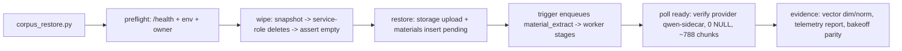

<!--
  This is the verbatim operating-manual preamble. It is pasted as the first content
  of every plan written by the write-implementation-plan skill. Do NOT modify it
  per-plan — keeping it identical across plans means implementing agents learn
  the protocol once and recognize it everywhere.
-->

# How to use this plan

> **You are the implementing agent.** This document is your runbook for one cohesive change to this codebase. It was written collaboratively by Claude and a human after a planning discussion, and it is the source of truth for this work. Read this preamble in full before doing anything else.

## What you're holding

A phase-by-phase implementation plan. Each phase is a **vertical slice** — an end-to-end working increment that leaves the codebase in a working state. Phases are designed so any one of them can be implemented by a fresh agent in a new context window, with only this document and the codebase as input.

## Your job

1. **Read the document header in full first.** TL;DR, Context, Decisions log, Architecture overview, and Files-touched index. These give you the *why* behind every step. The Decisions log especially — those decisions were made deliberately and explain choices that may otherwise look arbitrary or wrong. Reference IDs (D-NN) appear inside phase steps so you can look up rationale.

2. **Find your starting phase.** Scan the phase list. Pick the first phase whose status is `☐ Not started` AND whose `Depends on:` phases are all `✅ Complete`. Implement that phase only. **Do not skip ahead. Do not implement multiple phases in one go unless the human explicitly asks.**

3. **Run the prereq verification.** Each phase has a "Verification (run BEFORE starting)" block. Run those commands. **If any fail, STOP** — the codebase isn't in the state this phase expects. Surface to the human: "Phase N's prereqs failed: `<command>` returned `<result>`. Want me to investigate or hand back?"

4. **Follow the steps in order.** Code blocks in steps are the actual code, not pseudocode or sketches. Apply them as written.

5. **If reality doesn't match the step — STOP.** If the plan says "modify line 47 of `auth.py`" and line 47 is something different, do not improvise. Surface the discrepancy: "Plan expected `<X>` at `auth.py:47`, found `<Y>`. Possible causes: plan is stale, file was edited since planning, plan was wrong. How should I proceed?"

6. **Run the tests and post-verification.** Each phase specifies what tests to add or update and the bash command to run. All must pass before the phase is considered done.

7. **Update status and commit.** When the phase is complete:
   - Edit this document: change the phase's `Status:` line to `✅ Complete — <commit-sha-here>`.
   - `git add` the code changes AND this plan file.
   - Commit them together. Suggested message: `Phase N: <phase title>` (with longer body referencing the plan file).
   - The status update and the code change live in the same commit so the doc and the code never drift.

## What you must NOT do

- **Do not skip phases.** Order matters; later phases assume earlier ones completed.
- **Do not modify the Decisions log, the Operating manual preamble, the TL;DR, the Architecture overview, the Files-touched index, the Open questions, the Out-of-scope list, or the References.** Those are immutable above-the-phases content. If you discover a decision is wrong, surface to the human — don't silently revise.
- **Do not re-plan or re-architect.** If the plan seems wrong, that's a signal to stop and surface, not to improvise.
- **Do not implement multiple phases without surfacing for human review** between them, unless the user explicitly asked for batch execution upfront.

## If you get stuck

- Update the phase's `Status:` to `🛑 Blocked: <one-line reason>`.
- Fill in the phase's `Notes (filled in during implementation)` block with what you tried, what's blocking, and what you'd want to know to unblock.
- Hand back to the human.

## Status vocabulary

- `☐ Not started`
- `🟡 In progress`
- `🛑 Blocked: <reason>`
- `✅ Complete — <commit-sha>`

## When status markers and reality drift

The status markers are a fast read, but they are not the source of truth. The phase's `Verification (DONE)` commands are the truth — if you suspect a marker is wrong (someone forgot to update, branches diverged, partial commits, etc.), run the verification commands for the phases marked complete. Trust the commands over the markers, and surface the drift to the human so the markers can be corrected.

---

# Corpus Restore — wipe-then-re-ingest the frozen 572p probe corpus

**Slug:** `2026-08-19-corpus-restore`
**Date written:** 2026-08-19
**Author:** opencode + user
**Plan status:** Draft
**Upstream:** `.work/STATUS.md:37` (follow-up row — will recur) · `research/doc/2026-08-15-retrieval-quality-program-results.md` (frozen 788-chunk baseline) · `.work/plans/archive/2026-08-15-retrieval-quality-program/PLAN.md:47` (wiped → 11 rows warning) · `.work/plans/archive/2026-08-17-sidecar-embed-live-e2e/PLAN.md` (D-03 no-Gemini, D-07 throwaway, D-08 fail-fast) · `services/intelligence/scripts/sidecar_e2e.py` (reuse health/poll/report patterns)

## TL;DR

Live dev is **probe-blocked again**: `29288e28-d6ff-45c7-b750-ba43f7452409` has `799` chunks = `11` embedded / `788` NULL, and the frozen ACCA row `80c8b138-b544-4095-8dc0-1c390ac70da2` (788 chunks) is `failed` with `embedding_provider NULL`. This plan wipes **that owner's** library clean, then re-ingests **one durable book** `e2e/pdf/sample-textbook-572page.pdf` at its stable ID through the full sidecar pipeline, and proves retrieval parity. No Gemini, no 632p, no 1-chunk stubs.

## Context & background

- **2026-08-15** froze Qwen3-Embedding-0.6B @ 768-dim MRL + L2 + `is_query` prompt: `r@1 0.70 / r@3 0.83 / MRR 0.788` dense, `0.73/0.90/0.816` hybrid RRF `k=60 wL=0.7 pool 25`, `0.77/0.97/0.858` + Qwen3-Reranker-0.6B top-50 (migrations `015`/`016`, `services/reranker/`). Follow-up flagged `embedding IS NOT NULL → 11 rows` — restore needed before next live probe (`research/doc/2026-08-16-qwen3-gpu-benchmark.md:47`).
- **2026-08-16** made restore possible: `services/embedder/` (ROCm, `EMBEDDING_DIMENSIONS=768`), `EMBEDDING_PROVIDER=sidecar`, `materials.embedding_provider` (migration `017`), mixing guard `validation_failed`, `scripts/reembed_materials.py`.
- **2026-08-17** proved the path: sweep 9 configs (MRR 0.789, `EMBEDDING_BATCH_SIZE=128 + HTTP 16 → 4,381 chunks/min`), re-embed `07d62b7e-…`, 572p → `754` chunks `qwen-sidecar` then **deleted per D-07** (`services/intelligence/scripts/sidecar_e2e.py:599-605`). That throwaway-deleted design is why the durable corpus is now empty.
- **2026-08-19 live probe** (this session, `supabase db query`): `content_chunks 799 = 11 embedded / 788 NULL / 0 skipped`; `materials` 17 rows for a single owner `29288e28-d6ff-45c7-b750-ba43f7452409`, with `80c8b138…` `failed/NULL/788`. Single owner ⇒ owner-scoped wipe == global today, but owner-scoped is the code contract.

## Decisions log

### D-01 — Clean slate = wipe-then-re-ingest through the trigger path

**Status:** ✅ Agreed

**Context:** The 08-17 restore reused `reembed_materials.py` (null-reset + re-embed), which only re-proves the embedder. The user asked for "wipe then re-ingest, lets have clean slate".

**Decision:** Full `pending→extracting→chunking→embedding→ready` via `storage upload + materials insert` → `materials_enqueue_ingestion` trigger (migration `005`) — re-proves extract/clean/chunk/tsvector/GIN/`halfvec(768)`/publish, not just embedding.

**Alternatives considered:**
- Null-reset only (`reembed_materials.py`) → rejected: doesn't validate extraction/chunking.
- Manual `ingestion_jobs` insert → rejected: duplicates `(material_id, attempt)` (409) — `sidecar_e2e.py:518-521` documents the trigger must own the job.

**Reversibility:** full restore can be re-wiped and re-run; the manifest records pre/post state.

### D-02 — Owner-scoped wipe

**Status:** ✅ Agreed

**Context:** The dev project is shared (rules 16/36). One owner confirmed live today (`29288e28…`), but a future QA login would add a second.

**Decision:** Delete only `user_id = <owner>` — `public.materials`, `content_chunks`, `ingestion_jobs`, `generation_telemetry`, and `storage.objects/material-raw/<owner>/*` via service-role (same delete pattern as `sidecar_e2e.py:599-605`). Owner resolved from `--owner-id` or `E2E_LIVE_EMAIL` via `auth/v1/admin/users` (`sidecar_e2e.py:462-475`). Pre-wipe snapshot to `pre-wipe.json`, `--yes` gate. Never `TRUNCATE`.

**Alternatives considered:**
- Global truncate → rejected: destructive for any other owner.

**Reversibility:** the pre-wipe manifest lets the operator inspect exactly what was deleted.

### D-03 — No Gemini, ever

**Status:** ✅ Agreed

**Context:** The 08-17 plan's D-03 is carried forward ("We will not use gemini at all").

**Decision:** `EMBEDDING_PROVIDER=qwen-sidecar` only. Mixing guard (`worker.py:428-441`) stays armed. No phase may invoke Gemini or run `reembed_materials.py --provider gemini`.

**Alternatives considered:** none (carried decision).

**Reversibility:** trivial — a later plan may re-allow Gemini.

### D-04 — One durable corpus

**Status:** ✅ Agreed

**Context:** The frozen baseline numbers were measured on the 788-chunk ACCA book; `probe_questions.json` (30Q) golds reference its chunks.

**Decision:** Durable corpus = `e2e/pdf/sample-textbook-572page.pdf` recreated at its stable ID `80c8b138-b544-4095-8dc0-1c390ac70da2` so all golds stay valid. A second throwaway speed-run of the same file (for throughput evidence) is optional and out of this plan's must-have. Exclude `sample-textbook-632page.pdf` and all 1-chunk E2E stubs.

**Alternatives considered:**
- 632p now → deferred: ~30% longer wall time, needs a new ID + gold mapping.
- Re-ingest the 1-chunk stubs → rejected: noise without tuning signal.

**Reversibility:** easy — 632p can be added as a second corpus later.

### D-05 — New surface `corpus_restore.py`, not `sidecar_e2e` growth

**Status:** 🤔 Assumed (recommended; user asked "standalone" implicitly)

**Context:** The 08-17 runner is a focused E2E evidence tool.

**Decision:** New standalone `services/intelligence/scripts/corpus_restore.py` with `wipe` + `restore` subcommands. Reuse `sidecar_e2e.py` helpers (`snapshot_health`, `service_headers`, `load_env_file`, `require_env`, `_poll_material`) by import, not copy.

**Alternatives considered:**
- Extend `sidecar_e2e.py` with a `corpus-restore` subcommand → rejected: larger blast radius; the E2E runner stays focused.

**Reversibility:** easy — rename or fold in before Phase 1 lands.

### D-06 — Evidence = manifest + report, telemetry untouched

**Status:** ✅ Agreed

**Context:** `generation_telemetry` (migration `014`) is an approved, server-owned contract.

**Decision:** Keep telemetry untouched. Writes `evidence/<run>/{manifest.json,report.md}` plus `pre-wipe.json`/`wipe.json`. Reuses `scripts/ingestion_report.py <material_id>` and `embedding_bakeoff.py --models sidecar --hybrid --rerank` output.

**Alternatives considered:** add columns to telemetry → rejected (pollutes the approved contract).

**Reversibility:** easy — the runner is additive.

## Architecture overview

One operator-driven flow; no production-code changes beyond the new script:



- The **worker** (`app/worker_main.py` with `EMBEDDING_PROVIDER=sidecar`) runs as an operator-started process (rule 53: env must be in the shell, `.env` is not auto-loaded) and does the stage work; the runner only preflights, triggers, polls, snapshots, and verifies.
- The **trigger** (`materials_enqueue_ingestion`, migration `005`) owns job creation — the runner must NOT insert an `ingestion_jobs` row for a fresh material (409 duplicate).
- **Evidence** merges runner-captured operational data + `generation_telemetry` rows (via `ingestion_report.py`) + vector spot-checks against `content_chunks` + bakeoff parity.

## Files touched (index)

| Path | Change | Phase | Purpose |
|------|--------|-------|---------|
| `services/intelligence/scripts/corpus_restore.py` | new | 1, 2 | `wipe` + `restore` commands, manifest/report |
| `services/intelligence/tests/test_corpus_restore.py` | new | 1, 2 | `httpx.MockTransport` unit tests (health, wipe payload, poll) |
| `.work/plans/active/2026-08-19-corpus-restore/PLAN.md` | new | 0 | this file |
| `.work/plans/active/2026-08-19-corpus-restore/VERIFICATION.md` | new | 0, 3 | pre-filled criteria + running log |
| `.work/plans/active/2026-08-19-corpus-restore/evidence/` | new dir | 1, 2 | `pre-wipe.json`, `<run>.json/.md` |
| `.work/STATUS.md` | modify | 0, 3 | follow-up row → Done on close |

No migration, no other `services/intelligence` code changes.

## Phases

### Phase 0: Plan doc + status row

**Status:** ✅ Complete — b213c28
**Depends on:** none — can start immediately
**Estimated scope:** ~2 files, 0 code

#### Codebase state assumed at start

- `services/intelligence/.env` exists (gitignored) with `SUPABASE_URL`, `SUPABASE_SERVICE_ROLE_KEY`.
- `e2e/pdf/sample-textbook-572page.pdf` exists (canonical fixture, 572 pages).

#### Verification (run BEFORE starting to confirm prereqs are met)

```bash
ls services/intelligence/.env
ls e2e/pdf/sample-textbook-572page.pdf
```

#### Steps

1. Write this PLAN.md.
2. Write `VERIFICATION.md` with the acceptance criteria below pre-filled.
3. Add the Active row to `.work/STATUS.md` for this task.

#### Tests

None (doc-only phase).

#### Verification (DONE — run after implementation)

```bash
grep -c "80c8b138-b544-4095-8dc0-1c390ac70da2" .work/plans/active/2026-08-19-corpus-restore/PLAN.md   # >= 1
grep -n "2026-08-19-corpus-restore" .work/STATUS.md   # Active row present
```

#### Rollback

`git revert` the Phase 0 commit.

#### Notes (filled in during implementation)

- 2026-08-19: the plan file and STATUS row were written in the same commit as the Phase 1 implementation start (per plan-implementor the Phase 0 doc commit is its own boundary commit; see git log).

---

### Phase 1: Wipe primitive + preflight

**Status:** ✅ Complete — 4fba301a8a3837876b3f2c7fbc1f04bb0d58c59c
**Depends on:** Phase 0
**Estimated scope:** ~2 files, ~300 lines

#### Codebase state assumed at start

- `services/intelligence/scripts/sidecar_e2e.py` exists and is importable for helpers: `load_env_file`, `require_env`, `service_headers`, `snapshot_health`, `_service_client`, `_poll_material` (see `sidecar_e2e.py:46-64`, `67-74`, `111-118`, `288-289`, `326-349`).
- `services/intelligence/.env` has `SUPABASE_URL`, `SUPABASE_SERVICE_ROLE_KEY`.
- Owner `29288e28-d6ff-45c7-b750-ba43f7452409` is the live probe owner (or resolvable from `E2E_LIVE_EMAIL`).

#### Verification (run BEFORE starting to confirm prereqs are met)

```bash
ls services/intelligence/.env
ls .venv/bin/python
```

#### Steps

1. **Create `services/intelligence/scripts/corpus_restore.py`** — preflight + `wipe`:

   ```python
   """Wipe and restore the frozen probe corpus on the live dev project.

   Operator tool. Preflights the GPU embedder, wipes one owner's library
   (materials, chunks, jobs, telemetry, storage objects), then re-ingests the
   canonical 572-page textbook through the sidecar worker at its stable
   material id. Writes timestamped JSON + Markdown evidence under
   `.work/plans/active/2026-08-19-corpus-restore/evidence/`.

   Gemini is never called (plan decision D-03). The runner only preflights,
   triggers, polls, snapshots, and verifies; the worker does the stage work.

   Run from `services/intelligence` with `services/intelligence/.env` present:

       ../../.venv/bin/python scripts/corpus_restore.py wipe --owner-id <uuid>
       ../../.venv/bin/python scripts/corpus_restore.py restore \
           --pdf e2e/pdf/sample-textbook-572page.pdf
   """

   from __future__ import annotations

   import argparse
   import json
   import os
   import sys
   import uuid
   from datetime import UTC, datetime
   from pathlib import Path

   import httpx

   from scripts.sidecar_e2e import (
       load_env_file,
       require_env,
       service_headers,
       snapshot_health,
   )

   EVIDENCE_DIR = (
       Path(__file__).resolve().parents[3]
       / ".work"
       / "plans"
       / "active"
       / "2026-08-19-corpus-restore"
       / "evidence"
   )
   PROBE_MATERIAL_ID = "80c8b138-b544-4095-8dc0-1c390ac70da2"


   def run_id() -> str:
       return datetime.now(UTC).strftime("%Y%m%d-%H%M%S")


   def _service_client(key: str) -> httpx.Client:
       return httpx.Client(timeout=30.0, headers=service_headers(key))


   def _find_owner(client: httpx.Client, base: str, key: str, email: str | None) -> str:
       if not email:
           raise SystemExit("--owner-id or E2E_LIVE_EMAIL is required")
       response = client.get(
           f"{base}/auth/v1/admin/users",
           params={"per_page": 1000},
           headers={"apikey": key, "Authorization": f"Bearer {key}"},
       )
       response.raise_for_status()
       for user in response.json().get("users", []):
           if user.get("email") == email:
               return user["id"]
       raise SystemExit(f"no auth.users row for email {email!r}")


   def snapshot_library(client: httpx.Client, base: str, owner_id: str) -> dict:
       """Count every server-owned row + storage object for one owner (D-02)."""
       materials = client.get(
           f"{base}/rest/v1/materials",
           params={"user_id": f"eq.{owner_id}", "select": "id,title,ingestion_state,embedding_provider,chunk_count"},
       ).json()
       material_ids = [m["id"] for m in materials]
       chunks = (
           client.get(
               f"{base}/rest/v1/content_chunks",
               params={"user_id": f"eq.{owner_id}", "select": "id"},
           ).json()
           if material_ids
           else []
       )
       jobs = (
           client.get(
               f"{base}/rest/v1/ingestion_jobs",
               params={"user_id": f"eq.{owner_id}", "select": "id,status"},
           ).json()
           if material_ids
           else []
       )
       telemetry = (
           client.get(
               f"{base}/rest/v1/generation_telemetry",
               params={"owner_id": f"eq.{owner_id}", "select": "id"},
           ).json()
           if material_ids
           else []
       )
       objects = []
       if material_ids:
           for material_id in material_ids:
               response = client.get(
                   f"{base}/storage/v1/object/list/material-raw",
                   params={"prefix": f"{owner_id}/{material_id}"},
                   headers=service_headers(client.headers.get("apikey", "")),
               )
               if response.status_code < 400:
                   objects.extend(
                       {"name": obj.get("name"), "material_id": material_id}
                       for obj in response.json()
                   )
       return {
           "owner_id": owner_id,
           "materials": materials,
           "material_count": len(materials),
           "chunk_count": len(chunks),
           "job_count": len(jobs),
           "telemetry_count": len(telemetry),
           "storage_objects": objects,
       }


   def _delete_owner_rows(
       client: httpx.Client, base: str, owner_id: str, snapshot: dict
   ) -> None:
       """Delete one owner's rows + storage objects via service-role (D-02).

       Order mirrors sidecar_e2e.py cleanup: chunks -> jobs -> telemetry ->
       materials -> storage. Bodiless deletes carry no Content-Type (rule 36).
       """
       for material in snapshot["materials"]:
           material_id = material["id"]
           client.delete(
               f"{base}/rest/v1/content_chunks?material_id=eq.{material_id}"
           ).raise_for_status()
           client.delete(
               f"{base}/rest/v1/ingestion_jobs?material_id=eq.{material_id}"
           ).raise_for_status()
           client.delete(
               f"{base}/rest/v1/generation_telemetry?material_id=eq.{material_id}"
           ).raise_for_status()
           client.delete(
               f"{base}/rest/v1/materials?id=eq.{material_id}"
           ).raise_for_status()
           for obj in snapshot["storage_objects"]:
               if obj["material_id"] != material_id:
                   continue
               client.delete(
                   f"{base}/storage/v1/object/material-raw/{obj['name']}",
                   headers=service_headers(client.headers.get("apikey", "")),
               ).raise_for_status()


   def cmd_preflight(args: argparse.Namespace) -> int:
       """Fail-fast gate before any mutation (D-08 pattern)."""
       load_env_file(Path(__file__).parents[1] / ".env")
       base = require_env("SUPABASE_URL").rstrip("/")
       key = require_env("SUPABASE_SERVICE_ROLE_KEY")
       with _service_client(key) as client:
           health = snapshot_health(client)
       problems = []
       if health.get("status") != "ok":
           problems.append(f"health.status={health.get('status')!r} (expected 'ok')")
       if health.get("loaded") is not True:
           problems.append("health.loaded is not true")
       if health.get("dimensions") != 768:
           problems.append(f"health.dimensions={health.get('dimensions')} (expected 768)")
       if not health.get("cuda_available"):
           problems.append("health.cuda_available is false — GPU passthrough broken (rule 54)")
       if problems:
           print("PREFLIGHT FAILED:")
           for problem in problems:
               print(f"  - {problem}")
           return 1
       print("PREFLIGHT OK")
       return 0


   def cmd_wipe(args: argparse.Namespace) -> int:
       load_env_file(Path(__file__).parents[1] / ".env")
       base = require_env("SUPABASE_URL").rstrip("/")
       key = require_env("SUPABASE_SERVICE_ROLE_KEY")
       run = run_id()
       EVIDENCE_DIR.mkdir(parents=True, exist_ok=True)
       with _service_client(key) as client:
           owner_id = args.owner_id or _find_owner(
               client, base, key, os.getenv("E2E_LIVE_EMAIL")
           )
           snapshot = snapshot_library(client, base, owner_id)
           pre_path = EVIDENCE_DIR / f"{run}-pre-wipe.json"
           pre_path.write_text(
               json.dumps({"run_id": run, "created_at": datetime.now(UTC).isoformat(), **snapshot}, indent=2, sort_keys=True),
               encoding="utf-8",
           )
           print(
               f"owner {owner_id}: {snapshot['material_count']} materials, "
               f"{snapshot['chunk_count']} chunks, {snapshot['job_count']} jobs, "
               f"{snapshot['telemetry_count']} telemetry, "
               f"{len(snapshot['storage_objects'])} storage objects"
           )
           if args.dry_run:
               print(f"DRY-RUN: nothing deleted; pre-wipe snapshot at {pre_path}")
               return 0
           if not args.yes:
               answer = input("delete all of the above? [y/N] ").strip().lower()
               if answer not in ("y", "yes"):
                   print("aborted")
                   return 0
           _delete_owner_rows(client, base, owner_id, snapshot)
           # Assert: the owner's library is empty (D-02).
           leftover = client.get(
               f"{base}/rest/v1/materials",
               params={"user_id": f"eq.{owner_id}", "select": "id"},
           ).json()
           if leftover:
               raise SystemExit(f"WIPE VERIFICATION FAILED: {len(leftover)} materials remain")
           manifest = {
               "run_id": run,
               "created_at": datetime.now(UTC).isoformat(),
               "wipe": {
                   "owner_id": owner_id,
                   "pre": snapshot,
                   "post": {"material_count": 0, "chunk_count": 0},
               },
           }
           post_path = EVIDENCE_DIR / f"{run}-wipe.json"
           post_path.write_text(
               json.dumps(manifest, indent=2, sort_keys=True), encoding="utf-8"
           )
           print(f"WIPE OK: owner {owner_id} library cleared")
           print(f"pre-wipe snapshot: {pre_path}")
           print(f"wipe evidence:     {post_path}")
       return 0


   def cmd_restore(args: argparse.Namespace) -> int:
       raise NotImplementedError("implemented in Phase 2")


   def main() -> None:
       parser = argparse.ArgumentParser(description="Corpus wipe + restore driver")
       sub = parser.add_subparsers(dest="command", required=True)

       sub.add_parser("preflight", help="check embedder + env (fail-fast)")

       wipe = sub.add_parser("wipe", help="delete one owner's library (D-02)")
       wipe.add_argument("--owner-id", default="")
       wipe.add_argument("--yes", action="store_true", help="skip the confirmation prompt")
       wipe.add_argument("--dry-run", action="store_true", help="snapshot only, no mutation")

       restore = sub.add_parser("restore", help="re-ingest the frozen 572p corpus")
       restore.add_argument("--pdf", default="e2e/pdf/sample-textbook-572page.pdf")
       restore.add_argument("--material-id", default=PROBE_MATERIAL_ID)
       restore.add_argument("--title", default="ACCA APM Study Text")
       restore.add_argument("--owner-id", default="")
       restore.add_argument("--timeout", type=int, default=2400)

       args = parser.parse_args()
       handlers = {
           "preflight": cmd_preflight,
           "wipe": cmd_wipe,
           "restore": cmd_restore,
       }
       sys.exit(handlers[args.command](args))


   if __name__ == "__main__":
       main()
   ```

   Note: `scripts/` is importable from tests via pytest's prepend import mode (namespace package, same as `test_sidecar_e2e.py`).

2. **Create `services/intelligence/tests/test_corpus_restore.py`** — unit tests for the pure helpers with `httpx.MockTransport`:

   ```python
   """Unit tests for scripts/corpus_restore.py helpers (no live services)."""

   from __future__ import annotations

   import json

   import httpx

   from scripts.corpus_restore import run_id, snapshot_library


   def test_run_id_is_utc_timestamp() -> None:
       value = run_id()
       parts = value.split("-")
       assert len(parts) == 2
       assert len(parts[0]) == 8 and len(parts[1]) == 6


   def test_snapshot_library_counts_everything() -> None:
       def handler(request: httpx.Request) -> httpx.Response:
           path = request.url.path
           if path == "/rest/v1/materials":
               return httpx.Response(
                   200,
                   json=[
                       {
                           "id": "m1",
                           "title": "t",
                           "ingestion_state": "ready",
                           "embedding_provider": "qwen-sidecar",
                           "chunk_count": 788,
                       }
                   ],
               )
           if path == "/rest/v1/content_chunks":
               return httpx.Response(200, json=[{"id": "c1"}] * 3)
           if path == "/rest/v1/ingestion_jobs":
               return httpx.Response(200, json=[{"id": "j1", "status": "succeeded"}])
           if path == "/rest/v1/generation_telemetry":
               return httpx.Response(200, json=[{"id": "t1"}])
           if path == "/storage/v1/object/list/material-raw":
               return httpx.Response(200, json=[{"name": "owner/m1/pdf.pdf"}])
           return httpx.Response(404, json={})

       client = httpx.Client(
           transport=httpx.MockTransport(handler),
           headers={"apikey": "k", "Authorization": "Bearer k"},
       )
       snap = snapshot_library(client, "https://example.supabase.co", "owner")
       assert snap["material_count"] == 1
       assert snap["chunk_count"] == 3
       assert snap["job_count"] == 1
       assert snap["telemetry_count"] == 1
       assert snap["storage_objects"] == [{"name": "owner/m1/pdf.pdf", "material_id": "m1"}]
   ```

3. **Run the tests**:

   ```bash
   .venv/bin/python -m pytest services/intelligence/tests/test_corpus_restore.py -q
   ```

#### Tests

- Add `services/intelligence/tests/test_corpus_restore.py` — covers `run_id` format, `snapshot_library` aggregation.
- Run: `.venv/bin/python -m pytest services/intelligence/tests/test_corpus_restore.py -q`

#### Verification (DONE — run after implementation)

```bash
.venv/bin/python -m pytest services/intelligence/tests/test_corpus_restore.py -q   # all pass
.venv/bin/python -m ruff check services/intelligence/scripts/corpus_restore.py services/intelligence/tests/test_corpus_restore.py  # clean
# Dry-run (no mutation):
cd services/intelligence && ../../.venv/bin/python scripts/corpus_restore.py wipe --owner-id 29288e28-d6ff-45c7-b750-ba43f7452409 --dry-run   # prints snapshot, deletes nothing
```

#### Rollback

Delete `services/intelligence/scripts/corpus_restore.py` and `services/intelligence/tests/test_corpus_restore.py`; no live mutation occurs until an operator runs `wipe --yes`.

#### Notes (filled in during implementation)

- **Storage listing is a POST, not a GET.** The plan sketch used `GET /storage/v1/object/list/material-raw` with query params; the hosted Storage API rejects that (400/empty). `snapshot_library` was fixed to `POST` a JSON body `{"prefix": "<owner>/", "limit": 200}` and re-list each per-material folder (`<owner>/<materialId>`) to collect actual files. Without this fix the wipe would silently report `0 storage objects` and leave every uploaded PDF + fulltext.txt behind.
- **Orphan storage folders exist.** 27 folders under `<owner>/` have no matching `materials` row (leftovers from E2E runs that deleted the row but not the object). `_delete_owner_rows` now deletes every recorded object regardless of material-row membership, so the wipe is a true clean slate. Live dry-run snapshot: 17 materials / 799 chunks / 18 jobs / 240 telemetry / 42 storage objects (incl. orphans).
- `cmd_wipe` calls `snapshot_library(client, base, key, owner_id)` and `_delete_owner_rows(client, base, snapshot)` — signatures adjusted from the plan sketch.

---

### Phase 2: Restore subcommand — re-ingest the frozen corpus at its stable ID

**Status:** 🟡 In progress
**Depends on:** Phase 1
**Estimated scope:** ~1 file, ~250 lines

#### Codebase state assumed at start

- `services/intelligence/scripts/corpus_restore.py` exists with `cmd_restore` raising `NotImplementedError` (Phase 1).
- Worker runs with `EMBEDDING_PROVIDER=sidecar` (rule 53: env in shell, `.env` not auto-loaded), `EMBEDDING_DIMENSIONS=768`, `EMBEDDING_BATCH_SIZE=128` recommended operating point.
- Embedder healthy per rule 54 (`curl -s http://127.0.0.1:8200/health` → dims 768, cuda).

#### Verification (run BEFORE starting to confirm prereqs are met)

```bash
grep -n "NotImplementedError" services/intelligence/scripts/corpus_restore.py   # cmd_restore
.venv/bin/python -m pytest services/intelligence/tests/test_corpus_restore.py -q   # Phase 1 tests pass
```

#### Steps

1. **Modify `services/intelligence/scripts/corpus_restore.py`, replace `cmd_restore` (implements D-01, D-04, D-08):** upload the PDF, insert the material row in `pending` (let the trigger create the job), poll to `ready`, verify provider/chunks/NULLs/vector dims/norms, capture telemetry + `ingestion_report.py` + bakeoff parity.

   ```python
   def _material_payload(
       owner_id: str, material_id: str, title: str, pdf_name: str
   ) -> dict:
       return {
           "id": material_id,
           "user_id": owner_id,
           "client_id": uuid.uuid4().hex,
           "title": title,
           "kind": "file",
           "source": pdf_name,
           "ingestion_state": "pending",
           "ingestion_progress": 0,
           "content_version": uuid.uuid4().hex,
           "upload_complete_at": datetime.now(UTC).isoformat(),
       }


   def _poll_material(
       client: httpx.Client,
       base: str,
       key: str,
       material_id: str,
       timeout_s: float,
   ) -> dict:
       deadline = time.monotonic() + timeout_s
       while time.monotonic() < deadline:
           row = client.get(
               f"{base}/rest/v1/materials",
               params={"id": f"eq.{material_id}", "select": "*", "limit": 1},
           ).json()
           if row:
               state = row[0].get("ingestion_state")
               if state == "ready":
                   return row[0]
               if state == "failed":
                   raise SystemExit(
                       f"material {material_id} FAILED: "
                       f"{row[0].get('ingestion_error')} (no auto-retry, D-08)"
                   )
           time.sleep(5)
       raise SystemExit(f"material {material_id} did not reach ready in {timeout_s}s")


   def _check_vectors(
       client: httpx.Client, base: str, material_id: str, expected_chunks: int
   ) -> list[dict]:
       chunks = client.get(
           f"{base}/rest/v1/content_chunks",
           params={
               "material_id": f"eq.{material_id}",
               "order": "ordinal.asc",
               "select": "id,embedding,skipped",
           },
       ).json()
       nulls = [c for c in chunks if c.get("embedding") is None]
       skipped = [c for c in chunks if c.get("skipped")]
       if len(chunks) != expected_chunks:
           raise SystemExit(
               f"chunk count {len(chunks)} != expected {expected_chunks} "
               "(no auto-retry, D-08)"
           )
       if nulls:
           raise SystemExit(f"{len(nulls)} NULL vectors remain (no auto-retry, D-08)")
       if skipped:
           raise SystemExit(f"{len(skipped)} chunks skipped (no auto-retry, D-08)")
       sample = chunks[:5]
       problems = []
       for chunk in sample:
           vector = chunk.get("embedding") or []
           if len(vector) != 768:
               problems.append(f"dims={len(vector)} (expected 768)")
               break
           norm = sum(v * v for v in vector) ** 0.5
           if not (0.99 <= norm <= 1.01):
               problems.append(f"L2 norm {norm:.4f} out of [0.99,1.01]")
               break
       if problems:
           raise SystemExit(f"VECTOR CHECK FAILED: {'; '.join(problems)}")
       return chunks


   def cmd_restore(args: argparse.Namespace) -> int:
       load_env_file(Path(__file__).parents[1] / ".env")
       base = require_env("SUPABASE_URL").rstrip("/")
       key = require_env("SUPABASE_SERVICE_ROLE_KEY")
       pdf = Path(args.pdf)
       if not pdf.is_file():
           raise SystemExit(f"--pdf {args.pdf} not found")
       run = run_id()
       EVIDENCE_DIR.mkdir(parents=True, exist_ok=True)
       with _service_client(key) as client:
           # Idempotency guard (D-04): a ready/qwen-sidecar material is done.
           existing = client.get(
               f"{base}/rest/v1/materials",
               params={"id": f"eq.{args.material_id}", "select": "*", "limit": 1},
           ).json()
           if existing:
               row = existing[0]
               if (
                   row.get("ingestion_state") == "ready"
                   and row.get("embedding_provider") == "qwen-sidecar"
               ):
                   print(
                       f"material {args.material_id} already restored "
                       f"({row.get('chunk_count')} chunks); nothing to do"
                   )
                   return 0
               raise SystemExit(
                   f"material {args.material_id} exists in state "
                   f"{row.get('ingestion_state')}/{row.get('embedding_provider')}; "
                   "run `wipe` first (no overwrite, D-08)"
               )
           owner_id = args.owner_id or _find_owner(
               client, base, key, os.getenv("E2E_LIVE_EMAIL")
           )
           object_path = f"{owner_id}/{args.material_id}/{pdf.name}"
           upload = client.post(
               f"{base}/storage/v1/object/material-raw/{object_path}",
               headers={**service_headers(key), "x-upsert": "true", "Content-Type": "application/pdf"},
               content=pdf.read_bytes(),
           )
           if upload.status_code >= 400:
               raise SystemExit(f"storage upload failed: {upload.status_code} {upload.text[:300]}")
           client.post(
               f"{base}/rest/v1/materials",
               json=_material_payload(owner_id, args.material_id, args.title, pdf.name),
           ).raise_for_status()
           jobs = client.get(
               f"{base}/rest/v1/ingestion_jobs",
               params={
                   "material_id": f"eq.{args.material_id}",
                   "select": "id,correlation_id,attempt",
               },
           ).json()
           if not jobs:
               raise SystemExit("trigger did not create an ingestion job for the material")
           job_id = jobs[0]["id"]
           correlation_id = jobs[0]["correlation_id"]
           print(f"trigger enqueued extract: material={args.material_id} job={job_id}")
           post = _poll_material(client, base, key, args.material_id, float(args.timeout))
           if post.get("embedding_provider") != "qwen-sidecar":
               raise SystemExit(
                   f"provider={post.get('embedding_provider')!r} (expected qwen-sidecar)"
               )
           expected = int(post.get("chunk_count") or 0) or 754
           chunks = _check_vectors(client, base, args.material_id, expected)
           telemetry = client.get(
               f"{base}/rest/v1/generation_telemetry",
               params={"material_id": f"eq.{args.material_id}", "order": "id.asc", "select": "*"},
           ).json()
           import subprocess as sp

           report_md = sp.run(
               [
                   str(Path(__file__).resolve().parents[3] / ".venv" / "bin" / "python"),
                   "scripts/ingestion_report.py",
                   args.material_id,
               ],
               capture_output=True,
               text=True,
               timeout=120,
           )
           report_text = (
               report_md.stdout
               if report_md.returncode == 0
               else f"(report failed: {report_md.stderr[-500:]})"
           )
           manifest = {
               "run_id": run,
               "created_at": datetime.now(UTC).isoformat(),
               "restore": {
                   "material_id": args.material_id,
                   "job_id": job_id,
                   "correlation_id": correlation_id,
                   "owner_id": owner_id,
                   "pdf": str(pdf),
                   "title": args.title,
                   "state": post.get("ingestion_state"),
                   "provider": post.get("embedding_provider"),
                   "chunk_count": len(chunks),
                   "null_vectors": 0,
                   "skipped_chunks": 0,
                   "vector_sample": [
                       {"dims": len((c.get("embedding") or [])), "id": c["id"]}
                       for c in chunks[:5]
                   ],
                   "telemetry_records": len(telemetry),
               },
               "telemetry_report_md": report_text,
           }
           json_path = EVIDENCE_DIR / f"{run}-restore.json"
           json_path.write_text(
               json.dumps(manifest, indent=2, sort_keys=True), encoding="utf-8"
           )
           print(f"RESTORE OK: {args.material_id} ready with {len(chunks)} chunks, 0 NULL")
           print(f"evidence: {json_path}")
       return 0
   ```

   Add the missing imports (`time`) to the top of the file.

2. **Extend `services/intelligence/tests/test_corpus_restore.py`** — tests for the restore path:

   ```python
   def test_restore_material_payload_shape() -> None:
       from scripts.corpus_restore import _material_payload

       payload = _material_payload("owner", "m1", "T", "book.pdf")
       assert payload["id"] == "m1"
       assert payload["kind"] == "file"
       assert payload["source"] == "book.pdf"
       assert payload["ingestion_state"] == "pending"
       assert payload["client_id"] and payload["content_version"]
   ```

3. **Run the tests**:

   ```bash
   .venv/bin/python -m pytest services/intelligence/tests/test_corpus_restore.py -q
   ```

#### Tests

- Add `test_restore_material_payload_shape`.
- Run: `.venv/bin/python -m pytest services/intelligence/tests/test_corpus_restore.py -q`

#### Verification (DONE — run after implementation)

```bash
.venv/bin/python -m pytest services/intelligence/tests/test_corpus_restore.py -q   # all pass
.venv/bin/python -m ruff check services/intelligence/scripts/corpus_restore.py services/intelligence/tests/test_corpus_restore.py  # clean
# Live operator run (needs GPU sidecar + sidecar worker):
cd services/intelligence && ../../.venv/bin/python scripts/corpus_restore.py restore \
  --pdf e2e/pdf/sample-textbook-572page.pdf   # "RESTORE OK: 80c8b… ready with N chunks, 0 NULL"
```

The live restore is the Phase 3 operator run, not a CI check.

#### Rollback

If the restore crashes mid-way: material stays `embedding`/`failed` with NULL vectors. Preserved per D-08 — re-run `wipe` then `restore` after fixing the cause; never blind-retry.

#### Notes (filled in during implementation)

- (filled in during implementation)

---

### Phase 3: Live restore run + parity gate + close-out

**Status:** ☐ Not started
**Depends on:** Phase 2
**Estimated scope:** verification only, 0 new files

#### Codebase state assumed at start

- Phase 2 code complete and ruff-clean.
- Embedder sidecar running (rule 54), sidecar worker running with `EMBEDDING_PROVIDER=sidecar`.

#### Verification (run BEFORE starting to confirm prereqs are met)

```bash
curl -s http://127.0.0.1:8200/health   # dims 768, cuda, loaded
cd services/intelligence && ../../.venv/bin/python scripts/corpus_restore.py preflight  # "PREFLIGHT OK"
```

#### Steps

1. **Live wipe:** `../../.venv/bin/python scripts/corpus_restore.py wipe --owner-id 29288e28-d6ff-45c7-b750-ba43f7452409 --yes`. Confirm `WIPE OK` + `pre-wipe.json` written.
2. **Live restore:** `../../.venv/bin/python scripts/corpus_restore.py restore --pdf e2e/pdf/sample-textbook-572page.pdf`. Confirm `RESTORE OK: 80c8b… ready with ~754-788 chunks, 0 NULL`.
3. **DB assertions** (rule 36):

   ```bash
   npx --yes supabase@latest db query --linked --project-ref kabpmbhlvfbrhtbxjaua \
     "select id, ingestion_state, embedding_provider, chunk_count from public.materials where id='80c8b138-b544-4095-8dc0-1c390ac70da2';"
   # expect: ready | qwen-sidecar | 788
   npx --yes supabase@latest db query --linked --project-ref kabpmbhlvfbrhtbxjaua \
     "select count(*) as chunks, count(*) filter (where embedding is not null) as embedded from public.content_chunks where material_id='80c8b138-b544-4095-8dc0-1c390ac70da2';"
   # expect: chunks 788, embedded 788
   ```

4. **Parity gate** (frozen baseline `research/doc/2026-08-15-retrieval-quality-program-results.md:11-16`, tolerance ±0.01):

   ```bash
   cd services/intelligence && ../../.venv/bin/python scripts/embedding_bakeoff.py \
     --material 80c8b138-b544-4095-8dc0-1c390ac70da2 --models sidecar --hybrid --rerank
   # expect r@1 0.70 / r@3 0.83 / MRR 0.788 dense; 0.73/0.90/0.816 hybrid; 0.77/0.97/0.858 reranked
   ```

5. **Close-out:** append evidence paths to `VERIFICATION.md`; flip the `.work/STATUS.md` follow-up row to Done; move the plan folder to `plans/archive/`.

#### Verification (DONE — run after implementation)

```bash
.venv/bin/python -m pytest services/intelligence/tests -q   # 264+ + new pass; 5 pre-existing golden-fixture failures unchanged
.venv/bin/python -m ruff check services/intelligence/scripts/corpus_restore.py
grep -n "Done" .work/STATUS.md   # follow-up row flipped
```

#### Rollback

Doc-only revert of the STATUS flip + archive move; the live corpus remains restored (that's the goal).

#### Notes (filled in during implementation)

- (filled in during implementation)

---

## Out of scope

- Production wiring of the rerank step into a retrieval endpoint (client + sidecar exist, no caller yet).
- A second corpus (632p) — separate stretch plan after this gate is green.
- Worker/GPU orchestration productionization.
- Gemini path — never called (D-03).

## Open questions

- None blocking. D-05 (standalone vs `sidecar_e2e` extension) resolved to standalone; D-07 (fresh-PDF end state) not needed — the durable corpus is exactly one book.

## References

- `research/doc/2026-08-15-retrieval-quality-program-results.md` — frozen baseline metrics.
- `research/doc/2026-08-16-qwen3-gpu-benchmark.md` — wipe warning (`embedding=not.is.null → 11 rows`).
- `services/intelligence/app/ingestion/worker.py:424-514` — embed stage, NULL-scan, mixing guard.
- `services/intelligence/app/ingestion/repository.py:297-389` — chunk/vector persistence.
- `apps/app/supabase/migrations/017_material_embedding_provider.sql` — provider marker.
- `services/intelligence/scripts/sidecar_e2e.py` — helper patterns reused (health, poll, report, cleanup).
- Rules: `36-supabase-live-stack.agents.md`, `54-gpu-inference-sidecar.agents.md`, `53-wsl-dev-runtime.agents.md`.