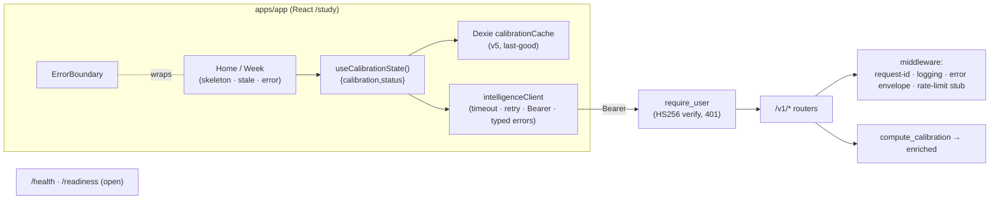

<!--
  This is the verbatim operating-manual preamble. It is pasted as the first content
  of every plan written by the write-implementation-plan skill. Do NOT modify it
  per-plan — keeping it identical across plans means implementing agents learn
  the protocol once and recognize it everywhere.
-->

# How to use this plan

> **You are the implementing agent.** This document is your runbook for one cohesive change to this codebase. It was written collaboratively by Claude and a human after a planning discussion, and it is the source of truth for this work. Read this preamble in full before doing anything else.

## What you're holding

A phase-by-phase implementation plan. Each phase is a **vertical slice** — an end-to-end working increment that leaves the codebase in a working state. Phases are designed so any one of them can be implemented by a fresh agent in a new context window, with only this document and the codebase as input.

## Your job

1. **Read the document header in full first.** TL;DR, Context, Decisions log, Architecture overview, and Files-touched index. These give you the *why* behind every step. The Decisions log especially — those decisions were made deliberately and explain choices that may otherwise look arbitrary or wrong. Reference IDs (D-NN) appear inside phase steps so you can look up rationale.

2. **Find your starting phase.** Scan the phase list. Pick the first phase whose status is `☐ Not started` AND whose `Depends on:` phases are all `✅ Complete`. Implement that phase only. **Do not skip ahead. Do not implement multiple phases in one go unless the human explicitly asks.**

3. **Run the prereq verification.** Each phase has a "Verification (run BEFORE starting)" block. Run those commands. **If any fail, STOP** — the codebase isn't in the state this phase expects. Surface to the human: "Phase N's prereqs failed: `<command>` returned `<result>`. Want me to investigate or hand back?"

4. **Follow the steps in order.** Code blocks in steps are the actual code, not pseudocode or sketches. Apply them as written.

5. **If reality doesn't match the step — STOP.** If the plan says "modify line 47 of `auth.py`" and line 47 is something different, do not improvise. Surface the discrepancy: "Plan expected `<X>` at `auth.py:47`, found `<Y>`. Possible causes: plan is stale, file was edited since planning, plan was wrong. How should I proceed?"

6. **Run the tests and post-verification.** Each phase specifies what tests to add or update and the bash command to run. All must pass before the phase is considered done.

7. **Update status and commit.** When the phase is complete:
   - Edit this document: change the phase's `Status:` line to `✅ Complete — <commit-sha-here>`.
   - `git add` the code changes AND this plan file.
   - Commit them together. Suggested message: `Phase N: <phase title>` (with longer body referencing the plan file).
   - The status update and the code change live in the same commit so the doc and the code never drift.

## What you must NOT do

- **Do not skip phases.** Order matters; later phases assume earlier ones completed.
- **Do not modify the Decisions log, the Operating manual preamble, the TL;DR, the Architecture overview, the Files-touched index, the Open questions, the Out-of-scope list, or the References.** Those are immutable above-the-phases content. If you discover a decision is wrong, surface to the human — don't silently revise.
- **Do not re-plan or re-architect.** If the plan seems wrong, that's a signal to stop and surface, not to improvise.
- **Do not implement multiple phases without surfacing for human review** between them, unless the user explicitly asked for batch execution upfront.

## If you get stuck

- Update the phase's `Status:` to `🛑 Blocked: <one-line reason>`.
- Fill in the phase's `Notes (filled in during implementation)` block with what you tried, what's blocking, and what you'd want to know to unblock.
- Hand back to the human.

## Status vocabulary

- `☐ Not started`
- `🟡 In progress`
- `🛑 Blocked: <reason>`
- `✅ Complete — <commit-sha>`

## When status markers and reality drift

The status markers are a fast read, but they are not the source of truth. The phase's `Verification (DONE)` commands are the truth — if you suspect a marker is wrong (someone forgot to update, branches diverged, partial commits, etc.), run the verification commands for the phases marked complete. Trust the commands over the markers, and surface the drift to the human so the markers can be corrected.

---

# Make dev feel production-ready for server-side calibration (auth · resilience · hardening)

**Slug:** `dev-production-readiness`
**Date written:** 2026-06-20
**Author:** Claude (Cowork planning/review agent) + Rohit
**Plan status:** Draft
**Upstream:** builds on [`../../active/2026-06-20-enriched-shrink-production-integration/PLAN.md`](../../active/2026-06-20-enriched-shrink-production-integration/PLAN.md) (server-side calibration shipped + Cowork-verified). Resolves its OQ-02 (offline/caching) and the dev-side of OQ-03 (auth/CORS). Production *hosting* remains deferred (apps are not deployed yet).

## TL;DR

Calibration now runs server-side: the app's `useCalibrationState` calls the FastAPI Intelligence Service at `/v1/calibration`. But the service is open (no auth), the client has no timeout/retry, the UI shows nothing when the service is slow/down, and nothing starts the service alongside `pnpm dev`. This plan makes the **dev** experience mirror what production will need — so going live later is *config only* (URLs, secrets, hosting), not new code. Five vertical slices: **(1)** real Supabase-JWT auth on all `/v1` endpoints (HS256 shared secret, exercised with real tokens in dev — D-02); **(2)** a resilient client (timeout, retry/backoff, typed errors, token attach); **(3)** resilient UI with a Dexie-persisted stale cache so calibration survives the service being offline (D-03) plus an app-wide error boundary; **(4)** service hardening (structured logging + request-id, input bounds, error envelope, `/readiness`, version stamp, rate-limit stub, compose healthcheck); **(5)** a one-command dev stack (`pnpm dev:full`). Actual production hosting/secrets stay out of scope.

## Context & background

Grounded in the codebase on 2026-06-20:

- **Wiring (already shipped, commit `e4555c1`):** `apps/app/src/progress/useCalibration.ts` → `apps/app/src/lib/intelligenceClient.ts` (`VITE_INTELLIGENCE_URL ?? http://localhost:8000`) → `POST /v1/calibration`. Returns `CalibrationState | null` (null on loading **and** error).
- **Service:** `services/intelligence/app/main.py` adds only CORS (`DEFAULT_CORS_ORIGINS=["http://localhost:5173"]`, `CORS_ORIGINS` env) and a `/health`. Routers `calibration`/`progress`/`roadmap` mounted under `/v1`. **No auth, no logging, no request-id, no input bounds.** Deps (`services/intelligence/pyproject.toml`): `fastapi`, `uvicorn`, `py-progress`, `py-roadmap-engine`.
- **Client:** `intelligenceClient.ts` is 11 lines — `fetch` + `Content-Type`, throws on non-2xx. No timeout, retry, or `Authorization` header.
- **Token source:** `apps/app/src/lib/supabase.ts` exports the `supabase` singleton; `supabase.auth.getSession()` → `data.session.access_token` (Supabase access JWT). `AuthGate.getSession()` wraps the same.
- **UI:** `Home.tsx:78` and `Week.tsx:27` both do `const calibration = useCalibrationState();` then feed `useProgressSnapshot(calibration)` / `usePromptDetail(calibration)`. There is **no `ErrorBoundary` and no toast** anywhere in `apps/app/src` (grep clean). When calibration is null, pace/progress/prompt simply don't render — a down service looks identical to "no data."
- **Dexie:** `apps/app/src/events/EventStoreProvider.tsx` `createEventStore` declares `version(1)`…`version(4)` (current tables: `events`, `sync_queue`, `sync_meta`, `onboardingDraft`, `activeSession`). Per-user DB `StudyTracker_<userId>`. (Note: `CLAUDE.md` still says "v3" — it's stale; the code is at v4.)
- **App composition:** `apps/app/src/App.tsx` defines `AppRoutes()` (the top-level `<Routes>`); provider nesting is `AuthProvider → EventStoreRouter → SyncRouter → AppRoutes`.
- **Dev scripts:** root `package.json` — `dev` = `pnpm -r --parallel run dev` (Astro + Vite only). `docker-compose.yml` runs the service but has **no healthcheck**. `Dockerfile` CMD is `uvicorn app.main:app --host 0.0.0.0 --port 8000`.
- **Supabase JWTs** are HS256 signed with the project **JWT secret**, with `aud="authenticated"` and `sub=<user id>`.

**Constraints / rules to honor:** Dexie schema bumps must add a new version re-declaring all tables (`.claude/rules/dexie-schema-migration.md`); Dexie tests need fake-indexeddb + unique DB names (`dexie-test-setup.md`); auth tests use hand-written fakes, never `jest.mock` (`auth-testing-fakes.md`); React Router uses `basename="/study"` — never include `/study` in `to` (`react-router-v7-basename.md`); pnpm install/build may need `COREPACK_NPM_REGISTRY` (`pnpm-build-registry.md`); Docker via Colima per `docker-colima-setup.md`. **E2E is written but not run** in this environment (`CLAUDE.md`).

**Support docs:** prior plan + verification (`plans/2026-06-20-enriched-shrink-production-integration/`); `DEPLOYMENT.md`; `services/intelligence/README.md`.

## Decisions log

### D-01: Scope is dev-parity, not production hosting

**Status:** ✅ Agreed
**Context:** The frontends are not deployed yet; "production" is hypothetical. The goal is that dev exercises the real code paths so going live is config-only.
**Decision:** Build real auth, resilience, and hardening, exercised locally. Defer hosting platform, production domains/secrets, real distributed rate-limiting, CDN.
**Rationale:** Maximizes prod-readiness of the *code* without committing to infra decisions that can wait.
**Alternatives considered:** Do nothing until deploy → rejected: leaves a brittle, unauth'd dev that hides production gaps.
**User pushback:** none.
**Reversibility:** n/a.

### D-02: Auth = Supabase JWT verified HS256 with the project secret, on all `/v1` endpoints

**Status:** ✅ Agreed (user-selected)
**Context:** `/v1/calibration` is open. Supabase issues HS256 access JWTs signed with the project JWT secret (`aud="authenticated"`).
**Decision:** Service verifies the bearer token signature with `SUPABASE_JWT_SECRET` (HS256, `audience="authenticated"`), returns `401` on missing/invalid/expired; `/health` and `/readiness` stay open. Client attaches the real access token. Exercised in dev with real Supabase sessions.
**Rationale:** Most production-like with the least infra; matches Supabase's default token type. Swappable to JWKS/asymmetric later behind the same dependency.
**Alternatives considered:** JWKS/asymmetric verify → rejected for now (project uses HS256 default); header-only dev stub → rejected (defeats the "feels prod-ready" goal).
**User pushback:** none — chose "Full verify, HS256 secret."
**Reversibility:** easy — swap the verify body in one dependency (`app/security.py`).

### D-03: Stale cache = Dexie-persisted last-good `CalibrationState`; no in-browser recompute fallback

**Status:** ✅ Agreed (user-selected)
**Context:** Calibration now needs the network every render; the app is otherwise local-first. The legacy TS `computeCalibration` still exists but was kept parity-only.
**Decision:** Persist the last good `CalibrationState` in the per-user Dexie DB (new `calibrationCache` table, schema `version(5)`); on fetch failure/offline, serve the cached value with a `stale` status. **Do not** fall back to recomputing in-browser with the TS incumbent — that path stays legacy/parity-only (consistent with the prior plan's "move calibration to server" decision, D-01 there).
**Rationale:** Restores offline tolerance and survives reloads (Dexie) without reintroducing two divergent calibration engines.
**Alternatives considered:** In-memory cache → rejected (lost on reload, no cold-offline help); TS recompute fallback → rejected (two engines producing different numbers; user already declined "server with local fallback").
**User pushback:** none — chose "Dexie (persisted)."
**Reversibility:** moderate — drop the table + revert the hook.

### D-04: `useCalibrationState` returns `{ calibration, status }`; only Home + Week call sites change

**Status:** ✅ Agreed
**Context:** UI needs to distinguish loading / ready / stale / error without breaking `useProgressSnapshot`/`usePromptDetail` (which take a `CalibrationState | null`).
**Decision:** The hook returns `{ calibration: CalibrationState | null; status: 'loading'|'ready'|'stale'|'error' }`. The two call sites (`Home.tsx:78`, `Week.tsx:27`) destructure `calibration` (unchanged downstream) and use `status` for a skeleton/stale/error affordance.
**Rationale:** Adds the status signal with a 2-file blast radius; downstream consumers keep their `CalibrationState | null` contract.
**Alternatives considered:** Separate `useCalibrationStatus()` hook → rejected (double fetch / duplicated request build); keep returning bare null → rejected (can't show loading vs error).
**User pushback:** none.
**Reversibility:** easy.

### D-05: Dev orchestration via `pnpm dev:full` (concurrently); docker-compose stays the alternative

**Status:** 🤔 Assumed (unconfirmed)
**Context:** `pnpm dev` doesn't start the Python service.
**Decision:** Add root devDeps `concurrently` + `wait-on`; `pnpm dev:full` runs Vite + `uv run … uvicorn` together, with the app gated on `/health`. `docker compose up` remains an equivalent path.
**Rationale:** One command, cross-platform, no container needed for the common case.
**Alternatives considered:** docker-compose profile only → kept as alternative; Procfile/foreman → rejected (extra tool).
**User pushback:** none (take recommendation).
**Reversibility:** easy — it's a script + two devDeps.

### D-06: Hardening is best-effort where sync endpoints constrain it; rate-limiting is a dev stub

**Status:** ✅ Agreed
**Context:** Endpoints are sync `def`; a hard per-request compute timeout is awkward. Real rate-limiting needs infra.
**Decision:** Bound compute via **input size limits** (max sessions per request → 422) instead of a hard timeout; ship an **in-memory per-user rate-limit stub** (generous threshold) keyed on the JWT `sub`; defer a real limiter.
**Rationale:** Gets the protective shape in place without over-building.
**Alternatives considered:** asyncio timeout wrapper on sync endpoints → rejected (fragile); real Redis limiter → deferred (infra).
**User pushback:** none.
**Reversibility:** easy.

## Architecture overview



Seams: the FastAPI router dependencies (auth), the `intelligenceClient` transport (resilience), and `useCalibrationState` (cache + status). Production differs only by env: `VITE_INTELLIGENCE_URL`, `CORS_ORIGINS`, `SUPABASE_JWT_SECRET`, and where the service is hosted.

## Files touched (index)

| Path | Change | Phase | Purpose |
|------|--------|-------|---------|
| `services/intelligence/pyproject.toml` | modify | 1 | Add `pyjwt` dep |
| `services/intelligence/app/security.py` | new | 1 | `require_user` HS256 JWT dependency |
| `services/intelligence/app/main.py` | modify | 1 | Apply auth dep to `/v1` routers; keep `/health` open |
| `services/intelligence/app/routers/calibration.py` | modify | 1 | (if needed) accept the authed user dep |
| `apps/app/src/lib/intelligenceClient.ts` | modify | 1,2 | Attach Bearer token (1); timeout/retry/typed errors (2) |
| `apps/app/.env.example` | modify | 1 | Document `SUPABASE_JWT_SECRET` (service) note |
| `services/intelligence/.env.example` | new | 1 | Service env template (`SUPABASE_JWT_SECRET`, `CORS_ORIGINS`) |
| `services/intelligence/tests/test_auth.py` | new | 1 | 401 without/invalid token, 200 with valid |
| `apps/app/src/lib/intelligenceClient.test.ts` | new | 2 | Timeout, retry on 5xx, no-retry on 401, token attach |
| `apps/app/src/events/EventStoreProvider.tsx` | modify | 3 | Dexie `version(5)` + `calibrationCache` table |
| `apps/app/src/progress/useCalibration.ts` | modify | 3 | Return `{calibration,status}`; write/read cache; serve stale |
| `apps/app/src/progress/useCalibration.test.ts` | modify | 3 | Stale-on-failure, status transitions |
| `apps/app/src/components/ErrorBoundary.tsx` | new | 3 | App-wide error boundary |
| `apps/app/src/components/ServiceStatusBanner.tsx` | new | 3 | Stale/error affordance |
| `apps/app/src/App.tsx` | modify | 3 | Wrap `AppRoutes` in `ErrorBoundary` |
| `apps/app/src/pages/Home.tsx` | modify | 3 | Destructure `{calibration,status}`; render banner/skeleton |
| `apps/app/src/pages/Week.tsx` | modify | 3 | Same |
| `services/intelligence/app/middleware.py` | new | 4 | Request-id + structured logging + error envelope |
| `services/intelligence/app/schemas/progress.py` | modify | 4 | `sessions` max_length (input bound) |
| `services/intelligence/app/main.py` | modify | 4 | Register middleware; `/readiness`; version stamp; rate-limit stub |
| `docker-compose.yml` | modify | 4 | Add healthcheck |
| `services/intelligence/tests/test_hardening.py` | new | 4 | request-id header, 422 oversize, `/readiness`, version |
| `package.json` (root) | modify | 5 | `dev:full` script + `concurrently`/`wait-on` devDeps |
| `README.md` / `apps/app/README.md` | modify | 5 | Document the one-command dev stack |

## Phases

### Phase 1: Real Supabase-JWT auth on all `/v1` endpoints (A + G)

**Status:** ✅ Complete — b71d962
**Depends on:** none — can start immediately
**Estimated scope:** ~5 files, ~120 lines

#### Codebase state assumed at start

- `services/intelligence/app/main.py` mounts `calibration`/`progress`/`roadmap` under `/v1` with only CORS + `/health`.
- `services/intelligence/pyproject.toml` deps do not include `pyjwt`.
- `apps/app/src/lib/intelligenceClient.ts` sends no `Authorization` header.
- `apps/app/src/lib/supabase.ts` exports `supabase`; `supabase.auth.getSession()` yields `data.session.access_token`.

#### Verification (run BEFORE starting)

```bash
grep -n "Authorization" apps/app/src/lib/intelligenceClient.ts   # absent
grep -n "require_user\|pyjwt\|jwt" services/intelligence/app/main.py services/intelligence/pyproject.toml  # absent
uv run --package intelligence pytest services/intelligence/tests -q   # passes (baseline)
```

#### Steps

1. **Add `pyjwt` to `services/intelligence/pyproject.toml`** dependencies:
   ```toml
   dependencies = [
       "fastapi>=0.115",
       "uvicorn[standard]>=0.32",
       "pyjwt>=2.9",
       "py-progress",
       "py-roadmap-engine",
   ]
   ```

2. **Create `services/intelligence/app/security.py`:**
   ```python
   from __future__ import annotations

   import os

   import jwt
   from fastapi import Header, HTTPException

   _ALGS = ["HS256"]


   def require_user(authorization: str | None = Header(default=None)) -> str:
       """Verify the Supabase access JWT (HS256) and return the user id (sub)."""
       if not authorization or not authorization.startswith("Bearer "):
           raise HTTPException(status_code=401, detail="missing bearer token")
       secret = os.getenv("SUPABASE_JWT_SECRET")
       if not secret:
           # Misconfiguration, not an auth failure — make it loud.
           raise HTTPException(status_code=500, detail="auth not configured")
       token = authorization.split(" ", 1)[1]
       try:
           claims = jwt.decode(token, secret, algorithms=_ALGS, audience="authenticated")
       except jwt.PyJWTError:
           raise HTTPException(status_code=401, detail="invalid token")
       sub = str(claims.get("sub") or "")
       if not sub:
           raise HTTPException(status_code=401, detail="token missing subject")
       return sub
   ```

3. **Apply the dependency to the `/v1` routers in `main.py`** (keep `/health` open):
   ```python
   from fastapi import Depends
   from app.security import require_user

   app.include_router(calibration.router, prefix="/v1", dependencies=[Depends(require_user)])
   app.include_router(progress.router, prefix="/v1", dependencies=[Depends(require_user)])
   app.include_router(roadmap.router, prefix="/v1", dependencies=[Depends(require_user)])
   ```

4. **Attach the token in `apps/app/src/lib/intelligenceClient.ts`** (full resilience comes in Phase 2; this phase only adds the header):
   ```ts
   import { supabase } from './supabase'

   const BASE = import.meta.env.VITE_INTELLIGENCE_URL ?? 'http://localhost:8000'

   async function authHeaders(): Promise<Record<string, string>> {
     const { data } = await supabase.auth.getSession()
     const token = data.session?.access_token
     return token ? { Authorization: `Bearer ${token}` } : {}
   }

   export async function postCalibration(body: unknown): Promise<unknown> {
     const resp = await fetch(`${BASE}/v1/calibration`, {
       method: 'POST',
       headers: { 'Content-Type': 'application/json', ...(await authHeaders()) },
       body: JSON.stringify(body),
     })
     if (!resp.ok) throw new Error(`calibration ${resp.status}`)
     return resp.json()
   }
   ```

5. **Config:** create `services/intelligence/.env.example`:
   ```
   SUPABASE_JWT_SECRET=<project JWT secret from Supabase dashboard → Settings → API>
   CORS_ORIGINS=http://localhost:5173
   ```
   Add a note to `apps/app/.env.example` that the Intelligence Service requires `SUPABASE_JWT_SECRET` (service-side, not a Vite var). The service reads it from its own environment (`uv run … uvicorn` inheriting the shell env, or compose `environment:`).

#### Tests

- Add `services/intelligence/tests/test_auth.py` (use `fastapi.testclient.TestClient`, set `SUPABASE_JWT_SECRET` via `monkeypatch.setenv`, mint tokens with `jwt.encode(..., algorithm="HS256", audience="authenticated")`):
  - no header → 401; malformed header → 401; token signed with wrong secret → 401; expired token → 401.
  - valid token → 200 on `/v1/calibration` with a minimal body.
  - `/health` → 200 with **no** token.
- Run: `uv run --package intelligence pytest services/intelligence/tests -q`

#### Verification (DONE — run after implementation)

```bash
uv run --package intelligence pytest services/intelligence/tests -q   # all pass
# Manual (service running with SUPABASE_JWT_SECRET set):
curl -s -o /dev/null -w "%{http_code}\n" -X POST http://localhost:8000/v1/calibration -H 'Content-Type: application/json' -d '{"sessions":[]}'   # 401
curl -s http://localhost:8000/health   # {"status":"ok"} (no token)
```

#### Rollback

Revert the four files + drop the dep. The app keeps calling the service; if the service requires auth but the client hasn't attached the token yet, calibration 401s → null (no crash). Land client step 4 and the service change in the same commit to avoid that window.

#### Notes (filled in during implementation)

Implemented as planned. Existing service golden tests were updated to send a valid
Supabase-shaped JWT because protecting all `/v1` routers made their previously
open fixture calls return 401. `SUPABASE_JWT_SECRET` is documented as
service-side only; the app `.env.example` intentionally references it only in a
comment because this Vite app exposes `SUPABASE_*` env vars.

---

### Phase 2: Resilient calibration client (B + client-side I)

**Status:** ✅ Complete — abbac65 (orig 5cabf41; Cowork-verified on re-review 2026-06-25 after the typed-error normalization fix).
**Depends on:** Phase 1
**Estimated scope:** 2 files, ~90 lines

#### Codebase state assumed at start

- `intelligenceClient.ts` attaches the Bearer token (Phase 1) and throws on non-2xx.
- `/v1/calibration` returns 401 for bad auth, 2xx with body otherwise.

#### Verification (run BEFORE starting)

```bash
grep -n "authHeaders\|Authorization" apps/app/src/lib/intelligenceClient.ts   # present (Phase 1)
pnpm --filter app test -- --run intelligenceClient 2>/dev/null || true        # no client test yet
```

#### Steps

1. **Rewrite `intelligenceClient.ts`** to add an `AbortController` timeout, bounded retry/backoff (retry transient 5xx/network only — never 401), typed errors, and a single warn-log on final failure:
   ```ts
   import { supabase } from './supabase'

   const BASE = import.meta.env.VITE_INTELLIGENCE_URL ?? 'http://localhost:8000'
   const TIMEOUT_MS = 8000
   const MAX_RETRIES = 2

   export class CalibrationAuthError extends Error {}
   export class CalibrationServiceError extends Error {}

   async function authHeaders(): Promise<Record<string, string>> {
     const { data } = await supabase.auth.getSession()
     const token = data.session?.access_token
     return token ? { Authorization: `Bearer ${token}` } : {}
   }

   export async function postCalibration(body: unknown): Promise<unknown> {
     let lastError: unknown
     for (let attempt = 0; attempt <= MAX_RETRIES; attempt++) {
       const controller = new AbortController()
       const timer = setTimeout(() => controller.abort(), TIMEOUT_MS)
       try {
         const resp = await fetch(`${BASE}/v1/calibration`, {
           method: 'POST',
           headers: { 'Content-Type': 'application/json', ...(await authHeaders()) },
           body: JSON.stringify(body),
           signal: controller.signal,
         })
         if (resp.status === 401) throw new CalibrationAuthError('unauthorized')
         if (resp.status >= 500) throw new CalibrationServiceError(`calibration ${resp.status}`)
         if (!resp.ok) throw new CalibrationServiceError(`calibration ${resp.status}`)
         return await resp.json()
       } catch (err) {
         lastError = err
         if (err instanceof CalibrationAuthError) throw err   // never retry auth failures
         if (attempt < MAX_RETRIES) {
           await new Promise((r) => setTimeout(r, 250 * 2 ** attempt))
           continue
         }
       } finally {
         clearTimeout(timer)
       }
     }
     console.warn('[intelligence] calibration failed after retries', lastError)
     throw lastError instanceof Error ? lastError : new CalibrationServiceError('calibration failed')
   }
   ```

#### Tests

- Add `apps/app/src/lib/intelligenceClient.test.ts` (Vitest; stub global `fetch` and `supabase.auth.getSession`):
  - attaches `Authorization: Bearer <token>` when a session exists.
  - retries on a 500 then succeeds; total calls = 2.
  - does **not** retry on 401 → throws `CalibrationAuthError` immediately (1 call).
  - aborts after `TIMEOUT_MS` (use fake timers) → throws.
- Run: `pnpm --filter app test`

#### Verification (DONE — run after implementation)

```bash
pnpm --filter app test       # client tests pass
pnpm --filter app typecheck  # typed errors compile
```

#### Rollback

Revert `intelligenceClient.ts` to the Phase 1 version (token attach, no retry).

#### Notes (filled in during implementation)

Implemented with retry limited to transient failures: network/abort errors and
HTTP 5xx responses retry up to two times, while 401 fails immediately as
`CalibrationAuthError` and other non-2xx responses fail as
`CalibrationServiceError`. Tests use a hand-written fake for the local
`./supabase` module because importing the real singleton requires browser env
vars in Vitest.

---

### Phase 3: Resilient UI + Dexie stale cache (C + D)

**Status:** ✅ Complete — 3655f34
**Depends on:** Phase 2
**Estimated scope:** ~7 files, ~180 lines

#### Codebase state assumed at start

- `intelligenceClient.postCalibration` throws typed errors (Phase 2).
- `EventStoreProvider.createEventStore` declares Dexie `version(1)`…`version(4)` (tables: `events`, `sync_queue`, `sync_meta`, `onboardingDraft`, `activeSession`).
- `useCalibration.ts` returns `CalibrationState | null`; consumed at `Home.tsx:78`, `Week.tsx:27`.
- No `ErrorBoundary` exists; `App.tsx` defines `AppRoutes()`.

#### Verification (run BEFORE starting)

```bash
grep -n "db.version(4)" apps/app/src/events/EventStoreProvider.tsx   # present (current latest)
grep -rn "useCalibrationState" apps/app/src/pages | grep -v test     # Home.tsx, Week.tsx only
grep -rn "ErrorBoundary" apps/app/src                                # absent
```

#### Steps

1. **Add Dexie `version(5)` with a `calibrationCache` table** in `EventStoreProvider.tsx` `createEventStore` (re-declare ALL tables — `.claude/rules/dexie-schema-migration.md`), appended after the existing `version(4)` block:
   ```ts
   db.version(5).stores({
     events: '++id, kind, createdAt',
     sync_queue: '++id, kind, createdAt, retries',
     sync_meta: 'key',
     onboardingDraft: 'id',
     activeSession: 'id',
     calibrationCache: 'key',
   });
   ```

2. **Rewrite `useCalibration.ts`** to return `{ calibration, status }`, persist last-good to `calibrationCache`, and serve stale on failure (no recompute — D-03). Keep the existing request-build (mapped events + `nextContext` with `planned_horizon`):
   ```ts
   export type CalibrationStatus = 'loading' | 'ready' | 'stale' | 'error'
   export interface CalibrationResult {
     calibration: CalibrationState | null
     status: CalibrationStatus
   }

   export function useCalibrationState(): CalibrationResult {
     const eventStore = useEventStore()
     const request = useLiveQuery(async () => { /* …unchanged request build… */ }, [eventStore])
     const requestKey = useMemo(() => JSON.stringify(request ?? null), [request])
     const [result, setResult] = useState<CalibrationResult>({ calibration: null, status: 'loading' })

     useEffect(() => {
       if (!request) return
       let cancelled = false
       setResult((prev) => ({ calibration: prev.calibration, status: 'loading' })) // keep prev → no flicker
       postCalibration(request)
         .then(async (r) => {
           if (cancelled) return
           const state = r as CalibrationState
           await eventStore.table('calibrationCache').put({ key: 'last', state, updatedAt: Date.now() })
           setResult({ calibration: state, status: 'ready' })
         })
         .catch(async () => {
           if (cancelled) return
           const cached = await eventStore.table('calibrationCache').get('last')
           if (cached?.state) setResult({ calibration: cached.state as CalibrationState, status: 'stale' })
           else setResult({ calibration: null, status: 'error' })
         })
       return () => { cancelled = true }
     }, [requestKey])

     return result
   }
   ```

3. **Create `apps/app/src/components/ErrorBoundary.tsx`** (class component with `getDerivedStateFromError` + `componentDidCatch` logging a minimal fallback UI using existing design tokens).

4. **Create `apps/app/src/components/ServiceStatusBanner.tsx`** — a small non-blocking notice rendered when `status === 'stale'` ("Showing last known — reconnecting…") or `status === 'error'` ("Couldn't reach the service"). No new dependency; use existing `Card`/`Tag` styles.

5. **Wrap `AppRoutes` in `App.tsx`** with `<ErrorBoundary>` (inside `BrowserRouter`, around the routed tree).

6. **Update `Home.tsx` and `Week.tsx`** call sites:
   ```ts
   const { calibration, status } = useCalibrationState();
   // …existing: useProgressSnapshot(calibration), usePromptDetail(calibration)…
   ```
   Render `<ServiceStatusBanner status={status} />` near the top of each page; show a lightweight skeleton when `status === 'loading' && !calibration`.

#### Tests

- Update `apps/app/src/progress/useCalibration.test.ts` (Dexie test setup per `dexie-test-setup.md`): on `postCalibration` resolve → `status:'ready'` + cache written; on reject with a prior cache → `status:'stale'` + cached calibration returned; on reject with no cache → `status:'error'`, `calibration:null`.
- Add a migration test: open a DB at v4 with seeded events, reopen at v5, assert events preserved and `calibrationCache` usable.
- Add an `ErrorBoundary` render test (throws child → fallback shown).
- Run: `pnpm --filter app test`

#### Verification (DONE — run after implementation)

```bash
pnpm --filter app test
pnpm --filter app typecheck
# Manual: with the service stopped, load Home → "Showing last known" banner + cached pace (after one good fetch);
# fresh profile + service down → graceful empty/error state, app still usable (logging works).
```

#### Rollback

Revert the 7 files. Schema v5 is additive — reverting the provider leaves the unused table; safe. (Do not remove a shipped version number.)

#### Notes (filled in during implementation)

Implemented the persisted last-good calibration cache with Dexie v5 and the
new `{ calibration, status }` hook contract. The UI now distinguishes loading,
stale, and error states on Home/Week while downstream progress/prompt hooks
still receive `CalibrationState | null`. Manual stale-cache browser verification
was not run because this local environment does not include the service-side
Supabase JWT signing secret needed for an authenticated app-to-service fetch.

---

### Phase 4: Service hardening (E + service-side I)

**Status:** ✅ Complete — dcb1069
**Depends on:** Phase 1
**Estimated scope:** ~4 files, ~140 lines

#### Codebase state assumed at start

- `main.py` has CORS + `/health` + auth-protected `/v1` routers (Phase 1).
- `schemas/progress.py` `CalibrationRequest.sessions` has no length bound.
- `docker-compose.yml` has no healthcheck.

#### Verification (run BEFORE starting)

```bash
grep -n "require_user" services/intelligence/app/main.py     # present (Phase 1)
grep -n "healthcheck" docker-compose.yml                      # absent
uv run --package intelligence pytest services/intelligence/tests -q   # passes
```

#### Steps

1. **Create `services/intelligence/app/middleware.py`** — an ASGI/HTTP middleware that: generates/propagates `X-Request-ID`, logs one structured (JSON) line per request (`request_id`, method, path, status, latency_ms) via the stdlib `logging`, and sets `X-Request-ID` + `X-Model-Version` (from `py_progress.enriched.PRODUCTION_PRIOR_STRATEGY`) on the response.
2. **Add an exception handler** (in `main.py`) for uncaught exceptions returning a consistent envelope `{ "error": <msg>, "code": "internal_error", "request_id": <id> }` with 500, without leaking stack traces; keep FastAPI's default for `HTTPException` (so 401/422 detail still flows).
3. **Input bound** in `schemas/progress.py`: cap `sessions` length (Pydantic v2 `Field(default_factory=list, max_length=5000)`), so oversized payloads return 422 automatically. Apply to `CalibrationRequest` (and `ProgressRequest`).
4. **`/readiness`** endpoint in `main.py` (open, no auth): does a trivial `production_calibrator().fit_global([])` to confirm the model imports/initializes; returns `{"status":"ready","model":PRODUCTION_PRIOR_STRATEGY}`.
5. **Rate-limit stub** — a dependency keyed on the authed `sub` (reuse `require_user`'s return) backed by an in-memory token bucket with a generous default (e.g., 120 req/min/user), returning 429 over the limit. Register on the `/v1` routers alongside `require_user`. Keep it clearly labelled as a dev stub.
6. **`docker-compose.yml`** — add a healthcheck to the `intelligence` service:
   ```yaml
       healthcheck:
         test: ["CMD", "python", "-c", "import urllib.request,sys; sys.exit(0) if urllib.request.urlopen('http://127.0.0.1:8000/health',timeout=3).status==200 else sys.exit(1)"]
         interval: 10s
         timeout: 4s
         retries: 5
   ```

#### Tests

- Add `services/intelligence/tests/test_hardening.py` (authed where needed): response carries `X-Request-ID` + `X-Model-Version`; oversized `sessions` (> max_length) → 422; `/readiness` → 200 with `model`; rate-limit stub returns 429 past the threshold (set a low limit via env in the test).
- Run: `uv run --package intelligence pytest services/intelligence/tests -q`

#### Verification (DONE — run after implementation)

```bash
uv run --package intelligence pytest services/intelligence/tests -q
curl -s -D- http://localhost:8000/readiness | grep -i "x-model-version\|status"   # header + ready
docker compose config >/dev/null && echo "compose valid"
```

#### Rollback

Revert the four files. Middleware/handlers are additive; removing them restores prior behavior.

#### Notes (filled in during implementation)

Implemented service request hardening with request-id/model-version headers,
structured per-request logging, bounded session payloads, `/readiness`, a
dev-labelled in-memory per-user rate-limit stub, an uncaught-error envelope, and
the compose healthcheck. The rate limiter remains intentionally in-memory per
D-06 and is configurable through `INTELLIGENCE_RATE_LIMIT_PER_MINUTE` for tests.

---

### Phase 5: One-command dev stack (F)

**Status:** ✅ Complete — 3c7092a
**Depends on:** none — can start immediately (independent; do last so docs reflect the finished system)
**Estimated scope:** 2–3 files, ~30 lines

#### Codebase state assumed at start

- Root `package.json` has `dev`, `dev:app`, `dev:marketing` (no service).
- The service runs via `uv run --package intelligence uvicorn app.main:app --reload --port 8000`.

#### Verification (run BEFORE starting)

```bash
grep -n "\"dev:full\"\|concurrently\|wait-on" package.json   # absent
```

#### Steps

1. **Add devDeps + script to root `package.json`** (install may need `COREPACK_NPM_REGISTRY` per `pnpm-build-registry.md`):
   ```json
   "scripts": {
     "dev:full": "concurrently -k -n app,intel -c blue,magenta \"pnpm dev:app\" \"uv run --package intelligence uvicorn app.main:app --reload --port 8000\""
   },
   "devDependencies": {
     "concurrently": "^9.1.0",
     "wait-on": "^8.0.1"
   }
   ```
   (Optionally gate the app on the service: a `predev:app`-style `wait-on http://localhost:8000/health` — but since the client now tolerates a late/absent service via retry + cache (Phases 2–3), a plain parallel start is acceptable. Pick whichever reads cleaner; document it.)
2. **Document** in root `README.md` (and/or `apps/app/README.md`): the service must run for calibration; `pnpm dev:full` brings up Vite + the service together; `SUPABASE_JWT_SECRET` must be set in the shell/env for the service; `docker compose up` is the container alternative.

#### Tests

- None (script + docs). Manual verification only.

#### Verification (DONE — run after implementation)

```bash
pnpm install   # (with COREPACK_NPM_REGISTRY if needed) installs concurrently + wait-on
# Manual: `pnpm dev:full` starts Vite (:5173) and uvicorn (:8000); curl /health 200; Home shows live pace.
```

#### Rollback

Remove the script + devDeps.

#### Notes (filled in during implementation)

Added `dev:intelligence`/`dev:full`, root/service docs, and a
`scripts/dev-intelligence.mjs` launcher that loads `services/intelligence/.env`,
requires `SUPABASE_JWT_SECRET`, and then starts uvicorn. Installed
`concurrently` and `wait-on`; normalized lockfile tarball URL churn after the VPN
retry.

`wait-on` originally used `http://localhost:8000/health`, which issued HEAD and
stuck on FastAPI's 405 response. The script now uses
`http-get://localhost:8000/health`, which gates on a real GET 200.

Manual stack verification with a temporary test JWT secret proved the script and
service path: `pnpm dev:full` started uvicorn on `:8000`, Vite on `:5173`,
`/health` and `/readiness` returned 200, and a headless browser with a synthetic
matching JWT received `POST /v1/calibration` 200 and rendered seeded Home
progress content.

Rohit's real browser session then exposed a stale assumption in D-02: the live
Supabase access token uses `alg: ES256`, not legacy `HS256`. Commit `3c7092a`
kept the HS256 path for legacy projects and added Supabase JWKS verification for
`ES256`/`RS256` tokens, plus `SUPABASE_URL` wiring for local dev and compose.
Final verification after restarting `pnpm dev:full`: `/health` 200,
`/readiness` 200, a real Supabase-issued `ES256` token received
`POST /v1/calibration` 200, and a Chrome browser run using Rohit's account loaded
`http://localhost:5173/study/home` with one calibration 200, no calibration 401,
and no auth/service banner.

---

## Open questions

### OQ-01: Rate-limit thresholds and backing store
**Why deferred:** real limits depend on deploy topology (per-instance vs shared). Phase 4 ships an in-memory per-user stub.
**Triggers needing resolution:** production deploy with >1 instance, or observed abuse.
**Owner / resolution path:** Rohit + the future production-deploy plan.

### OQ-02: Toast system vs inline banner
**Why deferred:** Phase 3 ships a minimal `ServiceStatusBanner`; a global toast/notification system is broader UI work.
**Triggers needing resolution:** if more surfaces need transient notifications.
**Owner / resolution path:** Rohit / design.

## Out of scope

- **Production hosting / platform / domains / secrets for the service** — deferred (apps not deployed yet); this plan makes dev mirror prod so that's config-only later.
- **JWKS / asymmetric JWT verification** — originally out of scope under the HS256 assumption; implemented in Phase 5 follow-up after live Supabase tokens proved this project uses ES256.
- **In-browser TS recompute as an offline fallback** — explicitly excluded (D-03); the TS calibrator stays legacy/parity-only.
- **Hard per-request compute timeout** — replaced by input-size bounds (D-06); sync endpoints make a true timeout fragile.
- **Real distributed rate limiter** — dev stub only (D-06 / OQ-01).
- **Moving `/v1/progress` and `/v1/roadmap` consumption into the app** — those routers are auth-protected here but remain unused by the UI; separate concern.

## References

- Prior integration plan + verification — `plans/2026-06-20-enriched-shrink-production-integration/{PLAN.md,VERIFICATION.md}`
- Client/seam — `apps/app/src/lib/intelligenceClient.ts`, `apps/app/src/progress/useCalibration.ts`, `apps/app/src/lib/supabase.ts`
- Service — `services/intelligence/app/{main.py,routers/calibration.py,schemas/progress.py}`, `services/intelligence/README.md`, `services/intelligence/Dockerfile`, `docker-compose.yml`
- App composition — `apps/app/src/App.tsx`, `apps/app/src/events/EventStoreProvider.tsx`, `apps/app/src/pages/{Home.tsx,Week.tsx}`
- Supabase JWT verification — PyJWT `jwt.decode(token, secret, algorithms=["HS256"], audience="authenticated")`
- Rules — `.claude/rules/{dexie-schema-migration,dexie-test-setup,auth-testing-fakes,react-router-v7-basename,pnpm-build-registry,docker-colima-setup}.md`
