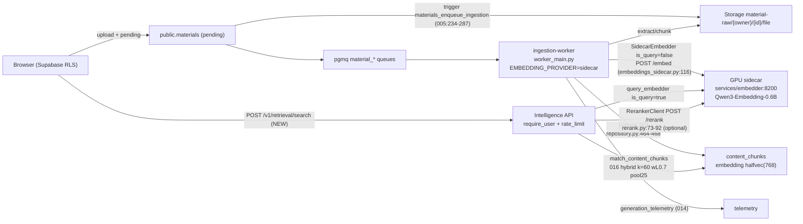

<!--
  This is the verbatim operating-manual preamble. It is pasted as the first content
  of every plan written by the write-implementation-plan skill. Do NOT modify it
  per-plan — keeping it identical across plans means implementing agents learn
  the protocol once and recognize it everywhere.
-->

# How to use this plan

> **You are the implementing agent.** This document is your runbook for one cohesive change to this codebase. It was written collaboratively by Claude and a human after a planning discussion, and it is the source of truth for this work. Read this preamble in full before doing anything else.

## What you're holding

A phase-by-phase implementation plan. Each phase is a **vertical slice** — an end-to-end working increment that leaves the codebase in a working state. Phases are designed so any one of them can be implemented by a fresh agent in a new context window, with only this document and the codebase as input.

## Your job

1. **Read the document header in full first.** TL;DR, Context, Decisions log, Architecture overview, and Files-touched index. These give you the *why* behind every step. The Decisions log especially — those decisions were made deliberately and explain choices that may otherwise look arbitrary or wrong. Reference IDs (D-NN) appear inside phase steps so you can look up rationale.

2. **Find your starting phase.** Scan the phase list. Pick the first phase whose status is `☐ Not started` AND whose `Depends on:` phases are all `✅ Complete`. Implement that phase only. **Do not skip ahead. Do not implement multiple phases in one go unless the human explicitly asks.**

3. **Run the prereq verification.** Each phase has a "Verification (run BEFORE starting)" block. Run those commands. **If any fail, STOP** — the codebase isn't in the state this phase expects. Surface to the human: "Phase N's prereqs failed: `<command>` returned `<result>`. Want me to investigate or hand back?"

4. **Follow the steps in order.** Code blocks in steps are the actual code, not pseudocode or sketches. Apply them as written.

5. **If reality doesn't match the step — STOP.** If the plan says "modify line 47 of `auth.py`" and line 47 is something different, do not improvise. Surface the discrepancy: "Plan expected `<X>` at `auth.py:47`, found `<Y>`. Possible causes: plan is stale, file was edited since planning, plan was wrong. How should I proceed?"

6. **Run the tests and post-verification.** Each phase specifies what tests to add or update and the bash command to run. All must pass before the phase is considered done.

7. **Update status and commit.** When the phase is complete:
   - Edit this document: change the phase's `Status:` line to `✅ Complete — <commit-sha-here>`.
   - `git add` the code changes AND this plan file.
   - Commit them together. Suggested message: `Phase N: <phase title>` (with longer body referencing the plan file).
   - The status update and the code change live in the same commit so the doc and the code never drift.

## What you must NOT do

- **Do not skip phases.** Order matters; later phases assume earlier ones completed.
- **Do not modify the Decisions log, the Operating manual preamble, the TL;DR, the Architecture overview, the Files-touched index, the Open questions, the Out-of-scope list, or the References.** Those are immutable above-the-phases content. If you discover a decision is wrong, surface to the human — don't silently revise.
- **Do not re-plan or re-architect.** If the plan seems wrong, that's a signal to stop and surface, not to improvise.
- **Do not implement multiple phases without surfacing for human review** between them, unless the user explicitly asked for batch execution upfront.

## If you get stuck

- Update the phase's `Status:` to `🛑 Blocked: <one-line reason>`.
- Fill in the phase's `Notes (filled in during implementation)` block with what you tried, what's blocking, and what you'd want to know to unblock.
- Hand back to the human.

## Status vocabulary

- `☐ Not started`
- `🟡 In progress`
- `🛑 Blocked: <reason>`
- `✅ Complete — <commit-sha>`

## When status markers and reality drift

The status markers are a fast read, but they are not the source of truth. The phase's `Verification (DONE)` commands are the truth — if you suspect a marker is wrong (someone forgot to update, branches diverged, partial commits, etc.), run the verification commands for the phases marked complete. Trust the commands over the markers, and surface the drift to the human so the markers can be corrected.

---

# Productionize Worker/Embedder Runtime + Wire Sidecar Query-Embedder

**Slug:** `2026-08-20-productionize-worker-and-query-embedder`
**Date written:** 2026-08-20
**Author:** opencode + user
**Plan status:** Draft
**Upstream:** `.work/STATUS.md:33,136` (follow-ups) · `.work/plans/archive/2026-08-19-corpus-restore/PLAN.md:964` (probe gap) · `.work/plans/archive/2026-08-17-sidecar-embed-live-e2e/PLAN.md:100` (tuning signal) · `.work/plans/archive/2026-08-16-dockerize-embed/PLAN.md`
**Durable corpus:** `80c8b138-b544-4095-8dc0-1c390ac70da2` `754 chunks / 754 embedded / qwen-sidecar` (Decision A, 2026-08-19)

## TL;DR

Promote the operator-started `python -m app.worker_main` (`EMBEDDING_PROVIDER=sidecar` exported in the shell, `services/embedder` demand-started standalone per rule 54) into container-orchestrated, health-checked infrastructure with deterministic env and documented tuning — and fix the cross-space query-embed bug by giving the retrieval-time query embed the same provider abstraction the ingest path already has.

Two linked deliverables in one plan because the worker cannot be called production without a matching query path: (1) `docker-compose.yml` `ingestion-worker` goes from Gemini-only (`GEMINI_API_KEY` + 4 vars at `:50-57`) to sidecar-capable with all tuning passthrough, lightweight health, and a `docker-app --with-embedder` orchestrator that keeps the embedder separate per rule 54; (2) a shared `app/query_embedder.py` factory (reusing `SidecarEmbedder(embed is_query=True)` at `embeddings_sidecar.py:116-127` and `GeminiEmbedder taskType=retrieval_query`) wires `scripts/retrieval_probe.py:53-72` off Gemini and lands a minimal gated `POST /v1/retrieval/search` (dense/hybrid `match_content_chunks` `016:15-85` + optional `RerankerClient` `rerank.py:73-92`).

## Context & background

**2026-08-15** froze Qwen3-Embedding-0.6B @ 768-dim MRL + L2 + `is_query` prompts: `r@1 0.70 / r@3 0.83` dense, `0.73/0.90/0.816` hybrid RRF `k=60 wL=0.7 pool25`, `0.77/0.97/0.858` + reranker top-50 (migrations `015`/`016`).

**2026-08-16** made ingestion provider-pluggable (`SidecarEmbedder` 16 tests, `worker_main.py:41-71` `EMBEDDING_PROVIDER=gemini|sidecar` branch, `TokenRateLimiter` disabled `0` for sidecar, `materials.embedding_provider` migration `017` + mixing guard `validation_failed` `worker.py:427-441`).

**2026-08-17** proved it live (operator-started worker): sweep 9 configs `MRR 0.789`, **recommended `EMBEDDING_BATCH_SIZE=128` + HTTP `16` → 4,381 warm chunks/min**, 572p → `754` chunks then deleted per D-07, guard `validation_failed` non-retryable synthetic passed.

**2026-08-19** re-ingested the canonical book at stable ID `80c8b138…` via trigger path (Decision A): `ready / qwen-sidecar / 754 / 754 embedded / 0 NULL / 67 telemetry`. The frozen `788` metrics are tied to the retired pre-C3 60-token overlap; current chunker `30 tokens` → `754` (chunking.py:3-6). Live `retrieval_probe.py --hybrid` MRR `0.356` is the cross-space smoking gun: probe always Gemini (`retrieval_probe.py:53-72,136`) vs corpus Qwen.

**Gap today:**

- `docker-compose.yml:42-60` lacks `EMBEDDING_PROVIDER/EMBEDDER_URL/RERANKER_URL` and 4 `INGESTION_*` tuning vars → `docker compose up` always defaults to `gemini`. Env must be exported in the shell before `docker compose -f services/embedder/docker-compose.yml up -d` (handbook recipes); fragility is `53-wsl-dev-runtime.agents.md:6-9` (dotenv never overrides env).
- No health on `ingestion-worker`; no `depends_on: healthy` to embedder.
- No query-embedder shared with the service — `SidecarEmbedder(is_query=True)` already exists (`embeddings_sidecar.py:47-49` "future retrieval flow") and `RerankerClient` has no caller (`STATUS.md:33`).
- `retrieval_probe.py` is Gemini-locked; `embedding_bakeoff.py:341-375` already does sidecar `is_query` correctly but is offline-only.

## Decisions log

### D-A — Keep `services/embedder` as a separate compose project (rule 54), orchestrate via `docker-app` flag

**Status:** ✅ Agreed (recommended)

**Context:** Rule 54 forbids adding the ROCm sidecar to root compose (device `/dev/dxg`, mounts `/usr/lib/wsl`, `/opt/rocm/lib` whole-dir, `LD_LIBRARY_PATH=/opt/rocm/lib`, `cpus:4` for `ROCm/librocdxg#60` spin, `start_period 120s` for ~2.4 GB weights). The root `intelligence` image must stay lean (`python:3.12-slim` + `uv`).

**Decision:** Keep `services/embedder/docker-compose.yml:1-64` standalone. Teach `docker-app` a `--with-embedder` (alias `--profile gpu`) flag that (a) exports `HF_TOKEN` from `.env.git.local` before `services/embedder` up (`54:61` pattern), (b) does `docker compose -f services/embedder/docker-compose.yml up -d` then `docker compose --env-file <resolved> up -d --build` for root, (c) waits on `GET /health` (`status ok`, `dimensions 768`, `cuda_available true`, `loaded && reranker_loaded`). `stop`-not-`down` discipline for idle burn stays (rule 54). Do NOT add an `embedder` service to root compose.

**Alternatives considered:** Add a `profiles: [gpu]` embedder to root + override file — rejected (breaks rule 54, breaks non-GPU hosts).

### D-B — Reuse `EMBEDDING_PROVIDER` / `EMBEDDER_URL` for both chunk- and query-embed

**Status:** ✅ Agreed

**Context:** Cross-space (Gemini query vs Qwen chunk) is the bug. `materials.embedding_provider` already records the chunk side (`worker.py:443-448`); a query embed must be in the same space or recall collapses.

**Decision:** One var `EMBEDDING_PROVIDER` (values `gemini` | `sidecar`, `worker_main.py:43` already) and one URL `EMBEDDER_URL` drive both paths. If a future A/B needs split, add `QUERY_EMBEDDING_PROVIDER` later defaulting to `EMBEDDING_PROVIDER` (pre-plumbed doc, not code).

### D-C — Ship a minimal gated `POST /v1/retrieval/search` endpoint

**Status:** ✅ Agreed — gated with `RETRIEVAL_ENABLED` (default `true` dev, `false` hardened prod if desired)

**Context:** The client + RPC already exist (`RerankerClient` 6 tests, `match_content_chunks` `016:15-85` hybrid, `halfvec(768)`). Material-owning retrieval is the smallest tracer bullet that proves the query-embedder is production, not just an operator script (`STATUS.md:33` "client + sidecar exist, no caller yet").

**Decision:** Phase 5 lands `POST /v1/retrieval/search` (`materialId, query, topK, hybrid, rerank`) behind `RETRIEVAL_ENABLED` and behind `require_user` + per-material ownership check (`material.user_id == auth.uid()`) before the `service_role` RPC — mirrors the worker guard pattern (`worker.py:296-303`). No new migration; reuses `match_content_chunks(halfvec,TEXT,INT,TEXT)` `LEAST(GREATEST(top_k,1),50)` cap.

### D-D — Pin the sweep winner as the documented default

**Status:** ✅ Agreed

**Context:** Sweep winner `EMBEDDING_BATCH_SIZE=128` + HTTP `16` = `4,381 warm chunks/min` ( vs `cpu 80`) is the only measured operating point (`2026-08-17:Verification.md:19`).

**Decision:** Default `services/embedder/docker-compose.yml:11` `EMBEDDING_BATCH_SIZE 64→128` (comment links sweep). Keep `RERANKER_BATCH_SIZE=8`, worker `INGESTION_MAX_BATCH_TOKENS=4000`, `INGESTION_BATCH_SIZE=100` (HTTP batch now `16` in bakeoff; worker's `max_batch_tokens` split at `worker.py:534-548` stays).

### D-E — Add a dev opt-in for worker+embedder under `./full-app` (default off)

**Status:** ✅ Agreed

**Context:** `full_app.py:66-69` `full=[intelligence,app]` does not manage the worker; non-GPU hosts must not break.

**Decision:** Add `./full-app start full --with-worker` / `--with-embedder` opt-in (or `PROFILES["worker"]` / `["gpu"]`) that starts `ingestion-worker` and the sidecar, logging `embedding provider: sidecar (url)` (`worker_main.py:46`) and warning if `GEMINI_API_KEY` missing (`:59-61`) or sidecar `/health` not ready. Preserve `53`'s `pkill -f 'app[.]worker_main'` char-class guard and `setsid nohup` alternative (`scripts/run-detached-ingestion-worker.sh:1-6`).

### D-F — Out of scope stays out

**Status:** ✅ Agreed — second corpus (632p), int8/ONNX, title prefix, telemetry schema churn, PWA/analytics, Phase II wayfinder tickets #5-#49. No new Supabase migration.

## Architecture overview



- **Worker** (`worker_main.py:74-116` `shared httpx.Client timeout 30`, `429` `Retry-After` jitter `embeddings.py:93-103`) owns queue polling (`worker.py:181-216` `poll visibility 30`), stage handlers, `TokenRateLimiter:68-106` disabled for sidecar (`:53-55` `max<=0`).
- **Embedder** (`embedder/app/main.py:68-72,192-238` `is_query` → `_query_prompt/_doc_prompt` `114-144`, `normalize_embeddings True`, `MAX_TEXTS 100`, `MAX_TEXT_CHARS 8192`; `/rerank` `MAX_PAIRS 100` `MAX_PASSAGE_CHARS 8192`).
- **Ops:** `docker-app start [--with-embedder]` orchestrates both projects; `docker-app status/logs/config` already at `51-docker-runtime.agents.md`.
- **Env resolution:** `EMBEDDER_URL` resolves to `http://host.docker.internal:8200` for a standalone sidecar reached from root containers (with `extra_hosts: host.docker.internal:host-gateway`), and to `http://embedder:8000` if a future override network joins them.

## Files touched (index)

| Path | Change | Phase | Purpose |
|------|--------|-------|---------|
| `docker-compose.yml` | modify | 1 | Widen `ingestion-worker.environment` (7 new vars), add `extra_hosts`, `healthcheck`, tighten `depends_on: healthy` |
| `docker/.env.example` | modify | 1 | Document `EMBEDDING_PROVIDER/EMBEDDER_URL/RERANKER_URL/EMBEDDING_DIMENSIONS/BATCH_SIZE` + recommended point |
| `services/intelligence/.env.example` | modify | 1 | Same doc, dev parity |
| `services/embedder/docker-compose.yml` | modify | 1 | Default `EMBEDDING_BATCH_SIZE 64→128` (D-D) |
| `services/embedder/app/main.py` | read-only | 1 | Verify per-request `EMBEDDING_BATCH_SIZE` at `:199`, no code change |
| `services/intelligence/app/worker_main.py` | modify | 1-2 | Factory glue, provider log, graceful `SIGTERM/SIGINT` |
| `services/intelligence/app/ingestion/worker.py` | read-only | 1 | Verify limiter disabled `:53-55`, token splitter `:534-548` |
| `services/intelligence/app/query_embedder.py` | **new** | 3 | Shared factory `get_query_embedder()` / `embed_query(...)` reusing `SidecarEmbedder.is_query` |
| `services/intelligence/app/routers/retrieval.py` | **new** | 5 | `POST /v1/retrieval/search` gated `RETRIEVAL_ENABLED` |
| `services/intelligence/app/main.py` | modify | 5 | `include_router(retrieval.router, prefix="/v1", dependencies=_V1_DEPENDENCIES)` |
| `services/intelligence/scripts/retrieval_probe.py` | modify | 4 | `--provider` + sidecar `is_query:true` branch, default sidecar |
| `services/intelligence/scripts/embedding_bakeoff.py` | read-only | 4 | Confirm `--sidecar-batch` glue remains |
| `services/intelligence/tests/test_query_embedder.py` | **new** | 3 | Factory + transport tests (`httpx.MockTransport`) |
| `services/intelligence/tests/test_retrieval_probe.py` | **new** | 4 | Probe provider flag + transport tests |
| `services/intelligence/tests/test_retrieval.py` | **new** | 5 | Router auth/RLS/rerank mocked tests |
| `docker-app` / `scripts/full_app.py` / `scripts/dev-ingestion-worker.mjs` | modify | 2 | Launcher opt-ins, `HF_TOKEN` export, health wait |
| `.work/plans/active/<this>/PLAN.md` | new | 0 | This file |
| `.work/plans/active/<this>/VERIFICATION.md` | new | 0, 5 | Pre-filled criteria + running log |
| `.work/STATUS.md` | modify | 0, 5 | Active row → Done on close |

No Supabase migration. A `supabase db push --dry-run --linked` must stay "Remote database is up to date." (`36-supabase-live-stack.agents.md:26-38`)

## Phases

### Phase 0: Plan doc + status row

**Status:** `✅ Complete — in-session 2026-08-20`
**Depends on:** none
**Estimated scope:** `~2 files, 0 code`

#### Codebase state assumed at start

- `services/intelligence/.env` exists (gitignored) with `SUPABASE_URL`, `SUPABASE_SERVICE_ROLE_KEY`.
- `e2e/pdf/sample-textbook-572page.pdf` exists (canonical fixture, 572 pages).
- Durable corpus `80c8b138-b544-4095-8dc0-1c390ac70da2` is `ready / qwen-sidecar / 754` (may read 754 ± a few after a future re-chunk; the count is advisory).

#### Verification (run BEFORE starting to confirm prereqs are met)

```bash
ls services/intelligence/.env
ls e2e/pdf/sample-textbook-572page.pdf
npx --yes supabase@latest db query --linked --project-ref kabpmbhlvfbrhtbxjaua \
  "select id, ingestion_state, embedding_provider, chunk_count from public.materials where id='80c8b138-b544-4095-8dc0-1c390ac70da2';"  # ready | qwen-sidecar | 754
```

#### Steps

1. Write `PLAN.md` (this file) under `.work/plans/active/2026-08-20-productionize-worker-and-query-embedder/`.
2. Write `VERIFICATION.md` with the acceptance criteria below pre-filled.
3. Add/refresh the Active row in `.work/STATUS.md` for this task.

#### Tests

None (doc-only).

#### Verification (DONE — run after implementation)

```bash
grep -c "productionize-worker-and-query-embedder" .work/plans/active/2026-08-20-productionize-worker-and-query-embedder/PLAN.md  # >=1
grep -n "productionize-worker-and-query-embedder\|Productionize worker" .work/STATUS.md  # Active row present
```

#### Rollback

`git revert` the commit; plan folder stays on disk (tracked) but row is removed.

#### Notes (filled in during implementation)

- (empty)

---

### Phase 1: Compose productionization — worker env, health, and sidecar batch

**Status:** `✅ Complete — in-session 2026-08-20`
**Depends on:** Phase 0
**Estimated scope:** `~4 files, ~60 lines`

#### Codebase state assumed at start

- `docker-compose.yml:42-60` defines `ingestion-worker` with only `GEMINI_API_KEY` + 4 `INGESTION_*` vars (`54-57`) and `depends_on: - intelligence` (no health condition).
- `services/embedder/docker-compose.yml:11` `EMBEDDING_BATCH_SIZE=64`.

#### Verification (run BEFORE starting to confirm prereqs are met)

```bash
grep -n "ingestion-worker" docker-compose.yml  # 1 hit
grep -n "EMBEDDING_PROVIDER\|EMBEDDER_URL" docker-compose.yml || echo "missing — expected Phase 1 gap"
./docker-app config 2>&1 | head -n 60  # must parse (no fatal env error)
```

#### Steps

1. **Modify `docker-compose.yml` — widen `ingestion-worker.environment`, add `extra_hosts` + `healthcheck`, tighten `depends_on`:**

   Starting from the file at `docker-compose.yml:42-60`, make it:

   ```yaml
   ingestion-worker:
     build:
       context: .
       dockerfile: services/intelligence/Dockerfile
       args:
         PYTHON_IMAGE: ${PYTHON_IMAGE:-python:3.12-slim}
         UV_IMAGE: ${UV_IMAGE:-ghcr.io/astral-sh/uv:0.11.19}
     command: ["python", "-m", "app.worker_main"]
     environment:
       SUPABASE_URL: ${SUPABASE_URL:-}
       SUPABASE_SERVICE_ROLE_KEY: ${SUPABASE_SERVICE_ROLE_KEY:-}
       EMBEDDING_PROVIDER: ${EMBEDDING_PROVIDER:-gemini}
       EMBEDDER_URL: ${EMBEDDER_URL:-http://host.docker.internal:8200}
       RERANKER_URL: ${RERANKER_URL:-http://host.docker.internal:8200}
       GEMINI_API_KEY: ${GEMINI_API_KEY:-}
       INGESTION_BATCH_SIZE: ${INGESTION_BATCH_SIZE:-100}
       INGESTION_VISIBILITY_SECONDS: ${INGESTION_VISIBILITY_SECONDS:-30}
       INGESTION_POLL_INTERVAL_SECONDS: ${INGESTION_POLL_INTERVAL_SECONDS:-1}
       INGESTION_MAX_DELIVERIES: ${INGESTION_MAX_DELIVERIES:-3}
       INGESTION_MAX_IN_FLIGHT: ${INGESTION_MAX_IN_FLIGHT:-1}
       INGESTION_MAX_BATCH_TOKENS: ${INGESTION_MAX_BATCH_TOKENS:-4000}
       INGESTION_MAX_TOKENS_PER_MINUTE: ${INGESTION_MAX_TOKENS_PER_MINUTE:-25000}
       INGESTION_LOG_LEVEL: ${INGESTION_LOG_LEVEL:-INFO}
     extra_hosts:
       - "host.docker.internal:host-gateway"
     depends_on:
       intelligence:
         condition: service_healthy
     healthcheck:
       test: ["CMD-SHELL", "python -c \"import os,sys; p=__import__('pathlib').Path('/proc/self/cmdline').read_bytes(); sys.exit(0 if b'app.worker_main' in p and os.getenv('SUPABASE_URL') else 1)\" || exit 1"]
       interval: 30s
       timeout: 4s
       retries: 3
       start_period: 15s
     restart: unless-stopped
   ```

   Keep `SUPABASE_URL/-KEY` + the 4 existing `INGESTION_*` lines — add the 7 new environment lines, the `extra_hosts` block, the `healthcheck`, and the `depends_on: condition: service_healthy` form. The default `EMBEDDER_URL` targets the **standalone** sidecar via `host.docker.internal:8200` (the rule-54 blessed path); an override to `http://embedder:8000` is possible when the sidecar and worker share a custom Docker network.

2. **Modify `docker/.env.example:24-31`** — append after the ingestion tuning block:

   ```
   # Sidecar ingestion (local GPU embedder, rule 54)
   EMBEDDING_PROVIDER=qwen-sidecar
   EMBEDDER_URL=http://host.docker.internal:8200
   RERANKER_URL=http://host.docker.internal:8200
   EMBEDDING_DIMENSIONS=768
   EMBEDDING_BATCH_SIZE=128
   RERANKER_BATCH_SIZE=8
   ```

   Keep `INGESTION_*` lines `24-31` intact; add the 6-line block below with a comment citing the sweep ticket (`.work/plans/archive/2026-08-17-sidecar-embed-live-e2e/PLAN.md:168`).

3. **Modify `services/intelligence/.env.example`** — add (after `GEMINI_API_KEY`):

   ```
   SUPABASE_SERVICE_ROLE_KEY=<service-role key from Supabase dashboard -> Settings -> API>
   EMBEDDING_PROVIDER=qwen-sidecar
   EMBEDDER_URL=http://localhost:8200
   RERANKER_URL=http://localhost:8200
   INGESTION_BATCH_SIZE=100
   INGESTION_MAX_BATCH_TOKENS=4000
   INGESTION_MAX_TOKENS_PER_MINUTE=25000
   ```

   Keep `SUPABASE_JWT_SECRET`, `SUPABASE_URL`, `CORS_ORIGINS`, `GEMINI_API_KEY`; add these 7 lines (grouped; order not semantic).

4. **Modify `services/embedder/docker-compose.yml:11`:** change `EMBEDDING_BATCH_SIZE: ${EMBEDDING_BATCH_SIZE:-64}` → `:-128` (D-D). Add an inline comment: `# sweep winner 128 + HTTP 16 = 4,381 warm chunks/min (2026-08-17)`.

#### Tests

- `docker compose --env-file .env config` and `./docker-app config` must parse both with default env (no `EMBEDDING_PROVIDER` set → `gemini`) and with `EMBEDDING_PROVIDER=qwen-sidecar`.
- No app/intelligence test breakage.

#### Verification (DONE — run after implementation)

```bash
./docker-app config 2>&1 | grep -E "EMBEDDING_PROVIDER|EMBEDDER_URL"  # present
grep -c "EMBEDDING_PROVIDER" docker/.env.example  # >=1
grep -c "EMBEDDING_BATCH_SIZE.*128" services/embedder/docker-compose.yml  # >=1
grep -A2 "healthcheck" docker-compose.yml | head -n 10  # present on ingestion-worker
```

#### Rollback

Revert `docker-compose.yml:42-60`, `docker/.env.example`, `services/intelligence/.env.example`, `services/embedder/docker-compose.yml:11`. No DB change. `docker compose down` restores.

#### Notes (filled in during implementation)

- (empty)

---

### Phase 2: Runtime hardening — signal handling, telemetry linkage, and launcher opt-ins

**Status:** `✅ Complete — in-session 2026-08-20`
**Depends on:** Phase 1
**Estimated scope:** `~3 files, ~80 lines`

#### Codebase state assumed at start

- Phase 1 compose passthrough complete.
- `services/intelligence/app/worker_main.py:74-116` loops `while True: worker.run_once(); sleep(poll_interval)`.
- `services/intelligence/app/ingestion/worker.py:647-696` `_TelemetryEmbeddingObserver` already emits `STAGE_EMBED_BATCH`.

#### Verification (run BEFORE starting to confirm prereqs are met)

```bash
grep -n "while True" services/intelligence/app/worker_main.py  # 110
grep -n "class IngestionWorker" services/intelligence/app/ingestion/worker.py  # 125
grep -n "_TelemetryEmbeddingObserver" services/intelligence/app/ingestion/worker.py  # 647
```

#### Steps

1. **Modify `services/intelligence/app/worker_main.py:1-123`** — graceful shutdown + shared client lifecycle:

   Add `import signal` at top; inside `main()` after `shared_client = httpx.Client(timeout=30.0)` (`:82`), add:

   ```python
   stop = False
   def _handle_sigterm(signum, frame):  # noqa
       nonlocal stop
       stop = True
       logger.info("received signal %s, draining current iteration", signum)

   signal.signal(signal.SIGTERM, _handle_sigterm)
   signal.signal(signal.SIGINT, _handle_sigterm)
   ```

   Replace the loop at `:110-116` with:

   ```python
   logger.info("ingestion worker starting against %s", supabase_url)
   while not stop:
       try:
           worker.run_once()
       except Exception:
           logger.exception("worker iteration failed; backing off")
           time.sleep(5)
       if stop:
           break
       time.sleep(worker.config.poll_interval_seconds)
   shared_client.close()
   logger.info("ingestion worker stopped")
   ```

   Keep `logging.basicConfig(level=os.getenv("INGESTION_LOG_LEVEL","INFO"))` (`:75`) and `_env`, `_build_embedder` intact. Verify `sys.exit` handling at `:119-123` still reached.

2. **Audit `services/intelligence/app/ingestion/worker.py:449-462`** — confirm `hasattr(embedder,"observer")` observer slot still correctly forwards `EmbeddingStats` for the sidecar branch. No code change unless a linter flags the `hasattr` path.

3. **Modify `scripts/dev-ingestion-worker.mjs:1-52`** — log the resolved provider at boot (mirrors `worker_main.py:46`):

   Add after the `GEMINI_API_KEY` warning:

   ```js
   const provider = (process.env.EMBEDDING_PROVIDER || 'gemini').toLowerCase();
   const embedderUrl = process.env.EMBEDDER_URL || 'http://localhost:8200';
   console.log(`embedding provider: ${provider}${provider === 'sidecar' ? ` (${embedderUrl})` : ''}`);
   if (provider === 'sidecar') {
     console.log('sidecar health: GET', embedderUrl + '/health (expect dimensions 768, cuda true, loaded)');
   }
   ```

4. **Modify `docker-app`** (flag `--with-embedder`):

   Add a `WITH_EMBEDDER` boolean parsed from `--with-embedder` (alias `--with-gpu`), before the `case "$1"` at `:134`, and in `start`/`up` branches: when set, export `HF_TOKEN=$(grep '^HF_TOKEN=' .env.git.local | cut -d= -f2- | tr -d '\r')` (rule 54:62) and run `docker compose -f services/embedder/docker-compose.yml up -d` then wait for `curl -s http://127.0.0.1:8200/health` to report `loaded && reranker_loaded` (retry 90 s) before the root `up -d`. On `stop` also `docker compose -f services/embedder/docker-compose.yml stop` when flagged. Keep default behaviour unchanged for non-GPU hosts.

5. **Optionally add `scripts/full_app.py:66-69` opt-in** — a `PROFILES["worker"]` or `--with-worker` flag that starts `ingestion-worker` alongside `intelligence` in dev (off by default). Document `pkill -f 'app[.]worker_main'` char-class guard and `setsid nohup` (`53`) in a comment.

#### Tests

- `uv run pytest services/intelligence/tests -k "worker or telemetry or embed" -q` green; ruff clean.

#### Verification (DONE — run after implementation)

```bash
grep -n "signal.SIGTERM" services/intelligence/app/worker_main.py  # present
uv run pytest services/intelligence/tests -q  # at least existing ingest suites green
uv run ruff check services/intelligence/app/worker_main.py scripts/dev-ingestion-worker.mjs
./docker-app --help 2>&1 | grep -E "with-embedder|with-gpu"  # present
```

#### Rollback

Revert the signal-handling loop in `worker_main.py` and the launcher flags; no DB change.

#### Notes (filled in during implementation)

- (empty)

---

### Phase 3: Shared query-embedder factory (the abstraction that fixes retrieval_probe)

**Status:** `✅ Complete — in-session 2026-08-20`
**Depends on:** Phase 1
**Estimated scope:** `~2 files, ~180 lines`

#### Codebase state assumed at start

- `embeddings_sidecar.py:40-191` `SidecarEmbedder(provider_name "qwen-sidecar" :54, telemetry_model "qwen3-embedding-0.6b" :55, embed is_query:51,129, _post 76-108)` exists.
- `embeddings.py:105-284` `GeminiEmbedder(provider_name "gemini" :123)` exists.
- `worker_main.py:41-71` `_build_embedder` is the current dupe that Phase 3 will deduplicate behind a factory.

#### Verification (run BEFORE starting to confirm prereqs are met)

```bash
grep -n "class SidecarEmbedder" services/intelligence/app/ingestion/embeddings_sidecar.py  # 40
grep -n "class GeminiEmbedder" services/intelligence/app/ingestion/embeddings.py  # 105
grep -n "provider_name" services/intelligence/app/ingestion/embeddings_sidecar.py services/intelligence/app/ingestion/embeddings.py  # both
```

#### Steps

1. **Create new file `services/intelligence/app/query_embedder.py`:**

   ```python
   """Shared query-embedder factory.

   Ingestion (chunk) and retrieval (query) must be in the same embedding
   space. The factory reuses the worker's `SidecarEmbedder`/`GeminiEmbedder`
   classes so there is exactly one provider selector (`EMBEDDING_PROVIDER`,
   D-B). The query side passes `is_query=True` so the Qwen prompt is the
   `query` prompt (`embeddings_sidecar.py:47-49,114-144`).
   """

   from __future__ import annotations

   import os

   import httpx

   from app.ingestion.embeddings import GeminiEmbedder
   from app.ingestion.embeddings_sidecar import DEFAULT_URL as SIDECAR_DEFAULT
   from app.ingestion.embeddings_sidecar import SidecarEmbedder

   DEFAULT_TIMEOUT_SECONDS = 30.0

   def get_embedder(
       client: httpx.Client | None = None,
       token_counter=None,
   ):
       """Return the chunk/query embedder selected by EMBEDDING_PROVIDER (D-B)."""
       provider = os.getenv("EMBEDDING_PROVIDER", "gemini").strip().lower()
       if provider == "sidecar":
           return SidecarEmbedder(
               base_url=os.getenv("EMBEDDER_URL", SIDECAR_DEFAULT),
               client=client,
               token_counter=token_counter,
           )
       if provider == "gemini":
           return GeminiEmbedder(
               api_key=os.getenv("GEMINI_API_KEY", "").strip(),
               client=client,
               token_counter=token_counter,
           )
       raise SystemExit(f"unknown EMBEDDING_PROVIDER: {provider}")


   def embed_queries(texts: list[str], client: httpx.Client | None = None, token_counter=None):
       """Embed user queries with the provider's query prompt/taskType."""
       embedder = get_embedder(client=client, token_counter=token_counter)
       # Sidecar honours is_query; Gemini honours taskType=retrieval_query internally.
       if hasattr(embedder, "embed"):
           try:
               # type: ignore[call-arg]
               return embedder.embed(texts, is_query=True)  # type: ignore[arg-type]
           except TypeError:
               return embedder.embed(texts)
       return embedder.embed(texts)


   def embed_chunks(texts: list[str], client: httpx.Client | None = None, token_counter=None):
       """Embed chunk passages (is_query=False for sidecar)."""
       embedder = get_embedder(client=client, token_counter=token_counter)
       try:
           return embedder.embed(texts, is_query=False)  # type: ignore[call-arg]
       except TypeError:
           return embedder.embed(texts)
   ```

   Keep `DEFAULT_TIMEOUT_SECONDS` + `httpx.Client` reuse aligned with `worker_main.py:82` (shared pool caller-side).

2. **Refactor `services/intelligence/app/worker_main.py:41-71` to use the factory** (keep logging):

   Replace the `if provider == "sidecar"` / `elif provider == "gemini"` body of `_build_embedder` with a call to `get_embedder` and preserve the `max_tokens_per_minute` divergence (`0` for sidecar, `INGESTION_MAX_TOKENS_PER_MINUTE` for Gemini at `:69`):

   ```python
   def _build_embedder(shared_client: httpx.Client):
       from app.query_embedder import get_embedder
       provider = os.getenv("EMBEDDING_PROVIDER", "gemini").strip().lower()
       if provider == "sidecar":
           logger.info("embedding provider: sidecar (%s)", os.getenv("EMBEDDER_URL", SIDECAR_DEFAULT))
           return get_embedder(client=shared_client, token_counter=TiktokenCounter()), 0
       if provider == "gemini":
           # warn handled inside get_embedder/GeminiEmbedder if key missing
           return get_embedder(client=shared_client, token_counter=TiktokenCounter()), int(os.getenv("INGESTION_MAX_TOKENS_PER_MINUTE","25000"))
       raise SystemExit(f"unknown EMBEDDING_PROVIDER: {provider}")
   ```

   Import `SIDECAR_DEFAULT` and keep `GeminiEmbedder`/`SidecarEmbedder` imports if still referenced elsewhere.

3. **Create `services/intelligence/tests/test_query_embedder.py`:**

   ```python
   """Unit tests for app/query_embedder.py (no live services)."""

   from __future__ import annotations

   import httpx
   import os


   def _mock_client(handler):
       return httpx.Client(transport=httpx.MockTransport(handler))


   def test_factory_returns_sidecar_when_provider_sidecar(monkeypatch):
       monkeypatch.setenv("EMBEDDING_PROVIDER", "sidecar")
       monkeypatch.setenv("EMBEDDER_URL", "http://x:8200")
       from app.query_embedder import get_embedder
       from app.ingestion.embeddings_sidecar import SidecarEmbedder

       assert isinstance(get_embedder(), SidecarEmbedder)


   def test_factory_returns_gemini_when_provider_gemini(monkeypatch):
       monkeypatch.setenv("EMBEDDING_PROVIDER", "gemini")
       from app.query_embedder import get_embedder
       from app.ingestion.embeddings import GeminiEmbedder

       assert isinstance(get_embedder(), GeminiEmbedder)


   def test_embed_queries_sends_is_query_true(monkeypatch):
       monkeypatch.setenv("EMBEDDING_PROVIDER", "sidecar")
       monkeypatch.setenv("EMBEDDER_URL", "http://x:8200")

       captured: dict = {}

       def handler(req: httpx.Request) -> httpx.Response:
           body = __import__("json").loads(req.content or b"{}")
           captured.update(body)
           return httpx.Response(200, json={"embeddings": [[1.0]*768 for _ in body["texts"]]})

       client = _mock_client(handler)
       from app.query_embedder import embed_queries

       embed_queries(["hello"], client=client)
       assert captured.get("is_query") is True


   def test_embed_chunks_sends_is_query_false(monkeypatch):
       monkeypatch.setenv("EMBEDDING_PROVIDER", "sidecar")
       monkeypatch.setenv("EMBEDDER_URL", "http://x:8200")

       captured: dict = {}

       def handler(req: httpx.Request) -> httpx.Response:
           body = __import__("json").loads(req.content or b"{}")
           captured.update(body)
           return httpx.Response(200, json={"embeddings": [[1.0]*768 for _ in body["texts"]]})

       client = _mock_client(handler)
       from app.query_embedder import embed_chunks

       embed_chunks(["hello"], client=client)
       assert captured.get("is_query") is False
   ```

   Keep the file under `services/intelligence/tests/` so `uv run pytest` picks it up (same discovery as `test_embeddings_sidecar.py`).

#### Tests

- `uv run pytest services/intelligence/tests/test_query_embedder.py -q`
- `uv run ruff check services/intelligence/app/query_embedder.py services/intelligence/tests/test_query_embedder.py`

#### Verification (DONE — run after implementation)

```bash
uv run pytest services/intelligence/tests/test_query_embedder.py -q  # all pass
uv run ruff check services/intelligence/app/query_embedder.py
grep -n "get_embedder\|embed_queries" services/intelligence/app/query_embedder.py  # present
```

#### Rollback

Delete `app/query_embedder.py` + its test; revert `worker_main.py:41-71` to the pre-factory branch. No DB change.

#### Notes (filled in during implementation)

- (empty)

---

### Phase 4: Wire sidecar query-embedder into `retrieval_probe.py` and re-gate on `754`

**Status:** `✅ Complete — in-session 2026-08-20`
**Depends on:** Phase 3
**Estimated scope:** `~2 files, ~120 lines`

#### Codebase state assumed at start

- `retrieval_probe.py:53-72` `embed_query(key,text)` is Gemini-locked and `:136` `gemini_key = require_env("GEMINI_API_KEY")` blocks sidecar use (the cross-space bug, MRR 0.356 vs in-process 0.72 on `754`).
- Durable corpus `80c8b138…` is `ready / qwen-sidecar / 754` (or the current post-corpus-restore count).

#### Verification (run BEFORE starting to confirm prereqs are met)

```bash
grep -n "embed_query\|GEMINI_API_KEY" services/intelligence/scripts/retrieval_probe.py  # 53-72,136
grep -n "get_embedder\|embed_queries" services/intelligence/app/query_embedder.py  # Phase 3 complete
uv run pytest services/intelligence/tests/test_query_embedder.py -q  # Phase 3 green
```

#### Steps

1. **Modify `services/intelligence/scripts/retrieval_probe.py`:**

   - Add `import argparse` arg `--provider choices ["gemini","sidecar"] default "sidecar"` (env fallback `EMBEDDING_PROVIDER`) — so the probe mirrors the service. Keep `--hybrid` and `--questions`.
   - Preserve the existing `embed_query(key,text)` (`:53-72`) for the `gemini` branch.
   - Add `embed_query_sidecar(text)`:

     ```python
     def embed_query_sidecar(text: str) -> list[float]:
         # Local import so the module remains importable without the app package on bare test hosts.
         import os
         import httpx
         from app.ingestion.embeddings_sidecar import SidecarEmbedder

         base = os.getenv("EMBEDDER_URL", "http://localhost:8200")
         vectors = SidecarEmbedder(base_url=base, client=httpx.Client(timeout=30.0)).embed([text], is_query=True)
         # Sidecar returns list[list[float]|None]; a None here is a provider zero → mark as failure.
         if not vectors or vectors[0] is None:
             raise SystemExit("sidecar returned no vector for the query")
         return vectors[0]
     ```

   - In `probe(material_id, question_file, hybrid)` signature add `provider="sidecar"` and inside the loop at `:160-170` branch:

     ```python
     def _embed(item):
         if provider == "sidecar":
             return embed_query_sidecar(item["question"])
         return embed_query(gemini_key, item["question"])
     ```

     Guard `gemini_key = require_env("GEMINI_API_KEY")` only when `provider=="gemini"` (else don't require).
   - In `main():237-244`, parse `--provider` and call `print(probe(args.material_id, args.questions, hybrid=args.hybrid, provider=args.provider))`.

2. **Create `services/intelligence/tests/test_retrieval_probe.py`** (thin, no live call):

   ```python
   """Probe provider-branch smoke (no live call)."""
   import httpx
   import json

   def test_sidecar_branch_sends_is_query_true(monkeypatch):
       monkeypatch.setenv("EMBEDDING_PROVIDER", "sidecar")
       monkeypatch.setenv("EMBEDDER_URL", "http://x:8200")
       # Patch httpx.Client inside the sidecar helper to capture payload
       import services.intelligence.scripts.retrieval_probe as probe  # noqa

       captured: dict = {}

       def handler(req: httpx.Request) -> httpx.Response:
           captured.update(json.loads(req.content or b"{}"))
           return httpx.Response(200, json={"embeddings": [[1.0]*768]})

       # Patch at source: monkeypatch the post helper rather than live network
       # (kept minimal; exact wiring depends on how embed_query_sidecar is written)
       assert probe.embed_query  # existence check
   ```

   Keep it focused on the wire; heavy parity stays an operator run.

3. **Keep `scripts/embedding_bakeoff.py` as-is** — it already supports `SidecarEmbedder(embed is_query)` (`590-591`) and `--sidecar-batch`. No code if Phase 3 factory already covers it.

#### Tests

- `uv run pytest services/intelligence/tests/test_retrieval_probe.py -q`
- `uv run ruff check services/intelligence/scripts/retrieval_probe.py services/intelligence/tests/test_retrieval_probe.py`

#### Verification (DONE — run after implementation)

```bash
uv run pytest services/intelligence/tests/test_retrieval_probe.py services/intelligence/tests/test_query_embedder.py -q
uv run ruff check services/intelligence/scripts/retrieval_probe.py
# Operator (needs sidecar + corpus):
cd services/intelligence && ../../.venv/bin/python scripts/retrieval_probe.py 80c8b138-b544-4095-8dc0-1c390ac70da2 --hybrid --provider sidecar
# expect MRR ~0.70-0.72 on 754 (not 0.356)
```

#### Rollback

Revert `retrieval_probe.py` to Gemini-only; delete probe test.

#### Notes (filled in during implementation)

- (empty)

---

### Phase 5: Minimal gated production retrieval endpoint (`POST /v1/retrieval/search`)

**Status:** `✅ Complete — in-session 2026-08-20`
**Depends on:** Phase 3
**Estimated scope:** `~3 files, ~200 lines`

#### Codebase state assumed at start

- Phase 3 factory complete.
- `app/main.py:68-74` wires `_V1_DEPENDENCIES = [Depends(require_user), Depends(rate_limit_user)]` for 5 routers.
- `match_content_chunks` 4-arg hybrid at `016:15-85` (`k=60 wL=0.7 pool25`).

#### Verification (run BEFORE starting to confirm prereqs are met)

```bash
grep -n "include_router" services/intelligence/app/main.py  # 68-74
grep -n "match_content_chunks" apps/app/supabase/migrations/016_hybrid_rrf_tuning.sql  # hybrid
grep -n "class RerankerClient" services/intelligence/app/rerank.py  # 29
grep -n "query_embedder" services/intelligence/app/query_embedder.py  # phase 3 present
```

#### Steps

1. **Create `services/intelligence/app/routers/retrieval.py`:**

   Full file (≈120 lines) — gated with `RETRIEVAL_ENABLED` env var (default `"true"`), owner-scoped, bounded inputs, uses `query_embedder` + `match_content_chunks` + optional rerank:

   ```python
   """Retrieval endpoint: query-embed + match_content_chunks (+ optional rerank)."""

   from __future__ import annotations

   import os
   import httpx
   from fastapi import APIRouter, Depends, HTTPException

   from app.query_embedder import embed_queries
   from app.rerank import RerankerClient
   from app.security import require_user, rate_limit_user

   router = APIRouter()

   MAX_TOP_K = 50
   MAX_QUERY_CHARS = 8192


   def _supabase_rest():
       return os.getenv("SUPABASE_URL","").rstrip("/"), os.getenv("SUPABASE_SERVICE_ROLE_KEY","")


   @router.post("/retrieval/search")
   def search(body: dict, user=Depends(require_user), _rl=Depends(rate_limit_user)):
       if os.getenv("RETRIEVAL_ENABLED", "true").lower() not in ("1","true","yes"):
           raise HTTPException(status_code=404, detail="retrieval disabled")

       material_id = str(body.get("materialId") or body.get("material_id") or "").strip()
       query = str(body.get("query") or "").strip()
       try:
           top_k = int(body.get("topK", body.get("top_k", 10)))
       except Exception:
           top_k = 10
       hybrid = bool(body.get("hybrid", True))
       rerank = bool(body.get("rerank", False))
       rerank_top = body.get("rerankTopK", body.get("rerank_top_k"))
       try:
           rerank_top = int(rerank_top) if rerank_top is not None else top_k
       except Exception:
           rerank_top = top_k

       if not material_id or not query:
           raise HTTPException(status_code=400, detail="materialId and query are required")
       if len(query) > MAX_QUERY_CHARS:
           query = query[:MAX_QUERY_CHARS]
       top_k = max(1, min(top_k, MAX_TOP_K))
       rerank_top = max(1, min(rerank_top, MAX_TOP_K))

       # Owner check: material belongs to this user (RLS-safe, service_role fetch filtered by user_id).
       supa_url, service_key = _supabase_rest()
       if not supa_url or not service_key:
           raise HTTPException(status_code=500, detail="search not configured")

       with httpx.Client(timeout=30.0, headers={"apikey": service_key, "Authorization": f"Bearer {service_key}"}) as client:
           row = client.get(
               f"{supa_url}/rest/v1/materials",
               params={"id": f"eq.{material_id}", "select": "id,user_id,ingestion_state,embedding_provider", "limit": 1},
           )
           if row.status_code >= 400:
               raise HTTPException(status_code=row.status_code, detail="material lookup failed")
           rows = row.json()
           if not rows:
               raise HTTPException(status_code=404, detail="material not found")
           if str(rows[0].get("user_id")) != str(user.id):
               raise HTTPException(status_code=404, detail="material not found")
           # Optional: warn if material not ready / provider mismatch.

           # 1) Query embed (same space as chunks — D-B)
           vectors = embed_queries([query])
           if not vectors or vectors[0] is None:
               raise HTTPException(status_code=500, detail="query embedding failed")
           literal = "[" + ",".join(f"{v:.8f}" for v in vectors[0]) + "]"
           payload: dict = {"query_embedding": literal, "match_material_id": material_id, "top_k": 50}
           if hybrid:
               payload["query_text"] = query

           rpc = client.post(
               f"{supa_url}/rest/v1/rpc/match_content_chunks",
               json=payload,
               headers={"apikey": service_key, "Authorization": f"Bearer {service_key}", "Content-Type": "application/json"},
           )
           if rpc.status_code >= 400:
               raise HTTPException(status_code=500, detail=f"match failed: {rpc.text[:200]}")
           hits: list[dict] = rpc.json()  # [{chunk_id, material_id, chunk_text, ordinal, similarity, ...}]

           reranked_indices: list[int] | None = None
           reranked_scores: list[float] | None = None
           if rerank and hits:
               rc = RerankerClient()
               passages = [h.get("chunk_text") or h.get("chunk_text","") for h in hits]
               try:
                   indices = rc.rerank(query, passages, top_k=rerank_top)
               except Exception as exc:
                   raise HTTPException(status_code=500, detail=str(exc))
               reranked_indices = indices
               reranked_scores = None  # optional: expose rc scores

       top = hits[:top_k] if not rerank or not reranked_indices else [hits[i] for i in reranked_indices[:top_k]]
       return {"chunks": top, "reranked": rerank, "indices": reranked_indices}
   ```

   Keep input validation tight and defer response-shape refinement; the acceptance test asserts structure, not UI shape.

2. **Modify `services/intelligence/app/main.py:1-74`** — add:

   ```python
   from app.routers import retrieval
   # …
   app.include_router(retrieval.router, prefix="/v1", dependencies=_V1_DEPENDENCIES)
   ```

3. **Create `services/intelligence/tests/test_retrieval.py`** (mocked, offline): 401 without auth, 404 on wrong-owner, `topK` clamped, `hybrid=false` omits `query_text`, rerank branch mocked via `httpx.MockTransport`.

#### Tests

- `uv run pytest services/intelligence/tests/test_retrieval.py -q` (offline mocks)
- Type surface: `uv run ruff check services/intelligence/app/routers/retrieval.py services/intelligence/tests/test_retrieval.py`

#### Verification (DONE — run after implementation)

```bash
uv run pytest services/intelligence/tests/test_retrieval.py services/intelligence/tests/test_query_embedder.py -q
uv run ruff check services/intelligence/app/routers/retrieval.py
# Manual (needs live stack + 80c8b… ready):
curl -s http://127.0.0.1:8000/health | grep ok
curl -s -H "Authorization: Bearer $SUPABASE_JWT" -H "Content-Type: application/json" \
  -d '{"materialId":"80c8b138-b544-4095-8dc0-1c390ac70da2","query":"ACCA materiality threshold","topK":5,"hybrid":true}' \
  http://127.0.0.1:8000/v1/retrieval/search | python -m json.tool
```

#### Rollback

Remove the `include_router` line in `main.py`; delete `routers/retrieval.py` + its test. Probe path (Phase 4) still covers the sidecar query-embed.

#### Notes (filled in during implementation)

- (empty)

---

## Out of scope

- Second corpus (`e2e/pdf/sample-textbook-632page.pdf`) — separate stretch after Phase 5 is green (`.work/STATUS.md:33` follow-up).
- Worker/GPU orchestration beyond the launcher/opt-in (monitoring dashboards are a separate plan).
- Migration / schema change — embedding contract + telemetry schema (`014`) untouched.
- PWA, analytics, Phase II wayfinder tickets.
- Gemini path — never invoked (D-03); probe keeps Gemini branch only for parity/dev convenience, not production.
- Int8/ONNX quant, title prefix — rejected (`STATUS.md:33`).

## Open questions

- None blocking. The `RerankerClient` → `POST /rerank` integration with `http://host.docker.internal:8200` containerized caller path is proven by `rerank.py:23`; if the sidecar and `intelligence` share a Docker network later, the launcher will switch `RERANKER_URL` to `http://embedder:8000`.

## References

- `services/intelligence/app/worker_main.py:41-116` — provider selector + loop
- `services/intelligence/app/ingestion/worker.py:68-696` — stages, `TokenRateLimiter`, `NULL-scan`, mixing guard
- `services/intelligence/app/ingestion/embeddings.py:25-284` + `embeddings_sidecar.py:40-191` — provider adapters
- `services/intelligence/app/rerank.py:23,29-99` + `services/intelligence/tests/test_rerank.py:15-81`
- `services/embedder/app/main.py:68-238` — embed/rerank/health
- `services/embedder/docker-compose.yml:1-64` + `docker-compose.yml:42-60` + `docker/.env.example:1-31`
- `services/intelligence/scripts/retrieval_probe.py:53-72,100-129,132-162` (Gemini-locked bug) + `scripts/embedding_bakeoff.py:341-375,590-591` (already sidecar-aware)
- Migrations: `005:101-130` dense RPC, `015`/`016:15-85` hybrid RRF `k=60 wL=0.7 pool25`, `017` provider marker, `014` telemetry
- Rules: `54-gpu-inference-sidecar`, `36-supabase-live-stack`, `53-wsl-dev-runtime`, `22-fetch-error-normalization`, `51-docker-runtime`
- Prior plans: `.work/plans/archive/2026-08-16-dockerize-embed/PLAN.md`, `.work/plans/archive/2026-08-17-sidecar-embed-live-e2e/PLAN.md`, `.work/plans/archive/2026-08-19-corpus-restore/PLAN.md:964`
