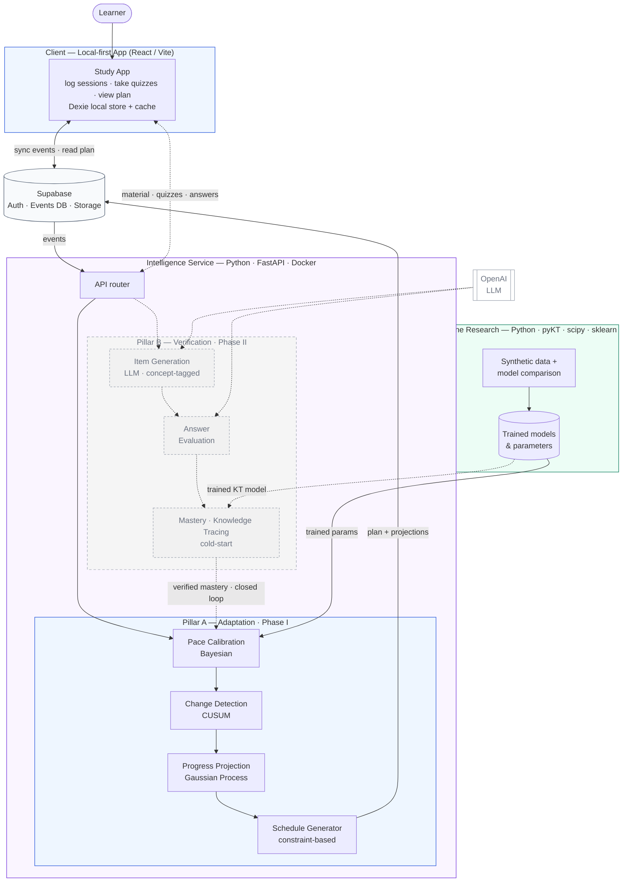

# Architecture Diagram — First Review (two-tier, Phase II greyed)

Layout rules applied: single top-down flow; Supabase as the data hub (no crisscross
client↔service edges); each pillar is a left→right pipeline (short parallel arrows);
the closed loop is the only deliberate feedback edge; Phase II = dashed + greyed.

## Reading guide (for the slide / talk)
- **Solid = Phase I (open loop):** Learner → App → Supabase → Pillar A
  (Calibrate → Detect → Project → Schedule) → plan back to Supabase → App.
- **Dashed + grey = Phase II:** Pillar B (Item-gen → Evaluate → Mastery), the OpenAI
  dependency, and the **one feedback edge** — verified mastery feeding calibration
  (closing the loop).
- **Supabase is the hub:** client and service exchange data through it, so there are no
  tangled direct connections.
- **Research feeds the service:** the offline pipeline produces the trained models the
  engines run (solid into Pillar A, dashed into Pillar B).

## One-line narration
"In Phase I the system logs honest study data and runs the adaptation pillar to keep the
schedule current. In Phase II the verification pillar generates assessments from the
learner's own material, measures real mastery, and feeds that trusted signal back into
calibration — closing the loop."
