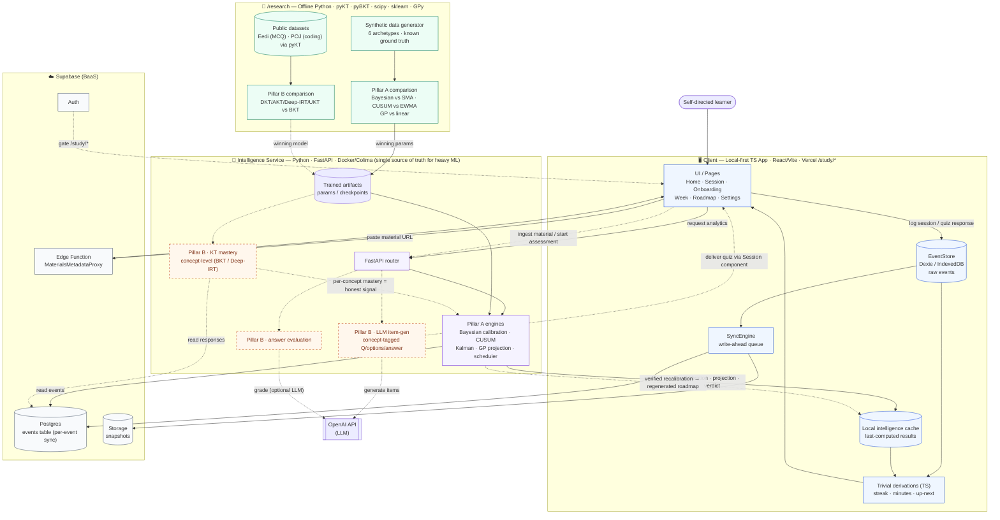

# System Architecture — Adaptive Study Planning (Verified Closed-Loop)

> Target architecture agreed during Review-1 prep (2026-06-04).
> Three tiers: offline research → Python Intelligence Service → local-first client.
> Two pillars: **A) closed-loop adaptation**, **B) assessment-based verification**.
> Solid = Phase I (open-loop). Dashed/orange = Phase II (assessment + closed loop).

## How to read it

- **Solid edges = Phase I (open-loop):** log → store → sync → server-computed
  analytics (Pillar A) → cached → displayed. Core logging works offline; analytics
  refresh when online.
- **Dashed / orange = Phase II (novelty):** the assessment subsystem (Pillar B) plus
  the **closed loop** — KT mastery becomes the *honest signal* feeding verified
  recalibration back into scheduling.
- **`/research` (green)** is offline-only: produces the model-comparison results
  (the "Model Comparison" deliverable) and exports winning params/checkpoints into the
  Intelligence Service. Nothing in `/research` runs at request time.
- **Single Intelligence Service** hosts both pillars' heavy ML — the
  "evaluated code = shipped code" decision (no TS/Python drift).

## Notes for Review 1

- Show the **solid (Phase I) portion in full color** and **grey/dash the Phase II
  portion** — matches the "proposed Phase II" framing from the guidance-call deck.
- Call out explicitly: the **concept-tag from `PB1`** is what lets `PB3` trace mastery
  over LLM-generated, never-before-seen items — the single-learner adaptation of KT.

## Key architectural decisions (provenance: 2026-06-04 grill)

- Three tiers: `/research` (offline Python) → Intelligence Service (FastAPI/Docker)
  → local-first TS client.
- Pillar A statistical engines move TS → Python as single source of truth
  (Phase-II migration; see `plans/deferrals/2026-06-04-review1-prep-deferrals.md`).
- Trivial display derivations stay client-side TS for offline.
- Assessment subsystem (LLM item-gen + answer eval + KT) consolidated in FastAPI.
- KT done at **concept level** (BKT/Deep-IRT) to handle generated/unique items and
  single-learner cold-start; deep pyKT models used as offline AUC baselines.
